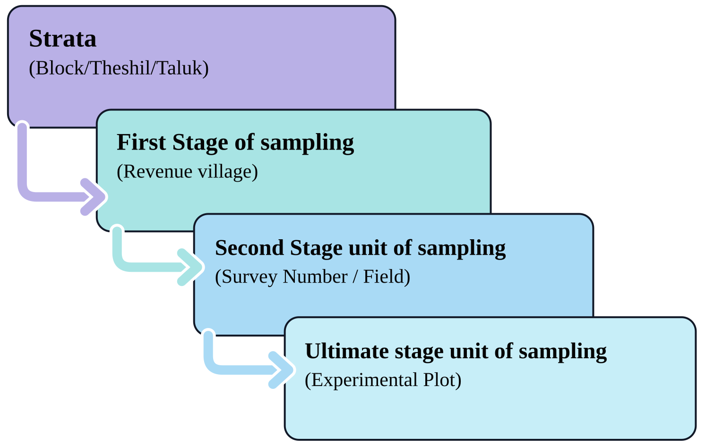

# Official agricultural statistics

The agricultural sector accounts for approximately 18% of India’s GDP and employs nearly half of its workforce. Reliable and timely information is vital for planners and policymakers to develop effective agricultural policies and make informed decisions on procurement, storage, public distribution, imports, exports, and other related matters. As such, the collection and management of agricultural statistics hold significant importance.

This chapter provides an overview of the system for collecting agricultural statistics in India. Agriculture is a state subject, but agricultural statistics fall under the concurrent list, which results in a decentralised system involving both the states and the centre. State Governments, through their State Agricultural Statistics Authorities (SASAs), play a central role in collecting and compiling agricultural statistics at the state level. At the national level, the **Directorate of Economics and Statistics (DES)**, under the Ministry of Agriculture and Farmers Welfare, is responsible for compiling the data. Other key agencies involved include the National Statistical Office (NSO) and the State Directorates of Economics and Statistics (DESs).

## Compiling crop statistics

Crop statistics comprise two key components: the area sown and the average yield.\
While area estimates are derived from land revenue systems, yield estimates are obtained through crop estimation surveys.

### Area statistics

The system for collecting area statistics across states and Union Territories (UTs) in India can be broadly classified into three categories:

1.  **States with complete enumeration systems**\
    These are the temporarily settled states, comprising 18 states and 3 UTs with cadastrally surveyed land records. Area statistics from this group account for about 86% of the country’s reporting area.

2.  **States using sample surveys**\
    These are the permanently settled states, such as Kerala, Odisha, and West Bengal, which have no land revenue agency at the village level. This group accounts for about 9% of the country’s reporting area.

3.  **States with no developed system for area statistics**\
    These mainly include hill states, north-eastern states, and certain UTs, where the collection is still based on conventional methods such as personal assessment. This group accounts for the remaining 5% of the country’s reporting area.

### Crop yield estimation

Crop yields are estimated through **Crop Cutting Experiments (CCE)**, which are conducted extensively across the country. The General Crop Estimation Survey (GCES) covers 65 crops, including 51 food crops and 14 non-food crops. Approximately 9 lakh CCEs are carried out annually in India to estimate the yield of key crops such as rice, maize, bajra, groundnut, and sugarcane. These experiments are conducted systematically to ensure accurate and reliable yield data for principal crops.

{fig-height="4" fig-alt="Sampling Design under General Crop Estimation Survey" fig-align="center" width="590" style="text-align:center;"}

#### Crop cutting experiment technique

In a Crop Cutting Experiment, a small, carefully chosen portion of the crop field is harvested and weighed, and the result is used to estimate the yield for the whole field. A CCE is conducted in a step-by-step manner, as described below.

**Step 1. Selection of the field**\
The field growing the crop chosen for the experiment must be large enough to accommodate at least one CCE plot. In other words, the total area of the field should be greater than the size of the plot marked for harvesting.

**Step 2. Locating and marking the experimental plot**  

Once the field is selected, the experimental plot is located and marked from the south-west (SW) corner of the field. The distance from the SW corner to the experimental plot is measured using steps. First, measure 58 steps along the horizontal direction from the SW corner and mark the point corresponding to the left side of the plot. From this point, measure 51 steps vertically towards the interior of the field to locate the lower-left corner, A, of the experimental plot.

For a 5 m × 5 m square CCE plot, mark the four corners as A, B, C, and D, as shown in @fig-cceplot. The sides AB, BC, CD, and DA should each measure 5 m. The diagonals AC and BD should each measure approximately 7.07 m, since

$AC = BD = \sqrt{5^2 + 5^2} = \sqrt{50} = 7.07$ m.

The equality of the two diagonals, together with the side measurements, can be used to verify that the marked plot is a true square. Thus, the figure illustrates how a 5 m × 5 m experimental plot is located at a specified distance from the SW corner of a field measuring 120 steps in the horizontal direction and 70 steps in the vertical direction.

The size and shape of the CCE plot may vary according to the crop and the state-specific CCE procedure. Common shapes include a 5 m × 5 m square, 10 m × 10 m square, or 10 m × 5 m rectangle. In Uttar Pradesh, an equilateral triangular plot with each side measuring 10 m is used for most crops. In West Bengal, a circular plot with a radius of approximately 1.7145 m is used.

{#fig-cceplot fig-alt="Demarcation of CCE plot of 5 m by 5 m size from SW corner" fig-align="center" width="80%" style="text-align:center;"}  

@fig-cceplot illustrates the location and marking of a 5 m × 5 m CCE plot from the south-west (SW) corner of a field. The lower-left corner of the plot, $A$, is located 58 steps horizontally and 51 steps vertically from the SW corner. The field measures 120 steps horizontally and 70 steps vertically. The four sides of the experimental plot are each 5 m long, and the diagonals $AC$ and $BD$ are each approximately 7.07 m. The diagonal measurements provide a check that the four marked corners form a true square.

**Step 3. Harvesting the experimental plot**\
A string is tied around the boundary pegs to clearly mark the edges of the plot. For plants growing on the boundary line, only those whose roots lie more than halfway inside the plot are harvested. All the harvested plants are then collected together.

**Step 4. Threshing the harvested plants**\
The harvested plants are spread on a clean cloth or mat and threshed carefully. After threshing, the grain is allowed to dry properly.

**Step 5. Winnowing and weighing the produce**\
*Winnowing* is the process of removing the chaff, or light waste material, from the grain by blowing air over it. After winnowing, only clean grains remain. These are put into a gunny bag (jute sack) and weighed as accurately as possible using the available weighing instrument.

::: {.callout-important title="Note"}
The plot size and shape used for a CCE can affect the accuracy of the yield estimate. Smaller or irregularly shaped plots tend to give more variable yield estimates, which is why the shape and size are standardised for each crop and state under the GCES.
:::

Final estimates of crop production are calculated using area figures obtained through complete enumeration and yield rates derived from crop-cutting experiments. These estimates become available only after the harvest. However, to support timely decision-making, the Government requires advance production estimates.

The DES provides advance estimates of crop area and production for key food and non-food crops such as food grains, oilseeds, sugarcane, and fibres. These estimates are issued in four stages:

1.  **First forecast**: Mid-September\
2.  **Second forecast**: January\
3.  **Third forecast**: Late March\
4.  **Fourth forecast**: Late May

In addition to these forecasts, **Final Estimates** of crop area and production are published in December. Subsequently, **Fully Revised Estimates** for all-India crop statistics are released in December of the following crop year.

Additionally, information on the structure and characteristics of the agricultural sector is gathered through the Agricultural Census.

## Agricultural Census

The Agricultural Census is a comprehensive exercise conducted to gather and analyse data on the structure of the agricultural sector in India. It provides essential information about operational holdings, including their number, area, land use, cropping patterns, and input usage, down to the lowest geographical levels such as villages, tehsils (sub-districts), and districts. This census serves as a statistical framework for planning and conducting future agricultural surveys.

Initiated in **1970-71**, the Agricultural Census is conducted on a quinquennial (five-yearly) basis by the Department of Agriculture and Farmers Welfare in collaboration with State and Union Territory administrations. In states with land records, the number and area of operational holdings are collected through **complete enumeration**, while detailed data on the characteristics of operational holdings are gathered on a **sample basis**.

To date, **eleven Agricultural Censuses** have been conducted, covering the reference years **1970-71, 1976-77, 1980-81, 1985-86, 1990-91, 1995-96, 2000-01, 2005-06, 2010-11, 2015-16 and 2020-21**. The reference period for each census corresponds to the agricultural year, spanning from **July to June**.

The data derived from the Agricultural Census plays a crucial role in policy formulation, resource allocation, and the overall development of the agricultural sector in India.

Additional data pertaining to various sectors can be obtained from the sources listed in the @sec-appendix-1.  

::: {.callout-tip title="Quotes to Inspire"}
**“Statistics is the art of never having to say you’re certain.”**\
**- W. Edwards Deming**
:::  

## Chapter Summary

### Fill in the blanks {.unnumbered}

1. Crop statistics mainly consist of __________ and __________.

2. Agriculture is a state subject, while agricultural statistics fall under the __________ list.

3. State-level agricultural statistics are mainly collected and compiled through the __________.

4. At the national level, agricultural statistics are compiled by the __________.

5. The two main components of crop statistics are __________ and __________.

6. Area estimates are mainly derived from __________ systems, while yield estimates are obtained through __________.

7. States with complete enumeration systems account for about __________% of the country's reporting area.

8. States using sample surveys account for about __________% of the country's reporting area.

9. States with no developed system for area statistics account for about __________% of the country's reporting area.

10. Crop yields are estimated through __________.

11. The General Crop Estimation Survey covers __________ crops.

12. The GCES covers __________ food crops and __________ non-food crops.

13. Approximately __________ lakh Crop Cutting Experiments are conducted annually in India.

14. In a Crop Cutting Experiment, the experimental plot is generally marked starting from the __________ corner of the field.

15. The common CCE plot sizes include __________ m × __________ m, __________ m × __________ m, and __________ m × __________ m.

16. In Uttar Pradesh, the CCE plot is generally an __________ triangle with each side measuring 10 m.

17. In West Bengal, the CCE plot is generally a circle with radius approximately __________ m.

18. The diagonal of a 5 m × 5 m square CCE plot is approximately __________ m.

19. The process of removing chaff from grain using air is called __________.

20. The four stages of advance crop forecasts are the first, second, third, and __________ forecasts.

21. The first forecast is issued in __________.

22. The second forecast is issued in __________.

23. The third forecast is issued in __________.

24. The fourth forecast is issued in __________.

25. Final estimates of crop area and production are published in __________.

26. Fully Revised Estimates are released in __________ of the following crop year.

27. The Agricultural Census was initiated in __________.

28. The Agricultural Census is conducted on a __________ basis.

29. The reference period of the Agricultural Census is from __________ to __________.

30. In states with land records, the number and area of operational holdings are collected through __________ enumeration.

31. Detailed information on the characteristics of operational holdings is collected on a __________ basis.

32. To date, __________ Agricultural Censuses have been conducted, covering the reference years up to __________.

33. Prasanta Chandra Mahalanobis founded the __________ in 1931.

34. Mahalanobis established the __________ in 1950.

### Short-answer questions {.unnumbered}

1. Why are agricultural statistics important for India?

2. Explain the system of collection and compilation of agricultural statistics in India.

3. What are the two main components of crop statistics?

4. Explain the three categories of area statistics systems in India.

5. What is a Crop Cutting Experiment (CCE)?

6. Explain the General Crop Estimation Survey (GCES).

7. Describe the steps involved in conducting a Crop Cutting Experiment.

8. Explain how the experimental plot is located and marked in a CCE.

9. What are the different sizes and shapes of CCE plots used in India?

10. Why is the size and shape of a CCE plot standardised?

11. Explain the harvesting, threshing, winnowing, and weighing stages of a CCE.

12. What are advance estimates of crop production? Why are they required?

13. List the four stages of advance crop forecasts and their timings.

14. Distinguish between Final Estimates and Fully Revised Estimates.

15. What is the Agricultural Census? What information does it provide?

16. When was the Agricultural Census initiated and how frequently is it conducted?

17. Explain the methods used for collecting data in the Agricultural Census.

18. What is the reference period of the Agricultural Census?

19. Write a short note on the contribution of Prasanta Chandra Mahalanobis to statistics in India.

### Important formulae {.unnumbered}

Diagonal of a square CCE plot:

$$
AC=BD=\sqrt{5^2+5^2}=7.07\text{ m}
$$

Diagonal of a square of side \(a\):

$$
d=a\sqrt{2}
$$

### Answers to fill in the blanks {.unnumbered}

::: {.answer-key}

`1.` Area sown; Average yield `2.` Concurrent `3.` State Agricultural Statistics Authorities (SASAs) `4.` Directorate of Economics and Statistics (DES) `5.` Area sown; Average yield `6.` Land revenue; Crop estimation surveys `7.` 86 `8.` 9 `9.` 5 `10.` Crop Cutting Experiments (CCE) `11.` 65 `12.` 51; 14 `13.` 9 `14.` South-west (SW) `15.` 5; 5; 10; 10; 10; 5 `16.` Equilateral `17.` 1.7145 `18.` 7.07 `19.` Winnowing `20.` Fourth `21.` Mid-September `22.` January `23.` Late March `24.` Late May `25.` December `26.` December `27.` 1970-71 `28.` Quinquennial (five-yearly) `29.` July; June `30.` Complete `31.` Sample `32.` Eleven; 2020-21 `33.` Indian Statistical Institute (ISI) `34.` National Sample Survey
:::

::: {.callout-caution title="Historical Insights"}
**“Mahalanobis and statistical planning in India”**

In 1931, a young physicist-turned-statistician named *Prasanta Chandra Mahalanobis* founded the Indian Statistical Institute (ISI) in Kolkata, in a room at Presidency College, with little more than a handful of enthusiastic collaborators and a conviction that data, properly collected and analysed, could transform how a nation was run. Five years later, he introduced the *Mahalanobis Distance*, a measure still used across statistics and machine learning to compare multivariate observations, developed originally from his work on anthropometric measurements of different castes and tribes in India.

Mahalanobis’ greatest impact, however, came after independence. In 1950, he established the National Sample Survey, one of the largest continuing household survey programmes in the world, which for the first time gave India reliable, regular estimates of consumption, employment, and agricultural output at a national scale. As a member of the Planning Commission, he went on to design the statistical framework behind India’s *Second Five-Year Plan (1956-1961)*, developing what came to be known as the *Mahalanobis Model*, a growth strategy that prioritised investment in heavy industries and capital goods to build long-term self-reliance. For these contributions, he was awarded the Padma Vibhushan in 1968 and is remembered today as the ‘Father of Indian Statistics’. His career remains one of the clearest illustrations of how statistical thinking, applied with rigour, can shape the destiny of an entire nation, an example particularly relevant to agricultural statistics, a field built on exactly the kind of large-scale, sample-based data collection that Mahalanobis pioneered.
:::
