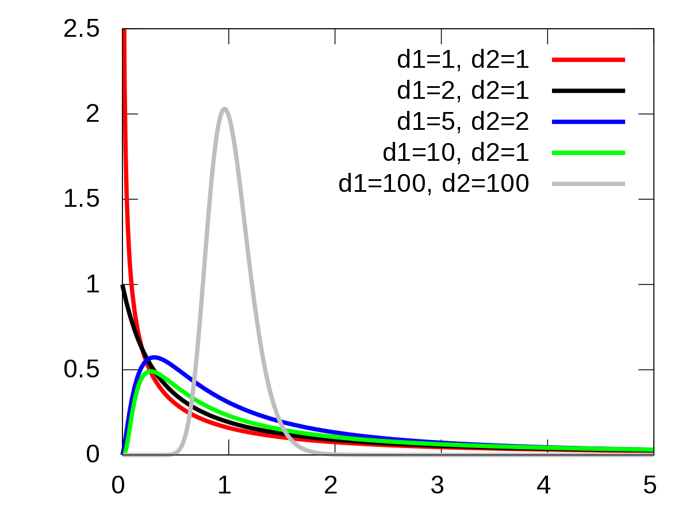
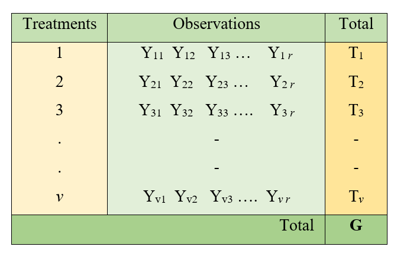
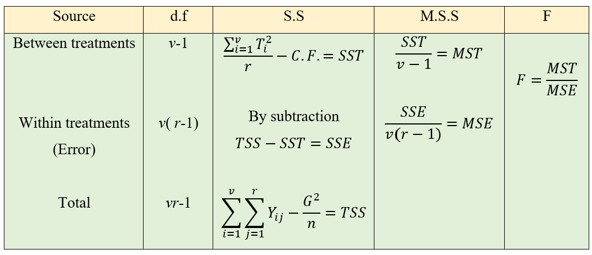
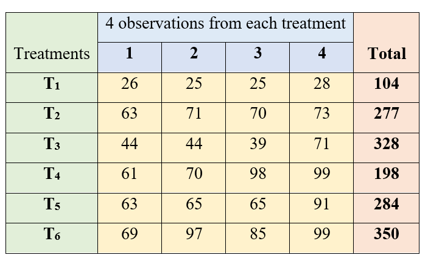
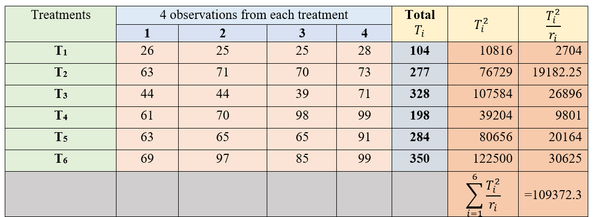
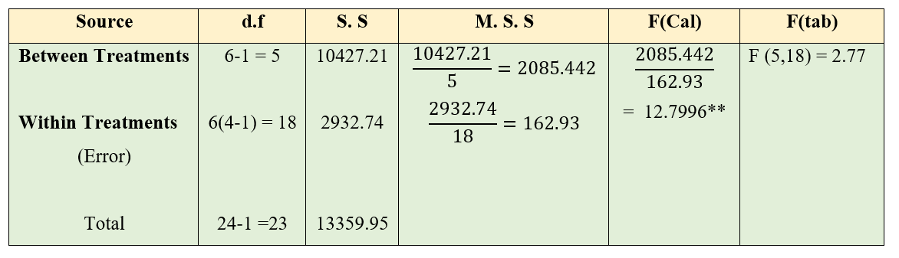
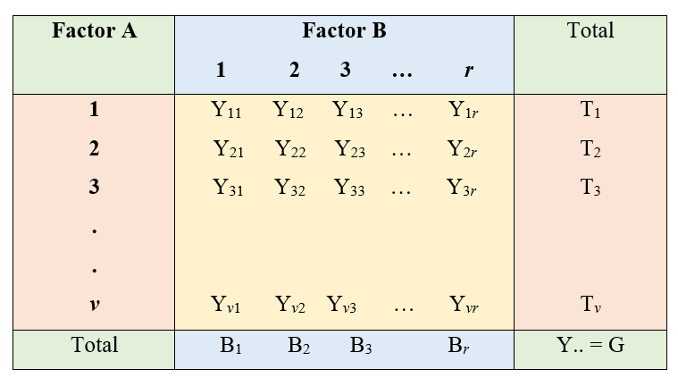
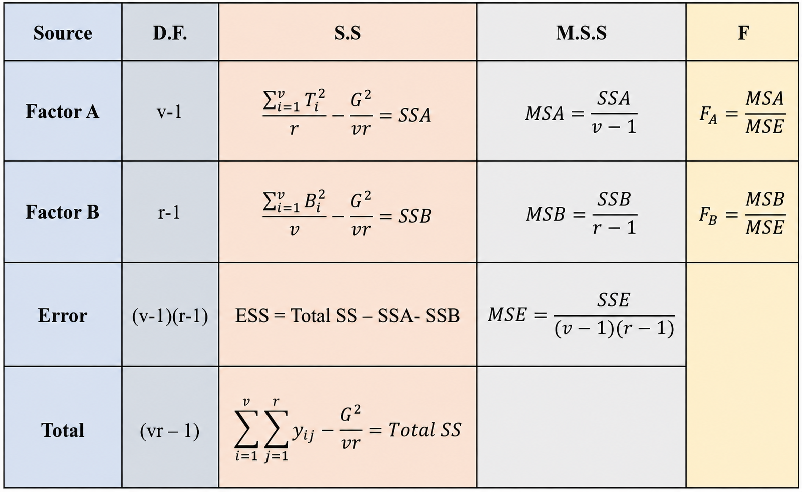
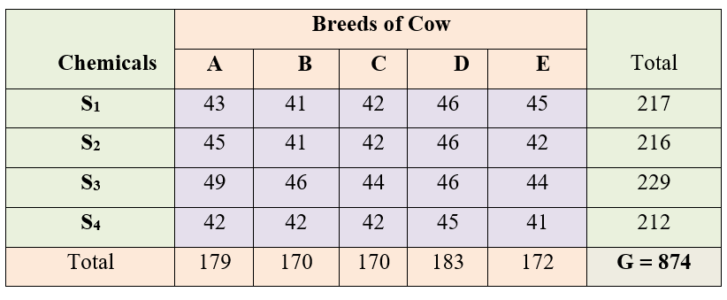
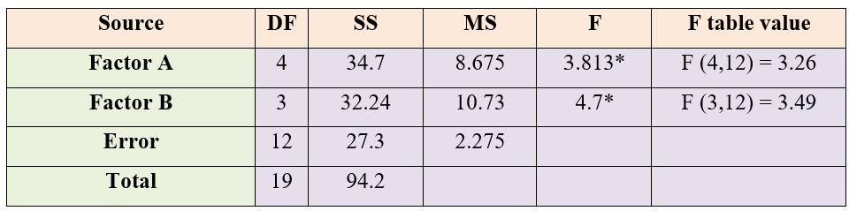

# Analysis of Variance  

Consider an experiment in which three chemical fertilizers, **A**, **B**, and **C**, are evaluated using potted plants. The objective of the experiment is to determine which fertilizer produces the highest yield. Since all the potted plants are maintained under identical conditions, the experimental units are assumed to be homogeneous.

After recording the yields, it is observed that the yield values are not identical; instead, they exhibit variability. This observed variability arises from two sources:

* **Treatment variation**, which is due to the different effects of the fertilizers.
* **Experimental error variation**, which results from uncontrolled or random factors affecting the plants.

Thus, the total observed variation in the data can be expressed as:  

$$\begin{aligned}
\text{Total variation} = \ &\text{Variation due to treatments} \\
&+ \text{Variation due to experimental error}
\end{aligned}$$ {#eq-totalvar}

In general, every experiment is conducted on a sample of experimental units, and conclusions are drawn about the corresponding population. In this example, the objective is to determine whether the mean yields produced by fertilizers **A**, **B**, and **C** differ significantly. However, any observed differences in sample means may simply be due to random experimental error rather than true treatment effects. Therefore, a statistical test is required to distinguish genuine treatment differences from chance variation.  

**Analysis of Variance (ANOVA)** is the statistical procedure used for this purpose. ANOVA partitions the total observed variation into components attributable to different sources of variation, primarily treatment and experimental error. The fundamental principle of ANOVA is that if the treatment effect is real, the variation among treatment means (between-treatment variation) should be substantially larger than the random variation within treatments (error variation).

To assess this, ANOVA compares the treatment variance (between-group variance) with the error variance (within-group variance). If the treatment variance is considerably greater than the error variance, it provides evidence that the treatment means are not all equal. Conversely, if the treatment variance is similar to the error variance, the observed differences among treatment means are likely due to random chance.

In essence, ANOVA is a statistical hypothesis-testing procedure used to determine whether the **means of two or more populations** differ significantly by comparing the variation due to treatments with the variation due to experimental error. The method was developed by Sir Ronald A. Fisher, and it remains one of the most widely used techniques for analyzing experimental data.


## Null hypothesis in ANOVA

The null hypothesis in ANOVA is that the population means are equal, which is denoted as $H_0$: $\mu_1 = \mu_2 = \mu_3 = \ldots = \mu_k$. The alternative hypothesis is that at least a pair of treatment means are not equal, $H_1$: $\mu_i \neq \mu_j$, where $i \neq j$; $i, j = 1, 2, \ldots, k$, and where $\mu_1, \mu_2, \mu_3, \ldots, \mu_k$ are the $k$ population means.

## Degrees of freedom

Before proceeding further, it is important to understand the concept of degrees of freedom (df). Simply put, degrees of freedom are the number of independent values that are free to vary after certain conditions or constraints have been taken into account.

To understand this idea, consider a simple example. Suppose you have 7 different hats and you want to wear a different hat every day for one week. On the first day, you can choose any one of the 7 hats. On the second day, you have 6 hats left to choose from. Similarly, on the third day you have 5 choices, and so on. By the sixth day, only two hats remain, so you still have a choice. However, after selecting a hat on the sixth day, there is only one hat left for the seventh day. Therefore, the choice on the last day is no longer free, it is completely determined by the choices made on the previous six days. In this example, there are 6 independent choices, or 7 − 1 = 6 degrees of freedom.

Now let us see how this idea applies to statistics.

Suppose we have three observations: 6, x, and 9, and we know that their mean is 6.

The mean is calculated as $\frac{6+x+9}{3}=6$. On solving for x, we get x=3. Although there are three observations, only two of them can vary freely. Once any two values are known, the third value is fixed because the mean must remain equal to 6. Thus, the data have 2 degrees of freedom. This example shows that whenever a value is constrained by other values, it is no longer independent.

The same idea applies when calculating the sample standard deviation.
Consider the heights (cm) of seven plants:
164, 173, 158, 179, 168, 187, 167
The sample mean is $\bar{x}$=170.86. The standard deviation can be calculated using either of the following formulas: $SD=\sqrt{\frac{\sum (x_i-\bar{x})^2}{n}}$, where (n) is the number of observations. Or, $SD=\sqrt{\frac{\sum (x_i-\bar{x})^2}{n-1}}$, where (n-1) represents the degrees of freedom.

Using the first formula gives a standard deviation of 9.00, while the second formula gives 9.72. You may wonder why we divide by (n-1) instead of (n). The reason is that the sample mean is first calculated from the same data. Once the mean is known, the deviations of the observations from the mean are no longer all independent because they must satisfy the following condition: $\sum (x_i-\bar{x})=0.$

This means that if the deviations of the first six observations are known, the deviation of the seventh observation is automatically determined. Therefore, only 6 of the 7 deviations are free to vary, giving 7 − 1 = 6 degrees of freedom.

It is important to note that all seven observations are used in calculating the standard deviation. However, only (n-1) deviations are independent because one degree of freedom has already been used to estimate the sample mean.

If we divide by (n), the sample variance tends to underestimate the true population variance. Dividing by (n-1), a correction known as Bessel's correction, removes this bias and provides an unbiased estimate of the population variance. Consequently, it also gives a better estimate of the population standard deviation.

Degrees of freedom play an important role in many statistical methods. They determine the shape of probability distributions such as the t-distribution, chi-square distribution, and F-distribution, which are used in hypothesis testing. The degrees of freedom therefore influence the critical values and p-values used to decide whether the observed differences are statistically significant.

## Mean squares

The sum of squares is the sum of the squared differences of each observation from the mean. That is, Sum of squares = $\sum_{i=1}^{n}\left( x_{i} - \overline{x} \right)^{2}$, where $i = 1, 2, \ldots, n$, and the mean $\overline{x} = \dfrac{\sum_{i=1}^{n} x_{i}}{n}$. The sum of squares generates a measure of variability. In one-way ANOVA we calculate the sum of squares of all observations to get a measure of total variability, along with the within-group and between-group sums of squares, which give an idea of the within-group (error) and between-group (between treatments) variability respectively. Mean sum of squares, or mean squares, are obtained by dividing the sum of squares by the corresponding degrees of freedom. The mean square provides an unbiased estimate of variance. For example, in ANOVA the error mean square (MSE), given by $\dfrac{\text{within-group sum of squares}}{\text{error degrees of freedom}}$, provides an unbiased estimate of the error variance.

## Test statistic F

Any function of sample values is known as a statistic. For example, the sample mean, sample variance, and the sum of all sample values are statistics, because these are all some functions of sample values. If a statistic is used to test a hypothesis, then it is known as a test statistic. Examples of test statistics are $t$, $F$, $\chi^2$, etc. The test statistic used in ANOVA is $F$.

The F-statistic is the ratio of two variances, and it was named after Sir Ronald A. Fisher. It can be proved that when the null hypothesis $H_0$: $\mu_1 = \mu_2 = \mu_3 = \ldots = \mu_k$ is true, the ratio of the mean square treatment to the mean square error follows an F distribution.  

The F-distribution is a continuous probability distribution that is always positively (right) skewed. Its exact shape depends on the numerator and denominator degrees of freedom. As shown in @fig-fdist, different combinations of degrees of freedom produce F-distributions with different shapes. For smaller degrees of freedom, the distribution is more highly skewed, whereas as the degrees of freedom increase, the distribution becomes less skewed and more concentrated around 1.

In ANOVA, the calculated F value is compared with the critical F value obtained from the F-distribution table. If the calculated F value is greater than the critical F value, the null hypothesis is rejected, indicating that at least one treatment mean differs significantly from the others. F-table with critical values of the F distribution at alpha = 0.05 is given in @tbl-ftable in Appendix 5.

```{r echo=FALSE, out.width="60%", fig.align='center'}
#| label: fig-fdist
#| fig-cap: "The F distribution under different degrees of freedom"

```

## Assumptions of ANOVA

-   Observations under each treatment group are drawn randomly from a normally distributed population.

-   All the populations from which observations are drawn have a common variance, that is, homogeneity of variance.

-   All the samples are drawn independently of each other.

-   Treatment effects are additive in nature.

As a result of the above assumptions, the experimental errors are independent and identically distributed (iid) with a normal distribution of mean 0 and variance $\sigma^2$. In other words, we can say $e_{ij} \sim iid\ N(0, \sigma^{2})$.

## Types of ANOVA

Based on the model used and the sources of variation studied, ANOVA can be classified into the following types:

-   One-way ANOVA
-   Two-way ANOVA
-   $m$-way ANOVA

### One-way ANOVA {#sec-oneway}

The simplest form of analysis of variance is one-way analysis of variance (one-way ANOVA). It is used when there is only one factor (source of variation) that is expected to influence the response variable. The objective of one-way ANOVA is to determine whether the means of two or more groups defined by this single factor differ significantly.

For example, suppose a researcher wants to compare the yield of a crop grown in fields receiving different fertiliser treatments. In this case, the fertiliser treatment is the only factor under study, while all other unexplained variation is included in the experimental error. One-way ANOVA separates the total variation in the data into two components: variation due to the factor being studied and variation due to random error. By comparing these two sources of variation, it determines whether the observed differences among group means are statistically significant.

#### One-way ANOVA model {#sec-onewaymodel}

$$Y_{ij} = \mu + \tau_{i} + e_{ij}$$ {#eq-onewaymodel}

where $i = 1, 2, \ldots, t$ and $j = 1, 2, \ldots, r$. $Y_{ij}$ is the observed value of the $i^{\text{th}}$ treatment from the $j^{\text{th}}$ replication, $\tau_{i}$ is the effect of the $i^{\text{th}}$ treatment, and $\mu$ is the general effect which is common for all treatments. $e_{ij}$ is the error effect, $e_{ij} \sim iid\ N(0, \sigma^{2})$.

#### One-way classification

Consider an experiment with $v$ treatments with $r$ replications each. The observations are recorded as shown in @fig-oneway.

```{r echo=FALSE, out.width="60%", fig.align='center'}
#| label: fig-oneway
#| fig-cap: "One-way classification of data"

```

#### Total sum of squares partitioning

ANOVA consists of partitioning the total variation in the $Y_{ij}$ values into variation due to treatments and variation caused by uncontrolled factors (error variation). Therefore, we can write

Variance of $Y_{ij}$ = $\dfrac{1}{n}\sum_{i=1}^{v}\sum_{j=1}^{r}\left( Y_{ij} - \bar{Y} \right)^{2}$, where $n = v \times r$ and the overall mean $\bar{Y} = \dfrac{G}{n}$.

Total Sum of Squares = $\sum_{i=1}^{v}\sum_{j=1}^{r} Y_{ij}^{2} - \dfrac{G^{2}}{n}$; where $\dfrac{G^{2}}{n}$ is known as the correction factor (C.F.).

::: {.callout-note title="Proof"}
$$\sum_{i=1}^{v}\sum_{j=1}^{r}\left( Y_{ij} - \bar{Y} \right)^{2} = \sum_{i=1}^{v}\sum_{j=1}^{r}\left( Y_{ij}^{2} - 2 Y_{ij}\bar{Y} + \bar{Y}^{2} \right)$$

$$= \sum_{i=1}^{v}\sum_{j=1}^{r} Y_{ij}^{2} - 2n\bar{Y}^{2} + n\bar{Y}^{2}$$

$$= \sum_{i=1}^{v}\sum_{j=1}^{r} Y_{ij}^{2} - n\bar{Y}^{2}$$

$$= \sum_{i=1}^{v}\sum_{j=1}^{r} Y_{ij}^{2} - n\left( \frac{\sum_{i=1}^{v}\sum_{j=1}^{r} Y_{ij}}{n} \right)^{2}$$

Denoting $\sum_{i=1}^{v}\sum_{j=1}^{r} Y_{ij} = G$,

$$\text{Total Sum of Squares} = \sum_{i=1}^{v}\sum_{j=1}^{r} Y_{ij}^{2} - \frac{G^{2}}{n}$$ {#eq-totalss}
:::

The Total Sum of Squares is partitioned into the Sum of Squares due to Treatments and the Sum of Squares due to Error, as shown in @eq-sspartition.

::: {.callout-note title="Proof"}
$$\sum_{i=1}^{v}\sum_{j=1}^{r}\left( Y_{ij} - \overline{Y} \right)^{2} = \sum_{i=1}^{v}\sum_{j=1}^{r}\left( Y_{ij} - \overline{Y}_{i} + \overline{Y}_{i} - \overline{Y} \right)^{2}$$

$$\begin{aligned}
= \sum_{i=1}^{v}\sum_{j=1}^{r}\Big( &\left( Y_{ij} - \overline{Y}_{i} \right)^{2} + \left( \overline{Y}_{i} - \overline{Y} \right)^{2} \\
&+ 2\left( Y_{ij} - \overline{Y}_{i} \right)\left( \overline{Y}_{i} - \overline{Y} \right) \Big)
\end{aligned}$$

$$\begin{aligned}
= &\sum_{i=1}^{v}\sum_{j=1}^{r}\left( Y_{ij} - \overline{Y}_{i} \right)^{2} + \sum_{i=1}^{v}\sum_{j=1}^{r}\left( \overline{Y}_{i} - \overline{Y} \right)^{2} \\
&+ 2\sum_{i=1}^{v}\sum_{j=1}^{r}\left( Y_{ij} - \overline{Y}_{i} \right)\left( \overline{Y}_{i} - \overline{Y} \right)
\end{aligned}$$

Let $\left( Y_{ij} - \overline{Y}_{i} \right) = e_{ij}$, with $\sum_{i=1}^{v}\sum_{j=1}^{r} e_{ij} = 0$.

$$\begin{aligned}
= &\sum_{i=1}^{v}\sum_{j=1}^{r} e_{ij}^{2} + \sum_{i=1}^{v}\sum_{j=1}^{r}\left( \overline{Y}_{i} - \overline{Y} \right)^{2} \\
&+ 2\sum_{i=1}^{v}\sum_{j=1}^{r} e_{ij}\left( \overline{Y}_{i} - \overline{Y} \right)
\end{aligned}$$

Since the sum of the weighted residuals is zero, $\sum_{i=1}^{v}\sum_{j=1}^{r} e_{ij}\left( \overline{Y}_{i} - \overline{Y} \right) = 0$, and the above equation becomes

$$= \sum_{i=1}^{v}\sum_{j=1}^{r} e_{ij}^{2} + \sum_{i=1}^{v}\sum_{j=1}^{r}\left( \overline{Y}_{i} - \overline{Y} \right)^{2}$$

Total Sum of Squares = within-group sum of squares + between-group sum of squares, that is,

$$\text{Total Sum of Squares} = \text{Error Sum of Squares} + \text{Treatment Sum of Squares}$$ {#eq-sspartition}
:::

#### Treatment sum of squares

Let us denote the treatment totals as $T_1, T_2, \ldots, T_v$, *i*.*e*. $T_i = \sum_{j=1}^{r} Y_{ij}$, so that $T_1 + T_2 + T_3 + \ldots + T_v = \sum_{i=1}^{v}\sum_{j=1}^{r} Y_{ij} = G$.

Treatment Sum of Squares, $\text{SST} = \dfrac{\sum_{i=1}^{v} T_{i}^{2}}{r} - \dfrac{G^{2}}{n}$.

#### Calculations for one-way ANOVA {#sec-onewaycalc}

**Total Sum of Squares (Total SS)** = $\sum_{i=1}^{v}\sum_{j=1}^{r} Y_{ij}^{2} - \text{C.F.}$ (square all the observations, sum them, and subtract the correction factor to get the total sum of squares).

**Treatment Sum of Squares (SST)** = $\dfrac{\sum_{i=1}^{v} T_{i}^{2}}{r} - \text{C.F.}$ (square all the treatment totals, sum them, divide by the number of replications, and subtract the correction factor to get the treatment sum of squares).

**Error Sum of Squares (SSE)** = Total SS $-$ SST.

**Correction factor (C.F.)** = $\dfrac{G^{2}}{n}$, where $G$ is the grand total of all observations.

**Mean sum of squares** is the sum of squares divided by the corresponding degrees of freedom (d.f.).

**Error degrees of freedom** = Total degrees of freedom $-$ treatment degrees of freedom.

$$\begin{aligned}
\text{Error d.f.} &= vr - 1 - (v - 1) \\
&= vr - 1 - v + 1 = vr - v = v(r - 1)
\end{aligned}$$ {#eq-onewaydf}

```{r echo=FALSE, out.width="90%", fig.align='center'}
#| label: fig-onewayanova
#| fig-cap: "One-way ANOVA table"

```

Here $F \sim F_{(v-1),\ v(r-1)}$.

MSE is an estimate of the error variance $\sigma^2$, and $\sqrt{\dfrac{\text{MSE}}{r}}$ is the standard error of a treatment mean.

::: {.callout-note title="Note"}
If your calculated F value in ANOVA is larger than the F critical value corresponding to the degrees of freedom in the critical value table (the F-distribution table), you can reject the null hypothesis.
:::

#### Example of one-way ANOVA {#sec-onewayexample}

::: {#exm-oneway}
The data on tiller count after transplanting were recorded from 4 hill sampling units for a fertilizer trial involving 6 treatments. Test for a significant difference between the treatments. The treatments are labeled as $T_1$, $T_2$, $T_3$, $T_4$, $T_5$, and $T_6$.

**Solution**

The data are arranged as shown in @fig-onewayex.

```{r echo=FALSE, out.width="75%", fig.align='center'}
#| label: fig-onewayex
#| fig-cap: "One-way classified data on tiller count"

```

Here, an equal number of observations are taken from all treatments, so $r_1 = r_2 = \ldots = r_6 = 4$, and the total number of observations is $n = 24$. The grand total of all observations is $G = 1541$.  

```{r echo=FALSE, out.width="75%", fig.align='center'}
#| label: fig-onewayex1
#| fig-cap: "ANOVA calculations"

```

Correction Factor, $CF = \dfrac{G^{2}}{n} = \dfrac{(1541)^{2}}{24} = \dfrac{2374681}{24} = 98945.04$

Total Sum of Squares,

$$\text{Total SS} = \sum_{i=1}^{6}\sum_{j=1}^{4} y_{ij}^{2} - CF = 112305 - 98945.04 = 13359.96$$

Treatment Sum of Squares,

$$\text{Treatment SS} = \sum_{i=1}^{6}\frac{T_{i}^{2}}{r_i} - CF = 109372.3 - 98945.04 = 10427.21$$

Error Sum of Squares,

$$\text{ESS} = \text{Total SS} - \text{Treatment SS} = 13359.96 - 10427.21 = 2932.75$$

```{r echo=FALSE, out.width="95%", fig.align='center'}
#| label: fig-onewayresult
#| fig-cap: "One-way ANOVA table for the tiller count data"

```

Here you can see that the calculated value is greater than the table value of F. So the null hypothesis is rejected, and we conclude that at least a pair of treatments are significantly different at the 5% level of significance.
:::

### Two-way ANOVA  

In one-way analysis of variance (one-way ANOVA), only one factor is considered to influence the response variable. However, in many practical situations, the response variable may be affected by two factors simultaneously. When the objective is to study the effects of two factors on a response variable, two-way analysis of variance (two-way ANOVA) is used. Compared with one-way ANOVA, two-way ANOVA provides more information by allowing the effects of both factors to be examined in a single analysis.

For example, the milk yield of cows may be influenced by both the type of feed provided and the breed of the cows. Similarly, the moisture content of butter may depend on the fat content of the cream as well as the churning speed used during preparation. In each of these examples, there are two factors that may contribute to the variation in the response variable.

In two-way ANOVA, the observations are classified according to two factors, and the total variation in the data is partitioned into variation due to Factor A, variation due to Factor B, and experimental error. This enables the researcher to determine whether each factor has a significant effect on the response variable.

In many experiments, the effect of one factor may depend on the level of the other factor. This phenomenon is known as the interaction effect. For example, a particular type of feed may improve milk yield more in one breed of cow than in another. When such an interaction is included in the statistical model, two-way ANOVA also tests whether the interaction between the two factors is statistically significant.

Thus, two-way ANOVA is a powerful extension of one-way ANOVA. It allows researchers to study the individual effects of two factors simultaneously and, when appropriate, to examine whether the factors interact with each other. Consequently, it is widely used in agricultural, biological, medical, and industrial experiments where more than one factor influences the response variable.


#### Two-way ANOVA model {#sec-twowaymodel}

$$Y_{ij} = \mu + \tau_{i} + \gamma_{j} + e_{ij}$$ {#eq-twowaymodel}

where $i = 1, 2, \ldots, t$ and $j = 1, 2, \ldots, r$. $Y_{ij}$ is the observed value of the response under the $i^{\text{th}}$ level of factor A and the $j^{\text{th}}$ level of factor B, $\tau_{i}$ is the effect of the $i^{\text{th}}$ level of factor A, and $\gamma_{j}$ is the effect of the $j^{\text{th}}$ level of factor B. $\mu$ is the general effect which is common for all treatments. $e_{ij}$ is the error effect, $e_{ij} \sim iid\ N(0, \sigma^{2})$.

#### Two-way classification

Consider an experiment with $v$ levels of factor 1 and $r$ levels of factor 2. The observations are recorded as shown in @fig-twoway. We have considered the situation of only one observation per cell.

```{r echo=FALSE, out.width="60%", fig.align='center'}
#| label: fig-twoway
#| fig-cap: "Two-way classification of data"

```

#### Calculations for two-way ANOVA {#sec-twowaycalc}

-   **SSA** = Take the sum of squares of the totals of each level of factor A, divide it by the number of levels of factor B, and subtract the correction factor.

-   **SSB** = Take the sum of squares of the totals of each level of factor B, divide it by the number of levels of factor A, and subtract the correction factor.

-   **Total SS** = Take the sum of squares of all observations and subtract the correction factor.

-   **Error SS** = Total SS $-$ SSA $-$ SSB.

-   **Error degrees of freedom** = Total d.f. $-$ factor A d.f. $-$ factor B d.f.

$$\begin{aligned}
\text{Error d.f.} &= vr - 1 - (v - 1) - (r - 1) \\
&= vr - 1 - v + 1 - r + 1 \\
&= vr - v - r + 1 = (v - 1)(r - 1)
\end{aligned}$$ {#eq-twowaydf}

```{r echo=FALSE, out.width="90%", fig.align='center'}
#| label: fig-twowaytable
#| fig-cap: "Two-way ANOVA table"

```

Here there are two F values, one for factor A and one for factor B. $F_A \sim F_{(v-1),\ (v-1)(r-1)}$ and $F_B \sim F_{(r-1),\ (v-1)(r-1)}$.

::: {.callout-note title="Note"}
In two-way ANOVA there are two null hypotheses, one for factor A and the other for factor B. For example, for factor A:

$H_0$: $\mu_1 = \mu_2 = \mu_3 = \ldots = \mu_v$; where $\mu_i$ is the population mean of the $i^{\text{th}}$ level of factor A.

$H_1$: at least a pair of level means are not equal.

For factor B:

$H_0$: $\beta_1 = \beta_2 = \beta_3 = \ldots = \beta_r$; where $\beta_j$ is the population mean of the $j^{\text{th}}$ level of factor B.

$H_1$: at least a pair of level means are not equal.
:::

Decisions on the null hypotheses are made by comparing the corresponding F value to the table value from the F-distribution table.

#### Example of two-way ANOVA

::: {#exm-twoway}
Four chemicals $S_1$, $S_2$, $S_3$, and $S_4$ were administered to 5 cow breeds (A, B, C, D, E). Observations were taken during the peak lactation period, and the average yield over the period is taken. Is there any significant difference between the chemicals? Is there any significant difference between the milk yields of the breeds? Consider that chemicals and breeds are independent.

**Solution**

```{r echo=FALSE, out.width="70%", fig.align='center'}
#| label: fig-twowayex
#| fig-cap: "Two-way classification of observations for chemicals and breeds"

```

Here $n = 20$, $v = 5$, and $r = 4$; factor A = cow breeds, factor B = chemicals, and the grand total $G = 874$.

Correction Factor, $CF = \dfrac{G^{2}}{n} = \dfrac{(874)^{2}}{20} = 38193.8$

Total Sum of Squares,

$$\text{Total SS} = \text{sum of squares of all observations} - CF = 38288 - 38193.8 = 94.2$$

Sum of Squares between Breeds (SSA),

$$\text{SSA} = \sum_{i=1}^{v}\frac{T_{i}^{2}}{r} - CF = \frac{1}{4}\left[ (179)^{2} + \ldots + (172)^{2} \right] - CF = 34.7$$

Sum of Squares between Chemicals (SSB),

$$\text{SSB} = \sum_{j=1}^{r}\frac{B_{j}^{2}}{v} - CF = \frac{1}{5}\left[ (217)^{2} + \ldots + (212)^{2} \right] - CF = 32.2$$

Sum of Squares of Error,

$$\text{SSE} = \text{Total SS} - (\text{SSA} + \text{SSB}) = 94.2 - (34.7 + 32.2) = 27.3$$

```{r echo=FALSE, out.width="90%", fig.align='center'}
#| label: fig-anovatabletwoway
#| fig-cap: "ANOVA table for chemicals and breeds"

```

For both chemicals and breeds there is a significant difference at the 5% level, because both calculated F values are greater than the table values.
:::

## Models under ANOVA

Analysis of variance is based on a linear statistical model. This linear model may be either

-   Fixed effects model
-   Random effects model
-   Mixed effects model

### Fixed effects model {#sec-fixed}

A fixed effects model is a statistical model in which the model parameters are fixed or non-random quantities. In using a fixed effects model in agricultural experiments, we assume that the treatment effects are unknown constants.

The fixed effects model can be explained using an example. Consider an experiment where the experimenter wants to know whether three fields had any impact on the yield of a particular strain of wheat. Observations were taken from 12 plots from each field (replication). The analysis of variance model is

$$Y_{ij} = \mu + \tau_{i} + e_{ij}; \qquad e_{ij} \sim iid\ N(0, \sigma^{2})$$

where $i = 1, 2, \ldots, t$ and $j = 1, 2, \ldots, r$. Here in our example $t = 3$ and $r = 12$. $Y_{ij}$ is the observed value of the $i^{\text{th}}$ field from the $j^{\text{th}}$ plot, and $\tau_{i}$ is the effect of the $i^{\text{th}}$ treatment, which is considered to be an unknown constant. $\mu$ is the general effect which is common for all treatments. $e_{ij}$ is the error effect, which is independently and normally distributed with mean 0 and constant variance $\sigma^2$. In this model, field is a "fixed effect". Along with $\mu$, the fixed parameters $\tau_{1}$, $\tau_{2}$, and $\tau_{3}$ are the quantities of interest. Using this model, the experimenter can make decisions only on the treatments (fields) tested.

### Random effects model {#sec-random}

A random effects model, also called a variance components model, is a statistical model where the model parameters are random variables. Consider the example above of the wheat fields. If a random effects model is used, then the fields are assumed to be randomly sampled from a population of fields in that area, and the analysis of variance model is

$$Y_{ij} = \mu + \tau_{i} + e_{ij}; \qquad e_{ij} \sim iid\ N(0, \sigma^{2}); \quad \tau_{i} \sim N(0, \sigma_{\tau}^{2})$$

where $i = 1, 2, \ldots, t$ and $j = 1, 2, \ldots, r$. Here $\tau_{i}$ is considered as a random variable, $\tau_{i} \sim N(0, \sigma_{\tau}^{2})$, and $e_{ij} \sim N(0, \sigma^{2})$. In this model, field is a "random effect". The statistical model describes the whole ensemble of possible repetitions of the experiment in the region from which the fields were selected. The experimenter could make generalisations about all the fields in that particular region based on the experiment. One important consequence of random effects is that the responses (the $Y_{ij}$'s) are no longer independent. The random $\tau_{i}$'s induce correlations among the responses. The responses jointly have a multivariate normal distribution.

### Mixed effects model {#sec-mixed}

A mixed model, mixed-effects model, or mixed error-component model is a statistical model containing both fixed effects and random effects. For example, in an agricultural trial where several specific fertilizers of interest (fixed effect) are tested across a random sample of fields drawn from a larger region (random effect), the model contains both kinds of effects and is therefore a mixed model.

::: {.callout-caution title="Historical Insights"}
**Fisher, Rothamsted, and the birth of ANOVA**

In 1919, a young statistician named **Ronald A. Fisher** joined the Rothamsted Experimental Station, an agricultural research institute in England that had been running long-term field experiments on crops and manures since the 1840s. Decades of yield data from these fields lay waiting to be analysed, tangled together with the effects of weather, soil differences, and countless other nuisance factors. The question that faced Fisher was how to separate the genuine effect of a treatment, say a fertilizer, from the natural variation of the field.

His answer was **analysis of variance**. Fisher realised that the total variation in a set of yields could be split into separate, additive pieces, one for each source of variation, and that the piece due to treatments could be compared against the piece due to chance error. If the treatment piece was large enough relative to the error piece, the treatments were judged to be genuinely different. To measure "large enough", he worked out the distribution of the ratio of two variances; the statistician George Snedecor later named this ratio the **F distribution** in Fisher's honour.

What makes the story remarkable is that this cornerstone of modern statistics was not born in a mathematics department but in a field of wheat. The practical need to make sense of messy agricultural data drove Fisher to invent not only ANOVA but also the principles of experimental design, randomization, replication, and blocking, that go hand in hand with it. When you carry out an ANOVA on a fertilizer or variety trial today, you are using the very tool that Fisher created for exactly that purpose, nearly a century ago, among the manure plots of Rothamsted. [@Fisher1925]
:::

::: {.callout-tip title="Quotes to Inspire"}
**"Errors using inadequate data are much less than those using no data at all." - Charles Babbage**
:::
