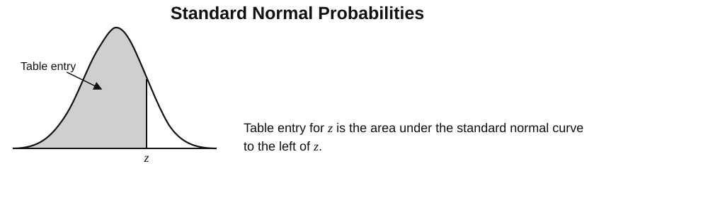

# Appendix 3 {#sec-appendix-3}

{#fig-zscoretable fig-align="center" width="80%"}

```{r echo=FALSE, warning=FALSE, message=FALSE}
#| label: tbl-ztable
#| tbl-cap: "Standard Normal Table: entries give the area under the standard normal curve to the left of z."

library(knitr)
library(kableExtra)

dt <- read.csv(
  "csv/ztable.csv",
  check.names = FALSE
)
colnames(dt)[1] <- "z"

n <- nrow(dt)

out <- kbl(
  dt,
  escape = FALSE,
  booktabs = FALSE,
  align = "c"
) %>%
  kable_classic(
    full_width = FALSE,
    html_font = "Arial"
  ) %>%
  kable_styling(
    latex_options = c(
      "HOLD_position",
      "repeat_header",
      "scale_down"
    ),
    bootstrap_options = c(
      "bordered",
      "striped",
      "condensed"
    )
  ) %>%
  row_spec(
    0,
    bold = TRUE,
    extra_css = paste(
      "font-family: Arial, sans-serif;",
      "font-size: 8px !important;"
    )
  ) %>%
  column_spec(
    1:ncol(dt),
    extra_css = paste(
      "font-family: Arial, sans-serif;",
      "font-size: 8px !important;"
    )
  ) %>%
  column_spec(
    1,
    bold = TRUE
  )

# PDF / LaTeX
if (knitr::is_latex_output()) {
  out <- out %>%
    kable_styling(font_size = 6) %>%
    landscape()
}

# HTML
if (knitr::is_html_output()) {
  out <- out %>%
    scroll_box(width = "100%")
}

out
```
