# Measures of association

In the previous chapters, we examined measures of central tendency, which summarize the location of data, and measures of dispersion, which describe the spread around that location. Together, these tools provided us with a foundation for understanding and summarizing a single dataset. However, in many real-world scenarios, we are interested in understanding the relationships between variables rather than focusing on one variable in isolation.

**Measures of association** allow us to explore and quantify the connections between two or more variables. For example, does fertilizer use influence crop yield? Is there a relationship between farm size and agricultural income? Do education levels impact the adoption of new farming technologies? By studying association, we can answer such questions and uncover meaningful patterns in data.

In this chapter, we will introduce key measures of association, such as **covariance**, **correlation coefficients**, and other related metrics. We will discuss how these measures are calculated, interpreted, and applied to analyze relationships between variables. By the end of this chapter, you will be equipped to assess both the strength and direction of relationships, providing deeper insights into agricultural and social science research.

## Linear and monotonic relationship

**Linear relationship**

A linear relationship (or linear association) is a statistical term used to describe a straight-line relationship between variables. Linear relationships can be expressed either in a graphical format where the variable plotted on X-Y plane gives a straight line or relation between two variables (consider *x* and *y*) can be expressed with an equation of a straight line (*y* = *a* + *bx*) (will be more clear when we discuss regression in @sec-regression).

**Monotonic relation**

A monotonic relationship between two variables means that as one variable increases or decreases, the other tends to move in the same direction, but not necessarily at a constant rate. In contrast, a linear relationship implies that the variables move in the same direction at a constant rate. While all linear relationships are monotonic, not all monotonic relationships are linear. Refer to the illustration @fig-linearandmono for a clearer distinction.

::: {#fig-linearandmono layout-ncol="2"}
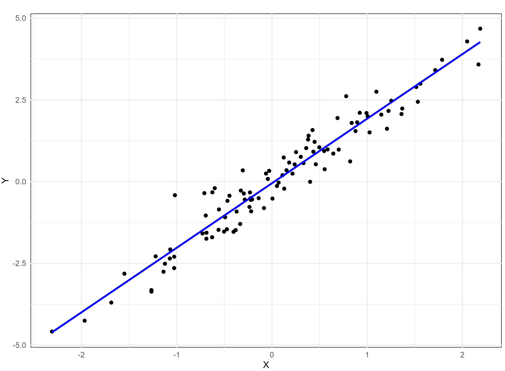{#fig-stroli width="200px" height="200px"}

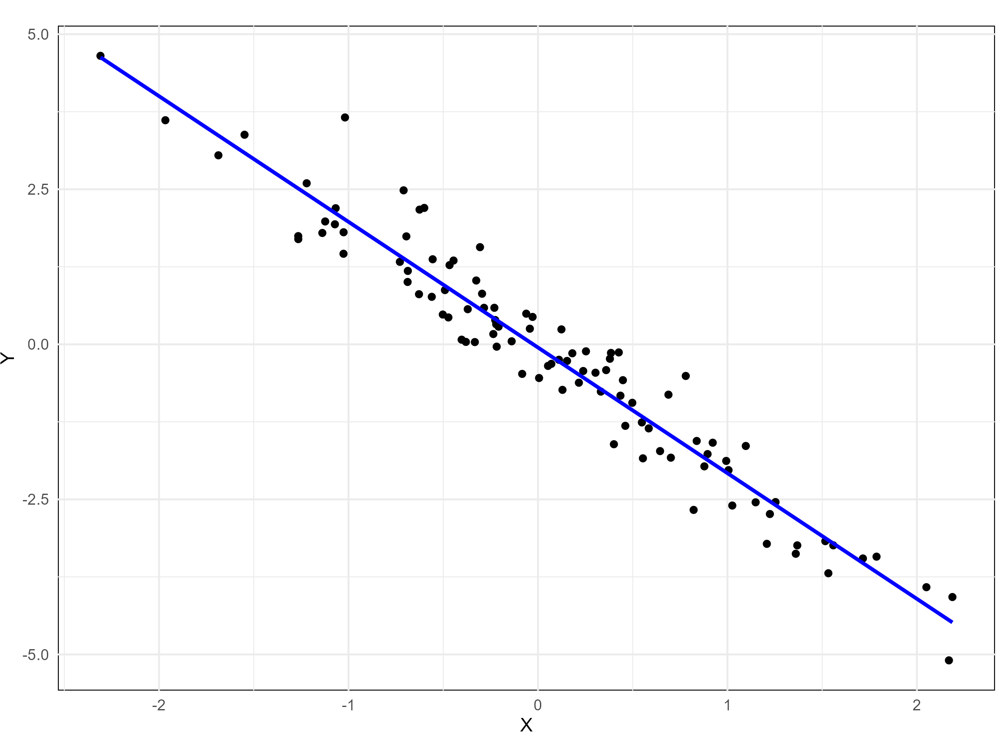{#fig-stroneg width="200px" height="200px"}

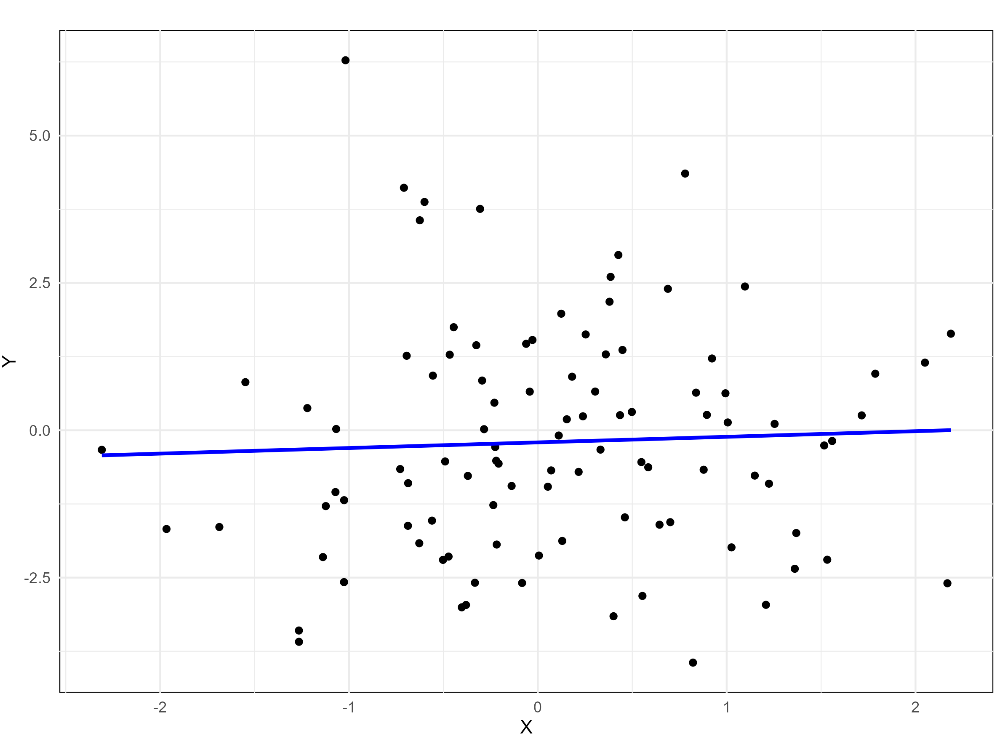{#fig-weakli width="200px" height="200px"}

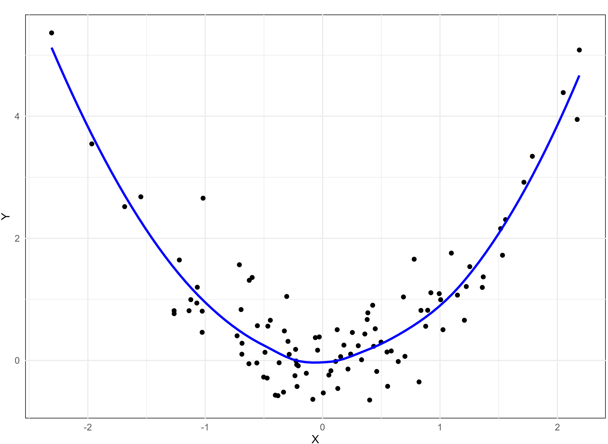{#fig-nonli width="200px" height="200px"}

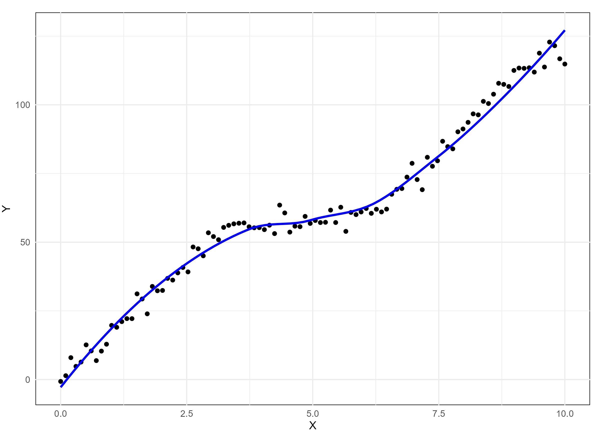{#fig-monotonic width="200px" height="200px"}

Linear and monotonic relationship
:::

## Scatter diagram {#sec-scatterdiag}

Consider two variables *x* and *y*, a scatter diagram is used to visually investigate whether there is any relationship between them. This graphical method helps explore whether an association exists between the two variables. If the variables *x* and *y* are plotted along the X-axis and Y-axis respectively in the X-Y plane of a graph sheet the resultant diagram of dots is known as **scatter diagram**. From the scatter diagram we can say whether there is any association between *x* and *y*. @fig-scatterdiag gives the scatter diagram of Example 8.1

**Example 8.1**: Consider the data on sepal length (*x*) and sepal width (*y*) of *Iris* *setosa.*

| Sepal length (*x*) | Sepal width (*y*) |
|:------------------:|:-----------------:|
|        5.1         |        3.5        |
|        4.9         |         3         |
|        4.7         |        3.2        |
|        4.6         |        3.1        |
|         5          |        3.6        |
|         7          |        3.2        |
|        6.4         |        3.2        |
|        6.9         |        3.1        |
|        5.5         |        2.3        |
|        6.5         |        2.8        |
|        6.3         |        3.3        |
|        5.8         |        2.7        |
|        7.1         |         3         |
|        6.3         |        2.9        |
|        6.5         |         3         |

: Data on sepal length (*x*) and sepal width (*y*) of *Iris* *setosa.* {#tbl-irisdata .bordered}

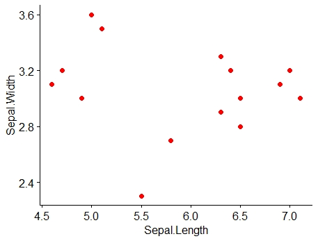{#fig-scatterdiag fig-align="center" width="50%" style="text-align:center;"}

**Example 8.2**: A research station investigates the relationship between the average daily soil moisture content (as influenced by irrigation levels, in percentage) and the corresponding monetary yield (in Rs.) of a crop. The data collected over different periods are as follows:

| Soil moisture (%) | Crop yield (in Rs./cent) |
|:-----------------:|:------------------------:|
|       14.2        |           215            |
|       16.4        |           325            |
|       11.9        |           185            |
|       15.2        |           332            |
|       18.5        |           406            |
|       22.1        |           522            |
|       19.4        |           412            |
|       25.1        |           614            |
|       23.4        |           544            |
|       18.1        |           421            |
|       22.6        |           445            |
|       17.2        |           408            |

: Model data on crop yield influenced by soil moisture {#tbl-corrdata .bordered}

Scatter diagram for the Example 8.2 is given in @fig-scattercorrdata. You can see a linear association between the two variables *i*.*e*. between soil moisture and crop yield in rupees. It can be shown using a line as in @fig-reglinecorrdata. It is clear that as soil moisture percentage increases crop yield in rupees increases, indicating a positive correlation.

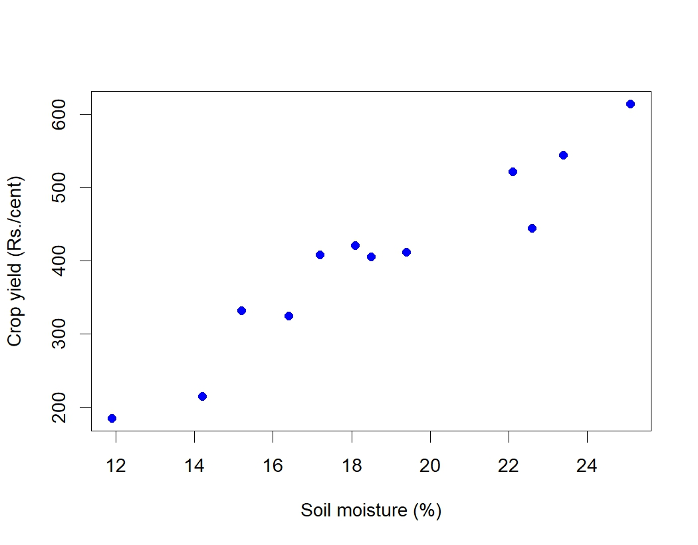{#fig-scattercorrdata fig-align="center" width="70%" style="text-align:center;"}

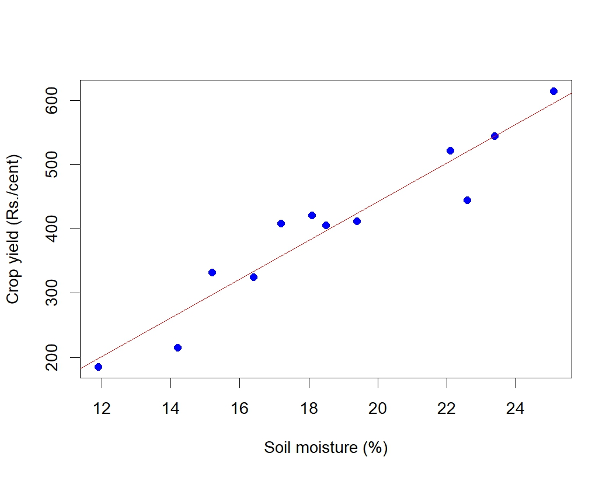{#fig-reglinecorrdata fig-align="center" width="70%" style="text-align:center;"}

From the examples above it is clear that scatter diagram gives an idea on linear association between variables, so it can also be used as a graphical tool to see whether any association is present or not. But we cannot quantify the association using scatter diagram.

## Correlation

Correlation is a statistical technique used to examine the relationship between two or more variables. It quantifies the degree and strength of the *linear association* between two variables, expressed as a single numerical value.

This measure allows us to summarize the extent to which changes in one variable are associated with changes in another. When two or more quantities vary in a related manner, such that movements in one variable are consistently accompanied by movements in the other, the variables are said to be correlated. Based on the nature of relationship, correlation can be classified into three categories *positive correlation*, *negative correlation* and *no correlation*.

**Positive correlation**

Positive correlation refers to a relationship between two variables in which both move in the same direction. A positive correlation exists when an increase in one variable is accompanied by an increase in the other, or when a decrease in one variable corresponds with a decrease in the other.

**Examples of positive correlation:**

1.  *Fertilizer use and crop yield*: The more fertilizer (*x*) a farmer applies to a field, the higher the crop yield (*y*). Here, as *x* increases, *y* also increases.

2.  *Rainfall and crop growth*: Increased rainfall (*x*) often leads to better crop growth (*y*).

3.  *Farm size and agricultural output*: Larger farm sizes (*x*) are associated with greater total agricultural output (*y*).

4.  *Labor hours and harvest quantity*: The more hours spent harvesting (*x*), the higher the quantity of crops harvested (*y*).

**Negative correlation**

Negative correlation refers to a relationship between two variables in which one variable increases as the other decreases, and vice versa.

**Examples of negative correlation:**

1.  *Weed density and crop yield*: As the density of weeds in a field (*x*) increases, the crop yield (*y*) decreases. Here, as *x* increases, *y* decreases.

2.  *Soil salinity and plant growth*: Higher soil salinity levels (*x*) result in reduced plant growth (*y*).

3.  *Age of livestock and milk production*: As a cow’s age (*x*) increases, the amount of milk it produces (*y*) decreases. Here, as *x* increases, *y* decreases.

4.  *Pesticide application and pest population*: As the amount of pesticide applied (*x*) increases, the pest population (*y*) decreases. Here, *x* increases while *y* decreases.

**No correlation** refers to a statistical relationship where two variables exhibit no apparent association with each other. In other words, changes in one variable do not systematically correspond to changes in the other.

Direction of correlation can be identified using a scatter diagram as shown below in @fig-directioncorr

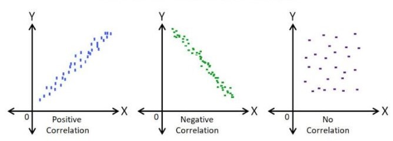{#fig-directioncorr fig-align="center" width="70%" style="text-align:center;"}

## Correlation types

**Simple and multiple**

In [simple correlation]{.underline} the relationship is confined to two variables only. In [multiple correlation]{.underline} the relationship between more than two variables is studied.

**Linear and non-linear correlation**

[Linear correlation:]{.underline} A type of correlation in which the relationship between two variables can be represented by a straight line. In this case, a change in one variable corresponds to a proportional change in the other, either in a positive or negative direction.

[Non-linear correlation:]{.underline} A type of correlation where the relationship between two variables cannot be represented by a straight line. Instead, the relationship follows a curved pattern, indicating that the variables do not change at a constant rate relative to each other. This is also referred to as *curvilinear correlation*.

**Partial and total correlation**

[Partial correlation]{.underline}: In multiple correlation analysis, partial correlation examines the relationship between two variables after controlling for or eliminating the linear effect of other correlated variables.

[Total correlation]{.underline}: Total correlation considers the relationship between variables based on all relevant variables without controlling for the influence of any specific variable.

Partial and multiple correlation are discussed in detail in @sec-partialmulti.

::: {.callout-important title="Note"}
**Perfect Correlation**: If there is any change in the value of one variable, the value of the other variable is changed in a fixed proportion then the correlation between them is said to be in perfect correlation. If there is a perfect correlation, the points will lie in the straight line. If there was a perfect correlation the data will look like in @fig-perfectcorr below.

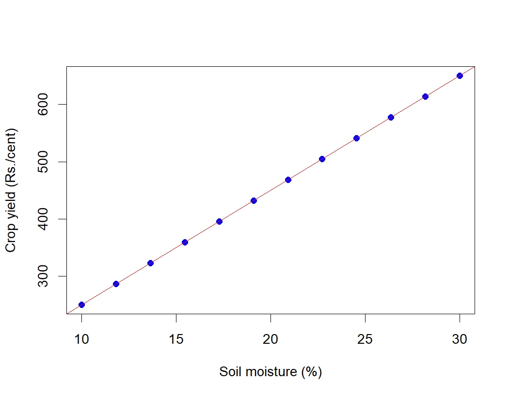{#fig-perfectcorr fig-align="center" width="30%" style="text-align:center;"}
:::

## Measuring correlation

While a scatter diagram provides a visual representation to examine whether there is an association between two variables, it does not give a precise measure of the strength or direction of the relationship. To understand the degree and nature of the correlation more quantitatively, we use numerical measures. In this section, we discuss various methods to quantify correlation, enabling a more comprehensive and objective analysis of the relationship between variables.

### Karl Pearson's coefficient of correlation

It is the most important and widely used measure of correlation. A measure of the intensity or degree of *linear relationship* between two variables is developed by Karl Pearson, a British Biometrician - known as the [**Pearson's correlation coefficient**]{.underline} denoted by '*r* ' which is expressed as the ratio of the **covariance** to the product of the standard deviations of the two variables.

[**Covariance**]{.underline}

**Covariance** is a measure of the joint linear variability of the two variables. Covariance of two variables *x* and *y* is denoted as *cov*(*x*, *y*). Covariance measure is used to find correlation coefficient. Consider two variables *x* and *y* with *n* observations each, then covariance is given by @eq-covariance

$$cov(x,y)=\frac{1}{n}\sum_{i = 1}^{n}{\left( x_{i} - \overline{x} \right)\left( y_{i} - \overline{y} \right)}$$ {#eq-covariance}

When covariance = 0 there is no joint variability or there is no linear relationship. The unit of covariance is the product of the units of the two variables.

[**Pearson's correlation coefficient**]{.underline}

**Assumptions of Pearson's correlation coefficient**

To ensure the validity of Pearson's correlation coefficient, the following assumptions must be met:

1.  **Linearity**: The relationship between the two variables must be linear. Pearson's correlation only measures the strength of linear associations, so it may not accurately describe relationships that are non-linear.

2.  **Continuous data**: Both variables should be measured on continuous scales (interval or ratio).

3.  **Normality**: Both variables should be approximately normally distributed, especially for small sample sizes. This assumption is less critical for large sample sizes due to the Central Limit Theorem.

4.  **Homoscedasticity**: The variability in one variable should remain constant across the range of the other variable. In other words, the scatter of points around the regression line should be uniform.

5.  **Independence**: Observations in the data should be independent of each other.

6.  **No significant outliers**: Outliers can have a disproportionate effect on Pearson's correlation, potentially distorting the results. An *outlier* is an observation in a dataset that is significantly different from other observations. It deviates markedly from the overall pattern of the data and may occur due to variability in the data, measurement errors, or rare events.

Violations of these assumptions may lead to incorrect or misleading interpretations of the correlation coefficient. In such cases, alternative methods like Spearman's correlation discussed in @sec-spearman may be more appropriate.

The Pearson's correlation coefficient between the two variables (*x* and *y*) is calculated using @eq-correlation. @eq-correlation can be also written as in @eq-correlation2

$$r=\frac{cov(x,y)}{sd(x)sd(y)}$$ {#eq-correlation}

where *sd* is the standard deviation.

$$r = \frac{\frac{1}{n}\sum_{i = 1}^{n}{\left( x_{i} - \overline{x} \right)\left( y_{i} - \overline{y} \right)}}{\sqrt{\frac{1}{n}\sum_{i = 1}^{n}\left( x_{i} - \overline{x} \right)^{2}\frac{1}{n}\sum_{i = 1}^{n}\left( y_{i} - \overline{y} \right)^{2}}}$$ {#eq-correlation2}

::: {.callout-important title="Note"}
**Product-moment correlation**

Karl Pearson's correlation coefficient (*r*) is also called the **product-moment correlation** coefficient because it is calculated using the product of the deviations of the two variables from their respective means. In other words, the @eq-correlation2 involves multiplying the deviations of each data point from the mean of its variable and then averaging those products. The term product-moment refers to the multiplication (product) of the deviations (moments) of the variables from their means.
:::

A simplified formula for by hand computation of correlation coefficient can be derived by modifying @eq-correlation2

$$r = \frac{n\left( \sum_{i = 1}^{n}{x_{i}y_{i}} \right) - \sum_{i = 1}^{n}{x_{i}\sum_{i = 1}^{n}y_{i}}}{\sqrt{\left\lbrack n\sum_{i = 1}^{n}{x_{i}^{2} - \left( \sum_{i = 1}^{n}x_{i} \right)^{2}} \right\rbrack\left\lbrack n\sum_{i = 1}^{n}{y_{i}^{2} - \left( \sum_{i = 1}^{n}y_{i} \right)^{2}} \right\rbrack}}$$ {#eq-correlation3}

[Properties of the correlation coefficient (*r)*]{.underline}

1.  It is a pure number independent of both origin and scale of the units of the observations.

2.  It always lies between −1 and +1 (absolute value cannot exceed unity).*i.e.* −1 ≤ *r* ≤ +1

3.  *r* = +1, indicates perfect positive correlation. *r* = −1, indicates perfect negative correlation. *r* = 0, indicates no correlation.

4.  When the correlation is zero then there is no linear relationship between the variables.

5.  Karl Pearson's correlation coefficient is also called as *product-moment correlation* coefficient.

6.  Two independent variables are always uncorrelated, meaning that there is no relationship between them. However, the reverse is not always true. Just because two variables are uncorrelated doesn't mean they are independent. Uncorrelated variables may still have a relationship, but the relationship might be non-linear, which correlation cannot capture. Independence implies no relationship in any form (linear or non-linear), but uncorrelated means there’s no linear relationship between them.

::: {.callout-important title="Note"}
**Spurious correlation**

When we calculate the correlation between two variables, we often get a numerical value that quantifies the strength and direction of the relationship between them. However, if there is no actual meaningful relationship between these variables, the correlation value obtained may be misleading. For example, even if there’s no practical or causal link, we might find a correlation between variables like “fertilizer price” and “Kohli’s batting average.” Despite the absence of any real-world connection between these two variables, we can still compute a correlation value. This type of correlation is known as a spurious correlation, which means it exists purely due to random chance or statistical artifacts rather than any practical or causal relationship.
:::

**Example 8.3**: Consider the @tbl-corrdata in Example 8.2; find correlation coefficient (*r*)

|  |  |  |  |  |  |  |  |
|:-------:|:-------:|:-------:|:-------:|:-------:|:-------:|:-------:|:-------:|
| Sl. No. | Moisture $(x_i)$ | Crop yield $(y_i)$ | $x_{i}-\overline{x}$(1) | $y_{i}-\overline{y}$(2) | (1).(2) | $(x_{i}-\overline{x})^{2}$ | $(y_{i}-\overline{y})^{2}$ |
| 1 | 14.2 | 215 | -4.48 | -187.42 | 838.69 | 20.03 | 35125.01 |
| 2 | 16.4 | 325 | -2.28 | -77.42 | 176.12 | 5.18 | 5993.34 |
| 3 | 11.9 | 185 | -6.78 | -217.42 | 1473 | 45.90 | 47270.01 |
| 4 | 15.2 | 332 | -3.48 | -70.42 | 244.70 | 12.08 | 4958.51 |
| 5 | 18.5 | 406 | -0.18 | 3.58 | -0.63 | 0.031 | 12.84 |
| 6 | 22.1 | 522 | 3.43 | 119.58 | 409.57 | 11.73 | 14300.17 |
| 7 | 19.4 | 412 | 0.73 | 9.58 | 6.95 | 0.53 | 91.84 |
| 8 | 25.1 | 614 | 6.43 | 211.58 | 1359.42 | 41.28 | 44767.51 |
| 9 | 23.4 | 544 | 4.73 | 141.58 | 668.98 | 22.33 | 20045.84 |
| 10 | 18.1 | 421 | -0.58 | 18.58 | -10.69 | 0.33 | 345.34 |
| 11 | 22.6 | 445 | 3.93 | 42.58 | 167.14 | 15.41 | 1813.34 |
| 12 | 17.2 | 408 | -1.48 | 5.58 | -8.24 | 2.18 | 31.17 |
| **Total** | **224.1** | **4829** | 0 | 0 | **5325.03** | **176.98** | **174754.9** |

: Calculation of Pearson's correlation coefficient for @tbl-corrdata {#tbl-corrcalc .bordered}

*n* =12

$$mean,\overline{x} = \ \frac{224.1}{12} = 18.68$$

$$mean,\overline{y} = \ \frac{4829}{12} = 402.42$$ *cov* (*x*,*y*) = $\frac{1}{n}\sum_{i = 1}^{n}{\left( x_{i} - \overline{x} \right)\left( y_{i} - \overline{y} \right)}$

$\sum_{i = 1}^{12}{\left( x_{i} - \overline{x} \right)\left( y_{i} - \overline{y} \right)} = 5325.03$

*Cov* (*x*,*y*) = $\frac{5325.03}{12} = 443.75$

$$Standard\ deviation,\ S.D\left( x \right) = \ \sqrt{\frac{1}{n}\sum_{i = 1}^{n}\left( x_{i} - \overline{x} \right)^{2}} = \sqrt{\frac{176.98}{12}} = 3.84$$

$$Standard\ deviation,\ S.D\left( y \right) = \ \sqrt{\frac{1}{n}\sum_{i = 1}^{n}\left( y_{i} - \overline{y} \right)^{2}} = \sqrt{\frac{174754.9}{12}} = 120.68$$

Using @eq-correlation, $r = \frac{443.75}{3.84\  \times 120.68} = 0.96$, which indicates a strong positive correlation

### Spearman's rank order correlation coefficient {#sec-spearman}

The Spearman's correlation coefficient evaluates the strength and direction of a monotonic relationship between two variables, whether they are continuous or ordinal. Spearman's correlation is denoted by a Greek letter $\rho$ pronounced as “*rho*”. The range of Spearman's rank correlation also lies between −1 and +1 always, *i*.*e*. −1 ≤ *ρ* ≤+1

Unlike Pearson's correlation, which measures linear relationships, Spearman's correlation is based on the ranked values of the variables rather than their raw data. This makes it particularly useful in situations where:

-   The relationship between variables is non-linear but monotonic.

-   The data contains outliers or is not normally distributed, as ranking reduces the influence of extreme values.

-   Variables are measured on an ordinal, interval, or ratio scale.

Spearman's correlation is a more robust alternative to Pearson's when the assumptions of Pearson's correlation coefficient are violated.

There are two cases in calculating $\rho$ :

1.  No tied rank case

2.  Tied rank case

[**No tied rank case**]{.underline}

When all the observations in both series are distinct, that is, no value is repeated, the ranks assigned to them are also all distinct, and this is called the *no tied rank case*. The formula for the Spearman rank correlation coefficient when there are *no tied ranks* is:

$$\rho = 1 - \frac{6\sum_{i = 1}^{n}d_{i}^{2}}{n\left( n^{2} - 1 \right)}$$ {#eq-spearman1}

where $d_{i}$ is the difference between ranks of *i^t^*^h^ pair of observation

**Example 8.4**: Calculation of Spearman's rank correlation when there is no tied rank is explained step by step by using the simple example below

The scores for nine students in physics and mathematics are as follows:

Physics: 35, 23, 47, 17, 10, 43, 9, 6, 28

Mathematics: 30, 33, 45, 23, 8, 49, 12, 4, 31

Compute the student's ranks in the two subjects and compute the Spearman rank correlation.

| Physics | Mathematics |
|:-------:|:-----------:|
|   35    |     30      |
|   23    |     33      |
|   47    |     45      |
|   17    |     23      |
|   10    |      8      |
|   43    |     49      |
|    9    |     12      |
|    6    |      4      |
|   28    |     31      |

: Non tied rank case example dataset {#tbl-nontied .bordered}

**Step 1**: Find the ranks for each individual subject. Rank the scores from greatest to smallest; assign the rank 1 to the highest score, 2 to the next highest and so on:

| Physics (*x*) | Rank~*x*~ | Mathematics (*y*) | Rank~*y*~ |
|:-------------:|:---------:|:-----------------:|:---------:|
|      35       |     3     |        30         |     5     |
|      23       |     5     |        33         |     3     |
|      47       |     1     |        45         |     2     |
|      17       |     6     |        23         |     6     |
|      10       |     7     |         8         |     8     |
|      43       |     2     |        49         |     1     |
|       9       |     8     |        12         |     7     |
|       6       |     9     |         4         |     9     |
|      28       |     4     |        31         |     4     |

: Ranks assigned for the non-tied rank case {#tbl-nontiedcalc1 .bordered}

**Step 2**: Add a column *d*, to your data. The *d* is the difference between ranks.

*d* = Rank~*x*~ *-* Rank~*y*~

For example, the first student's physics rank is 3 and math rank is 5, so the difference is -2. In the next column, square your *d* values.

| Physics (*x*) | Rank~*x*~ | Mathematics (*y*) | Rank~*y*~ | *d* | *d*^2^ |
|:-------------:|:---------:|:-----------------:|:---------:|:---:|:------:|
|      35       |     3     |        30         |     5     | -2  |   4    |
|      23       |     5     |        33         |     3     |  2  |   4    |
|      47       |     1     |        45         |     2     | -1  |   1    |
|      17       |     6     |        23         |     6     |  0  |   0    |
|      10       |     7     |         8         |     8     | -1  |   1    |
|      43       |     2     |        49         |     1     |  1  |   1    |
|       9       |     8     |        12         |     7     |  1  |   1    |
|       6       |     9     |         4         |     9     |  0  |   0    |
|      28       |     4     |        31         |     4     |  0  |   0    |
|   **Total**   |           |                   |           |     |   12   |

: Rank differences and squared differences for the non-tied rank case {#tbl-nontiedcalc2 .bordered}

**Step 3**: Sum (add up) all of your *d*^2^ values. $\sum_{i = 1}^{n}d_{i}^{2} =$ 4 + 4 + 1 + 0 + 1 + 1 + 1 + 0 + 0 = 12.

**Step 4**: Insert the values into @eq-spearman1

$$\rho = 1 - \frac{6 \times 12}{9\left( 81 - 1 \right)} = 0.90$$

The Spearman's rank correlation for this set of data is 0.90. This indicates there is a high correlation between the marks of physics and mathematics in the sample.

[**Tied rank case**]{.underline}\
When two or more data points have the same value, same ranks were given to these data points and a tied rank case occurs. When there are tied ranks, the formula for calculating $\rho$ is given below $$\rho = 1 - \frac{6\left( \sum_{i = 1}^{n}d_{i}^{2} + T_{x} + T_{y} \right)}{n\left( n^{2} - 1 \right)}$$ {#eq-spearman2}

If there are *m* individuals tied (having same rank), and *s* such sets of ranks are there in X- series then, $$T_{x} = \ \frac{1}{12}\sum_{i = 1}^{s}{m_{i}\left( m_{i}^{2} - 1 \right)}$$ {#eq-spearmanx}

If there are *w* individuals tied (having same rank), and *s'* such sets of ranks are there in Y- series then, $$T_{y} = \ \frac{1}{12}\sum_{i = 1}^{s'}{w_{i}\left( w_{i}^{2} - 1 \right)}$$ {#eq-spearmany}

Calculation of Spearman's rank correlation when there is tied rank is explained step by step by using the example below

**Example 8.5**: The scores for nine students in physics and mathematics are as follows:

| Physics (*x*) | Mathematics (*y*) |
|:-------------:|:-----------------:|
|      35       |        30         |
|      23       |        33         |
|      47       |        45         |
|      23       |        23         |
|      10       |         8         |
|      43       |        49         |
|       9       |        12         |
|       6       |        33         |
|      28       |        33         |

: Tied rank case example dataset {#tbl-tied .bordered}

**Step 1**: Consider the marks in Physics, ranked as usual without considering the repeated value. Here you can see 23 is repeated but first value is given rank 5 and second repeated value is given the next rank 6.

| Physics (*x*) | Rank |
|:-------------:|:----:|
|      35       |  3   |
|      23       |  5   |
|      47       |  1   |
|      23       |  6   |
|      10       |  7   |
|      43       |  2   |
|       9       |  8   |
|       6       |  9   |
|      28       |  4   |

: Initial ranks assigned to physics scores, before averaging tied ranks {#tbl-tiedcalc1 .bordered}

Then the average of two ranks 5 and 6 is assigned to both the values; $\left( \frac{5 + 6}{2}\right)$ = 5.5

| Physics (*x*) | Rank |
|:-------------:|:----:|
|      35       |  3   |
|      23       | 5.5  |
|      47       |  1   |
|      23       | 5.5  |
|      10       |  7   |
|      43       |  2   |
|       9       |  8   |
|       6       |  9   |
|      28       |  4   |

: Physics ranks after averaging the tied rank {#tbl-tiedcalc2 .bordered}

Similarly for marks in mathematics you can see 33 is repeated thrice.

| Mathematics (*y*) | Rank |
|:-----------------:|:----:|
|        30         |  6   |
|        33         |  3   |
|        45         |  2   |
|        23         |  7   |
|         8         |  9   |
|        49         |  1   |
|        12         |  8   |
|        33         |  4   |
|        33         |  5   |

: Initial ranks assigned to mathematics scores, before averaging tied ranks {#tbl-tiedcalc3 .bordered}

You can see the value 33 is repeated thrice, so the average of three ranks 3, 4 and 5 is given $\left( \frac{3 + 4 + 5}{3} \right)$ = 4

| Mathematics (*y*) | Rank |
|:-----------------:|:----:|
|        30         |  6   |
|        33         |  4   |
|        45         |  2   |
|        23         |  7   |
|         8         |  9   |
|        49         |  1   |
|        12         |  8   |
|        33         |  4   |
|        33         |  4   |

: Mathematics ranks after averaging the tied ranks {#tbl-tiedcalc4 .bordered}

**Step 2**: Calculate $T_{x}$ and $T_{y}$

In our example marks in Physics (*x*) there are two 23 values tied therefore *m* = 2; since only one such a set is there *s* = 1. Applying these values in @eq-spearmanx $T_{x} = \frac{1}{12}\left[ 2 \times (2^{2} - 1) \right] = 0.5$

In our example marks in Mathematics (*y*) there are three 33 values tied therefore *w* = 3; since only one such a set is there *s* = 1. Applying these values in @eq-spearmany $T_{y} = \frac{1}{12}\left[ 3 \times (3^{2} - 1) \right] = 2$

**Step 3**: Calculate *d* and then use @eq-spearman2

| Physics (*x*) | Rank | Mathematics (*y*) | Rank |  d   | d^2^ |
|:-------------:|:----:|:-----------------:|:----:|:----:|:----:|
|      35       |  3   |        30         |  6   |  -3  |  9   |
|      23       | 5.5  |        33         |  4   | 1.5  | 2.25 |
|      47       |  1   |        45         |  2   |  -1  |  1   |
|      23       | 5.5  |        23         |  7   | -1.5 | 2.25 |
|      10       |  7   |         8         |  9   |  -2  |  4   |
|      43       |  2   |        49         |  1   |  1   |  1   |
|       9       |  8   |        12         |  8   |  0   |  0   |
|       6       |  9   |        33         |  4   |  5   |  25  |
|      28       |  4   |        33         |  4   |  0   |  0   |
|   **Total**   |      |                   |      |  0   | 44.5 |

: Rank differences and squared differences for the tied rank case {#tbl-tiedcalc5 .bordered}

using @eq-spearman2, $\rho = 1 - \frac{6 \times \left( 44.5 + 0.5 + 2 \right)}{9\left( 9^{2} - 1 \right)} = \ 1 - \frac{282}{720}$ = 0.61

A Spearman rank correlation of 0.61 indicates a moderately strong positive monotonic relationship between the two variables.

::: {.callout-important title="Note"}
Spearman's rank correlation is a non-parametric method, meaning it does not rely on assumptions about the data's distribution and is suitable for ordinal data or non-linear relationships. In contrast, Karl Pearson's correlation is a parametric method that assumes the data follows a normal distribution and is used for continuous variables with a linear relationship. Parametric methods are more sensitive to outliers and deviations from assumptions, while non-parametric methods are more robust and versatile for different types of data.
:::

### Kendall's coefficient of concordance

Kendall's coefficient of concordance is a measure of association that evaluates the degree of agreement among several sets of ranks. It ranges from 0 to 1, *i.e.* $0\leq W \leq1$, where $W = 0$ indicates no agreement and $W = 1$ indicates perfect agreement. (This coefficient of concordance is a distinct measure from Kendall's $\tau$, which measures the rank correlation between just two variables and ranges from $-1$ to $+1$. In this book we follow the notation used in some texts and denote the coefficient of concordance by $\tau$ in the formula below.)

When there are multiple sets of rankings (*k* sets), Kendall's coefficient of concordance can be used to assess the association among them. This measure is particularly useful in evaluating the reliability or consistency of scores assigned by multiple judges or raters. By quantifying the agreement across different rankings, it provides a robust way to analyze consensus in subjective evaluations or repeated assessments.

To calculate Kendall's coefficient of concordance ($\tau$), the data is organized into a table where each row represents the ranks assigned by a different judge to the same set of *n* objects. Each column in the table corresponds to the ranks given by a judge to *n* objects.

For *k* judges, there will be *k* sets of rankings for each object. The table should look like this:

| Object | Judge 1 | Judge 2 | ... | Judge *k* |
|:------:|:-------:|:-------:|:---:|:---------:|
|   1    |  R~11~  |  R~12~  | ... |  R~1*k*~  |
|   2    |  R~21~  |  R~22~  | ... |  R~2*k*~  |
|  ...   |   ...   |   ...   | ... |    ...    |
|  *n*   | R~*n1*~ | R~*n*2~ | ... |  R~*nk*~  |

: Model table for the calculation of Kendall's $\tau$ {#tbl-kendalltau .bordered}

In @tbl-kendalltau each row represents the ranks assigned to an object by all (*k*) judges. Each column represents the ranks for each object assigned by a particular judge. $R_{ij}$ is the rank assigned to the *i*^th^ object by the *j*^th^ judge, where *i* = 1, 2, ..., *n* and *j* = 1, 2, ..., *k.*

Kendall's coefficient of concordance ($\tau$) is calculated using @eq-kendall.

$$\tau = \frac{12\left\lbrack \sum_{i = 1}^{n}{R_{i}^{2} - \frac{\left( \sum_{i = 1}^{n}R_{i} \right)^{2}}{n}} \right\rbrack}{k^{2}n\left( n^{2} - 1 \right)}$$ {#eq-kendall}

where $R_{i} =\sum_{j = 1}^{k}{R_{ij}}$, *i*.*e*. the sum of ranks obtained by each object. Calculation of Kendall's $\tau$ is explained in Example 8.6

**Example 8.6**: In a crop production competition, 10 entries of farmers were ranked by agricultural scientists (judges). Find the degree of agreement among the scientist for the competition result given below.

|         |             |             |             |             |
|:-------:|:-----------:|:-----------:|:-----------:|:-----------:|
| Farmers | Scientist 1 | Scientist 2 | Scientist 3 | Scientist 4 |
|    1    |      4      |      5      |      3      |      7      |
|    2    |     10      |      9      |      8      |      6      |
|    3    |      8      |      6      |     10      |      9      |
|    4    |      3      |      4      |      2      |      1      |
|    5    |      1      |      3      |      4      |      2      |
|    6    |      2      |      1      |      1      |      4      |
|    7    |      5      |      7      |      6      |      5      |
|    8    |      6      |      2      |      5      |      3      |
|    9    |      7      |      8      |      9      |     10      |
|   10    |      9      |     10      |      7      |      8      |

: Rankings of 10 farmers by agricultural scientists {#tbl-croprod .bordered}

**Solution 8.6**

|  Farmers  | S1  | S2  | S3  | S4  | $R _{i}$ (sum of ranks) | $R _ {i} ^ {2}$ |
|:---------:|:---:|:---:|:---:|:---:|:-----------------------:|:---------------:|
|     1     |  4  |  5  |  3  |  7  |           19            |       361       |
|     2     | 10  |  9  |  8  |  6  |           33            |      1089       |
|     3     |  8  |  6  | 10  |  9  |           33            |      1089       |
|     4     |  3  |  4  |  2  |  1  |           10            |       100       |
|     5     |  1  |  3  |  4  |  2  |           10            |       100       |
|     6     |  2  |  1  |  1  |  4  |            8            |       64        |
|     7     |  5  |  7  |  6  |  5  |           23            |       529       |
|     8     |  6  |  2  |  5  |  3  |           16            |       256       |
|     9     |  7  |  8  |  9  | 10  |           34            |      1156       |
|    10     |  9  | 10  |  7  |  8  |           34            |      1156       |
| **Total** |     |     |     |     |           220           |      5900       |

: Calculation of Kendall's $\tau$ {#tbl-kendallcalc .bordered}

here *k* = number of judges = 4; *n* = number of farmers = 10; $\left(\sum_{i = 1}^{10}R_{i}\right)^{2}$ = (220)^2^ = 48400; $\sum_{i = 1}^{10}R_{i}^{2}$ = 5900. Using @eq-kendall

$$\tau = \frac{12\left\lbrack 5900 - \frac{48400}{10} \right\rbrack}{16 \times 10\left( 100 - 1 \right)} = 0.80$$

A coefficient of concordance of 0.80 suggests that the judges’ rankings are highly consistent. This level of concordance implies that the rankings are strongly aligned, indicating a high level of agreement across the judges' evaluations.

## Correlation matrix

A correlation matrix is a table that displays the correlation coefficients between multiple variables. It is particularly useful for presenting the correlation values of several variables at the same time. The matrix can be computed using either Pearson's correlation or Spearman's correlation. Each cell in the matrix represents the correlation coefficient between the two variables at the intersecting row and column. These values range from -1 to 1. The diagonal elements are always equal to 1, as a variable is perfectly correlated with itself. Additionally, the matrix is symmetrical across the diagonal, since the correlation between *x* and *y* is the same as the correlation between *y* and *x*.

**Example 8.7**: Data below gives the measurement on several plant growth characters. Create a correlation matrix.

```{r echo=FALSE,warning=FALSE,results='asis'}
#| label: tbl-corrmat
#| tbl-cap: "Plant growth characters"

library(knitr)
library(kableExtra)
dt<-read.csv("csv/corrmatdata.csv")
dt %>%
  kbl(booktabs = TRUE, align = "c",) %>%
   kable_classic(full_width = F, html_font = "Georgia") %>%
kable_styling(
    # latex_options = "HOLD_position", 
    full_width = FALSE,
    position = "center", 
    bootstrap_options = "bordered"
  ) %>% 
  column_spec(1, width = "7em") %>%  
  column_spec(2, width = "7em") %>%
  column_spec(3, width = "7em") %>%
  column_spec(4, width = "7em") %>%
  column_spec(5, width = "7em")
```

Correlation matrix for @tbl-corrmat can be created as shown in @tbl-corrmatdata below. Here the diagonal elements are 1 because correlation of any variable to itself is 1. Also from the matrix below it is easy to find the correlation between any two variables, for example correlation between growth and water is 0.988. Correlation matrix is an effective way of presenting correlation results of several variables.

|                | Growth | Water  | Sunlight | Fertilizer | Nutrient |
|----------------|--------|--------|----------|------------|----------|
| **Growth**     | 1      | 0.988  | -0.343   | -0.332     | 0.983    |
| **Water**      | 0.988  | 1      | -0.328   | -0.314     | 0.967    |
| **Sunlight**   | -0.343 | -0.328 | 1        | 0.986      | -0.371   |
| **Fertilizer** | -0.332 | -0.314 | 0.986    | 1          | -0.366   |
| **Nutrient**   | 0.983  | 0.967  | -0.371   | -0.366     | 1        |

: Correlation matrix of data in @tbl-corrmat {#tbl-corrmatdata .bordered}

## Correlogram

A correlogram is a graphical representation of a correlation matrix. It is used to visualize the pairwise correlation coefficients between multiple variables in a dataset. The correlogram uses color and size to represent the strength and direction of the correlation, helping to quickly identify relationships among variables. The most common way to display a correlogram is through a matrix of circles or squares, where each shape represents the correlation between two variables. Correlogram can be drawn using packages like `corrplot` [@corrplot] in R software [@RCoreTeam]. Different colours and styles are available to make the presentation attractive. Correlation matrix and correlogram can also be generated using our online platform available at www.kaugrapes.com [@grapes].

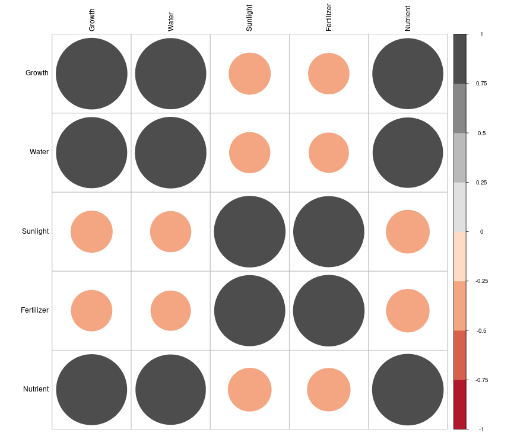{fig-align="center" width="50%" style="text-align:center;"}

## Partial and multiple correlation {#sec-partialmulti}

::: {.callout-caution title="Historical Insights"}
**Correlation and Sir Francis Galton**

The concept of correlation dates back to Sir Francis Galton, who introduced the idea of *“co-relation”* in the 19^th^ century while studying the relationship between physical traits, such as the height of parents and their children. Galton's cousin, Karl Pearson, further developed this idea by formalizing the calculation of correlation and introducing the formula we use today in terms of Pearson's correlation coefficient. Pearson's work in the late 1800s provided a mathematical framework for understanding the strength and direction of relationships between two variables, a concept that has since become fundamental in statistics, especially in the fields of genetics, psychology, and social sciences.
:::

::: {.callout-tip title="Quotes to Inspire"}
**“Statistics is like a high-caliber weapon: helpful when used correctly and potentially disastrous in the wrong hands.”**\
**- Herman Chernoff**
:::

## Chapter Summary

### Fill in the blanks {.unnumbered}

Answers are given at the end of the chapter.

1. Measures of association are used to study the __________ between two or more variables.

2. A straight-line relationship between two variables is called a __________ relationship.

3. A relationship in which variables move in the same direction but not necessarily at a constant rate is called a __________ relationship.

4. All linear relationships are __________, but not all monotonic relationships are linear.

5. A graphical method used to examine the relationship between two variables is called a __________ diagram.

6. In a scatter diagram, the values of the two variables are plotted on the __________ and __________ axes.

7. When two variables move in the same direction, they are said to have __________ correlation.

8. When one variable increases while the other decreases, they have __________ correlation.

9. A correlation coefficient of zero indicates __________ linear correlation.

10. The relationship between only two variables is called __________ correlation.

11. The relationship involving more than two variables is called __________ correlation.

12. Correlation that can be represented by a straight line is called __________ correlation.

13. Correlation that cannot be represented by a straight line is called __________ correlation.

14. Correlation between two variables after controlling the effect of other variables is called __________ correlation.

15. Pearson's correlation coefficient is denoted by __________.

16. Pearson's correlation coefficient measures the strength and direction of __________ association.

17. Covariance measures the joint __________ variability of two variables.

18. The units of covariance are the __________ of the units of the two variables.

19. Pearson's correlation coefficient is also called the __________ correlation coefficient.

20. The range of Pearson's correlation coefficient is from __________ to __________.

21. A correlation coefficient of $+1$ indicates __________ positive correlation.

22. A correlation coefficient of $-1$ indicates __________ negative correlation.

23. Pearson's correlation coefficient is sensitive to __________.

24. One important assumption of Pearson's correlation is __________.

25. Another assumption of Pearson's correlation is __________ of variance across the range of the other variable.

26. Spearman's rank correlation coefficient is denoted by the Greek letter __________.

27. Spearman's rank correlation measures the strength of a __________ relationship.

28. Spearman's correlation is based on the __________ of observations rather than their raw values.

29. Spearman's rank correlation is particularly useful for __________ data.

30. When no ranks are tied, Spearman's coefficient is calculated using the differences between the two __________.

31. When two or more observations have the same value and are assigned the same rank, they are called __________ ranks.

32. In the tied-rank method, tied observations are assigned their __________ rank.

33. Kendall's coefficient of concordance is used to measure the degree of __________ among rankings.

34. Kendall's coefficient of concordance is particularly useful when rankings are provided by multiple __________ or raters.

35. A table showing correlation coefficients among several variables is called a correlation __________.

36. The diagonal elements of a correlation matrix are always __________.

37. A correlation matrix is __________ about its principal diagonal.

38. A graphical representation of a correlation matrix is called a __________.

### Short-answer questions {.unnumbered}

1. Define measures of association and explain their importance.

2. What is a linear relationship?

3. What is a monotonic relationship?

4. Distinguish between linear and monotonic relationships.

5. What is a scatter diagram? Explain its uses.

6. Explain positive, negative, and no correlation.

7. Explain the different types of correlation based on the number of variables.

8. Distinguish between simple and multiple correlation.

9. Distinguish between linear and non-linear correlation.

10. What is partial correlation?

11. What is total correlation?

12. What is perfect correlation? Explain its characteristics.

13. Define covariance and explain its interpretation.

14. Define Pearson's correlation coefficient.

15. State the assumptions of Pearson's correlation coefficient.

16. Explain the interpretation of the sign and magnitude of Pearson's correlation coefficient.

17. Why is Pearson's correlation coefficient called product-moment correlation?

18. What are the limitations of Pearson's correlation coefficient?

19. Define Spearman's rank correlation coefficient.

20. When is Spearman's rank correlation preferred over Pearson's correlation?

21. Explain the calculation of Spearman's rank correlation when there are no tied ranks.

22. Explain the calculation of Spearman's rank correlation when tied ranks are present.

23. What are tied ranks? How are tied observations assigned ranks?

24. Define Kendall's coefficient of concordance.

25. Explain the use of Kendall's coefficient of concordance.

26. What is a correlation matrix? Explain its important properties.

27. What is a correlogram? Explain its use.

28. Distinguish between Pearson's correlation and Spearman's rank correlation.

29. Distinguish between correlation and covariance.

30. Explain the difference between correlation matrix and correlogram.

### Numerical and conceptual questions {.unnumbered}

Answers are given at the end of the chapter.

1. Draw a scatter diagram for a given set of paired observations and identify whether the relationship is positive, negative, or absent.

2. Explain whether a strong monotonic relationship must always be linear.

3. Calculate the covariance for the following paired observations:

| $x$ | $y$ |
|:---:|:---:|
| 2 | 5 |
| 4 | 7 |
| 6 | 9 |
| 8 | 11 |
| 10 | 13 |

4. Calculate Pearson's correlation coefficient for the following data:

| $x$ | $y$ |
|:---:|:---:|
| 2 | 4 |
| 4 | 8 |
| 6 | 12 |
| 8 | 16 |
| 10 | 20 |

5. If Pearson's correlation coefficient is $r=0.85$, interpret the result.

6. If Pearson's correlation coefficient is $r=-0.72$, interpret the result.

7. If $r=0$, what can be concluded about the linear relationship between the variables?

8. If $r=1$, what does it indicate?

9. If $r=-1$, what does it indicate?

10. Calculate Spearman's rank correlation coefficient for the following data:

Physics: 35, 23, 47, 17, 10, 43, 9, 6, 28

Mathematics: 30, 33, 45, 23, 8, 49, 12, 4, 31

11. For the data in Question 10, calculate the rank differences and verify that $\sum d_i^2=12$.

12. Calculate Spearman's rank correlation coefficient when $\sum d_i^2=12$ and $n=9$.

13. Interpret a Spearman rank correlation coefficient of $\rho=0.90$.

14. Calculate Spearman's rank correlation for a dataset containing tied ranks using the correction terms $T_x$ and $T_y$.

15. If two observations in the $X$ series are tied, calculate the correction term $T_x$.

16. If three observations in the $Y$ series are tied, calculate the correction term $T_y$.

17. Interpret a Spearman rank correlation coefficient of $\rho=0.61$.

18. Four scientists rank 10 farmers in a crop production competition. Calculate Kendall's coefficient of concordance using the given ranking data.

19. If Kendall's coefficient of concordance is $\tau=0.80$, interpret the result.

20. Construct a correlation matrix for a given set of variables.

21. Explain why the diagonal elements of a correlation matrix are equal to 1.

22. Explain why a correlation matrix is symmetrical.

23. Interpret the following correlation coefficients: $0.988$, $-0.343$, and $0.986$.

24. Distinguish between a strong correlation and a weak correlation using a scatter diagram.

### Important formulae {.unnumbered}

Covariance:

$$
cov(x,y)=\frac{1}{n}\sum_{i=1}^{n}(x_i-\bar{x})(y_i-\bar{y})
$$

Pearson's correlation coefficient:

$$
r=\frac{cov(x,y)}{sd(x)sd(y)}
$$

Pearson's correlation coefficient using deviations:

$$
r=
\frac{\sum_{i=1}^{n}(x_i-\bar{x})(y_i-\bar{y})}
{\sqrt{\sum_{i=1}^{n}(x_i-\bar{x})^2\sum_{i=1}^{n}(y_i-\bar{y})^2}}
$$

Spearman's rank correlation coefficient without tied ranks:

$$
\rho=1-\frac{6\sum_{i=1}^{n}d_i^2}{n(n^2-1)}
$$

where $d_i$ is the difference between the ranks of the $i$th pair of observations.

Spearman's rank correlation coefficient with tied ranks:

$$
\rho=1-\frac{6\left(\sum_{i=1}^{n}d_i^2+T_x+T_y\right)}
{n(n^2-1)}
$$

Correction for tied ranks in $X$:

$$
T_x=\frac{1}{12}\sum_{i=1}^{s}m_i(m_i^2-1)
$$

Correction for tied ranks in $Y$:

$$
T_y=\frac{1}{12}\sum_{i=1}^{s'}w_i(w_i^2-1)
$$

Kendall's coefficient of concordance:

$$
\tau=
\frac{12\left[\sum_{i=1}^{n}R_i^2-\frac{\left(\sum_{i=1}^{n}R_i\right)^2}{n}\right]}
{k^2n(n^2-1)}
$$

where $R_i$ is the sum of ranks obtained by the $i$th object and $k$ is the number of judges.

### Quick revision {.unnumbered}

- Measures of association → describe relationships between variables.
- Linear relationship → relationship that can be represented by a straight line.
- Monotonic relationship → variables move in the same direction, but not necessarily at a constant rate.
- Scatter diagram → graphical method for examining association between two variables.
- Positive correlation → both variables tend to move in the same direction.
- Negative correlation → variables tend to move in opposite directions.
- No correlation → no systematic linear association.
- Simple correlation → relationship between two variables.
- Multiple correlation → relationship involving more than two variables.
- Linear correlation → relationship represented by a straight line.
- Non-linear correlation → relationship represented by a curved pattern.
- Partial correlation → relationship between two variables after controlling other variables.
- Perfect correlation → all points lie on a straight line.
- Pearson's correlation → measures linear association.
- Pearson's $r$ ranges from $-1$ to $+1$.
- $r=+1$ → perfect positive correlation.
- $r=-1$ → perfect negative correlation.
- $r=0$ → no linear correlation.
- Covariance → measures joint linear variability.
- Covariance depends on the units of measurement.
- Pearson's correlation is unit-free.
- Pearson's correlation is sensitive to outliers.
- Pearson's correlation requires a linear relationship.
- Spearman's $\rho$ → rank-based measure of monotonic association.
- Spearman's correlation is useful for ordinal data and non-linear monotonic relationships.
- Spearman's correlation ranges from $-1$ to $+1$.
- No tied ranks → use the basic Spearman formula.
- Tied ranks → use average ranks and correction terms.
- Kendall's coefficient of concordance → measures agreement among multiple rankings.
- Correlation matrix → table of pairwise correlation coefficients.
- Diagonal elements of a correlation matrix → 1.
- Correlation matrix → symmetrical about the diagonal.
- Correlogram → graphical representation of a correlation matrix.
- Strong positive correlation → coefficient close to $+1$.
- Strong negative correlation → coefficient close to $-1$.
- Correlation measures association, not necessarily causation.

### Answers to fill in the blanks {.unnumbered}

1. Relationships
2. Linear
3. Monotonic
4. Monotonic
5. Scatter
6. X; Y
7. Positive
8. Negative
9. No
10. Simple
11. Multiple
12. Linear
13. Non-linear
14. Partial
15. $r$
16. Linear
17. Linear
18. Product
19. Product-moment
20. $-1$; $+1$
21. Perfect
22. Perfect
23. Outliers
24. Linearity
25. Homoscedasticity
26. $\rho$
27. Monotonic
28. Ranks
29. Ordinal
30. Ranks
31. Tied
32. Average
33. Agreement
34. Judges
35. Matrix
36. 1
37. Symmetrical
38. Correlogram

### Solutions to numerical and conceptual questions {.unnumbered}

1.  Plot each pair $(x_i,y_i)$ on the $X$-$Y$ plane: points rising left to right indicate positive correlation, points falling left to right indicate negative correlation, and points with no systematic pattern indicate no correlation.

2.  No. A monotonic relationship only requires the variables to move consistently in the same direction, at a possibly varying rate; so all linear relationships are monotonic, but not all monotonic relationships are linear.

3.  Using @eq-covariance, $\bar{x}=6$, $\bar{y}=9$, $\sum(x_i-\bar{x})(y_i-\bar{y})=40$, so $cov(x,y)=\frac{40}{5}=8$.

4.  Here $y=2x$, so all points lie on a straight line with positive slope; using @eq-correlation3, $r=+1$ (perfect positive correlation).

5.  $r=0.85$ is positive and close to $+1$, indicating a strong positive linear relationship.

6.  $r=-0.72$ is negative and fairly close to $-1$, indicating a strong negative linear relationship.

7.  $r=0$ means there is no linear correlation, though a non-linear or monotonic relationship may still exist.

8.  $r=1$ indicates perfect positive linear correlation; all points lie on a straight line with positive slope.

9.  $r=-1$ indicates perfect negative linear correlation; all points lie on a straight line with negative slope.

10. Using @eq-spearman1 with $\sum d_i^2=12$ and $n=9$, $\rho=1-\frac{6(12)}{9(81-1)}=0.90$, a high positive monotonic relationship.

11. The rank differences are $d=-2,2,-1,0,-1,1,1,0,0$, so $d^2=4,4,1,0,1,1,1,0,0$ and $\sum d_i^2=12$.

12. Using @eq-spearman1 with $\sum d_i^2=12$ and $n=9$, $\rho=1-\frac{6(12)}{9(81-1)}=0.90$.

13. $\rho=0.90$ indicates a high positive monotonic relationship between the two variables.

14. Assign tied observations their average rank, compute $\sum d_i^2$, $T_x$ and $T_y$, then apply @eq-spearman2.

15. Using @eq-spearmanx with $m=2$, $T_x=\frac{1}{12}[2(2^2-1)]=0.5$.

16. Using @eq-spearmany with $w=3$, $T_y=\frac{1}{12}[3(3^2-1)]=2$.

17. $\rho=0.61$ indicates a moderately strong positive monotonic relationship.

18. Using @eq-kendall with $k=4$, $n=10$, $\sum R_i=220$ and $\sum R_i^2=5900$, $\tau=\frac{12\left[5900-\frac{220^2}{10}\right]}{4^2(10)(99)}=0.80$.

19. A coefficient of concordance of $\tau=0.80$ indicates a high degree of agreement among the judges' rankings.

20. A correlation matrix lists the pairwise correlation coefficients among all variables, with 1 on the diagonal and symmetry about it.

21. The diagonal elements equal 1 because every variable is perfectly correlated with itself, $r(X,X)=1$.

22. A correlation matrix is symmetrical because $r(X,Y)=r(Y,X)$, so the entries above and below the diagonal are equal.

23. $r=0.988$ is a very strong positive correlation, $r=-0.343$ a weak to moderate negative correlation, and $r=0.986$ a very strong positive correlation.

24. A strong correlation shows points clustering closely around a straight line, whereas a weak correlation shows points more widely scattered with a less clearly defined pattern.
