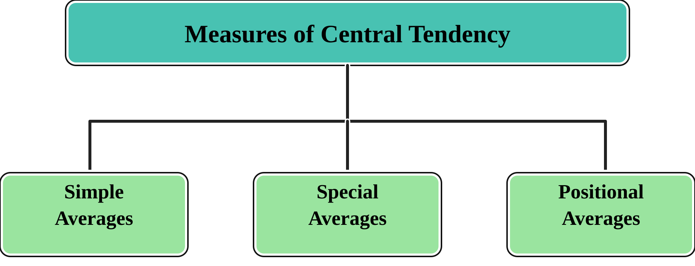
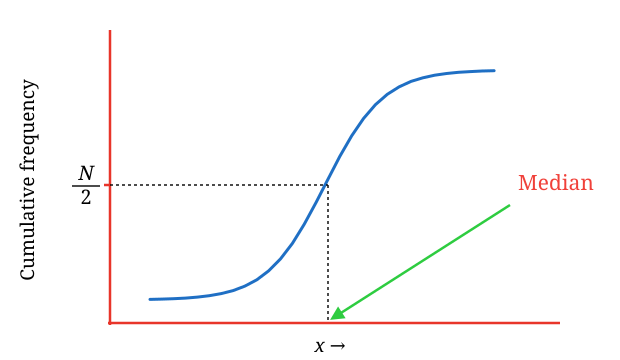
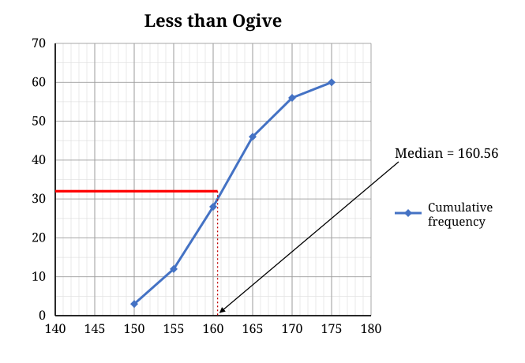
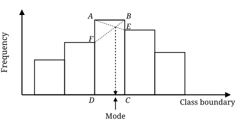

# Central tendency I

In the previous chapter, you explored how data can be summarized using tables and visually presented through graphs, enabling important features to be highlighted effectively. In this chapter, we shift our focus to **statistical measures** that describe the characteristics of a dataset.

One key aspect of data analysis is identifying a single value that represents the overall dataset. This is where **measures of central tendency** come into play. These are summary statistics that capture the center or typical value of a dataset, providing a concise numerical summary.

There are five commonly used averages: **mean**, **median**, and **mode**, collectively referred to as **simple averages**, and **geometric mean** and **harmonic mean**, known as **special averages**. In addition to these, there are **positional averages**, such as **quartiles**, **deciles**, and **percentiles**, which are determined based on the position of values within an ordered dataset. These measures provide insights into the central value and distribution of the data, making them fundamental tools for understanding and interpreting data patterns.

In this section, we will focus on **simple averages**, with a detailed discussion on positional averages and special averages following later.

{style="text-align:center;" fig-alt="Measures of central tendency" fig-align="center" width="60%"}

[**Requisites of a good measure of central tendency:**]{.underline}

-   It should be rigidly defined.

-   It should be simple to understand & easy to calculate.

-   It should be based upon all values of given data.

-   It should be capable of further mathematical treatment.

-   It should have sampling stability.

-   It should not be unduly affected by extreme values.

**The main objectives of a measure of central tendency are:**

-   To condense data in a single value.

-   To facilitate comparisons between data.

## Arithmetic mean

This is what people usually intend when they say “average”. Arithmetic mean or simply the mean of a variable is defined as the sum of the observations divided by the number of observations. Mean of set of numbers $x_{1},x_{2},\ldots,x_{n}$ is denoted as $\overline{x}$. It is given by the formula

$$\overline{x} = \frac{x_{1} + x_{2} + \ldots + x_{n}}{n}$$

$$= \frac{1}{n}\sum_{i = 1}^{n}x_{i}$$ {#eq-mean}

::: {#exm-ct1}
Find the mean of the numbers 2, 4, 7, 8, 11, 12

**Solution**

$$\overline{x} = \frac{2 + 4 + 7 + 8 + 11 + 12}{6} = \frac{44}{6} = 7.33$$
:::

### Mean of ungrouped frequency distribution

[**Direct method**]{.underline}

If the numbers $x_{1},x_{2},\ldots,x_{n}$ occur with frequencies $f_{1},f_{2},\ldots,f_{n}$ respectively then

$$\overline{x} = \frac{x_{1}f_{1} + x_{2}f_{2\ \ } + \ldots + x_{n}f_{n}}{f_{1} + f_{2} + \ldots + f_{n}}$$

$$= \frac{\sum_{i = 1}^{n}{f_{i}x_{i}}}{\sum_{i = 1}^{n}f_{i}}$$ {#eq-meanungrouped}

::: {#exm-ct2}
@tbl-plantheight below shows the plant height of 50 plants. Find the mean plant height.

|                  |     |     |     |     |     |
|:----------------:|:---:|:---:|:---:|:---:|:---:|
| Plant height(cm) | 159 | 160 | 161 | 162 | 163 |
| Frequency        |   3 |   9 |  23 |  11 |   4 |

: Plant height of 50 plants {#tbl-plantheight .bordered}

**Solution**

The calculation can be arranged as shown

| Plant height(*x*) | Frequency(*f*) | *fx* |
|:----------------------:|:----------------------:|:----------------------:|
| 159 | 3 | 477 |
| 160 | 9 | 1440 |
| 161 | 23 | 3703 |
| 162 | 11 | 1782 |
| 163 | 4 | 652 |
|  | $\sum_{i = 1}^{n}f_{i}$= 50 | $\sum_{i = 1}^{n}{f_{i}x_{i}}$= 8054 |

: Solution using direct method {#tbl-pltheightsolutn .bordered}

$\overline{x} = \frac{\sum_{i = 1}^{n}{f_{i}x_{i}}}{\sum_{i = 1}^{n}f_{i}} = \frac{8054}{50}$= 161.08 cm
:::

[**Assumed mean method (Indirect method)**]{.underline}

The amount of computation involved above can be reduced by using the following formula:

$$\overline{x} = A + \frac{\sum_{i = 1}^{n}{f_{i}d_{i}}}{\sum_{i = 1}^{n}f_{i}}$$ {#eq-assumedmean}

where, $A$ is the assumed mean, which can be any value in *x*. $d_{i} = x_{i} - A$, $f_{i}$ is the frequency of $x_{i}$

Consider the @tbl-plantheight

let $A$ = 161; it can be any number in *x*

| Plant height(*x*) | Frequency(*f*) | $d_i = x_i - 161$ | $f_i d_i$ |
|:----------------:|:----------------:|:----------------:|:----------------:|
| 159 | 3 | -2 | -6 |
| 160 | 9 | -1 | -9 |
| 161 | 23 | 0 | 0 |
| 162 | 11 | 1 | 11 |
| 163 | 4 | 2 | 8 |
|  | $\sum_{i = 1}^{n}f_{i}= 50$ |  | $\sum_{i = 1}^{n}{f_{i}d_{i}}$= 4 |

: Solution using assumed mean method {#tbl-pltheightassumed .bordered}

using @eq-assumedmean, $\overline{x} = 161 + \frac{4}{50}$ = 161.08 cm

The mean plant height is 161.08 cm.

### Mean of grouped frequency distribution

[**Direct method**]{.underline}

The mean for grouped data is obtained from the following formula:

$$\overline{x} = \frac{\sum_{i = 1}^{k}{f_{i}x_{i}}}{n}$$ {#eq-meangpdirect}

Where $x_{i}$ = the mid-point of *i*^th^ class (*i*^th^ class mark); $f_{i}$= the frequency of *i*^th^ class; $n$ = the sum of the frequencies or total frequencies in a sample. Note that *i* =1, 2,..., *k*, *i*.*e*. there are *k* classes.

::: {#exm-ct3}
@tbl-math shows the distribution of the marks scored by 60 students in a Maths examination. Find the mean mark.

|                    |       |       |       |       |       |
|:-------------------:|:-----:|:-----:|:-----:|:-----:|:-----:|
| Mark (%)           | 60-65 | 65-70 | 70-75 | 75-80 | 80-85 |
| Number of students | 2     | 15    | 25    | 14    | 4     |

: Distribution of the marks scored by 60 students {#tbl-math .bordered}

**Solution**

The solution can be arranged as shown

| Marks | Class mark(${x}_{i}$) | Frequency(${f}_{i}$) | ${f}_{i}{x}_{i}$ |
|:----------------:|:----------------:|:----------------:|:----------------:|
| 60-65 | 62.5 | 2 | 125 |
| 65-70 | 67.5 | 15 | 1012.5 |
| 70-75 | 72.5 | 25 | 1812.5 |
| 75-80 | 77.5 | 14 | 1085 |
| 80-85 | 82.5 | 4 | 330 |
|  |  | $\sum_{i = 1}^{n}f_{i}$= 60 | $\sum_{i = 1}^{n}{f_{i}x_{i}}$= 4365 |

: Mean of grouped frequency table using direct method {#tbl-mathsolutn .bordered}

$\overline{x} = \frac{\sum_{i = 1}^{n}{f_{i}x_{i}}}{\sum_{i = 1}^{n}f_{i}} = \frac{4365}{60}$= 72.75

The mean mark is 72.75%.
:::

[**Coding method or Indirect method**]{.underline}

If all the class intervals of a grouped frequency distribution have equal size $C$ (class width); then the following formula can be used instead of direct method above. This formula makes calculations easier.

$$\overline{x} = A + C\frac{\sum_{i = 1}^{n}{f_{i}u_{i}}}{\sum_{i = 1}^{n}f_{i}}$$ {#eq-meancoding}

where, $A$ is the class mark with the highest frequency, $u_{i} = \frac{x_{i} - A}{C}$, $f_{i}$ is the frequency of $x_{i}$, *C* is the class width.

This is called the “coding” method for computing the mean. It is a very short method and should always be used for finding the mean of a grouped frequency distribution with equal class widths.

Applying the coding method to the same data used in @exm-ct3 (@tbl-math).

$A$ = 72.5, class mark with highest frequency; $C$ = 5

| Marks | Class mark(${x}_{i}$) | Frequency(${f}_{i}$) | $${u}_{i}=\frac{x_i- 72.5}{5}$$ | $${f}_{i}{u}_{i}$$ |
|:-------------:|:-------------:|:-------------:|:-------------:|:-------------:|
| 60-65 | 62.5 | 2 | -2 | -4 |
| 65-70 | 67.5 | 15 | -1 | -15 |
| 70-75 | 72.5 | 25 | 0 | 0 |
| 75-80 | 77.5 | 14 | 1 | 14 |
| 80-85 | 82.5 | 4 | 2 | 8 |
|  |  | $\sum_{i = 1}^{k}f_{i}$= 60 |  | $\sum_{i = 1}^{k}{f_{i}u_{i}}$=3 |

: Solution using coding method {#tbl-pltheightcoding .bordered}

using @eq-meancoding, $\overline{x} = 72.5 + 5 \times \left( \frac{3}{60} \right)$= 72.75

The mean mark is 72.75%.

**Merits and demerits of arithmetic mean**

[**Merits**]{.underline}

1.  It is rigidly defined.

2.  It is easy to understand and easy to calculate.

3.  If the number of items is sufficiently large, it is more accurate and more reliable.

4.  It is a calculated value and is not based on its position in the series.

5.  It is possible to calculate even if some of the details of the data are lacking.

6.  Of all averages, it is affected least by fluctuations of sampling.

7.  It provides a good basis for comparison.

[**Demerits**]{.underline}

1.  It cannot be obtained by inspection nor located through a frequency graph.

2.  It cannot be used in the study of qualitative phenomena not capable of numerical measurement *i*.*e*. Intelligence, beauty, honesty etc.

3.  It can ignore any single item only at the risk of losing its accuracy.

4.  It is affected very much by extreme values.

5.  It cannot be calculated for open-end classes.

6.  It may lead to fallacious conclusions, if the details of the data from which it is computed are not given.

### Weighted average

A weighted average is a method of computing an average where some data points contribute more than others.

::: {.callout-important title="Note"}
If all the weights of the data point are equal then the weighted average is the same as the simple mean.
:::

The formula for the weighted average is: $$\text{Weighted average} = \frac{\sum w_{i}x_{i}}{\sum w_{i}}$$ {#eq-weighted} where, $x_{i}$ = individual data values; $w_{i}$ = corresponding weights

::: {#exm-ct4}
If $x$ = \[10, 20, 30\] and its corresponding weights are $w$ = \[1, 2, 3\] then calculate its weighted average

**Solution**

Using the @eq-weighted $$\text{Weighted average} = \frac{(1\times10)+(2\times20)+(3\times30)}{1+2+3} = 23.33$$
:::

::: {#exm-ct5}
What is the weighted average of the first *n* natural numbers if the weights assigned to each number are equal to the numbers themselves?

**Solution**

Using the @eq-weighted

$$\text{Weighted average} = \frac{(1\times1) + (2\times2) + ... + (n\times n)}{1+2+...+n}$$ $$=\frac{1^2+2^2+...+n^2}{1+2+...+n}$$ $$=\frac{n(2n+1)(n+1)/6}{n(n+1)/2}$$ $$=\frac{2n+1}{3}$$
:::

## The median

The **median** is the middle value in a set of data when the values are arranged in order from smallest to largest. If there is an **odd** number of values, the median is the one in the middle, with half of the values smaller and half larger. If there is an **even** number of values, the median is the average of the two middle values. The median is a **positional measure**, which means it depends on the order of the data, not the actual values. It helps to find the central point of the data, especially when there are extreme values or outliers that could affect the average.

### Median of ungrouped or raw data

Arrange the given *n* observations $x_{1\ },x_{2},\ldots,x_{n}$ in ascending order. If the number of values is odd, median is the middle value. If the number of values is even, median is the mean of middle two values.

Arrange data in ascending then use the following formula

When *n* is odd, Median = Md =$\left( \frac{n + 1}{2} \right)^{\text{th}}$value

When *n* is even, Median = Md =${\text{Average of}\left( \frac{n}{2} \right)^{th}\text{and }\left( \frac{n}{2} + 1 \right)}^{\text{th}}$value

::: {#exm-ct6}
Find the median of each of the following sets of numbers.

$a)$ 12, 15, 22, 17, 20, 26, 22, 26, 12

$b)$ 4, 7, 9, 10, 5, 1, 3, 4, 12, 10

**Solution**

$a)$ Arranging the data in an increasing order of magnitude, we obtain 12, 12, 15, 17, 20, 22, 22, 26, 26. Here, N = 9 is odd, and so, median = $\left( \frac{9 + 1}{2} \right)^{\text{th}}$= 5^th^ ordered observation = 20.

::: {.callout-important title="Note"}
If a number is repeated, we still count it the number of times it appears when we calculate the median.
:::

$b)$ Arranging the data in an increasing order of magnitude, we obtain 1, 3, 4, 4, 5, 7, 9, 10, 10, 12. Here, N = 10 is an even number and so median = $\frac{1}{2}${5^th^ ordered observation + 6^th^ ordered observation} = $\frac{1}{2}\left( 5 + 7 \right) = 6$.

::: {.callout-important title="Note"}
You can see in each case, the median divides the distribution into two equal parts, with 50% of the observations greater than it and the other 50% less than it.
:::
:::

### Median of ungrouped frequency distribution

The median is the middle number in an ordered set of data. In a frequency table, the observations are already arranged in an ascending order. We can obtain the median by looking for the value in the middle position.

[**Odd number of observations**]{.underline}

When the number of observations (*n*) is odd, then the median is the value at the $\left( \frac{n + 1}{2} \right)^{\text{th}}$ positional value. For that we use less than cumulative frequency.

::: {#exm-ct7}
The @tbl-score shows the frequency of the score obtained in a mathematics quiz. Find the median score.

|               |     |     |     |     |     |
|:-------------:|:---:|:---:|:---:|:---:|:---:|
| **Score**     | 0   | 1   | 2   | 3   | 4   |
| **Frequency** | 3   | 4   | 7   | 6   | 3   |

: Score obtained in a mathematics quiz {#tbl-score .bordered}

**Solution**

Total frequency = 3 + 4 + 7 + 6 + 3 = 23 (odd number). Since the number of scores is odd, the median is at $\left( \frac{23 + 1}{2} \right)^{\text{th}} =$ 12^th^ position.

|                                    |     |     |        |     |     |
|:-----------------------------------:|:---:|:---:|:------:|:---:|:---:|
| **Score**                          | 0   | 1   | **2**  | 3   | 4   |
| **Frequency**                      | 3   | 4   | **7**  | 6   | 3   |
| **Less than cumulative frequency** | 3   | 7   | **14** | 20  | 23  |

: Less than cumulative frequency of the scores in mathematics quiz {#tbl-mediansolution .bordered}

To find out the 12^th^ position, we use less than cumulative frequencies in @tbl-mediansolution which helps us track how many values are less than or equal to each score. In the table, the less than cumulative frequency for the score 0 is 3 (meaning the first 3 values are 0), for the score 1 is 7 (meaning the first 7 values are 0 and 1), and for the score 2 is 14 (meaning the first 14 values are 0, 1, and 2). If we list the data in order, it would look like this: 0, 0, 0, 1, 1, 1, 1, 2, 2, 2, 2, 2, 2. (no need to list, this is just for reader’s understanding, less than cumulative frequency is enough).

Now, we need to find where the 12^th^ value falls. The 12^th^ value is between the 7^th^ and 14^th^ values, so based on less than cumulative frequency it is clear that 12^th^ value is 2. So the median is 2.
:::

[**Even number of observations**]{.underline}

When the number of observations is even, then the median is the average of ${\left( \frac{n}{2} \right)^{th}\text{and}\left( \frac{n}{2} + 1 \right)}^{\text{th}}$ position values.

::: {#exm-ct8}
The @tbl-median is a frequency table of the marks obtained in a competition. Find the median score.

|               |     |     |     |     |     |
|:-------------:|:---:|:---:|:---:|:---:|:---:|
| **Mark**      | 0   | 1   | 2   | 3   | 4   |
| **Frequency** | 11  | 9   | 5   | 10  | 15  |

: Distribution of marks obtained in a competition. {#tbl-median .bordered}

**Solution**

Total frequency = 11 + 9 + 5 + 10 + 15 = 50 (even number). Since the number of scores is even, the median is at the average of the values in ${\left( \frac{n}{2} \right)^{th} = 25\ and\ \left( \frac{n}{2} + 1 \right)}^{\text{th}} = 26$ positions. To find out the 25^th^ position and 26^th^ position, we add up the frequencies as shown:

|                                    |     |     |     |     |     |
|:-----------------------------------:|:---:|:---:|:---:|:---:|:---:|
| **Mark**                           | 0   | 1   | 2   | 3   | 4   |
| **Frequency**                      | 11  | 9   | 5   | 10  | 15  |
| **Less than cumulative frequency** | 11  | 20  | 25  | 35  | 50  |

: Less than cumulative frequency of marks obtained. {#tbl-medianeven .bordered .hover}

The mark at the 25^th^ position is 2 and the mark at the 26^th^ position is 3. The median is the average of the scores at 25^th^ and 26^th^ positions = $\frac{2 + 3}{2} = 2.5$
:::

### Median of grouped frequency distribution

The exact value of the median of a grouped data cannot be obtained because the actual values of a grouped data are not known. For a grouped frequency distribution, the median is in the class interval which contains the $\left( \frac{N}{2} \right)^{\text{th}}$ordered observation, where $N$ is the total number of observations. This class interval is called the **median class**. The median of a grouped frequency distribution can be estimated by either of the following two methods:

[**Linear interpolation method**]{.underline}

The median of a grouped frequency distribution can be estimated by linear interpolation. We assume that the observations are evenly spread through the median class. The median can then be computed by using the following formula:

$$Median = L + \left( \frac{\frac{1}{2}N - F}{f_{m}} \right)C$$ {#eq-medlinear}

where, $N$ = total number of observations, $L$ = lower limit of the median class, $F$ = sum of all frequencies below *L*(cumulative frequency), $f_{m}$ = frequency of the median class, $C$ = class width of the median class.

[**Estimation from cumulative frequency curve**]{.underline}

The median of a grouped frequency distribution can be estimated from a cumulative frequency curve. A horizontal line is drawn from the point $\frac{\text{N}}{2}$ on the vertical axis to meet the cumulative frequency curve. From the point of intersection, a vertical line is dropped to the horizontal axis. The value on the horizontal axis is equal to the median.

{fig-align="center" width="50%"}

::: {#exm-ct9}
@tbl-medianheight below gives the distribution of the heights of 60 students in a senior high school. Find the median height of the students

|                    |         |         |         |         |         |         |
|:-------------------:|:-------:|:-------:|:-------:|:-------:|:-------:|:-------:|
| Height(cm)         | 145-150 | 150-155 | 155-160 | 160-165 | 165-170 | 170-175 |
| Number of students | 3       | 9       | 16      | 18      | 10      | 4       |

: Distribution of heights of 60 students {#tbl-medianheight .bordered}

**Solution**

**(i) Linear interpolation method**

$N$ = 60 (Sum of frequencies)

Median class= class interval which contains the $\left( \frac{N}{2} \right)^{\text{th}}$ordered observation; here $\left( \frac{60}{2} \right)^{\text{th}} =$ 30^th^ observation. Before the class 160-165 there are 3+9+16 = 28 observations so 30^th^ observation will be in the class 160-165, therefore it is the median class.

$L$ = lower limit of the median class = 160

$F$ = sum of all frequencies below 160(cumulative frequency) = 16+9+3 = 28

$f_{m}$ = frequency of the median class = 18

$C$ = class width of the median class = 5

using @eq-medlinear, $median = 160 + \left( \frac{\frac{1}{2}60 - 28}{18} \right)5$ = 160.56

**(ii) From a cumulative frequency curve**

{#fig-medcf fig-align="center" width="80%"}
:::

**Merits and demerits of median**

[**Merits**]{.underline}

1.  Median is not influenced by extreme values because it is a positional average.

2.  Median can be calculated in case of distribution with open-end intervals.

3.  Median can be located even if the data are incomplete.

[**Demerits**]{.underline}

1.  A slight change in the series may bring drastic change in median value.

2.  In case of even number of items or continuous series, median is an estimated value other than any value in the series.

3.  It is not suitable for further mathematical treatment except its use in calculating mean deviation.

4.  It does not take into account all the observations.

## The mode

The mode of a set of data is the value which occurs with the greatest frequency. The mode is therefore the most frequently occurring value in a dataset. The mode is an important measure in case of qualitative data. The mode can be used to describe both quantitative and qualitative data.

### Mode of ungrouped or raw data

For ungrouped data or a series of individual observations, mode is often found by mere inspection.

::: {#exm-ct10}
Find the mode of each of the following sets of numbers.

$a)$ 1, 2, 2, 2, 3

$b)$ 2, 3, 4, 4, 5, 5

$c)$ (i) 3, 6, 8, 9; (ii) 4, 4, 4, 7, 7, 7, 9, 9, 9

**Solution**

$a)$ The mode of 1, 2, 2, 2, 3 is 2.

$b)$ The modes of 2, 3, 4, 4, 5, 5 are 4 and 5.

$c)$ The mode does not exist for either data set, since every observation has the same frequency.

::: {.callout-important title="Note"}
It can be seen that the mode of a distribution may not exist, and even if it exists, it may not be unique. Distributions with a single mode are referred to as *unimodal*. Distributions with two modes are referred to as *bimodal*. Distributions may have several modes, in which case they are referred to as *multimodal*.
:::
:::

::: {#exm-ct11}
20 patients selected at random had their blood groups determined. The results are given in the @tbl-letters

|                 |     |     |     |     |
|:---------------:|:---:|:---:|:---:|:---:|
| Blood group     | A   | AB  | B   | O   |
| No. of patients | 2   | 4   | 6   | 8   |

: Blood group of 20 patients {#tbl-letters .bordered}

**Solution**

The blood group with the highest frequency is O. The mode of the data is therefore blood group O. We can say that most of the patients selected have blood group O. Notice that the mean and the median cannot be applied to the data. This is because the variable “blood group” cannot take numerical values. However, it can be seen that the mode can be used to describe both quantitative and qualitative data.
:::

### Mode of grouped data

Mode of a grouped frequency distribution can be found out using the formula below.

$$mode = L + \left( \frac{f_{m}-f_{p}}{2f_{m}-f_{p} - f_{s}} \right)C$$ {#eq-mode}

Locate the highest frequency the class corresponding to that frequency is called the **modal class**.

where, $L$ = lower limit of the modal class; $f_{m}$ = the frequency of modal class; $f_{p}$= the frequency of the class preceding the modal class; $f_{s}$= the frequency of the class succeeding the modal class and $C$ = class interval

::: {#exm-ct12}
For the frequency distribution of weights of sorghum ear-heads given in @tbl-earhead below. Calculate the mode.

| Weights of ear heads (g) | No of ear heads (*f*) |
|:------------------------:|:---------------------:|
|          60-80           |          22           |
|          80-100          |          38           |
|         100-120          |          45           |
|         120-140          |          35           |
|         140-160          |          20           |

: Frequency distribution of weights of sorghum ear heads {#tbl-earhead .bordered}

**Solution**

**(i) Using the formula**

Modal class is **100-120**, since it is the class with highest frequency.

Using @eq-mode mode is calculated as below.

$mode = 100 + \left( \frac{45-38}{90-38-35} \right)20 =$ 108.24

**(ii) Using histogram**

Consider the figure below. The modal class is the class interval which corresponds to rectangle $\text{ABCD}$. An estimate of the mode of the distribution is the abscissa of the point of intersection of the line segments $\overline{\text{AE}}$ and $\overline{\text{BF}}$ in the figure.

{#fig-modehist fig-align="center" width="80%"}
:::

**Merits and demerits of mode**

[**Merits**]{.underline}

1.  It is readily comprehensible and easy to compute. In some cases it can be computed merely by inspection.

2.  It is not affected by extreme values. It can be obtained even if the extreme values are not known.

3.  Mode can be determined in distributions with open classes.

4.  Mode can be located on the graph also.

5.  Mode can be used to describe both quantitative and qualitative data.

[**Demerits**]{.underline}

1.  The mode is not unique *i.e.* there can be more than one mode for a given set of data.

2.  The mode of a set of data may not exist.

3.  It is not based upon all the observations.

::: {.callout-caution title="Historical Insights"}
**Ancient wall measuring with the mode!**

Back in the 5^th^ century BCE, the defenders of Plataea, allies of Athens under siege by the Spartans, used a clever “statistical hack” to plan their escape. Soldiers counted bricks in an unplastered section of the enemy’s wall multiple times, and the most frequent count (what we now call the mode) was taken as the best estimate. They then multiplied this by the height of a brick to calculate the wall’s height and build ladders tall enough to scale it and slip past the siege. Problem-solving with statistics!

**Astronomy and the mean**

Although the Greeks knew the concept of the arithmetic mean, it wasn’t generalized for multiple values until the 16^th^ century. Simon Stevin’s invention of the decimal system in 1585 made it much easier to calculate. Astronomer Tycho Brahe was one of the first to use the mean, reducing errors in his estimates of celestial body locations.

**Navigation and the median**

The concept of the median first appeared in 1599 in Edward Wright’s book on navigation, *Certaine errors in navigation*. Wright used it to determine the most likely value in a series of compass readings. Later, in 1669, Christiaan Huygens noticed the difference between the mean and the median while working with Graunt’s tables. It’s amazing how these early navigators and mathematicians paved the way for the stats we use today.
:::

::: {.callout-tip title="Quotes to Inspire"}
**“If the statistics are boring, you’ve got the wrong numbers.”**\
**- Edward R. Tufte**
:::  

## Chapter Summary

### Fill in the blanks {.unnumbered}

Answers are given at the end of the chapter.  

1. The measures used to represent the central or typical value of a dataset are called measures of __________.

2. The three commonly used measures of central tendency are __________, __________, and __________.

3. The arithmetic mean is obtained by dividing the __________ of observations by the number of observations.

4. The sum of deviations of observations from their arithmetic mean is __________.

5. The arithmetic mean is denoted by __________.

6. The mean calculated by assigning different importance to observations is called the __________ mean.

7. The arithmetic mean calculated by giving equal importance to all observations is called the __________ mean.

8. The geometric mean is based on the __________ of the observations.

9. The harmonic mean is particularly useful for averaging __________ or rates.

10. The median is a measure based on the __________ of observations.

11. The median divides an ordered dataset into __________ equal parts.

12. The value occurring most frequently in a dataset is called the __________.

13. A distribution having one mode is called __________.

14. A distribution having two modes is called __________.

15. A distribution having more than two modes is called __________.

16. In a grouped frequency distribution, the class having the highest frequency is called the __________ class.

17. The median class is the class containing the __________ observation.

18. The mean, median, and mode are equal in a perfectly __________ distribution.

19. In a positively skewed distribution, the relationship is generally __________.

20. In a negatively skewed distribution, the relationship is generally __________.

21. The inequality relationship among arithmetic mean, geometric mean, and harmonic mean is __________.

22. If a constant is added to every observation, the arithmetic mean changes by the __________ constant.

23. If a constant is added to every observation, the standard deviation remains __________.

24. If all observations are equal, their standard deviation is __________.

25. The arithmetic mean, geometric mean, and harmonic mean satisfy the relationship __________.

### Short-answer questions {.unnumbered}

1. What is meant by central tendency? Explain its importance.

2. Explain the characteristics of a good measure of central tendency.

3. Explain the different measures of central tendency.

4. Define arithmetic mean and explain its calculation for ungrouped data.

5. Explain the direct method, assumed mean method, and coding method of calculating arithmetic mean.

6. What is a weighted mean? When is it used?

7. Define geometric mean and harmonic mean.

8. Explain the relationship among arithmetic mean, geometric mean, and harmonic mean.

9. Define median and explain how it is calculated for an ungrouped dataset.

10. Explain the calculation of median for a frequency distribution.

11. Explain the calculation of median for grouped data.

12. What is a median class?

13. Define mode and explain how it is determined for a frequency distribution.

14. What is a modal class?

15. Explain unimodal, bimodal, and multimodal distributions.

16. Compare mean, median, and mode.

17. State the advantages and disadvantages of arithmetic mean.

18. State the advantages and disadvantages of median.

19. State the advantages and disadvantages of mode.

20. Which measure of central tendency is most appropriate when extreme values are present? Explain.

### Numerical and conceptual questions {.unnumbered}

Answers are given at the end of the chapter.  

1. The mean of 100 observations is 50. If 5 is added to every observation, what is the new mean?

2. The mean of 100 observations is 50 and the standard deviation is 10. If 5 is added to every observation, what are the new mean and standard deviation?

3. What is the sum of deviations of 20 observations from their arithmetic mean?

4. The mean of 20 observations is 4 and the standard deviation is zero. What is the maximum value of the observations?

5. If the mean of a set of observations is 25 and 10 is added to every observation, what will be the new mean?

6. If the mean of a set of observations is 25 and every observation is multiplied by 3, what will be the new mean?

7. If every observation is increased by 10, what happens to the standard deviation?

8. If all observations in a dataset are equal, what is the value of the standard deviation?

9. If the arithmetic mean and harmonic mean of positive observations are known, state the possible relationship with the geometric mean.

10. A frequency distribution has a coefficient of variation of 5%, a standard deviation of 2, and a Karl Pearson’s coefficient of skewness of 1.5. Find the mean, median, and mode.

### Important formulae {.unnumbered}

Arithmetic mean:

$$
\bar{x}=\frac{\sum x_i}{n}
$$

Arithmetic mean for a frequency distribution:

$$
\bar{x}=\frac{\sum f_ix_i}{\sum f_i}
$$

Assumed mean method:

$$
\bar{x}=A+\frac{\sum f_id_i}{\sum f_i}
$$

where

$$
d_i=x_i-A
$$

Coding method:

$$
\bar{x}=A+C\frac{\sum f_iu_i}{\sum f_i}
$$

where

$$
u_i=\frac{x_i-A}{C}
$$

Weighted mean:

$$
\bar{x}_w=\frac{\sum w_ix_i}{\sum w_i}
$$

Median for odd $n$:

$$
Md=\left(\frac{n+1}{2}\right)^{\text{th}}\text{ observation}
$$

Median for even $n$:

$$
Md=\frac{1}{2}
\left[
\left(\frac{n}{2}\right)^{\text{th}}\text{ observation}
+
\left(\frac{n}{2}+1\right)^{\text{th}}\text{ observation}
\right]
$$

Median for grouped data:

$$
Md=L+\left(\frac{\frac{N}{2}-F}{f}\right)C
$$

Mode for grouped data:

$$
Mo=L+\left(\frac{f_1-f_0}{2f_1-f_0-f_2}\right)C
$$

Relationship among arithmetic mean, geometric mean, and harmonic mean:

$$
AM\geq GM\geq HM
$$

### Quick revision {.unnumbered}

- Mean → arithmetic average of observations.
- Median → middle value after arranging observations.
- Mode → most frequently occurring value.
- Mean → uses all observations.
- Median → based on position.
- Mode → based on frequency.
- Mean is affected by extreme values.
- Median is less affected by extreme values.
- Mode is useful for identifying the most common category or value.
- Mean + constant → mean increases by the same constant.
- Mean × constant → mean is multiplied by the same constant.
- Adding a constant to every observation does not change the standard deviation.
- Multiplying every observation by a constant multiplies the standard deviation by the absolute value of that constant.
- Sum of deviations from the arithmetic mean = 0.
- Standard deviation = 0 → all observations are identical.
- $AM\geq GM\geq HM$.
- Symmetric distribution → mean = median = mode.
- Positively skewed distribution → mean > median > mode.
- Negatively skewed distribution → mean < median < mode.  

### Answers to fill in the blanks {.unnumbered}

1. Central tendency · 2. Mean; Median; Mode · 3. Sum · 4. Zero · 5. $\bar{x}$ · 6. Weighted · 7. Arithmetic · 8. Product · 9. Rates · 10. Position · 11. Two · 12. Mode · 13. Unimodal · 14. Bimodal · 15. Multimodal · 16. Modal · 17. $N/2$th · 18. Symmetric · 19. Mean > Median > Mode · 20. Mean < Median < Mode · 21. $AM\geq GM\geq HM$ · 22. Same · 23. Unchanged · 24. Zero · 25. $AM\geq GM\geq HM$  

### Solutions to numerical and conceptual questions {.unnumbered}

1.  Using @eq-mean, adding a constant to every observation shifts the mean by that constant: new mean $=50+5=55$.

2.  Adding a constant to every observation shifts the mean but leaves the standard deviation unchanged: new mean $=50+5=55$, new SD $=10$.

3.  Since $\sum(x_i-\bar{x})=0$ always, the sum of deviations is 0.

4.  $SD=0$ means every observation equals the mean, so $x_1=x_2=\cdots=x_{20}=4$; the maximum value is 4.

5.  Using @eq-mean, new mean $=25+10=35$.

6.  Using @eq-mean, new mean $=3(25)=75$.

7.  Adding a constant to every observation does not affect deviations from the mean, so the standard deviation is unchanged.

8.  If all observations are equal there is no variation, so $SD=0$.

9.  For positive observations, $AM\geq GM\geq HM$, with equality when all observations are equal.

10. From $CV=\frac{SD}{\bar{x}}\times100$, $5=\frac{2}{\bar{x}}\times100 \Rightarrow \bar{x}=40$. From $Sk=\frac{\bar{x}-Mode}{SD}$, $1.5=\frac{40-Mode}{2}\Rightarrow Mode=37$. Using the empirical relationship $Mode=3\,Median-2\,Mean$, $37=3\,Median-80\Rightarrow Median=39$. Thus Mean $=40$, Median $=39$, Mode $=37$.

