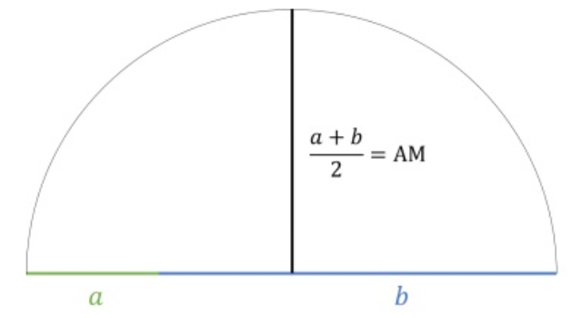
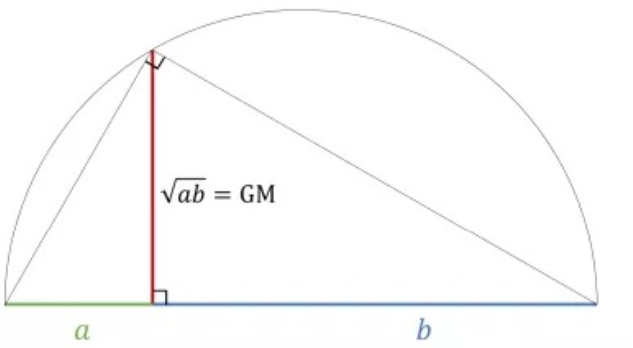
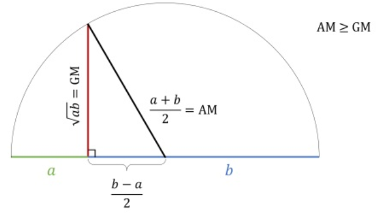
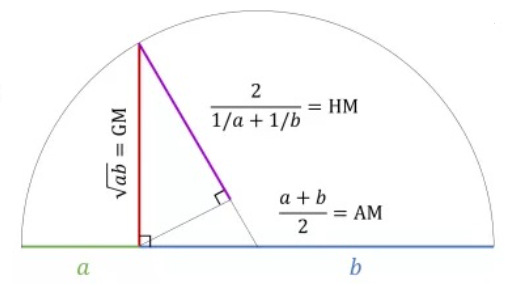

# Central tendency II

While simple averages like mean, median, and mode are widely used to summarize data, certain situations call for more specialized measures to capture the essence of a dataset. **Special averages**, including the **geometric mean** and **harmonic mean**, are tailored for specific contexts where the nature of the data or the relationships between data points require a different approach.

## Geometric mean

The **geometric mean (GM)** is a specialized measure of central tendency, particularly suited for datasets involving growth rates, ratios, or percentages, such as population growth, investment returns, or interest rates. Unlike the arithmetic mean, which calculates the average by summing values, the geometric mean finds the average by multiplying values and then taking the root (typically the *n*^th^ root for *n* values).

This approach captures the compounding effects present in the data, making the geometric mean an essential tool for accurately summarizing proportional changes or rates over time. Its utility lies in providing a more representative measure for datasets where changes are multiplicative rather than additive.

The geometric mean of a series containing *n* observations is the *n*^th^ root of the product of the values. If $x_{1},x_{2},\ldots, x_{n}$ are observations then

$$GM = \sqrt[n]{\prod_{i=1}^{n}x_{i}}$$ {#eq-gm1}\
where, $\prod_{i=1}^{n} x_i$ means the product of $x_{1},x_{2},\ldots, x_{n}$

$$= \left( x_1 x_2 \cdots x_n \right)^{\frac{1}{n}}$$

$$\log \text{GM} = \frac{1}{n} \log \left( x_1 x_2 \cdots x_n \right)$$

$$= \frac{1}{n} \left( \log x_1 + \log x_2 + \cdots + \log x_n \right)$$

$$= \frac{\sum_{i=1}^{n} \log x_i}{n}$$ {#eq-gm2}

$$\text{GM} = \operatorname{Antilog} \left( \frac{\sum_{i=1}^{n} \log x_i}{n} \right)$$ {#eq-gm3}

### Geometric mean for frequency table

$$\text{GM} = \operatorname{Antilog} \left( \frac{\sum_{i=1}^{k} f_i \log x_i}{n} \right)$$ {#eq-gm4}

where, $x_{i}$ is the *i*^th^ value in the dataset and for a grouped frequency table $x_{i}$ will be the midpoint of the *i*^th^ class interval calculated as the average of upper and lower limit, $f_{i}$ is the frequency of the *i*^th^ value or class , *k* is the number of classes.

**Example 5.1**: If the weight of sorghum ear heads are 45, 60, 48, 100, 65 gms. Find the geometric mean?

| Weight of ear head (*x*) | log(*x*)  |
|:------------------------:|:---------:|
|            45            |   1.653   |
|            60            |   1.778   |
|            48            |   1.681   |
|           100            |   2.000   |
|            65            |   1.813   |
|          Total           | **8.925** |

: Log values of sorghum ear head weights {#tbl-sorghumear .bordered}

**Solution 5.1**

Here *n* =5

using @eq-gm3

$$=\operatorname{Antilog}\left( \frac{8.925}{5} \right) $$\
$$ =\operatorname{Antilog}(1.785) = 60.95$$ note: here $\operatorname{Antilog}\left( x \right) = 10^{x}$ *i*.*e*. $$\operatorname{Antilog}\left( 1.785 \right) = \ 10^{1.785} = 60.95$$

**Example 5.2**: Geometric mean of a frequency distribution

| Weight of ear head (*x*) | Frequency(*f*) | log(*x*) | *f*.log(*x*) |
|:------------------------:|:--------------:|:--------:|:------------:|
|            45            |       5        |  1.653   |    8.266     |
|            60            |       4        |  1.778   |    7.113     |
|            48            |       6        |  1.681   |    10.087    |
|           100            |       8        |  2.000   |    16.000    |
|            65            |       9        |  1.813   |    16.316    |
|        **Total**         |     **32**     |          |  **57.782**  |

: Frequency distribution and log for GM calculation {#tbl-gmfreq .bordered}

**Solution 5.2**

Here *n* =32

using @eq-gm4

$${\sum_{i = 1}^{k}{{f_{i}\log}x_{i}} = 57.782
}$$\
$${\text{GM} = \ \operatorname{Antilog}\left( \frac{57.782}{32} \right)  }$$\
$${= \operatorname{Antilog}\left( 1.8056 \right)= 10^{1.8056} = 63.92}$$

**Example 5.3**: Geometric mean of a grouped frequency distribution

|  Class  | Mid value (*x*) | Frequency(*f*) | log(*x*) | *f*.log(x) |
|:-------:|:---------------:|:--------------:|:--------:|:----------:|
|  60-80  |       70        |       5        |  1.845   |   9.225    |
| 80-100  |       90        |       4        |  1.954   |   7.817    |
| 100-120 |       110       |       6        |  2.041   |   12.248   |
| 120-140 |       130       |       8        |  2.114   |   16.912   |
| 140-160 |       150       |       9        |  2.176   |   19.585   |
|         |    **Total**    |     **32**     |          | **65.787** |

: Geometric mean calculation for grouped frequency table {#tbl-gmgrpfreq .bordered}

**Solution 5.3**\
Here *n* = 32

using @eq-gm4

$${\sum_{i = 1}^{k}{{f_{i}\log}x_{i}} = 65.787}$$ $${\text{GM} = \ \operatorname{Antilog}\left( \frac{65.787}{32} \right)}$$ $${= \operatorname{Antilog}\left( 2.0558 \right) = 10^{2.0558} = 113.71}$$

**Merits and demerits of geometric mean**

[**Merits**]{.underline}

-   It is rigidly defined.

-   It is based on all the observations of the series.

-   It is suitable for measuring the relative changes.

-   It gives more weights to the small values and less weight to the large values.

-   It is used in averaging the ratios, percentages and in determining the rate gradual increase and decrease.

-   It is capable of further algebraic treatment.

[**Demerits**]{.underline}

-   It is not easy to understand.

-   It is difficult to calculate.

-   It cannot be calculated, if the number of negative values is odd.

-   It cannot be calculated, if any value of a series is zero.

-   At times it gives a value which may not be found in the series or impractical.

## Harmonic mean

Harmonic means are often used in averaging things like rates (e.g. the average travel speed given duration of several trips). Harmonic mean (HM) of a set of observations is defined as the reciprocal of the arithmetic average of the reciprocal of the given value.

::: {.callout-important title="Note"}
Harmonic mean can be easily remembered as “reciprocal of the mean of the reciprocals”.
:::

If $x_{1},\ x_{2},\ldots,\ x_{n}$ are *n* observations then

$$\text{H.M} = \frac{n}{\sum_{i = 1}^{n}\frac{1}{x_{i}}}$$ {#eq-hm1}

[**Steps in calculating Harmonic Mean (H.M)**]{.underline}

1.  Calculate the reciprocal (1/value) for every value.

2.  Find the average of those reciprocals (just add them and divide by how many there are).

3.  Then do the reciprocal of that average (=1/average).

**Example 5.4**: From the given data 5, 10, 17, 24, 30. calculate H.M

**Solution 5.4**

Here *n* = 5

|  *x*  |   1/*x*    |
|:-----:|:----------:|
|   5   |   0.2000   |
|  10   |   0.1000   |
|  17   |   0.0588   |
|  24   |   0.0417   |
|  30   |   0.0333   |
| Total | **0.4338** |

: Inverse of numbers to calculate harmonic mean {#tbl-hmcalc .bordered}

using @eq-hm1

$$\text{H.M} = \frac{5}{0.4338} = 11.53$$

### Harmonic mean for frequency table

$$\text{H.M} = \frac{n}{\sum_{i = 1}^{k}{f_{i}\frac{1}{x_{i}}}}$$ {#eq-hm2}

where, $x_{i}$ is the *i*^th^ value in the dataset and for a grouped frequency table $x_{i}$ will be the midpoint of the *i*^th^ class interval calculated as the average of upper and lower limit, $f_{i}$ is the frequency of the *i*^th^ value or class , *k* is the number of classes.

**Example 5.5**: For the given data calculate the harmonic mean.

|                 |     |     |     |     |     |     |
|:----------------:|:---:|:---:|:---:|:---:|:---:|:---:|
| *x*             | 20  | 21  | 22  | 23  | 24  | 25  |
| frequency (*f*) | 4   | 2   | 7   | 1   | 3   | 1   |

: Model data for harmonic mean calculation {#tbl-tomato .bordered}

**Solution 5.5**

| *x* |  *f*   | 1/*x* | *f .* (1/x) |
|:---:|:------:|:-----:|:-----------:|
| 20  |   4    | 0.050 |    0.200    |
| 21  |   2    | 0.048 |    0.095    |
| 22  |   7    | 0.045 |    0.318    |
| 23  |   1    | 0.043 |    0.043    |
| 24  |   3    | 0.042 |    0.125    |
| 25  |   1    | 0.040 |    0.040    |
|     | **18** |       |  **0.822**  |

: Calculation of harmonic mean from frequency table {#tbl-freqhm .bordered}

Here *n* =18

using @eq-hm2

$$\text{H.M} = \frac{18}{0.822} = 21.90$$

**Example 5.6**: *Cistern Problem*-Two pipes are used to fill a cistern. Pipe A can fill the cistern in 3 hours. Pipe B can fill the cistern in 5 hours. If both pipes are opened at the same time, how long will it take to fill the cistern completely?

**Solution 5.6**\
To solve the cistern problem, we first calculate the rate at which each pipe fills the cistern. Pipe A fills the cistern in 3 hours, so its rate is $\frac{1}{3}$ of the cistern per hour. Pipe B fills the cistern in 5 hours, so its rate is $\frac{1}{5}$ per hour. To find the combined rate, we add these rates together; $\frac{1}{3} + \frac{1}{5} = \frac{8}{15}$. This means the two pipes together fill $\frac{8}{15}$ of the cistern each hour. To find the total time, we take the reciprocal of the combined rate *i*.*e*. $\text{Total time} = \frac{1}{\frac{8}{15}} = \frac{15}{8} = 1.875$. To convert 1.875 hours into hours and minutes, we first separate the whole number from the decimal part. 1.875 hours consists of 1 hour (the whole number) and 0.875 hours (the decimal part). Next, we convert the decimal part into minutes. Since 1 hour is equal to 60 minutes, we multiply 0.875 by 60 *i*.*e*. $0.875 \times 60 = 52.5 \, \text{minutes}$. Rounding 52.5 minutes gives approximately 53 minutes. Thus, 1.875 hours is equivalent to 1 hour and 53 minutes.
\
The problem can be easily solved using the harmonic mean, the harmonic mean of two pipes is

$$
\text{H.M}=\frac{2}{\frac{1}{3} +\frac{1}{5}}
$$

$$= \frac{2 \cdot 3 \cdot 5}{3 + 5} = \frac{30}{8} = 3.75 \, \text{hours}$$

the harmonic mean of the pipes is 3.75 hours, and since both pipes are working together, the total time is half of that, which confirms the answer of 1 hour and 53 minutes.

**Example 5.7**: A car travels a certain distance from City A to City B at a speed of 60 km/h, and returns the same distance from City B to City A at a speed of 90 km/h. What is the average speed for the entire trip?

**Solution 5.7**

To find the average speed when traveling the same distance at two different speeds, we use the harmonic mean. The harmonic mean for the speed is $\frac{2 \cdot S_1 \cdot S_2}{S_1 + S_2}$, where $S_1 = 60 \, \text{km/h}$ is the speed from City A to City B, $S_2 = 90 \, \text{km/h}$ is the speed from City B to City A.

In this case, we are calculating the average speed over the entire round trip. The harmonic mean is used because it accounts for the fact that traveling at different speeds over the same distance results in an overall average speed that is closer to the lower of the two speeds, rather than simply averaging the two speeds.

Now, applying the harmonic mean formula:

$S_{\text{avg}} = \frac{2 \cdot 60 \cdot 90}{60 + 90} = \frac{10800}{150} = 72 \, \text{km/h}$

So, the average speed for the entire trip is 72 km/h.

**Merits and demerits of harmonic mean**

[**Merits**]{.underline}

-   It is rigidly defined.

-   It is defined on all observations.

-   It is amenable to further algebraic treatment.

-   It is the most suitable average when it is desired to give greater weight to smaller and less weight to the larger ones.

[**Demerits**]{.underline}

-   It is not easily understood.

-   It is difficult to compute.

-   It is only a summary figure and may not be the actual item in the series.

-   It gives greater importance to small items and is therefore, useful only when small items have to be given greater weightage.

-   It is rarely used in grouped data.

## AM, GM or HM?

The arithmetic mean (AM), geometric mean (GM), and harmonic mean (HM) are termed as **Pythagorean means**. The Pythagorean means refer to three specific types of means that were known to the ancient Greek mathematicians, particularly to Pythagoras and his followers. Choosing the right average depends on what you’re measuring and how the data behaves. Let’s break it down step by step in a simple way:

**Arithmetic Mean (AM)**\
The arithmetic mean is the most common type of average. You use it when the values in your data add together in a straightforward way. This is suitable for quantities like:\
- Heights or weights\
- Lengths or distances\
- Marks in exams

For example, if you want to find the average height of students in a class, you add up all the heights and divide by the number of students. The arithmetic mean gives a meaningful average because height or weight adds linearly.

**Harmonic Mean (HM)**\
The harmonic mean is useful when you are working with rates, ratios, or situations where quantities add up as reciprocals. Some examples include:\
- Speeds (distance per unit time)\
- Capacitors in a series circuit\
- Rates like fuel efficiency or cost per unit

For instance, imagine you are driving the same distance at different speeds. If you want to find the average speed for the entire trip, the harmonic mean is the best choice. This is because speeds relate inversely to time when you go faster, you take less time, and vice versa.

**Geometric Mean (GM)**\
The geometric mean is the right choice when your data involves multiplication or compounding, such as:\
- Growth rates (like population growth or interest rates)\
- Percentages (like inflation rates)\
- Ratios

For example, if you have annual interest rates for 10 years and want to find a single rate that represents the same total growth over that period, the geometric mean gives you the answer. It works by multiplying the rates and taking the root, which accounts for the compounding effect.

Here’s a simple example to understand how the geometric mean works. Suppose you invest Rs.100, and your investment changes over three years as follows: in the first year, it grows by 10%, represented by a growth factor of 1.10; in the second year, it grows by 20%, represented by 1.20; and in the third year, it drops by 10%, represented by 0.90. To find a single rate that would give the same overall growth over the three years, you multiply the growth factors: $1.10 \times 1.20 \times 0.90 = 1.188$. Then, take the cube root (since there are three years): $\sqrt[3]{1.188} \approx 1.059$. This gives a geometric mean rate of approximately 1.059, or 5.9% per year. In other words, if your Rs. 100 investment grew steadily at a rate of 5.9% each year, it would result in the same total growth over three years, leaving you with about Rs. 118.80 at the end.

**Key Takeaways**\
1. Use **Arithmetic Mean** when values combine directly, like adding lengths or weights.\
2. Use **Harmonic Mean** for rates or quantities that work reciprocally, like speed or resistance.\
3. Use **Geometric Mean** for data involving multiplication or compounding, like growth rates or percentages.

By understanding the relationship between the data and the type of average, you can choose the most meaningful measure for your analysis.

## Relation between AM, GM and HM

The formula for the relation between AM, GM, HM is the product of arithmetic mean and harmonic mean is equal to the square of the geometric mean. This can be presented here in the form of @eq-amgmhm

$$\text{AM}\times\text{HM}=\text{GM}^{2}$$ {#eq-amgmhm}

also

$$AM \geq GM \geq HM$$ {#eq-gretamgmhm}

### Geometric illustration

Consider two numbers a and b. See @fig-semiam a semi circle can be drawn with diameter a+b. Then its radius is half the diameter, which will be the arithmetic mean $\frac{a+b}{2}$.

{#fig-semiam fig-align="center" width="50%" style="text-align:center;"}

The geometric mean is the length of the perpendicular where a and b meet, which is never larger than the radius of the circle as illustrated in @fig-semigm

{#fig-semigm fig-align="center" width="50%" style="text-align:center;"}

Now draw a line from the top of red line which is the GM in @fig-semigm to the center of the circle. Now that line is the radius of the circle, so it is equal to AM, which is now the hypotenuse of the newly formed triangle with GM as the leg of the triangle. So from @fig-semiamgm it is clear that

$$AM \geq GM$$ {#eq-amgm}

{#fig-semiamgm fig-align="center" width="50%" style="text-align:center;"}

Now if we draw an altitude to the hypotenuse as shown in @fig-semiamgm, the upper length on the hypotenuse is the harmonic mean . We can now consider another triangle where HM is a leg and the GM is the hypotenuse, this shows the GM is never smaller than the HM. So $$GM \geq HM$$ {#eq-gmhm}

{#fig-semiamgmhm fig-align="center" width="50%" style="text-align:center;"}

Now from @eq-amgm and @eq-gmhm it is clear that $AM \geq GM \geq HM$

## Positional averages {#sec-positional_avg}

Positional averages are measures derived directly from the values in a dataset. These averages are based on the position of the values within the series and are used to represent the overall dataset or highlight specific positional characteristics.

::: {.callout-important title="Note"}
The **median**, although a simple average, is also a positional average that represents the middle value of an ordered dataset, making it a central point of reference. Similarly, the **mode**, which identifies the most frequently occurring value in the dataset, is also a positional average since it is directly taken from the series.
:::

The other common positional averages include **percentiles**, **quartiles**, and **deciles**, which divide the data into equal parts to analyze its distribution.

In contrast, measures like the **arithmetic mean**, **geometric mean**, and **harmonic mean** are referred to as **mathematical averages**, as they are calculated through specific mathematical operations rather than being derived from the data’s positional properties.

### Quartiles {#sec-quartile}

The **median** divides a dataset into two equal halves. Similarly, it is possible to divide a dataset into more than two parts. When an **ordered** dataset is divided into four equal sections, the points that mark these divisions are called **quartiles**.

The **first or lower quartile** ($Q_{1}$) is a value that has one fourth, or 25% of the observations below its value.

The **second quartile** ($Q_{2}$) has one-half, or 50% of the observations below its value. The second quartile is equal to the median.

The **third or upper quartile** ($Q_{3}$) is a value that has three-fourths, or 75% of the observations below it. If there are *n* items in a dataset then

$$Q_1 = \left( \frac{n + 1}{4} \right)^{\text{th}} {\text{item}}$$ {#eq-quartileq1}

$$Q_3 = \left( \frac{3(n + 1)}{4} \right)^{\text{th}} {\text{item}}$$ {#eq-quartileq2}

Calculations of quartiles are explained using the example below. See in the example the procedure followed when a fraction appear in the calculation.

**Example 5.8**: Compute quartiles for the data 25, 18, 30, 8, 15, 5, 10, 35, 40, 45.

**Solution 5.8**

First arrange the data in ascending order

5, 8, 10, 15, 18, 25, 30, 35, 40, 45

here *n* = 10

using @eq-quartileq1 and @eq-quartileq2

$Q_{1} = \left( \frac{10 + 1}{4} \right)^{th}$ = 2.75^th^ item; when such a fraction appears we use the following procedure

$Q_{1}$ = 2.75^th^ item = 2^nd^ item + 0.75(3^rd^ item - 2^nd^ item)

So from the given data $Q_{1}$ = 8+0.75(10 - 8) = 9.5, also $Q_{2}$ is the median, here $Q_{2}$ = (18+25)/2 = 21.5

$Q_{3} = \left(\frac{3(10 + 1)}{4} \right)^{th}$ = 8.25^th^ item = 8^th^ item + 0.25(9^th^ item - 8^th^ item) = 35+0.25(40-35) = 36.25

#### Quartiles of a discrete frequency data

The following steps explain how to calculate quartiles for discrete frequency data

1.  Find cumulative frequencies.

2.  Find $\left( \frac{n + 1}{4} \right)$.

3.  See in the cumulative frequencies, the value just greater than $\left(\frac{n + 1}{4}\right)$, then the corresponding value of $x$ is $Q_{1}$.

4.  Find $\left( \frac{3(n + 1)}{4}\right)$.

5.  See in the cumulative frequencies, the value just greater than $\left(\frac{3(n + 1)}{4}\right)$, then the corresponding value of $x$ is $Q_{3}$.

**Example 5.9**: Compute quartiles for the data given below

|     |     |     |     |     |     |     |     |
|:---:|:---:|:---:|:---:|:---:|:---:|:---:|:---:|
| *x* |  5  |  8  | 12  | 15  | 19  | 24  | 30  |
| *f* |  4  |  3  |  2  |  4  |  5  |  2  |  4  |

: A model frequency distribution {#tbl-quartile .bordered}

**Solution 5.9**

| *x* | *f* | *cf* |
|:---:|:---:|:----:|
|  5  |  4  |  4   |
|  8  |  3  |  7   |
| 12  |  2  |  9   |
| 15  |  4  |  13  |
| 19  |  5  |  18  |
| 24  |  2  |  20  |
| 30  |  4  |  24  |

: Cumulative frequency data for quartile calculation {#tbl-qtlcalc .bordered}

Here *n* =24

$\left( \frac{n + 1}{4} \right)$ = $\left( \frac{25}{4} \right)$ = 6.25

The cumulative frequency value just greater than 6.25 is 7, the\
${x}$ value corresponding to cumulative frequency 7 is 8. So ${Q}_{1}$ = 8

$\left( \frac{3(n + 1)}{4} \right)$ = $\left( \frac{3 \times 25}{4} \right)$ = 18.75

The cumulative frequency value just greater than 18.75 is 20, the\
$x$ value corresponding to cumulative frequency 20 is 24. So ${Q}_{3}$ = 24

#### Quartiles of a grouped frequency data

Below it is explained steps in calculating quartiles for a continuous frequency data

1.  Find cumulative frequencies.

2.  Find $\left( \frac{n}{4} \right)$.

3.  See in the cumulative frequencies, the value just greater than $\left( \frac{n}{4} \right)$, and then the corresponding class interval is called **first quartile class**.

4.  Find $3\left( \frac{n}{4} \right)$.

5.  See in the cumulative frequencies the value just greater than $3\left( \frac{n}{4} \right)$, then the corresponding class interval is called **3^rd^ quartile class**. Then apply the respective formulae

$$Q_1 = l_1 + \frac{\frac{n}{4} - m_1}{f_1} \times c_1$$ {#eq-qrtl1}

$$Q_3 = l_3 + \frac{3 \left( \frac{n}{4} \right) - m_3}{f_3} \times c_3$$ {#eq-qrtl2}

where, $l_{1}$ = lower limit of the first quartile class

$f_{1}$ = frequency of the first quartile class

$c_{1}$ = width of the first quartile class

$m_{1}$ = cumulative frequency preceding the first quartile class

$l_{3}$= lower limit of the 3^rd^ quartile class

$f_{3}$= frequency of the 3^rd^ quartile class

$c_{3}$= width of the 3^rd^ quartile class

$m_{3}$ = cumulative frequency preceding the 3^rd^ quartile class

**Example 5.10**: Find the quartiles for the grouped frequency data given

| **Class** | **frequency** | **cumulative frequency** |
|:---------:|:-------------:|:------------------------:|
|   0--10   |      11       |            11            |
|  10--20   |      18       |            29            |
|  20--30   |      25       |            54            |
|  30--40   |      28       |            82            |
|  40--50   |      30       |           112            |
|  50--60   |      33       |           145            |
|  60--70   |      22       |           167            |
|  70--80   |      15       |           182            |
|  80--90   |      12       |           194            |
|  90--100  |      10       |           204            |

: A model grouped frequency data {#tbl-grpdqrtl .bordered}

**Solution 5.10**

$\left( \frac{n}{4} \right)$ = $\frac{204}{4}$ = 51

The cumulative frequency value just greater than 51 is 54 so the class 20-30 is the 1^st^ quartile class

using @eq-qrtl1

$$Q_1 = 20 + \frac{51 - 29}{25} \times 10 = 28.8$$

$3\left( \frac{n}{4} \right)$= $3 \times \frac{204}{4}$ = 153

The cumulative frequency value just greater than 153 is 167 so the class 60-70 is the 3^rd^ quartile class.

using @eq-qrtl2

$$Q_3 = 60 + \frac{153 - 145}{22} \times 10 = 63.64$$

### Percentiles

Percentiles divide an ordered dataset into 100 equal parts, with each part containing 1% of the observations. The *p*^th^ percentile, denoted as $P_p$, is the value below which *x* percent of the data falls.

For example:\
- The $P_{50}$, **50^th^ percentile**, is equivalent to the median, representing the middle value of the dataset.\
- The $P_{25}$, **25^th^ percentile**, corresponds to the first quartile ($Q_1$), which marks the lower 25% of the data.\
- The $P_{75}$, **75^th^ percentile**, is the third quartile ($Q_3$), indicating that 75% of the data falls below this value.

For raw data, first arrange the *n* observations in increasing order. Then the *x*^th^ percentile is given by

$$P_p = \left( \frac{p(n + 1)}{100} \right)^{\text{th}} \text{ item}$$ {#eq-percentilesingle1}

#### Percentiles of discrete frequency data

To calculate percentiles for discrete frequency data, follow these steps which is similar to that of quartiles:

1.  Find the cumulative frequencies.

2.  Find the position of the percentile. For the $p$-th percentile, calculate the position using the formula: $$
    P_p = \left( \frac{p(n + 1)}{100} \right)
    $$ where $p$ is the percentile and $n$ is the total number of data points.

3.  Identify the value in the cumulative frequencies.

find the cumulative frequency that is just greater than or equal to the calculated position $P_p$. The corresponding value of $x$ is the $p$-th percentile.

For example, to find the first percentile ($P_1$): - Calculate $P_1 = \left( \frac{1(n + 1)}{100} \right)$. - Locate the cumulative frequency that is just greater than $P_1$, and the corresponding value of $x$ is $P_1$.

#### Percentiles of a grouped frequency data

Calculation of percentile is very much similar to that of quartile. For a frequency distribution the *p*^th^ percentile is given by following steps

1.  Find cumulative frequencies.

2.  Find $\left( \frac{p.n}{100} \right)$.

3.  See in the cumulative frequencies, the value just greater than $\left( \frac{p.n}{100} \right)$ and then the corresponding class interval is called **Percentile class**.

4.  Use the following formula

$$P_p = l + \frac{\left( \frac{p \times n}{100} \right) - cf}{f} \times c$$ {#eq-percentile1}

where,

${l}$ = lower limit of the percentile class

${cf}$ = cumulative frequency preceding the percentile class

${f}$ = frequency of the percentile class

${c}$ = class interval

${n}$ = total number of observations

**Example 5.11**: Compute ${P}_{25}$ and ${P}_{75}$ for the data 25, 18, 30, 8, 15, 5, 10, 35, 40, 45.

**Solution 5.11**

First arrange the data in ascending order

5, 8, 10, 15, 18, 25, 30, 35, 40, 45

Here *n* = 10

$P_{25} = \left( \frac{25(10 + 1)}{100} \right)^{\text{th}}$ = 2.75^th^ item

$P_{25}$ = 2.75^th^ item = 2^nd^ item + 0.75(3^rd^ item - 2^nd^ item)

So from the given data $P_{25}$ = 8+0.75(10 - 8) = 9.5

$P_{75} = \left( \frac{75(10 + 1)}{100} \right)^{\text{th}}$ = 8.25^th^ item

*i*.*e*. $P_{75} = \left( 75 \times \frac{10 + 1}{100} \right)^{th}$ = 8.25^th^ item = 8^th^ item + 0.25(9^th^ item - 8^th^ item) = 35+0.25(40-35) = 36.25

::: {.callout-important title="Note"}
Data in Example 5.11 is same as Example 5.8; it can be seen that $P_{25} = Q_{1}$ & $P_{75} = Q_{3}$ always
:::

::: {.callout-note appearance="simple"}
**Try yourself**

Find $P_{25}$, $P_{50}$ & $P_{75}$ for Example 5.9 & 5.10; verify that $P_{50} = Q_{2}$, $P_{25} = Q_{1}$ & $P_{75} = Q_{3}$
:::

### Deciles

Deciles consist of 9 points that divide an ordered dataset into ten equal parts. The *d* ^th^ decile is denoted as $D_d$. It is important to note that the **median** is the **5th decile**.

$$D_d = \left( \frac{d(n + 1)}{10} \right)^{\text{th}} \text{ item}$$ {#eq-decileq1}\
where, $d$ is the decile number (e.g., $d = 1$ for the first decile, $d = 9$ for the ninth decile), and $n$ is the total number of data points.

#### Deciles of discrete frequency data

To calculate deciles for discrete frequency data, follow these steps which are similar to that of percentiles:

1.  Find the cumulative frequencies.

2.  Find the position of the decile.\
    For the $d^{th}$ decile, calculate the position using the formula:\
    $$D_d = \left( \frac{d(n + 1)}{10} \right)$$\

3.  Identify the value in the cumulative frequencies.\
    Find the cumulative frequency that is just greater than or equal to the calculated position $D_d$. The corresponding value of $x$ is the $d^{th}$ decile.

For example, to find the first decile ($D_1$): - Calculate $D_1 = \left( \frac{1(n + 1)}{10} \right)$. - Locate the cumulative frequency that is just greater than $D_1$, and the corresponding value of $x$ is $D_1$.

#### Deciles of a grouped frequency data

For a frequency distribution the *d*^th^ decile is given by following steps

1.  Find cumulative frequencies.

2.  Find $\left( \frac{d.n}{10} \right)$.

3.  See in the cumulative frequencies, the value just greater than $\left( \frac{d.n}{10} \right)$, and then the corresponding class interval is called **decile class**.

4.  Use the following formula

$$D_d = l + \frac{\left( \frac{d \times n}{10} \right) - cf}{f} \times c$$ {#eq-decile}

where,

$l$ = lower limit of the decile class

${cf}$ = cumulative frequency preceding the decile class

${f}$ = frequency of the decile class

${c}$ = class interval

${n}$ = total number of observations

::: {.callout-note appearance="simple"}
**Try yourself**

Find $\text{D}_{5}$ for Example 5.9, 5.10 & 5.11; verify that ${D}_{5} = {Q}_{2} = {P}_{50} = median$
:::

::: {.callout-caution title="Historical Insights"}
**“The harmonic mean and the perfect fourth”**

The harmonic mean is a term derived from the ancient Greeks, particularly associated with Pythagoras or his followers. The harmonic mean is closely related to musical intervals, specifically the *perfect fourth*. In music theory, an octave change upwards corresponds to a doubling of the frequency (a 1:2 ratio). The harmonic mean of 1 and 2, which is $\frac{4}{3}$, defines the frequency ratio for the perfect fourth, making it a crucial concept in understanding musical harmony and acoustics.
:::

::: {.callout-tip title="Quotes to Inspire"}
**“The best thing about being a statistician is that you get to play in everyone’s backyard.”**\
**- John Tukey**
:::  

## Chapter Summary

### Fill in the blanks {.unnumbered}

Answers are given at the end of the chapter.

1. The two special averages discussed in this chapter are __________ and __________.

2. The geometric mean is particularly suitable for data involving __________, ratios, and percentages.

3. The geometric mean of $n$ observations is the __________ root of their product.

4. The geometric mean of $x_1,x_2,\ldots,x_n$ is denoted by __________.

5. The geometric mean can be calculated using logarithms by taking the __________ of the arithmetic mean of the logarithms.

6. For a frequency distribution, the geometric mean is calculated using the frequencies as __________.

7. The geometric mean cannot be calculated if any observation is __________.

8. The geometric mean cannot be calculated if the number of negative values is __________.

9. The harmonic mean is the reciprocal of the arithmetic mean of the __________ of the observations.

10. The harmonic mean is particularly useful for averaging __________ and rates.

11. The harmonic mean of $n$ observations is denoted by __________.

12. Quartiles divide an ordered dataset into __________ equal parts.

13. The first quartile is denoted by __________.

14. The second quartile is denoted by __________ and is equal to the __________.

15. The third quartile is denoted by __________.

16. The second quartile has __________% of observations below it.

17. The first quartile has __________% of observations below it.

18. The third quartile has __________% of observations below it.

19. Percentiles divide an ordered dataset into __________ equal parts.

20. The $50^{th}$ percentile is equal to the __________.

21. The $25^{th}$ percentile is equal to the __________ quartile.

22. The $75^{th}$ percentile is equal to the __________ quartile.

23. Deciles divide an ordered dataset into __________ equal parts.

24. There are __________ deciles in a dataset.

25. The fifth decile is equal to the __________, $Q_2$, and $P_{50}$.

26. In grouped frequency data, the class containing the required quartile position is called the __________ class.

27. In grouped frequency data, the class containing the required percentile position is called the __________ class.

28. In grouped frequency data, the class containing the required decile position is called the __________ class.

29. The arithmetic mean, geometric mean, and harmonic mean are collectively called __________ means.

30. The relationship among the three Pythagorean means is generally written as $AM$ __________ $GM$ __________ $HM$.

### Short-answer questions {.unnumbered}

1. Define geometric mean and explain its applications.

2. Explain how geometric mean is calculated using logarithms.

3. Explain how geometric mean is calculated for a frequency distribution.

4. State the merits and demerits of geometric mean.

5. Define harmonic mean and explain its applications.

6. Explain the steps involved in calculating harmonic mean.

7. Explain how harmonic mean is calculated for a frequency distribution.

8. Why is harmonic mean suitable for averaging rates?

9. State the merits and demerits of harmonic mean.

10. Distinguish between arithmetic mean, geometric mean, and harmonic mean.

11. What are Pythagorean means?

12. State the relationship among arithmetic mean, geometric mean, and harmonic mean.

13. What are positional averages?

14. What are mathematical averages?

15. What are quartiles? Explain $Q_1$, $Q_2$, and $Q_3$.

16. Explain how quartiles are calculated for raw data.

17. Explain how quartiles are calculated for discrete frequency data.

18. Explain how quartiles are calculated for grouped frequency data.

19. What is the relationship between quartiles and the median?

20. Define percentiles and explain their interpretation.

21. Explain how percentiles are calculated for raw data.

22. Explain how percentiles are calculated for discrete frequency data.

23. Explain how percentiles are calculated for grouped frequency data.

24. Define deciles and explain their interpretation.

25. Explain how deciles are calculated for raw data.

26. Explain how deciles are calculated for discrete frequency data.

27. Explain how deciles are calculated for grouped frequency data.

28. Explain the relationship between $D_5$, $Q_2$, $P_{50}$, and the median.

### Numerical and conceptual questions {.unnumbered}

Answers are given at the end of the chapter.

1. Find the geometric mean of 45, 60, 48, 100, and 65.

2. Find the harmonic mean of 5, 10, 17, 24, and 30.

3. For the data 5, 8, 12, 15, 19, 24, and 30, find $Q_1$ and $Q_3$.

4. For the data 25, 18, 30, 8, 15, 5, 10, 35, 40, and 45, find $P_{25}$ and $P_{75}$.

5. Explain why $P_{50}=Q_2$.

6. Explain why $P_{25}=Q_1$ and $P_{75}=Q_3$.

7. Explain why $D_5=Q_2=P_{50}=\text{Median}$.

8. Calculate the geometric mean for the following frequency distribution.

| $x$ | $f$ |
|:---:|:---:|
| 45 | 5 |
| 60 | 4 |
| 48 | 6 |
| 100 | 8 |
| 65 | 9 |

9. Calculate the harmonic mean for the following frequency distribution.

| $x$ | $f$ |
|:---:|:---:|
| 20 | 4 |
| 21 | 2 |
| 22 | 7 |
| 23 | 1 |
| 24 | 3 |
| 25 | 1 |

10. Two pipes can fill a cistern in 3 hours and 5 hours, respectively. Find the time required to fill the cistern when both pipes are opened together.

11. A car travels from City A to City B at 60 km/h and returns over the same distance at 90 km/h. Find the average speed for the entire trip.

12. Find $P_{25}$, $P_{50}$, and $P_{75}$ for a given frequency distribution and verify that $P_{25}=Q_1$, $P_{50}=Q_2$, and $P_{75}=Q_3$.

13. Find $D_5$ for a given dataset and verify that $D_5=Q_2=P_{50}=\text{Median}$.

### Important formulae {.unnumbered}

Geometric mean:

$$
GM=\sqrt[n]{\prod_{i=1}^{n}x_i}
$$

Geometric mean using logarithms:

$$
\log GM=\frac{\sum_{i=1}^{n}\log x_i}{n}
$$

Geometric mean using antilogarithms:

$$
GM=\operatorname{Antilog}\left(\frac{\sum_{i=1}^{n}\log x_i}{n}\right)
$$

Geometric mean for a frequency distribution:

$$
GM=\operatorname{Antilog}\left(\frac{\sum_{i=1}^{k}f_i\log x_i}{n}\right)
$$

Harmonic mean:

$$
HM=\frac{n}{\sum_{i=1}^{n}\frac{1}{x_i}}
$$

Harmonic mean for a frequency distribution:

$$
HM=\frac{n}{\sum_{i=1}^{k}f_i\frac{1}{x_i}}
$$

First quartile for raw data:

$$
Q_1=\left(\frac{n+1}{4}\right)^{\text{th}}\text{ item}
$$

Third quartile for raw data:

$$
Q_3=\left(\frac{3(n+1)}{4}\right)^{\text{th}}\text{ item}
$$

First quartile for grouped data:

$$
Q_1=l_1+\frac{\frac{n}{4}-m_1}{f_1}\times c_1
$$

Third quartile for grouped data:

$$
Q_3=l_3+\frac{\frac{3n}{4}-m_3}{f_3}\times c_3
$$

Percentile for raw data:

$$
P_p=\left(\frac{p(n+1)}{100}\right)^{\text{th}}\text{ item}
$$

Percentile for grouped data:

$$
P_p=l+\frac{\left(\frac{pn}{100}\right)-cf}{f}\times c
$$

Decile for raw data:

$$
D_d=\left(\frac{d(n+1)}{10}\right)^{\text{th}}\text{ item}
$$

Decile for grouped data:

$$
D_d=l+\frac{\left(\frac{dn}{10}\right)-cf}{f}\times c
$$

Relationship among Pythagorean means:

$$
AM\times HM=GM^2
$$

$$
AM\geq GM\geq HM
$$

### Quick revision {.unnumbered}

- Geometric mean → suitable for growth rates, ratios, percentages, and multiplicative changes.
- Harmonic mean → suitable for rates, ratios, and reciprocal relationships.
- Geometric mean → $n$th root of the product of $n$ observations.
- Harmonic mean → reciprocal of the arithmetic mean of reciprocals.
- Geometric mean gives greater weight to smaller values and less weight to larger values.
- Harmonic mean gives greater weight to smaller values.
- Geometric mean cannot be calculated when any observation is zero.
- Geometric mean cannot be calculated when the number of negative values is odd.
- Arithmetic mean, geometric mean, and harmonic mean are called Pythagorean means.
- Mathematical averages → arithmetic mean, geometric mean, and harmonic mean.
- Positional averages → median, mode, quartiles, percentiles, and deciles.
- Quartiles → divide data into 4 equal parts.
- $Q_1$ → 25th percentile.
- $Q_2$ → 50th percentile → Median.
- $Q_3$ → 75th percentile.
- Percentiles → divide data into 100 equal parts.
- $P_{25}=Q_1$.
- $P_{50}=Q_2=\text{Median}$.
- $P_{75}=Q_3$.
- Deciles → divide data into 10 equal parts.
- $D_5=Q_2=P_{50}=\text{Median}$.
- For raw data, arrange observations in ascending order before finding positional measures.
- For discrete frequency data, use cumulative frequencies to locate the required position.
- For grouped frequency data, first identify the relevant quartile, percentile, or decile class.
- In grouped data, interpolation is then used to calculate the required value.

### Answers to fill in the blanks {.unnumbered}

1. Geometric mean; Harmonic mean
2. Growth rates
3. $n$th
4. $GM$
5. Antilog
6. $f_i\log x_i$
7. Zero
8. Odd
9. Reciprocals
10. Rates
11. $HM$
12. Four
13. $Q_1$
14. $Q_2$; Median
15. $Q_3$
16. 50
17. 25
18. 75
19. Hundred
20. Median
21. First
22. Third
23. Ten
24. Nine
25. Median
26. Quartile
27. Percentile
28. Decile
29. Pythagorean
30. $\geq$; $\geq$

### Solutions to numerical and conceptual questions {.unnumbered}

1.  Using @eq-gm3, $\sum\log x_i=8.925$, so $GM=\operatorname{Antilog}\left(\frac{8.925}{5}\right)=\operatorname{Antilog}(1.785)=60.95$.

2.  Using @eq-hm1, $\sum\frac{1}{x}=0.4338$, so $HM=\frac{5}{0.4338}=11.53$.

3.  Using @eq-quartileq1 and @eq-quartileq2 for $n=7$: $Q_1=\left(\frac{8}{4}\right)^{\text{th}}$ item $=2^{\text{nd}}$ item $=8$; $Q_3=\left(\frac{24}{4}\right)^{\text{th}}$ item $=6^{\text{th}}$ item $=24$.

4.  Using @eq-percentilesingle1 for $n=10$: $P_{25}=2.75^{\text{th}}$ item $=8+0.75(10-8)=9.5$; $P_{75}=8.25^{\text{th}}$ item $=35+0.25(40-35)=36.25$.

5.  $P_{50}$ marks the same position as $Q_2$ (both the 50% point), so $P_{50}=Q_2=\text{Median}$.

6.  $Q_1$ is the 25th percentile and $Q_3$ is the 75th percentile, so $P_{25}=Q_1$ and $P_{75}=Q_3$.

7.  $D_5$ divides the data at the 50% position, the same as $Q_2$ and $P_{50}$, so $D_5=Q_2=P_{50}=\text{Median}$.

8.  Using @eq-gm4, $\sum f_i\log x_i=57.782$ for $n=32$, so $GM=\operatorname{Antilog}\left(\frac{57.782}{32}\right)=\operatorname{Antilog}(1.8056)=63.92$.

9.  Using @eq-hm2 with $n=18$, $\sum f_i\frac{1}{x_i}=0.822$, so $HM=\frac{18}{0.822}=21.90$.

10. Pipes A and B fill $\frac{1}{3}$ and $\frac{1}{5}$ of the cistern per hour; combined rate $=\frac{1}{3}+\frac{1}{5}=\frac{8}{15}$, so the time required is $\frac{15}{8}=1.875$ hours, or approximately 1 hour 53 minutes.

11. Using the harmonic-mean average speed, $S_{\text{avg}}=\frac{2S_1S_2}{S_1+S_2}=\frac{2(60)(90)}{60+90}=\frac{10800}{150}=72$ km/h.

12. Using @eq-percentile1 on the frequency distribution from @tbl-quartile (Example 5.9, $n=24$): $P_{25}=8=Q_1$, $P_{50}=15=Q_2=\text{Median}$, $P_{75}=24=Q_3$, verifying the relationship.

13. Using @eq-decile on the same distribution as question 12: $D_5=15=Q_2=P_{50}=\text{Median}$, verifying the relationship.
