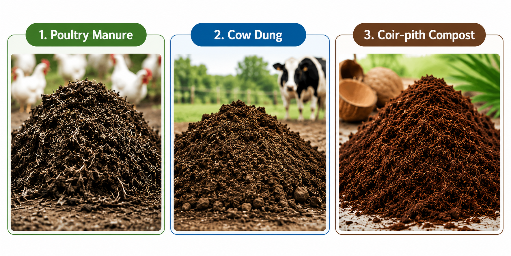

# Design of experiments  

Design of experiments is an integral component of agricultural research. A scientifically designed experiment is a valuable tool in gaining new knowledge and developing technology. "It is the effective use of the tools of statistical design of experiments that paved the way for the green revolution", these words of the father of the green revolution in India, Dr. M.S. Swaminathan, show how important the design and analysis of experiments, as well as statistical science, is for agricultural experiments.  

A carefully designed experiment is able to answer all the queries of a researcher with accuracy and reliability, while making efficient use of the available resources. Thus, for successful experimentation, it is highly desirable that scientists and researchers of scientific disciplines, including the agricultural sciences, understand the basic principles of designing an experiment and of analyzing the resultant data from the completed experiment. It may be emphasized that a researcher should always consult a statistician before, during, and after experimentation, if he is not convinced enough about using a design for his experiment or an analysis technique for his data.

Any scientific investigation involves the formulation of certain assertions (or hypotheses) whose validity is examined through the data generated from an experiment conducted for the purpose.  

The term **experiment** is defined as the systematic procedure carried out under controlled conditions in order to discover an unknown effect, to test or establish a hypothesis, or to illustrate a known effect.

In agricultural research, Design of Experiments (DoE) is the statistical methodology for planning agricultural experiments so that treatment effects can be estimated accurately, efficiently, and without bias. It involves the systematic allocation of treatments to experimental units while controlling experimental variability through the principles of randomization, replication, and local control. These three principles, **randomization**, **replication**, and **local control**, are together termed the **Basic Principles of Design**, explained in @sec-basicP. The ultimate goal is to draw valid scientific conclusions about the performance of agricultural treatments under field or laboratory conditions.

DoE is a structured approach for conducting experiments. The primary objectives of designing agricultural experiments are to ensure:  

-   Validity: The experiment accurately measures the true effect of the treatments by minimizing bias and controlling extraneous sources of variation.  

-   Reliability: The experimental results are consistent and dependable under similar conditions.

-   Replicability: The experiment can be repeated by other researchers or at different locations and seasons to verify the findings.  

-   Optimality: Maximum information is obtained with the minimum use of resources, resulting in precise estimates and greater statistical power.  

## Some terms involved

### Treatments

A **treatment** is any object of comparison in an experiment. It is the condition, factor, method, or intervention that is deliberately applied to the experimental units to study and compare its effect on a response variable. The primary objective of an experiment is to determine whether the observed differences in the response are due to the treatments being compared.

In agricultural experiments, treatments may include different crop varieties, fertilizers, irrigation methods or irrigation levels, pesticides, fungicides, planting densities, nutrient levels, or crop management practices. In laboratory experiments, treatments may consist of different doses of a drug, concentrations of a chemical solution, incubation temperatures, or processing methods.

**Examples of treatments**

* Different crop varieties
* Different fertilizer sources (e.g., poultry manure, farmyard manure, and vermicompost)
* Different irrigation methods or irrigation levels
* Different doses of a pesticide or herbicide
* Different fungicides for disease management
* Different planting densities
* Different grazing systems for livestock
* Different tree species in agroforestry experiments
* Different concentrations of a chemical solution

In simple terms, **anything that is compared in an experiment is called a treatment.**  

### Control

A **control** or **control treatment** is a treatment used as a standard for comparison in an experiment. It provides a baseline against which the effects of the other treatments can be evaluated. The control may be the existing standard practice or, in some cases, the absence of any treatment.

For example, in a fertilizer experiment, a plot that receives no fertilizer may serve as the control treatment. Similarly, in a pesticide experiment, the control may be a recommended commercial pesticide against which new pesticides are compared. In clinical trials, the control treatment is often a placebo, which resembles the test treatment but contains no active ingredient.

Including a control treatment helps the researcher determine whether the observed changes are due to the treatments under investigation or would have occurred even without them.


### Experimental units

An **experimental unit** is the smallest unit of the experiment to which a treatment is independently applied. It is the unit on which observations are made and from which data are collected. The choice of the experimental unit depends on the nature of the experiment and the objective of the study.

In agricultural field experiments, an experimental unit is usually a plot of land. In pot culture experiments, each pot is an experimental unit. In animal experiments, an individual animal or a group of animals may serve as the experimental unit, depending on how the treatments are applied. Similarly, in laboratory experiments, an experimental unit may be a Petri dish, a test tube, a culture flask, or any other unit that receives a treatment independently.

**Examples of experimental units**

* Plots of land in field experiments
* Pots in greenhouse or pot culture experiments
* Individual plants or trees
* Individual animals or groups of animals
* Petri dishes used for microbial culture
* Test tubes or culture flasks in laboratory experiments

It is important to distinguish between an experimental unit and an observation unit. In some experiments, several observations may be recorded from a single experimental unit. For example, in a field experiment, the treatment is applied to an entire plot (experimental unit), but measurements may be taken from several plants within the plot (observation units). Since the treatment was applied to the plot and not to the individual plants, the plot remains the experimental unit.


### Response

Responses are measurable outcomes that are observed after applying a treatment to an experimental unit. Alternatively, the response is what we measure to find out what happened in the experiment. In an experiment, there may be more than one response. Some examples of responses are grain yield or straw yield, nitrogen content in plants or biomass of plants, quality parameters of the produce, percentage of plants infested by disease, and weight gain by animals.

### Factors

Factors are the variables whose influence on a response variable is being studied in the experiment. If only one factor is being studied in an experiment, then such an experiment is called a single-factor experiment. If more than one factor is being studied simultaneously in an experiment, then such an experiment is called a multi-factor or factorial experiment. The term factor is commonly used in the case of factorial experiments. For example, temperature and concentration of chemicals in a chemical experiment are two factors; nitrogen, phosphorus, and potassium fertilizers are three factors in an agronomic experiment. Dose and time of application of a chemical formulation are two factors in a laboratory experiment.

### Factor levels

The term factor levels, or simply levels, is used to denote the values or settings that a factor takes in a factorial experiment. For example, doses of a nitrogenous fertilizer as 0 kg/ha, 30 kg/ha, and 80 kg/ha are three levels of the factor *fertilizer*. Concentrations of 10%, 20%, 30%, and 40% of a solute in a solution are four levels of the factor *solute* in a laboratory experiment. Presence of a polythene sheet on the surface of the soil, or its absence, could be two levels of the factor *management practice* in a water management study.

### Observational unit

An observational unit is a unit on which the response variables are measured. Observational units are often the same as experimental units, but this may not always be true. The mistake of confusing the observational unit with the experimental unit leads to pseudo-replication, as discussed in a paper by [@hurlbert]. Consider an experiment to investigate the effects of ultraviolet (UV) levels on the growth of smolt. The experiment is conducted in two tanks, where one tank receives high levels of UV light and the other receives no UV light. Fish are placed in each tank, and at the end of the experiment the growth of the individual fish is measured. In this experiment, the tanks are the experimental units but the observational units are the smolts. The treatments, presence and absence of UV light, are applied to the tanks and not to individual fish, but a whole group of fish is simultaneously exposed to the UV radiation. Here any tank effect is completely confounded with the treatment effect and cannot be separated. Another example is where inorganic fertilizers are applied to plots in a field containing some plants. At the time of harvest, not all the plants in the plot are harvested; only a sample of plants is harvested. In this case, once again, the plot is the experimental unit to which fertilizers are applied, but the observational units are the plants sampled.

## Experimental error

To explain experimental error, consider the example given by [@gomez]. Consider a plant breeder who wishes to compare the yield of a new rice variety A with that of a standard variety B of known and tested properties. He lays out two plots of equal size, side by side, and sows one to variety A and the other to variety B. Grain yield for each plot is then measured, and the variety with the higher yield is judged to be better. Despite the simplicity and common-sense appeal of the procedure just outlined, it has one important flaw. It presumes that any difference between the yields of the two plots is caused by the varieties and nothing else. This certainly is not true. Even if the same variety were planted on both plots, the yields would differ. Other factors, such as soil fertility, moisture, and damage by insects, diseases, and birds also affect rice yields. Because these other factors affect yields, a satisfactory evaluation of the two varieties must involve a procedure that can separate the varietal difference from other sources of variation. That is, the plant breeder must be able to design an experiment that allows him to decide whether the difference observed is caused by varietal difference or by other factors.

> The logic behind the decision is simple. Two rice varieties planted in two adjacent plots will be considered different in their yielding ability only if the observed yield difference is larger than that expected if both plots were planted to the same variety.

Hence, the researcher needs to know not only the yield difference between plots planted to different varieties, but also the yield difference between plots planted to the same variety. The difference among experimental plots treated alike is called **experimental error**. This error is the primary basis for deciding whether an observed difference is real or just due to chance. Clearly, every experiment must be designed to have a measure of the experimental error.

Responses from all experimental units receiving the same treatment may not be the same, even under similar conditions. These variations in responses may be due to various reasons. Factors like heterogeneity of soil, climatic factors, and genetic differences (known as extraneous factors) may also cause variation.

::: {.callout-important title="Definition"}
The variations in response caused by extraneous factors are known as **experimental error**.
:::

Our aim in designing an experiment will be to minimize the experimental error.


## A simple example

Suppose you want to know which of 3 organic manures (poultry manure, cow dung, coir-pith compost) is good for getting a high yield.

```{r echo=FALSE, out.width="50%", fig.align='center'}
#| label: fig-orgmanure
#| fig-cap: "Poultry manure, cow dung, and coir-pith compost"

```

You have decided to conduct an experiment. Consider yourself a layman with no knowledge of the design of experiments. So you have selected 3 potted plants for the experiment, and the 3 organic manures are applied to the potted plants.

```{r echo=FALSE, out.width="50%", fig.align='center'}
#| label: fig-orgtopot
#| fig-cap: "Treatments given to the potted plants"
knitr::include_graphics("images/design/orgtopot.png")
```

After the experiment you get the yield from each plant as shown below: 5 kg for poultry manure, 4 kg for cow dung, and 3 kg for coir-pith compost.  

```{r echo=FALSE, out.width="50%", fig.align='center'}
#| label: fig-yield
#| fig-cap: "Yield observed from the plants"
knitr::include_graphics("images/design/yield.png")
```

Can you immediately conclude that poultry manure is the best organic manure? The answer is No. Before drawing such a conclusion, think about the following questions:
  
  * What if another person repeats the same experiment and gets different results?
  * Could the differences in plant growth be due to natural variation among the plants rather than the manure?
  * How do we know whether the observed differences are caused by the treatments or by experimental error?
  * What if the healthiest plant was deliberately given poultry manure? Would the comparison still be fair?
  * Can such an experiment provide reliable scientific evidence?
  * Is it appropriate to make a general conclusion based on only three plants?

The answer to all these questions highlights the importance of properly designing an experiment. In the above example, we cannot confidently say that poultry manure is the best because many other factors could have influenced the results. The plants may differ in their genetic makeup, age, initial health, soil conditions, sunlight received, or several other environmental factors. Any of these factors, rather than the manure itself, could be responsible for the observed differences in growth.

For this reason, the scientific community would not accept the conclusion from such an experiment. A scientific conclusion must be based on an experiment that is carefully planned and supported by statistical principles. Proper experimental design ensures that the treatment effects are measured fairly while minimizing the influence of other sources of variation.

Design of experiments is the process of planning an experiment so that the data collected can answer a research question in a valid, reliable, efficient, and economical manner. The design of an experiment and the statistical analysis of the resulting data are closely related. A well-designed experiment produces data that can be analyzed to draw valid and reliable conclusions. On the other hand, if an experiment is poorly designed, even the most advanced statistical methods cannot produce trustworthy conclusions.

In the following sections, we will learn the basic principles of experimental design and see how the above experiment can be redesigned to produce scientifically valid results.

## Importance of DOE

-   Reduces, controls, and provides an estimate of the experimental error

-   Gives a structured approach

-   Reduces the cost of the experiment with considerable reliability

-   Produces statistically valid results

-   Allows changes to be accommodated

-   Reduces complexity

-   Improves accountability

## Characteristics of a good design

-   Provides unbiased estimates of the factor effects and their associated uncertainties

-   Enables the experimenter to detect important differences

-   Includes the plan for analysis and reporting of the results

-   Gives results that are easy to interpret

-   Permits conclusions that have wide validity

-   Uses minimal resources

-   Is as simple as possible  


## Brief history

The statistical principles underlying the design of experiments were pioneered by R. A. Fisher in the 1920s and 1930s at Rothamsted Experimental Station, an agricultural research station around forty kilometres north of London. Fisher showed the way to draw valid conclusions from field experiments where nuisance variables such as temperature, soil conditions, and rainfall are present. He introduced the concept of analysis of variance (ANOVA) for partitioning the variation present in data into that (a) due to attributable factors and (b) due to chance factors. The methodologies he and his colleague Frank Yates developed are now widely used and have had a profound impact on agricultural research. [@Fisher1935]

Though experimental design was initially introduced in an agricultural context, the method has been applied successfully in industry since the 1940s. George Box and his co-workers developed experimental design procedures for optimising chemical processes, particularly response surface designs for the chemical and process industries. [@Montgomery2017]

More recently, experimental designs are also being used in clinical trials. This evolved in the 1960s, when medical advances had previously been based on unreliable data. For example, doctors used to examine a few patients and publish papers based on such data. The biases resulting from these kinds of studies became known. This led to a move toward making the randomized double-blind clinical trial the standard for approval of any new product, medical device, or procedure. The scientific application of valid designing and analysis following proper statistical methods became very important in clinical trials.

Even more recently, experimental design techniques have started gaining popularity in the area of computer-aided design and engineering using computer and simulation models, including applications in manufacturing industries.

## Basic principles of design {#sec-basicP}

::: {.callout-note title="Note"}
There are three basic principles of designing an experiment, namely randomization, replication, and local control (blocking). [@DasGiri1986]
:::

### Randomization {#sec-rand}  

Randomization is the process of assigning treatments to experimental units purely by chance. In other words, every experimental unit has an equal chance of receiving any of the treatments.

The main purpose of randomization is to eliminate bias and ensure that the treatment groups are comparable. It prevents the experimenter from consciously or unconsciously assigning a particular treatment to a better or poorer experimental unit. As a result, the effect of unknown or uncontrollable factors is distributed randomly among the treatments.

For example, suppose three fertilizers (A, B, and C) are to be tested on 15 potted plants. Instead of choosing which plants receive each fertilizer, the treatments are assigned randomly. This ensures that differences in plant size, soil conditions, or other unknown factors are spread across all treatments rather than favouring one treatment.

Randomization also satisfies an important assumption of statistical analysis. Since the treatments are assigned at random, the experimental errors are expected to be random and independent. This allows statistical methods such as the t-test, F-test (ANOVA), and other hypothesis tests to produce valid conclusions.

Randomization alone, however, is not sufficient. It should always be used together with replication to obtain reliable and scientifically valid results.

When every experimental unit has an equal chance of receiving any treatment, the process is called **complete randomization**.


::: {.callout-note title="Note"}
Consider an example where you want to randomly allot 3 treatments to 3 experimental units. How will you do this? It is very easy: just label all the units from 1 to 3. Make lots of equal size labelled 1, 2, and 3. Put these labels in a bowl and pick one with your eyes closed. If 1 comes up, the first treatment is allotted to the first unit. This is a very simple technique of randomization. Random number tables or computer-generated random numbers can also be used.
:::

```{r echo=FALSE, out.width="30%", fig.align='center'}
#| label: fig-random
#| fig-cap: "Taking a lot from a bowl is also a process of randomization"
knitr::include_graphics("images/design/random.jpg")
```

### Replication {#sec-rep}  

Replication is the process of applying the same treatment to more than one experimental unit. In other words, each treatment is repeated several times in an experiment. 

The main purpose of replication is to improve the reliability and precision of the experimental results. A conclusion based on several observations is more dependable than one based on a single observation. As the number of replications increases, the precision of the experiment also increases.

Replication also helps in estimating experimental error variance, which is the natural variation that exists even among experimental units receiving the same treatment. Estimating experimental error is essential because it allows us to determine whether the observed differences among treatments are real or simply due to chance. Statistical tests such as the t-test and Analysis of Variance (ANOVA) use this estimate of experimental error to test the significance of treatment effects.

Without replication, it is impossible to estimate experimental error variance. As a result, reliable statistical analysis and valid conclusions cannot be made.  


### Local control (Blocking) {#sec-local}  

Local control, also known as **blocking**, is the principle of grouping similar experimental units into blocks before assigning treatments. The objective of blocking is to reduce experimental error by accounting for known sources of variation among the experimental units.

In agricultural field experiments, the experimental field is rarely uniform. Soil fertility, moisture, slope, and other environmental conditions may vary from one part of the field to another. If these variations are ignored, they become part of the experimental error and make it difficult to detect the true effect of the treatments.

To overcome this problem, the field is divided into smaller groups of relatively homogeneous experimental units, called **blocks**. Each block should contain experimental units that are as similar as possible. All the treatments are then assigned randomly within each block. In this way, the variation between blocks is separated from the experimental error, resulting in more precise comparisons among treatments.

Local control is used together with replication to improve the precision of an experiment. By reducing experimental error by accounting for known sources of variation among experimental units, it increases the ability of the experiment to detect real differences among treatments.

For example, consider a field where one side is more fertile than the other. Instead of treating the entire field as uniform, it can be divided into blocks based on soil fertility. Each block receives all the treatments, and the treatments are assigned randomly within each block. This ensures that the differences due to soil fertility are accounted for, allowing a fair comparison of the treatment effects.

Suppose you have a field experiment with 4 treatments and 5 replications. Consider a field with a fertility gradient from left to right, as shown in @fig-field.

```{r echo=FALSE, out.width="70%", fig.align='center'}
#| label: fig-field
#| fig-cap: "A field with a fertility gradient from left to right"
knitr::include_graphics("images/design/field.png")
```

Homogeneity can be achieved by dividing the experimental field into groups of similar experimental units, as shown in @fig-field2. In this example, each vertical strip forms a block because the plots within a strip have nearly the same soil fertility.

Each block is then divided into plots, and all the treatments are assigned randomly to the plots within that block. Since every block contains all the treatments, the treatments are compared under similar field conditions. This helps separate the variation due to differences in soil fertility from the experimental error, resulting in more precise treatment comparisons.

In this example, there are five blocks. Since each treatment appears once in every block, each treatment is replicated five times. Thus, the number of replications is equal to the number of blocks.

This type of experimental layout is called a Randomized Block Design (RBD). The Randomized Block Design is one of the most widely used experimental designs in agricultural research and is discussed in detail in a later chapter.

```{r echo=FALSE, out.width="70%", fig.align='center'}
#| label: fig-field2
#| fig-cap: "Plots are grouped into blocks"
knitr::include_graphics("images/design/field2.png")
```

## Methods for improving experimental precision

In addition to randomization, replication, and local control, several other practices can improve the precision of an experiment by minimizing unwanted sources of variation.

### Border effect

Plants located along the borders of a plot may be influenced by the treatments applied in neighbouring plots. This phenomenon is known as the **border effect**. For example, fertilizer applied to one plot may move into an adjacent plot through seepage or runoff, affecting the growth and yield of the border plants. Similarly, competition for light, water, and nutrients between plants in adjacent plots may influence their performance. Since these border plants may not accurately represent the treatment applied to their own plot, they are usually excluded from data collection. Observations are recorded only from the inner plants, known as the **net plot**.

### Proper plot technique

Good plot management is essential for obtaining reliable experimental results. Apart from the treatments under study, all other management practices should be kept as uniform as possible across the experimental units. In field experiments, factors such as planting method, plant population, irrigation, fertilizer application (other than the treatment), weed control, pest management, and harvesting should be identical for all plots. Although complete uniformity is impossible because of natural field variability, careful plot management helps minimize unnecessary variation and improves the precision of treatment comparisons.

### Appropriate statistical analysis

Appropriate statistical methods can further improve the precision of an experiment by accounting for known sources of variation. One commonly used method is **Analysis of Covariance (ANCOVA)**, which adjusts the response variable using one or more related variables called **covariates**. By removing the variation associated with the covariates, ANCOVA provides a more precise comparison of treatment effects.

For example, in an animal feeding experiment, the animals may differ in their initial body weights. Since initial weight influences final weight, it can be used as a covariate. ANCOVA adjusts the final weights to account for these initial differences, allowing a fair comparison of the feeds. Similarly, in a field experiment, if some plots suffer greater pest damage than others, the extent of pest damage may be included as a covariate to improve the precision of treatment comparisons.


## Chapter Summary

### Fill in the blanks {.unnumbered}

Answers are given at the end of the chapter.

1. Design of Experiments is a statistical methodology for planning experiments so that treatment effects can be estimated accurately, efficiently, and without __________.

2. A systematic procedure carried out under controlled conditions to discover an unknown effect or test a hypothesis is called an __________.

3. The three basic principles of experimental design are __________, __________, and __________.

4. The object of comparison in an experiment is called a __________.

5. A treatment used as a standard for comparison is called a __________ treatment.

6. The smallest unit to which a treatment is independently applied is called the __________ unit.

7. The measurable outcome observed after applying a treatment is called the __________.

8. A variable whose influence on a response is being studied is called a __________.

9. The values or settings taken by a factor are called factor __________.

10. A unit on which the response variable is measured is called the __________ unit.

11. The variation among experimental units receiving the same treatment is called __________ error.

12. The main objective of experimental design is to __________ experimental error.

13. The process of assigning treatments to experimental units purely by chance is called __________.

14. When every experimental unit has an equal chance of receiving any treatment, it is called __________ randomization.

15. The process of applying the same treatment to more than one experimental unit is called __________.

16. Replication helps in estimating the __________ error variance.

17. Grouping similar experimental units into blocks before assigning treatments is called __________ control.

18. Local control is also known as __________.

19. In a block, experimental units should be as __________ as possible.

20. A design in which every block contains all the treatments is called a __________ Block Design.

21. Plants located along the border of a plot may be affected by neighbouring plots; this is called the __________ effect.

22. The inner portion of a plot from which observations are recorded is called the __________ plot.

23. All management practices other than the treatments under study should be kept as __________ as possible.

24. ANCOVA can improve precision by adjusting the response variable using one or more __________ variables.

25. The statistical principles underlying the design of experiments were pioneered by __________.

26. R. A. Fisher developed the principles of experimental design at __________ Experimental Station.

27. Fisher introduced __________ of Variance for partitioning variation in experimental data.

28. The three basic principles of design are collectively called the __________ Principles of Design.

### Short-answer questions {.unnumbered}

1. Define an experiment.

2. Define Design of Experiments.

3. State the main objectives of Design of Experiments.

4. Explain the importance of Design of Experiments in agricultural research.

5. What is meant by validity of an experiment?

6. What is meant by reliability of an experiment?

7. What is meant by replicability of an experiment?

8. What is meant by optimality in experimental design?

9. Define treatment and give suitable agricultural examples.

10. What is a control treatment? Give an example.

11. Define an experimental unit with examples.

12. Distinguish between an experimental unit and an observational unit.

13. Define response and give examples of responses in agricultural experiments.

14. What is a factor? Give examples.

15. What are factor levels? Give an example.

16. Define observational unit.

17. Explain experimental error.

18. Why is experimental error important in an experiment?

19. What are extraneous factors? Give examples.

20. Explain the importance of estimating experimental error.

21. State the characteristics of a good experimental design.

22. Explain randomization and its importance.

23. What is complete randomization?

24. Explain replication and its importance.

25. Why is replication necessary for statistical analysis?

26. Explain local control or blocking.

27. Why is blocking particularly useful in agricultural field experiments?

28. What are the three basic principles of experimental design?

29. Explain how randomization helps to reduce bias.

30. Explain how replication improves precision.

31. Explain how local control reduces experimental error.

32. What is a Randomized Block Design?

33. Why should all treatments be included in every block in an RBD?

34. Explain the border effect.

35. What is a net plot?

36. Explain the importance of proper plot technique.

37. What is meant by appropriate statistical analysis?

38. Explain how ANCOVA can improve experimental precision.

39. Describe the contribution of R. A. Fisher to experimental design.

40. Explain the significance of Fisher's work at Rothamsted Experimental Station.

### Numerical and conceptual questions {.unnumbered}

Answers are given at the end of the chapter.

1. Three organic manures are applied to three different plants and the yields are 5, 4, and 3 kg. Explain why it is not scientifically valid to conclude immediately that the manure giving 5 kg is the best.

2. Explain how natural variation among plants can affect the comparison of treatments.

3. A researcher deliberately assigns the healthiest plants to a new fertilizer and weaker plants to the control. What principle of experimental design has been violated? Explain.

4. Three fertilizers A, B, and C are to be tested on 15 experimental units. Explain how randomization can be used to assign the treatments.

5. Explain why randomization should be used along with replication.

6. An experiment compares four treatments using only one experimental unit for each treatment. Explain the major statistical limitation of this experiment.

7. A field has a fertility gradient from one side to the other. Explain how blocking can be used to improve the experiment.

8. A field experiment has four treatments and five blocks. Explain how the treatments should be allocated within the blocks.

9. In an experiment, a treatment is applied to an entire plot but measurements are taken from several plants within the plot. Identify the experimental unit and observational unit.

10. In an experiment, UV treatment is applied to two tanks and individual fish within the tanks are measured. Identify the experimental unit and observational unit and explain the problem of pseudoreplication.

11. Explain why differences among experimental plots treated alike are used to estimate experimental error.

12. Explain why a difference between two treatment means should be compared with the experimental error before concluding that the treatments differ.

13. A fertilizer experiment is conducted in a field with differences in soil fertility. Explain what may happen if the fertility variation is ignored.

14. Explain how a Randomized Block Design can separate variation due to soil fertility from experimental error.

15. In a field experiment, plants at the edges of plots are affected by neighbouring treatments. Explain how the border effect can be controlled.

16. Explain why observations are generally taken from the net plot rather than the border plants.

17. An animal feeding experiment compares feeds, but the animals have different initial body weights. Explain how ANCOVA can improve the precision of the comparison.

18. Explain why a poorly designed experiment cannot be rescued simply by using an advanced statistical analysis.

19. Explain how proper plot management improves the precision of an agricultural experiment.

20. A researcher wants to compare three treatments but has no replication and no method for estimating experimental error. Explain why reliable statistical conclusions cannot be made.

21. Explain the relationship among randomization, replication, local control, and experimental error.

22. Explain why the treatments should be randomly assigned within each block in a Randomized Block Design.

23. Explain how a good experimental design helps in obtaining unbiased estimates of treatment effects.

24. Explain how Design of Experiments helps in obtaining maximum information with minimum use of resources.

25. Explain the role of Design of Experiments in making agricultural research scientifically valid and reliable.

### Important concepts {.unnumbered}

* Experiment → systematic procedure conducted under controlled conditions to discover an effect, test a hypothesis, or illustrate a known effect.

* Design of Experiments → statistical methodology for planning experiments so that treatment effects can be estimated accurately, efficiently, and without bias.

* Main objectives of DoE → validity, reliability, replicability, and optimality.

* Treatment → any object of comparison in an experiment.

* Control → standard treatment used for comparison.

* Experimental unit → smallest unit to which a treatment is independently applied.

* Observation unit → unit on which the response is measured.

* Response → measurable outcome observed after treatment application.

* Factor → variable whose influence on a response is being studied.

* Factor level → value or setting taken by a factor.

* Experimental error → variation in response caused by extraneous factors among experimental units receiving the same treatment.

* Extraneous factors → factors other than the treatments that cause variation in the response.

* Randomization → assignment of treatments to experimental units purely by chance.

* Complete randomization → every experimental unit has an equal chance of receiving any treatment.

* Replication → application of the same treatment to more than one experimental unit.

* Local control → grouping similar experimental units into blocks before assigning treatments.

* Blocking → another term for local control.

* Basic principles of design → randomization, replication, and local control.

* Randomization → reduces bias and distributes unknown sources of variation among treatments.

* Replication → improves reliability and precision and permits estimation of experimental error.

* Local control → reduces experimental error by accounting for known sources of variation.

* Randomized Block Design → design in which similar experimental units are grouped into blocks and all treatments are randomly assigned within each block.

* Border effect → influence of neighbouring plots on plants located near plot borders.

* Net plot → inner portion of a plot from which observations are recorded after excluding border plants.

* Proper plot technique → keeping all management practices other than the treatments as uniform as possible.

* ANCOVA → statistical method that adjusts the response using one or more covariates to improve precision.

* Good experimental design → unbiased, precise, interpretable, efficient, simple, and capable of providing conclusions with wide validity.

### Important historical points {.unnumbered}

* R. A. Fisher pioneered the statistical principles of Design of Experiments in the 1920s and 1930s.

* Fisher developed these principles at Rothamsted Experimental Station.

* Fisher introduced Analysis of Variance (ANOVA) for partitioning variation into components attributable to factors and chance.

* Fisher and Frank Yates developed important experimental design and statistical methodologies used extensively in agricultural research.

* Experimental design later became widely used in industrial processes, clinical trials, and computer-aided design and engineering.

* Fisher's famous tea-tasting experiment illustrates the importance of randomization and statistical evaluation of chance.

### Quick revision {.unnumbered}

* A well-designed experiment separates the effect of the treatments from other sources of variation, so that observed differences can be attributed to the treatments with confidence.

* Experimental error is the variation among experimental units that receive the same treatment; every design must provide a way of estimating it.

* The three basic principles of design, randomization, replication, and local control, work together: randomization removes bias, replication permits estimation of experimental error and improves precision, and local control reduces experimental error by accounting for known sources of variation.

* An experimental unit is the smallest unit to which a treatment is independently applied; an observational unit is the unit on which the response is actually measured. Confusing the two leads to pseudo-replication.

* In a Randomized Block Design, similar experimental units are grouped into blocks, and all treatments are randomly assigned within each block, so that treatments are compared under similar conditions.

* Precision can be further improved through good plot technique (keeping everything except the treatment uniform), excluding border plants from data collection (using only the net plot), and appropriate statistical analysis such as ANCOVA, which adjusts for covariates.

* R. A. Fisher developed the statistical foundations of experimental design at Rothamsted Experimental Station in the 1920s and 1930s, introducing ANOVA and, together with Frank Yates, the methodologies that remain central to agricultural research today.

### Answers to fill in the blanks {.unnumbered}

::: {.answer-key}

`1.` Bias `2.` Experiment `3.` Randomization; replication; local control `4.` Treatment `5.` Control `6.` Experimental `7.` Response `8.` Factor `9.` Levels `10.` Observational `11.` Experimental `12.` Minimise `13.` Randomization `14.` Complete `15.` Replication `16.` Experimental `17.` Local `18.` Blocking `19.` Similar `20.` Randomized `21.` Border `22.` Net `23.` Uniform `24.` Covariate `25.` R. A. Fisher `26.` Rothamsted `27.` Analysis `28.` Basic
:::

### Solutions to numerical and conceptual questions {.unnumbered}

1.  The result is based on only one plant per manure, with no replication. The difference could be due to natural variation among the plants (genetic makeup, initial health, soil conditions) rather than the manure itself, and with no replication there is no way to estimate the experimental error and judge whether the observed difference is real.

2.  Even under the same treatment, experimental units differ in genetic makeup, age, initial health, and microenvironment, so their responses vary naturally. If this variation is mistaken for a treatment effect, the comparison of treatments becomes unreliable.

3.  The principle of randomization has been violated. Treatments must be assigned to experimental units purely by chance; assigning healthier plants to one treatment biases the comparison in its favor regardless of the treatment's true effect.

4.  Each of the 15 units is labeled, and the three treatments are allocated using a chance mechanism such as random numbers or drawing lots, giving every unit an equal chance of receiving any treatment, typically 5 units per treatment.

5.  Randomization alone removes bias in how treatments are assigned but does not, by itself, allow experimental error to be estimated. Replication is needed to obtain that estimate, so the two principles are used together to ensure the comparison is both unbiased and testable.

6.  With only one unit per treatment, there is no replication, so experimental error cannot be estimated. Without an estimate of error, it is not possible to judge statistically whether the observed differences among treatments are real or due to chance.

7.  The field can be divided into blocks running perpendicular to the fertility gradient, so that units within each block are relatively homogeneous. All treatments are applied once within each block, separating the fertility-related variation from the experimental error.

8.  Each of the 5 blocks should contain all 4 treatments, with one plot per treatment in every block. Within each block, the treatments should be assigned to the plots randomly and independently of the other blocks.

9.  The experimental unit is the plot, since the treatment is applied to the whole plot. The observational units are the sampled plants, since the response is measured on them individually.

10. The experimental unit is the tank, since the UV treatment is applied to the whole tank. The observational units are the individual fish. Treating the fish as independent replicates of the treatment is pseudoreplication, because the tank effect is completely confounded with the treatment effect and the two cannot be separated.

11. Since these plots all receive the identical treatment, any difference among them cannot be due to the treatment; it must come from other extraneous sources of variation. This difference therefore provides a direct measure of the experimental error.

12. A difference between treatment means can arise purely from natural variation among experimental units, even when the treatments have no real effect. Comparing the observed difference with the experimental error shows whether it is larger than what chance alone could produce, which is necessary before concluding the treatments genuinely differ.

13. If the fertility variation is ignored, it becomes part of the experimental error, inflating it and making real treatment differences harder to detect. It could also bias the comparison if fertility happens to coincide with how the treatments were allocated.

14. By grouping plots of similar fertility into blocks and applying all treatments within each block, the variation between blocks (due to fertility) is estimated and removed separately, leaving a smaller and more accurate experimental error for comparing the treatments.

15. The border effect can be controlled by excluding the outer border plants from data collection and recording observations only from the inner net plot, since border plants may be influenced by treatments in the neighbouring plots.

16. Border plants may be affected by treatments applied to neighbouring plots through seepage, competition, or runoff, so they do not purely reflect the treatment applied to their own plot. Restricting observations to the net plot ensures the recorded response reflects only the treatment under study.

17. Since final weight is influenced by initial weight, initial body weight can be used as a covariate. ANCOVA statistically adjusts the final weights to account for these initial differences, removing this source of variation and giving a more precise comparison of the feeds.

18. Statistical analysis can only work with the information present in the data. If the experiment lacked randomization or replication, the data simply does not contain the information needed to separate treatment effects from other sources of variation, no matter how advanced the analysis method is.

19. Keeping all management practices other than the treatment (planting method, irrigation, weed control, and so on) as uniform as possible across all plots minimizes variation that is not due to the treatments, thereby reducing experimental error and improving the precision of treatment comparisons.

20. Without replication, experimental error cannot be estimated, and without an estimate of error there is no basis for judging whether an observed difference among treatment means exceeds what chance alone could produce. No statistically valid conclusion can therefore be drawn.

21. Randomization ensures unbiased estimates of the treatment effects and of the experimental error. Replication allows the experimental error to actually be estimated and improves precision. Local control reduces the size of the experimental error by accounting for known sources of variation. Together, the three principles ensure the experimental error is minimized, correctly estimated, and free of bias.

22. Randomizing the treatments within each block ensures that any remaining variation among the units within a block does not systematically favor a particular treatment, keeping the comparison among treatments unbiased even after blocking.

23. A good design uses randomization so that no treatment is systematically favored by known or unknown factors, ensuring that observed differences reflect only the true treatment effects and not other extraneous influences.

24. By using local control and an efficient allocation of treatments and replications, a well-designed experiment increases the precision of comparisons for a given number of experimental units, allowing reliable conclusions without wasting resources on unnecessarily large experiments.

25. Design of Experiments provides a structured framework, randomization, replication, and local control, that ensures treatment comparisons are unbiased, experimental error can be estimated, and conclusions are precise and reproducible, making the results of agricultural research scientifically credible and dependable.

::: {.callout-caution title="Historical Insights"}
**Darwin's paired plants, decades before "local control" had a name**

In 1876, Charles Darwin published a book describing eleven years of patient experiments comparing cross-fertilised and self-fertilised plants. He suspected that cross-fertilised seedlings grew taller and stronger, but he faced a familiar problem: pots differ from one another in soil, light, and moisture, so any two plants grown in different pots are not really comparable. Darwin's solution was simple and elegant. In each pot, he planted one cross-fertilised seed and one self-fertilised seed side by side, so that both experienced exactly the same conditions. Only the difference in height between the two members of each pair was used to judge which type of seedling grew better.

Darwin never used the term "local control," and the formal theory of experimental design was still half a century away. But by pairing his plants within the same pot, he was already doing what every blocked design does: grouping similar units together so that the treatment comparison is not clouded by differences between pots. Decades later, in his own book *The Design of Experiments*, Ronald Fisher returned to Darwin's original data on paired maize seedlings and used it to illustrate the paired *t*-test, a fitting tribute to an experiment that anticipated one of the basic principles of design long before it had a name.
:::  

::: {.callout-tip title="Quotes to Inspire"}
**“Randomization is too important to be left to chance.”**\
**- J. D. Petruccelli**
:::  
