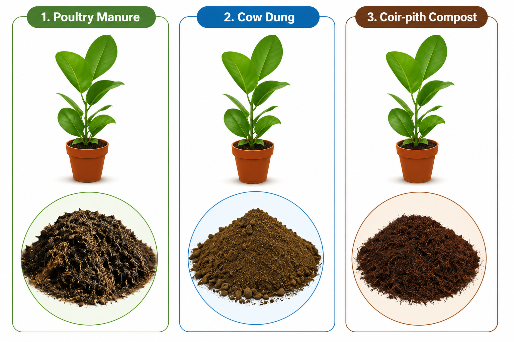
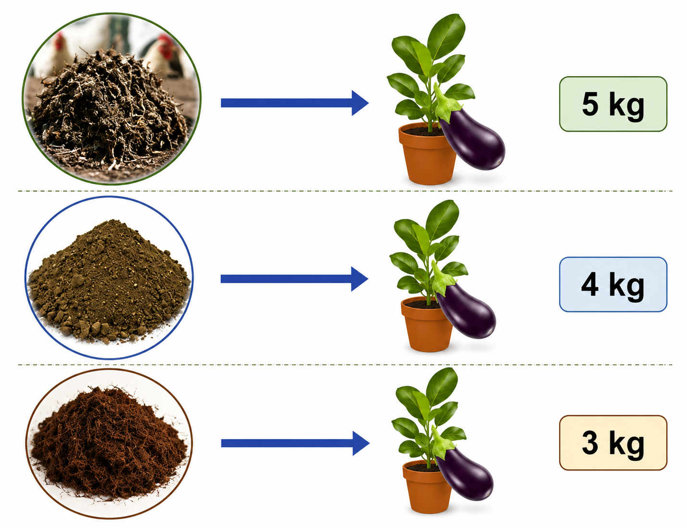
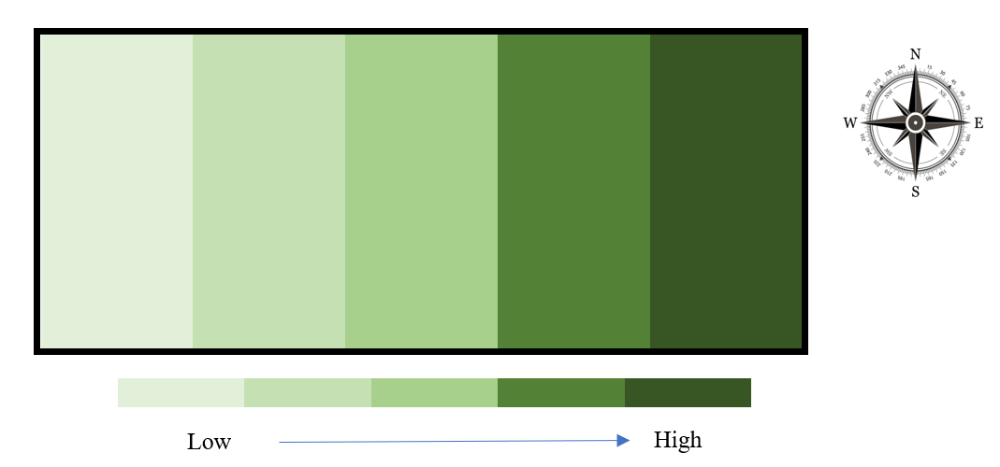
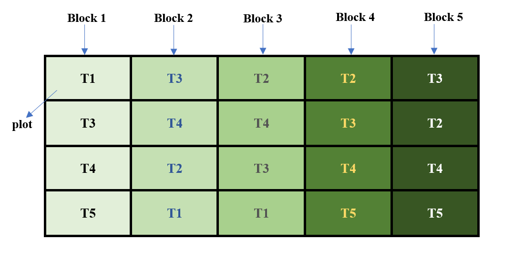

# Design of experiments  

Design of experiments is an integral component of agricultural research. A scientifically designed experiment is a valuable tool in gaining new knowledge and developing technology. "It is the effective use of the tools of statistical design of experiments that paved the way for the green revolution", these words of the father of the green revolution in India, Dr. M.S. Swaminathan, show how important the design and analysis of experiments, as well as statistical science, is for agricultural experiments.  

A carefully designed experiment is able to answer all the queries of a researcher with accuracy and reliability, while making efficient use of the available resources. Thus, for successful experimentation, it is highly desirable that scientists and researchers of scientific disciplines, including the agricultural sciences, understand the basic principles of designing an experiment and of analysing the resultant data from the completed experiment. It may be emphasised that a researcher should always consult a statistician before, during, and after experimentation, if he is not convinced enough about using a design for his experiment or an analysis technique for his data.

Any scientific investigation involves the formulation of certain assertions (or hypotheses) whose validity is examined through the data generated from an experiment conducted for the purpose.  

The term **experiment** is defined as the systematic procedure carried out under controlled conditions in order to discover an unknown effect, to test or establish a hypothesis, or to illustrate a known effect.

In agricultural research, Design of Experiments (DoE) is the statistical methodology for planning agricultural experiments so that treatment effects can be estimated accurately, efficiently, and without bias. It involves the systematic allocation of treatments to experimental units while controlling experimental variability through the principles of randomization, replication, and local control. The principles - **randomization**, **replication** and **local control** is termed as **Basic Principles of Design**, explained in @sec-basicP. The ultimate goal is to draw valid scientific conclusions about the performance of agricultural treatments under field or laboratory conditions.

DoE is a structured approach for conducting experiments. The primary objectives of designing agricultural experiments are to ensure:  

-   Validity: The experiment accurately measures the true effect of the treatments by minimizing bias and controlling extraneous sources of variation.  

-   Reliability: The experimental results are consistent and dependable under similar conditions.

-   Replicability: The experiment can be repeated by other researchers or at different locations and seasons to verify the findings.  

-   Optimality: Maximum information is obtained with the minimum use of resources, resulting in precise estimates and greater statistical power.  

## Some terms involved

### Treatments

A **treatment** is any object of comparison in an experiment. It is the condition, factor, method, or intervention that is deliberately applied to the experimental units to study and compare its effect on a response variable. The primary objective of an experiment is to determine whether the observed differences in the response are due to the treatments being compared.

In agricultural experiments, treatments may include different crop varieties, fertilizers, irrigation methods or irrigation levels, pesticides, fungicides, planting densities, nutrient levels, or crop management practices. In laboratory experiments, treatments may consist of different doses of a drug, concentrations of a chemical solution, incubation temperatures, or processing methods.

**Examples of treatments**

* Different crop varieties
* Different fertilizer sources (e.g., poultry manure, farmyard manure, and vermicompost)
* Different irrigation methods or irrigation levels
* Different doses of a pesticide or herbicide
* Different fungicides for disease management
* Different planting densities
* Different grazing systems for livestock
* Different tree species in agroforestry experiments
* Different concentrations of a chemical solution

In simple terms, **anything that is compared in an experiment is called a treatment.**  

### Control

A **control** or **control treatment** is a treatment used as a standard for comparison in an experiment. It provides a baseline against which the effects of the other treatments can be evaluated. The control may be the existing standard practice or, in some cases, the absence of any treatment.

For example, in a fertilizer experiment, a plot that receives no fertilizer may serve as the control treatment. Similarly, in a pesticide experiment, the control may be a recommended commercial pesticide against which new pesticides are compared. In clinical trials, the control treatment is often a placebo, which resembles the test treatment but contains no active ingredient.

Including a control treatment helps the researcher determine whether the observed changes are due to the treatments under investigation or would have occurred even without them.


### Experimental Units

An **experimental unit** is the smallest unit of the experiment to which a treatment is independently applied. It is the unit on which observations are made and from which data are collected. The choice of the experimental unit depends on the nature of the experiment and the objective of the study.

In agricultural field experiments, an experimental unit is usually a plot of land. In pot culture experiments, each pot is an experimental unit. In animal experiments, an individual animal or a group of animals may serve as the experimental unit, depending on how the treatments are applied. Similarly, in laboratory experiments, an experimental unit may be a Petri dish, a test tube, a culture flask, or any other unit that receives a treatment independently.

**Examples of experimental units**

* Plots of land in field experiments
* Pots in greenhouse or pot culture experiments
* Individual plants or trees
* Individual animals or groups of animals
* Petri dishes used for microbial culture
* Test tubes or culture flasks in laboratory experiments

It is important to distinguish between an experimental unit and an observation unit. In some experiments, several observations may be recorded from a single experimental unit. For example, in a field experiment, the treatment is applied to an entire plot (experimental unit), but measurements may be taken from several plants within the plot (observation units). Since the treatment was applied to the plot and not to the individual plants, the plot remains the experimental unit.


### Response

Responses are measurable outcomes that are observed after applying a treatment to an experimental unit. Alternatively, the response is what we measure to find out what happened in the experiment. In an experiment, there may be more than one response. Some examples of responses are grain yield or straw yield, nitrogen content in plants or biomass of plants, quality parameters of the produce, percentage of plants infested by disease, and weight gain by animals.

### Factors

Factors are the variables whose influence on a response variable is being studied in the experiment. If only one factor is being studied in an experiment, then such an experiment is called a single-factor experiment. If more than one factor is being studied simultaneously in an experiment, then such an experiment is called a multi-factor or factorial experiment. The term factor is commonly used in the case of factorial experiments. For example, temperature and concentration of chemicals in a chemical experiment are two factors; nitrogen, phosphorus, and potassium fertilisers are three factors in an agronomic experiment. Dose and time of application of a chemical formulation are two factors in a laboratory experiment.

### Factor levels

The term factor levels, or simply levels, is used to denote the values or settings that a factor takes in a factorial experiment. For example, doses of a nitrogenous fertiliser as 0 kg/ha, 30 kg/ha, and 80 kg/ha are three levels of the factor *fertiliser*. Concentrations of 10%, 20%, 30%, and 40% of a solute in a solution are four levels of the factor *solute* in a laboratory experiment. Presence of a polythene sheet on the surface of the soil, or its absence, could be two levels of the factor *management practice* in a water management study.

### Observational unit

An observational unit is a unit on which the response variables are measured. Observational units are often the same as experimental units, but this may not always be true. The mistake of confusing the observational unit with the experimental unit leads to pseudo-replication, as discussed in a paper by [@hurlbert]. Consider an experiment to investigate the effects of ultraviolet (UV) levels on the growth of smolt. The experiment is conducted in two tanks, where one tank receives high levels of UV light and the other receives no UV light. Fish are placed in each tank, and at the end of the experiment the growth of the individual fish is measured. In this experiment, the tanks are the experimental units but the observational units are the smolts. The treatments, presence and absence of UV light, are applied to the tanks and not to individual fish, but a whole group of fish is simultaneously exposed to the UV radiation. Here any tank effect is completely confounded with the treatment effect and cannot be separated. Another example is where inorganic fertilisers are applied to plots in a field containing some plants. At the time of harvest, not all the plants in the plot are harvested; only a sample of plants is harvested. In this case, once again, the plot is the experimental unit to which fertilisers are applied, but the observational units are the plants sampled.

## Experimental error

To explain experimental error, consider the example given by [@gomez]. Consider a plant breeder who wishes to compare the yield of a new rice variety A with that of a standard variety B of known and tested properties. He lays out two plots of equal size, side by side, and sows one to variety A and the other to variety B. Grain yield for each plot is then measured, and the variety with the higher yield is judged to be better. Despite the simplicity and common-sense appeal of the procedure just outlined, it has one important flaw. It presumes that any difference between the yields of the two plots is caused by the varieties and nothing else. This certainly is not true. Even if the same variety were planted on both plots, the yields would differ. Other factors, such as soil fertility, moisture, and damage by insects, diseases, and birds also affect rice yields. Because these other factors affect yields, a satisfactory evaluation of the two varieties must involve a procedure that can separate the varietal difference from other sources of variation. That is, the plant breeder must be able to design an experiment that allows him to decide whether the difference observed is caused by varietal difference or by other factors.

> The logic behind the decision is simple. Two rice varieties planted in two adjacent plots will be considered different in their yielding ability only if the observed yield difference is larger than that expected if both plots were planted to the same variety.

Hence, the researcher needs to know not only the yield difference between plots planted to different varieties, but also the yield difference between plots planted to the same variety. The difference among experimental plots treated alike is called **experimental error**. This error is the primary basis for deciding whether an observed difference is real or just due to chance. Clearly, every experiment must be designed to have a measure of the experimental error.

Responses from all experimental units receiving the same treatment may not be the same, even under similar conditions. These variations in responses may be due to various reasons. Factors like heterogeneity of soil, climatic factors, and genetic differences (known as extraneous factors) may also cause variation.

::: {.callout-important title="Definition"}
The variations in response caused by extraneous factors are known as **experimental error**.
:::

Our aim in designing an experiment will be to minimise the experimental error.


## A simple example

Suppose you want to know which of 3 organic manures (poultry manure, cow dung, coir-pith compost) is good for getting a high yield.

```{r echo=FALSE, out.width="50%", fig.align='center'}
#| label: fig-orgmanure
#| fig-cap: "Poultry manure, cow dung, and coir-pith compost"
knitr::include_graphics("images/organicmanure.png")
```

You have decided to conduct an experiment. Consider yourself a layman with no knowledge of the design of experiments. So you have selected 3 potted plants for the experiment, and the 3 organic manures are applied to the potted plants.

```{r echo=FALSE, out.width="50%", fig.align='center'}
#| label: fig-orgtopot
#| fig-cap: "Treatments given to the potted plants"

```

After the experiment you get the yield from each plant as shown below: 5 kg for poultry manure, 4 kg for cow dung, and 3 kg for coir-pith compost.  

```{r echo=FALSE, out.width="50%", fig.align='center'}
#| label: fig-yield
#| fig-cap: "Yield observed from the plants"

```

Can you immediately conclude that poultry manure is the best organic manure?. The answer is No. Before drawing such a conclusion, think about the following questions:
  
  * What if another person repeats the same experiment and gets different results?
  * Could the differences in plant growth be due to natural variation among the plants rather than the manure?
  * How do we know whether the observed differences are caused by the treatments or by experimental error?
  * What if the healthiest plant was deliberately given poultry manure? Would the comparison still be fair?
  * Can such an experiment provide reliable scientific evidence?
  * Is it appropriate to make a general conclusion based on only three plants?

The answer to all these questions highlights the importance of properly designing an experiment. In the above example, we cannot confidently say that poultry manure is the best because many other factors could have influenced the results. The plants may differ in their genetic makeup, age, initial health, soil conditions, sunlight received, or several other environmental factors. Any of these factors, rather than the manure itself, could be responsible for the observed differences in growth.

For this reason, the scientific community would not accept the conclusion from such an experiment. A scientific conclusion must be based on an experiment that is carefully planned and supported by statistical principles. Proper experimental design ensures that the treatment effects are measured fairly while minimizing the influence of other sources of variation.

Design of experiments is the process of planning an experiment so that the data collected can answer a research question in a valid, reliable, efficient, and economical manner. The design of an experiment and the statistical analysis of the resulting data are closely related. A well-designed experiment produces data that can be analyzed to draw valid and reliable conclusions. On the other hand, if an experiment is poorly designed, even the most advanced statistical methods cannot produce trustworthy conclusions.

In the following sections, we will learn the basic principles of experimental design and see how the above experiment can be redesigned to produce scientifically valid results.

## Importance of DOE

-   Reduces, controls, and provides an estimate of the experimental error

-   Gives a structured approach

-   Reduces the cost of the experiment with considerable reliability

-   Produces statistically valid results

-   Allows changes to be accommodated

-   Reduces complexity

-   Improves accountability

## Characteristics of a good design

-   Provides unbiased estimates of the factor effects and their associated uncertainties

-   Enables the experimenter to detect important differences

-   Includes the plan for analysis and reporting of the results

-   Gives results that are easy to interpret

-   Permits conclusions that have wide validity

-   Uses minimal resources

-   Is as simple as possible  


## Brief history

The statistical principles underlying the design of experiments were pioneered by R. A. Fisher in the 1920s and 1930s at Rothamsted Experimental Station, an agricultural research station around forty kilometres north of London. Fisher showed the way to draw valid conclusions from field experiments where nuisance variables such as temperature, soil conditions, and rainfall are present. He introduced the concept of analysis of variance (ANOVA) for partitioning the variation present in data into that (a) due to attributable factors and (b) due to chance factors. The methodologies he and his colleague Frank Yates developed are now widely used and have had a profound impact on agricultural research. [@Fisher1935]

Though experimental design was initially introduced in an agricultural context, the method has been applied successfully in industry since the 1940s. George Box and his co-workers developed experimental design procedures for optimising chemical processes, particularly response surface designs for the chemical and process industries. [@Montgomery2017]

More recently, experimental designs are also being used in clinical trials. This evolved in the 1960s, when medical advances had previously been based on unreliable data. For example, doctors used to examine a few patients and publish papers based on such data. The biases resulting from these kinds of studies became known. This led to a move toward making the randomised double-blind clinical trial the standard for approval of any new product, medical device, or procedure. The scientific application of valid designing and analysis following proper statistical methods became very important in clinical trials.

Even more recently, experimental design techniques have started gaining popularity in the area of computer-aided design and engineering using computer and simulation models, including applications in manufacturing industries.

## Basic principles of design {#sec-basicP}

::: {.callout-note title="Note"}
There are three basic principles of designing an experiment, namely randomization, replication, and local control (blocking). [@DasGiri1986]
:::

### Randomization {#sec-rand}  

Randomization is the process of assigning treatments to experimental units purely by chance. In other words, every experimental unit has an equal chance of receiving any of the treatments.

The main purpose of randomization is to eliminate bias and ensure that the treatment groups are comparable. It prevents the experimenter from consciously or unconsciously assigning a particular treatment to a better or poorer experimental unit. As a result, the effect of unknown or uncontrollable factors is distributed randomly among the treatments.

For example, suppose three fertilizers (A, B, and C) are to be tested on 15 potted plants. Instead of choosing which plants receive each fertilizer, the treatments are assigned randomly. This ensures that differences in plant size, soil conditions, or other unknown factors are spread across all treatments rather than favouring one treatment.

Randomization also satisfies an important assumption of statistical analysis. Since the treatments are assigned at random, the experimental errors are expected to be random and independent. This allows statistical methods such as the t-test, F-test (ANOVA), and other hypothesis tests to produce valid conclusions.

Randomization alone, however, is not sufficient. It should always be used together with replication to obtain reliable and scientifically valid results.

When every experimental unit has an equal chance of receiving any treatment, the process is called **complete randomization**.


::: {.callout-note title="Note"}
Consider an example where you want to randomly allot 3 treatments to 3 experimental units. How will you do this? It is very easy: just label all the units from 1 to 3. Make lots of equal size labelled 1, 2, and 3. Put these labels in a bowl and pick one with your eyes closed. If 1 comes up, the first treatment is allotted to the first unit. This is a very simple technique of randomization. Random number tables or computer-generated random numbers can also be used.
:::

```{r echo=FALSE, out.width="30%", fig.align='center'}
#| label: fig-random
#| fig-cap: "Taking a lot from a bowl is also a process of randomization"

```

### Replication {#sec-rep}  

Replication is the process of applying the same treatment to more than one experimental unit. In other words, each treatment is repeated several times in an experiment. 

The main purpose of replication is to improve the reliability and precision of the experimental results. A conclusion based on several observations is more dependable than one based on a single observation. As the number of replications increases, the precision of the experiment also increases.

Replication also helps in estimating experimental error variance, which is the natural variation that exists even among experimental units receiving the same treatment. Estimating experimental error is essential because it allows us to determine whether the observed differences among treatments are real or simply due to chance. Statistical tests such as the t-test and Analysis of Variance (ANOVA) use this estimate of experimental error to test the significance of treatment effects.

Without replication, it is impossible to estimate experimental error variance. As a result, reliable statistical analysis and valid conclusions cannot be made.  


### Local control (Blocking) {#sec-local}  

Local control, also known as **blocking**, is the principle of grouping similar experimental units into blocks before assigning treatments. The objective of blocking is to reduce experimental error by accounting for known sources of variation among the experimental units.

In agricultural field experiments, the experimental field is rarely uniform. Soil fertility, moisture, slope, and other environmental conditions may vary from one part of the field to another. If these variations are ignored, they become part of the experimental error and make it difficult to detect the true effect of the treatments.

To overcome this problem, the field is divided into smaller groups of relatively homogeneous experimental units, called **blocks**. Each block should contain experimental units that are as similar as possible. All the treatments are then assigned randomly within each block. In this way, the variation between blocks is separated from the experimental error, resulting in more precise comparisons among treatments.

Local control is used together with replication to improve the precision of an experiment. By reducing experimental error by accounting for known sources of variation among experimental units, it increases the ability of the experiment to detect real differences among treatments.

For example, consider a field where one side is more fertile than the other. Instead of treating the entire field as uniform, it can be divided into blocks based on soil fertility. Each block receives all the treatments, and the treatments are assigned randomly within each block. This ensures that the differences due to soil fertility are accounted for, allowing a fair comparison of the treatment effects.

Suppose you have a field experiment with 4 treatments and 5 replications. Consider a field with a fertility gradient from left to right, as shown in @fig-field.

```{r echo=FALSE, out.width="70%", fig.align='center'}
#| label: fig-field
#| fig-cap: "A field with a fertility gradient from left to right"

```

Homogeneity can be achieved by dividing the experimental field into groups of similar experimental units, as shown in @fig-field2. In this example, each vertical strip forms a block because the plots within a strip have nearly the same soil fertility.

Each block is then divided into plots, and all the treatments are assigned randomly to the plots within that block. Since every block contains all the treatments, the treatments are compared under similar field conditions. This helps separate the variation due to differences in soil fertility from the experimental error, resulting in more precise treatment comparisons.

In this example, there are five blocks. Since each treatment appears once in every block, each treatment is replicated five times. Thus, the number of replications is equal to the number of blocks.

This type of experimental layout is called a Randomized Block Design (RBD). The Randomized Block Design is one of the most widely used experimental designs in agricultural research and is discussed in detail in a later chapter.

```{r echo=FALSE, out.width="70%", fig.align='center'}
#| label: fig-field2
#| fig-cap: "Plots are grouped into blocks"

```

## Methods for improving experimental precision

In addition to randomization, replication, and local control, several other practices can improve the precision of an experiment by minimizing unwanted sources of variation.

### Border effect

Plants located along the borders of a plot may be influenced by the treatments applied in neighbouring plots. This phenomenon is known as the **border effect**. For example, fertilizer applied to one plot may move into an adjacent plot through seepage or runoff, affecting the growth and yield of the border plants. Similarly, competition for light, water, and nutrients between plants in adjacent plots may influence their performance. Since these border plants may not accurately represent the treatment applied to their own plot, they are usually excluded from data collection. Observations are recorded only from the inner plants, known as the **net plot**.

### Proper plot technique

Good plot management is essential for obtaining reliable experimental results. Apart from the treatments under study, all other management practices should be kept as uniform as possible across the experimental units. In field experiments, factors such as planting method, plant population, irrigation, fertilizer application (other than the treatment), weed control, pest management, and harvesting should be identical for all plots. Although complete uniformity is impossible because of natural field variability, careful plot management helps minimize unnecessary variation and improves the precision of treatment comparisons.

### Appropriate statistical analysis

Appropriate statistical methods can further improve the precision of an experiment by accounting for known sources of variation. One commonly used method is **Analysis of Covariance (ANCOVA)**, which adjusts the response variable using one or more related variables called **covariates**. By removing the variation associated with the covariates, ANCOVA provides a more precise comparison of treatment effects.

For example, in an animal feeding experiment, the animals may differ in their initial body weights. Since initial weight influences final weight, it can be used as a covariate. ANCOVA adjusts the final weights to account for these initial differences, allowing a fair comparison of the feeds. Similarly, in a field experiment, if some plots suffer greater pest damage than others, the extent of pest damage may be included as a covariate to improve the precision of treatment comparisons.


::: {.callout-caution title="Historical Insights"}
**The lady who could taste the difference**

One summer afternoon in the late 1920s at the Rothamsted Experimental Station in England, a group of scientists paused for tea. A lady among them, the algologist Dr. Muriel Bristol, declared that she could tell whether the milk had been poured into the cup before the tea or the tea before the milk. The idea seemed absurd to most of those present, since surely the finished cup is the same either way. But one young statistician at the table, **Ronald A. Fisher**, did not dismiss her. Instead he asked a far more interesting question: how could one *design an experiment* to find out whether her claim was true?

Fisher reasoned that offering her a single cup would prove nothing, because she could guess correctly by pure chance half the time. Nor would it help to line up a few cups of one kind and then a few of the other, because she might detect the pattern or the order rather than the taste. His solution contained, in miniature, the whole logic of experimental design. He prepared eight cups, four made one way and four the other, and presented them to her *in a completely random order*, telling her only that there were four of each. The randomization ensured that no hidden cue, and no lucky ordering, could be mistaken for genuine ability. He could then count how many she classified correctly and calculate exactly how likely such a result would be if she were merely guessing.

This small teatime puzzle became the opening chapter of Fisher's landmark 1935 book *The Design of Experiments*, and from it grew the ideas of randomization, the null hypothesis, and the careful accounting of chance that underpin every field trial in this book. [@Fisher1935] The principles you are about to study, randomization, replication, and local control, were not born in a rice field or a laboratory, but at a tea table, from a willingness to take a seemingly foolish claim seriously and ask how it could be tested. (And by several accounts, the lady identified all eight cups correctly.)
:::

::: {.callout-tip title="Quotes to Inspire"}
**"Randomization is too important to be left to chance." - J. D. Petruccelli**
:::
