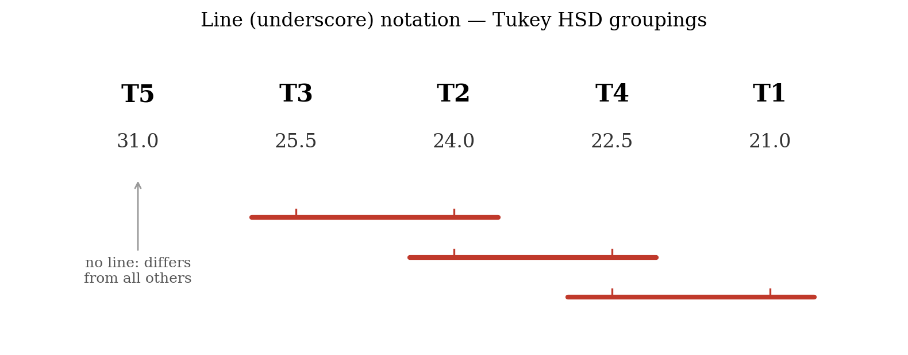

# Multiple comparison tests

ANOVA is an omnibus test. An *omnibus test*, as the general name suggests, refers to an overall or global test. It is implemented on an overall hypothesis that tends to find whether there is any significant difference between the treatment means (in the case of ANOVA) or not.

ANOVA does not tell us which treatment pairs are different. More clearly, on rejecting the null hypothesis in ANOVA, we conclude that at least a pair of treatment means are different, but it does not give any idea about which specific treatments are different. In order to identify which treatment means are significantly different, we need to employ **multiple comparison tests**, also known as **post-hoc tests**.

A significant omnibus F test in the ANOVA procedure is a prerequisite before conducting post-hoc comparisons; otherwise, those comparisons are not required. There are several methods for performing post-hoc tests. In this chapter, we discuss the three that are most widely used in agricultural research:

-   Fisher's LSD test (Least Significant Difference test)

-   Duncan's Multiple Range Test (DMRT)

-   Tukey's test (Honestly Significant Difference test)

## Why do we need a post-hoc test?

A **Type I error** occurs when the null hypothesis $H_0$ is statistically rejected even though it is actually true (a false positive), whereas a **Type II error** refers to failing to reject $H_0$ when it is actually false (a false negative). In a post-hoc test, we compare each of the treatment pairs individually. For example, consider a situation in which three treatments A, B, and C are compared. They may form the following three pairs: A versus B, A versus C, and B versus C. The set of pairwise comparisons for a given experiment is called a **family**. The Type I error rate for the whole set of comparisons taken together is called the **family-wise error rate** (FWER) [@Lee].

For example, if one performs a pairwise test between two groups A and B at the 5% level of significance ($\alpha$) and observes that they are not significantly different, then the chance that a correct decision is made (not committing a Type I error) is 95%. If a second pairwise test between groups B and C is also carried out and gives a non-significant result, then the probability of making a correct decision on both the A–B and B–C comparisons is $0.95 \times 0.95 = 0.9025$, or 90.25%. Consequently, the actual Type I error rate for the family is $1 - 0.9025 = 0.0975$, not 0.05. If the comparison between groups A and C is also non-significant, the probability of correctly declaring non-significance for all three pairs is $0.95 \times 0.95 \times 0.95 = 0.857$, and the actual family-wise Type I error rate is $1 - 0.857 = 0.143$, which is more than 14%. So the chance of a Type I error increases sharply when several treatment pairs are tested together. Multiple comparison tests are devised in such a way that a correction is incorporated to control this inflation in $\alpha$, so that the actual level of significance remains at the prescribed rate (in our case 0.05).

$$\text{Inflated } \alpha = 1 - \left( 1 - \alpha \right)^{N}$$ {#eq-inflated}

where $N$ is the number of hypotheses (comparisons) tested. As @eq-inflated shows, the inflation of the probability of a Type I error increases with the number of comparisons.

::: {.callout-note title="Note"}
The number of possible pairwise comparisons among $v$ treatments is $\binom{v}{2} = \dfrac{v(v-1)}{2}$. For example, with 5 treatments there are $\dfrac{5 \times 4}{2} = 10$ pairwise comparisons, and without any correction the family-wise error rate would rise to $1 - (0.95)^{10} = 0.40$, or 40%.
:::

## Fisher's LSD test {#sec-lsd}

The first pairwise comparison technique was developed by Fisher in 1935 and is called the **least significant difference (LSD) test**. Fisher's LSD procedure is a two-step testing procedure for pairwise comparisons of several treatment groups. In the first step, ANOVA is performed. If the null hypothesis can be rejected at the pre-specified level of significance, then in the second step all pairwise comparisons of treatment means are performed.

**Steps in Fisher's LSD test**

1.  ANOVA is performed, and if the null hypothesis is rejected, proceed to step 2. If the ANOVA does not show a significant effect, the analysis is not carried forward to pairwise comparisons. 

2.  An LSD (least significant difference) value is calculated. For each pair of treatments, if the absolute difference between the two treatment means is greater than the LSD value, we conclude that those treatment means are significantly different.

::: {.callout-note title="Note"}
Among agricultural researchers in India, the term **CD (Critical Difference)** is used instead of LSD. Both terms mean the same thing and are used interchangeably.
:::

### LSD (Least Significant Difference)

Consider two treatments $T_{i}$ and $T_{j}$ with replications $r_{i}$ and $r_{j}$. Then the LSD (or CD) is given by

$$\text{LSD} = t_{\frac{\alpha}{2},\, edf} \cdot SE(d)$$ {#eq-lsd}

$$SE(d) = \sqrt{\text{MSE}\left( \frac{1}{r_{i}} + \frac{1}{r_{j}} \right)}$$ {#eq-sed}

where MSE is the mean square error from the ANOVA, and $t_{\frac{\alpha}{2},\, edf}$ is the critical value of the two-tailed Student's t distribution at the $\alpha$ level of significance and error degrees of freedom ($edf$).

If the replications are equal, $r_{i} = r_{j} = r$, then

$$SE(d) = \sqrt{\text{MSE}\left( \frac{1}{r} + \frac{1}{r} \right)} = \sqrt{\text{MSE}\left( \frac{2}{r} \right)} = \sqrt{\frac{2\,\text{MSE}}{r}}$$ {#eq-sedequal}

$$\text{LSD} = t_{\frac{\alpha}{2},\, edf} \cdot \sqrt{\frac{2\,\text{MSE}}{r}}$$ {#eq-lsdequal}

If the difference between the means of two treatments $T_{i}$ and $T_{j}$ is greater than the LSD, we say that $T_{i}$ and $T_{j}$ are significantly different at the specified level of significance $\alpha$.

### Logic behind the LSD test

Let $\overline{T_{i}}$ and $\overline{T_{j}}$ be the treatment means obtained from the experiment, and let $\mu_{i}$ and $\mu_{j}$ be the corresponding unknown population means. The null hypothesis for a pairwise comparison is

$H_0$: $\mu_{i} = \mu_{j}$, *i*.*e*. $\mu_{i} - \mu_{j} = 0$.

A t-test can be used to test this hypothesis:

$$t = \frac{\overline{T_{i}} - \overline{T_{j}}}{SE(d)}$$ {#eq-lsdt}

The $100(1 - \alpha)\%$ confidence interval for the mean difference $\overline{T_{i}} - \overline{T_{j}}$ is $\left( \overline{T_{i}} - \overline{T_{j}} \right) \pm t_{\frac{\alpha}{2},\, edf}\, SE(d)$, which can be written as $\left( \overline{T_{i}} - \overline{T_{j}} \right) \pm \text{LSD}$. So, if $\left| \overline{T_{i}} - \overline{T_{j}} \right| > \text{LSD}$, the confidence interval does not include 0, and we reject the null hypothesis and conclude that the two treatment means are different, with $100(1 - \alpha)\%$ confidence.

### Advantages and disadvantages of LSD  

::: {.callout-important title="Note"}
The LSD test is also known as the **protected Fisher's LSD test**. "Protected" means that the pairwise calculations are performed only when the null hypothesis has already been rejected by the ANOVA. This first step helps to control the false positive rate (Type I error) for the entire family of comparisons [@Hayter].  
:::  

While the protected Fisher's LSD test was the first post-hoc test ever developed, it does not correct for $\alpha$ inflation as effectively as some other post-hoc tests. Fisher's LSD procedure is known to preserve the experiment-wise Type I error rate at the nominal level only when the number of treatments is exactly three [@Meier]. Nevertheless, the LSD is still the most commonly used post-hoc test in agricultural research. When the number of treatments is larger, it is advisable to also consider DMRT or Tukey's test.

## Duncan's Multiple Range Test (DMRT)

When a comparison of all possible pairs of treatment means is required, we can use **Duncan's Multiple Range Test (DMRT)**, devised by Duncan in 1955. It is especially useful when the number of treatments to be compared is large, and it is very popular in the plant sciences. In this test, the standard error of a mean is multiplied by tabulated values ($r_{p}$) for different values of $p$, where p is the number of ordered treatment means spanned by the comparison, including the two means being compared. For example, when comparing two adjacent means, p=2. If one mean lies between the two means being compared, then p=3. If two means lie between them, then p=4, and so on. The calculated critical value is then used to decide whether the difference between the two treatment means is significant. For given $p$, the $r_p$ values are obtained from DMRT tables, a table is provided in @sec-appendix-2.  

Unlike Fisher's LSD, which uses the same critical difference for every pair of means, DMRT uses progressively larger critical values as p increases. Consequently, treatment means that are farther apart in the ordered list are compared using a larger critical value.

**Steps in DMRT**

1.  Arrange the treatment means in descending order, along with their ranks (highest value is given rank 1 and so on).

2.  Calculate the standard error of a mean as

$$SE(\overline{Y}) = \sqrt{\frac{\text{MSE}}{r}}$$ {#eq-sedmrt}

3.  From the statistical tables of **Duncan's multiple ranges**, note the $r_{p}$ values for $p = 2, 3, \ldots, v$ treatments, corresponding to the error degrees of freedom.

4.  Calculate the shortest significant ranges ($R_{p}$), where

$$R_{p} = r_{p} \cdot SE(\overline{Y})$$ {#eq-rp}

5.  Compare the difference between each pair of means with the $R_{p}$ value corresponding to the number of steps $p$ separating them in the ranked order. If the difference exceeds the corresponding $R_{p}$, the two means are significantly different.

6.  Present the results using a letter (or line) notation to indicate which treatments are on par and which are significantly different.

::: {.callout-note title="Note"}
The critical value $R_{p}$ in DMRT gradually increases as the means being compared are ranked further apart. This means the "protection level" of the test relaxes as the number of means spanned increases, making DMRT more powerful (more likely to declare a difference) than a test based on a single critical value like the LSD. It is, however, more liberal than Tukey's test, so it may declare more pairs significant.
:::

## Tukey's test (Honestly Significant Difference)

**Tukey's test**, also called the **honestly significant difference (HSD) test**, was proposed by John Tukey. It is used for making all possible pairwise comparisons among treatment means while controlling the family-wise error rate at the chosen level $\alpha$ for the *entire* set of comparisons. This is its key advantage over the LSD test, which controls only the error rate of each individual comparison.

Tukey's test is based on the **studentised range statistic** $q$. For equal replications, a single critical difference, called the honestly significant difference, is computed:

$$\text{HSD} = q_{\alpha,\, (v,\, edf)} \cdot \sqrt{\frac{\text{MSE}}{r}}$$ {#eq-hsd}

where $q_{\alpha,\, (v,\, edf)}$ is the critical value of the studentised range distribution for $v$ treatments and error degrees of freedom $edf$, MSE is the error mean square from the ANOVA, and $r$ is the number of replications. Any two treatment means whose absolute difference exceeds the HSD are declared significantly different. Tukey's test is more conservative than the LSD and DMRT, meaning it is less likely to declare a difference significant, and it is recommended when all pairwise comparisons are of interest and strict control of the Type I error is desired.

## A worked example

::: {#exm-postdoc}
A field experiment was conducted to compare the yield (in kg per plot) of five fertilizer treatments $T_1$, $T_2$, $T_3$, $T_4$, and $T_5$, laid out in a completely randomized design with four replications ($r = 4$). The ANOVA gave a significant treatment effect ($F$ significant at the 5% level), with an error mean square $\text{MSE} = 0.5333$ and error degrees of freedom $edf = 15$. The treatment means are given below. Identify which treatments differ from one another using the LSD, DMRT, and Tukey's tests at the 5% level of significance.

| Treatment | $T_1$ | $T_2$ | $T_3$ | $T_4$ | $T_5$ |
|:-----------|:-----:|:-----:|:-----:|:-----:|:-----:|
| Mean yield | 21.0 | 24.0 | 25.5 | 22.5 | 31.0 |

**Solution**

Since the ANOVA F test is significant, we may proceed to the post-hoc comparisons. 

**(a) Fisher's LSD test.**  

The critical t value at $\alpha/2 = 0.025$ and $edf = 15$ is $t_{0.025,\,15} = 2.131$. Using @eq-lsdequal,

$$\text{LSD} = t_{0.025,\,15} \cdot \sqrt{\frac{2\,\text{MSE}}{r}} = 2.131 \times \sqrt{\frac{2 \times 0.5333}{4}} = 2.131 \times 0.5164 = 1.10$$

Any two treatment means differing by more than 1.10 are significantly different.

**(b) Duncan's Multiple Range Test.**  

For DMRT first, arrange the means in descending order:

| Rank | 1 | 2 | 3 | 4 | 5 |
|:-----|:-----:|:-----:|:-----:|:-----:|:-----:|
| Treatment | $T_5$ | $T_3$ | $T_2$ | $T_4$ | $T_1$ |
| Mean | 31.0 | 25.5 | 24.0 | 22.5 | 21.0 |
The standard error of a mean, using @eq-sedmrt, is

$$SE(\overline{Y}) = \sqrt{\frac{\text{MSE}}{r}} = \sqrt{\frac{0.5333}{4}} = 0.3651$$

The Duncan's range values $r_{p}$ at the 5% level for $edf = 15$, $r_{p}$ can be obtained from DMRT table given in @sec-appendix-2 and the shortest significant ranges $R_{p} = r_{p} \cdot SE(\overline{Y})$ from @eq-rp, are

| $p$ (means apart) | 2 | 3 | 4 | 5 |
|:-------------------|:-----:|:-----:|:-----:|:-----:|
| $r_{p}$ | 3.014 | 3.160 | 3.250 | 3.312 |
| $R_{p}$ | 1.10 | 1.15 | 1.19 | 1.21 |

**(c) Tukey's HSD test.** The studentised range value at the 5% level for $v = 5$ treatments and $edf = 15$ is $q_{0.05,\,(5,15)} = 4.367$. Using @eq-hsd,

$$\text{HSD} = q_{0.05,\,(5,15)} \cdot \sqrt{\frac{\text{MSE}}{r}} = 4.367 \times 0.3651 = 1.59$$

Any two treatment means differing by more than 1.59 are significantly different.

The pairwise comparisons under the three tests are summarised in @tbl-comparison. For each pair, S denotes a significant difference and NS a non-significant one. 

| Comparison  | Mean difference | Steps apart ($p$) | LSD (1.10) | DMRT ($R_p$) used | Result | HSD (1.59) |
| :---------- | :-------------: | :---------------: | :--------: | :-------------: | :----: | :--------: |
| (T_5 - T_3) |       5.5       |         2         |      S     |       1.10      |    S   |      S     |
| (T_5 - T_2) |       7.0       |         3         |      S     |       1.15      |    S   |      S     |
| (T_5 - T_4) |       8.5       |         4         |      S     |       1.19      |    S   |      S     |
| (T_5 - T_1) |       10.0      |         5         |      S     |       1.21      |    S   |      S     |
| (T_3 - T_2) |       1.5       |         2         |      S     |       1.10      |    S   |     NS     |
| (T_3 - T_4) |       3.0       |         3         |      S     |       1.15      |    S   |      S     |
| (T_3 - T_1) |       4.5       |         4         |      S     |       1.19      |    S   |      S     |
| (T_2 - T_4) |       1.5       |         2         |      S     |       1.10      |    S   |     NS     |
| (T_2 - T_1) |       3.0       |         3         |      S     |       1.15      |    S   |      S     |
| (T_4 - T_1) |       1.5       |         2         |      S     |       1.10      |    S   |     NS     |  
: Pairwise comparisons under the three tests {#tbl-comparison}  

**Note:** The "Steps apart $p$" column indicates the number of ordered treatment means spanned by the comparison (including the two means being compared). The corresponding shortest significant range $R_p$ is selected from the DMRT table based on this value of ($p$). This makes it clear why different critical values are used for different comparisons.  

Notice the important difference between the tests. The LSD and DMRT declare every pair significant, because even the smallest difference (1.5) exceeds their critical values. Tukey's HSD, being more conservative, uses a larger critical value (1.59), so the three pairs that differ by only 1.5 ($T_3 - T_2$, $T_2 - T_4$, and $T_4 - T_1$) are judged **not** significant. This illustrates the general rule that Tukey's test is stricter than the LSD and DMRT, and therefore detects fewer differences.
:::

## Letter grouping (display of results)

The results of a multiple comparison test are conventionally presented using a compact **letter grouping** (also called the alphabet notation). Treatments that are **not** significantly different from each other share at least one common letter, while treatments that do **not** share any letter are significantly different. This lets the reader see the whole pattern of significance at a glance, without reading the full table of pairwise comparisons. You can even use symbols to denote significance but usually alphabets are used because its easy and 26 letters are there.

The rule for assigning letters is as follows:

1.  Arrange the treatment means in descending order.

2.  Assign the letter **a** to the largest mean (This is not a stricter rule, but this convention is followed usually, you can even use any symbol instead of alphabets). Moving down the list, keep the same letter **a** for every following mean that is **not** significantly different from the largest one (*i*.*e*. whose difference from it is less than the critical value).

3.  When a mean is reached that **is** significantly different from the first mean of the current letter, start a new letter (**b**) at that mean.

4.  Repeat the process starting from this new mean, and continue with letters **c**, **d**, and so on. A treatment that is not significantly different from more than one group receives more than one letter (for example **bc**), showing that it belongs to both overlapping groups.

Let us apply this to the results in @exm-postdoc.

For the **LSD and DMRT**, every pair of treatments is significantly different, so no two treatments share a letter, and each receives its own letter:

| Treatment | Mean | Grouping |
|:-----------|:----:|:--------:|
| $T_5$ | 31.0 | a |
| $T_3$ | 25.5 | b |
| $T_2$ | 24.0 | c |
| $T_4$ | 22.5 | d |
| $T_1$ | 21.0 | e |

For **Tukey's HSD**, the pairs $T_3 - T_2$, $T_2 - T_4$, and $T_4 - T_1$ are not significant, so those treatments share letters. Starting from the top: $T_5$ differs from all others and gets **a**. $T_3$ starts **b**; $T_2$ is not different from $T_3$, so it also gets **b**, but $T_2$ is also not different from $T_4$, so a new letter **c** begins at $T_2$, giving it **bc**. $T_4$ is not different from $T_2$ (**c**) and not different from $T_1$, so it takes **cd**. $T_1$ is not different from $T_4$, so it takes **d**.

| Treatment | Mean | Grouping |
|:-----------|:----:|:--------:|
| $T_5$ | 31.0 | a |
| $T_3$ | 25.5 | b |
| $T_2$ | 24.0 | bc |
| $T_4$ | 22.5 | cd |
| $T_1$ | 21.0 | d |

Reading the Tukey grouping: $T_5$ (a) stands alone as the highest-yielding treatment, significantly better than all others. $T_3$ and $T_2$ share the letter b, so they are on par. $T_2$ and $T_4$ share c, and $T_4$ and $T_1$ share d, so those neighbouring pairs are also on par. But $T_3$ (b) and $T_4$ (cd) share no letter, so they are significantly different, and likewise $T_2$ (bc) and $T_1$ (d) are significantly different. This overlapping pattern is exactly what the letter notation is designed to convey.  

An older but equivalent way of displaying the same information is the **line (or underscore) notation**. The treatment means are first arranged in order, and each group of adjacent means that are not significantly different from one another is joined by a common line. When groups overlap, the lines are drawn at different levels, some above and some below the row of means, so that they do not collide. Two treatments joined (directly or through a chain) by a common line are on par, while two treatments with no connecting line between them are significantly different. For the Tukey results in @exm-postdoc, one line would join $T_3$ and $T_2$, a second line (at a different level) would join $T_2$ and $T_4$, and a third would join $T_4$ and $T_1$, while $T_5$ has no line at all, since it differs significantly from every other treatment. This conveys exactly the same groupings as the letters a, b, bc, cd, and d. The letter notation is now more common in printed tables because it is easier to typeset, but the two notations carry identical meaning.  

{#fig-tukey1 width="450px" height="300px"}

::: {.callout-important title="Note"}  
The letter grouping method is more common in modern statistical software (such as R, SAS, SPSS, GenStat, JMP and cloud platforms like RAISINS), whereas the line or underscore notation was frequently used in older agricultural statistics texts and research publications. Both methods are equivalent in interpretation.
:::  

## Other multiple comparison tests

Besides the three tests discussed above, several other multiple comparison procedures exist, each designed for a particular situation. These include the **Student-Newman-Keuls (SNK) test**, the **Bonferroni method**, the **Dunnett method** (used when every treatment is compared only against a single control), and **Scheffé's test** (used for testing general contrasts among means). A detailed treatment of these methods is beyond the scope of this book; the interested reader may refer to a specialised text on the design and analysis of experiments.

::: {.callout-tip title="Quotes to Inspire"}
**"The method of difference is the most potent of all methods in experimental inquiry." - John Stuart Mill**
:::
