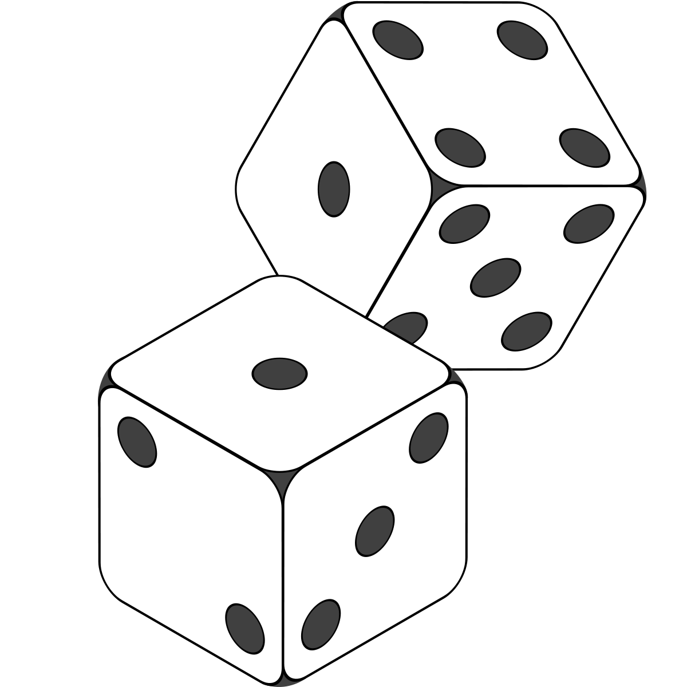
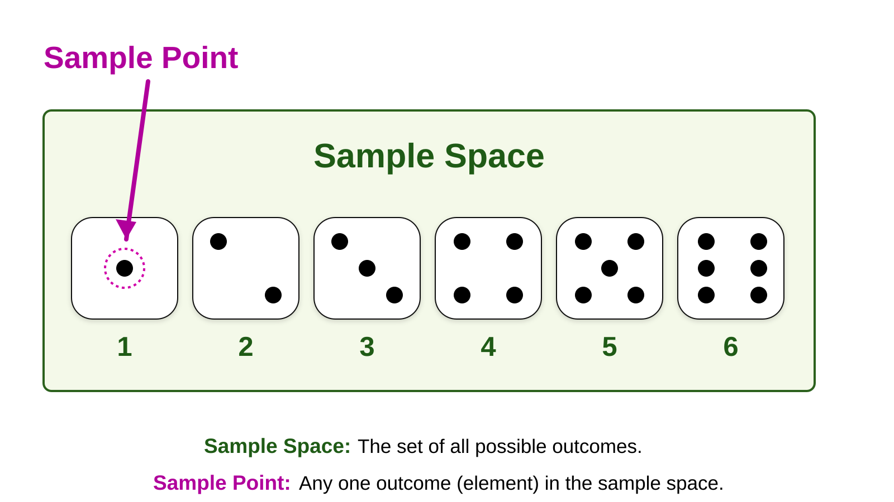
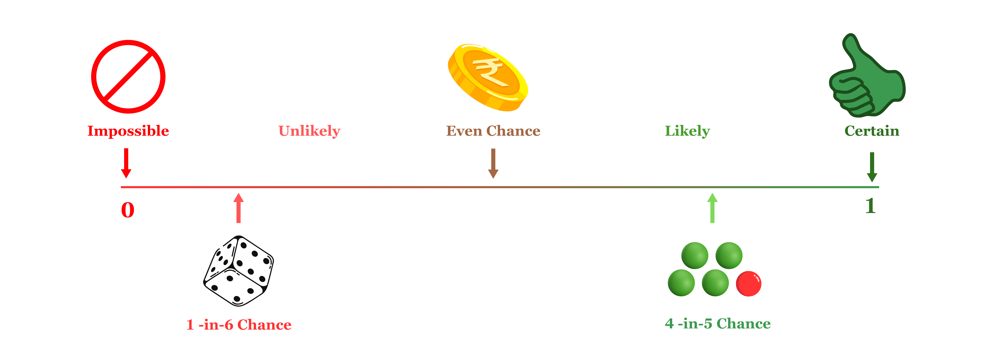
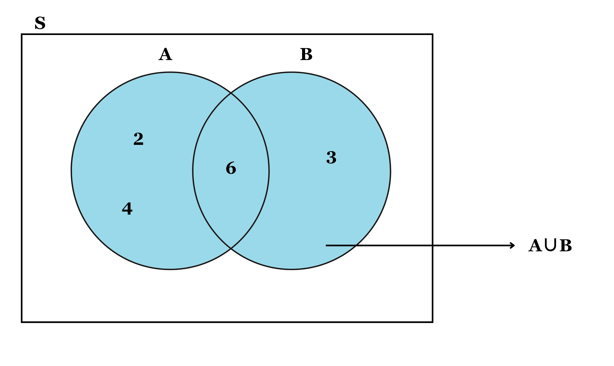
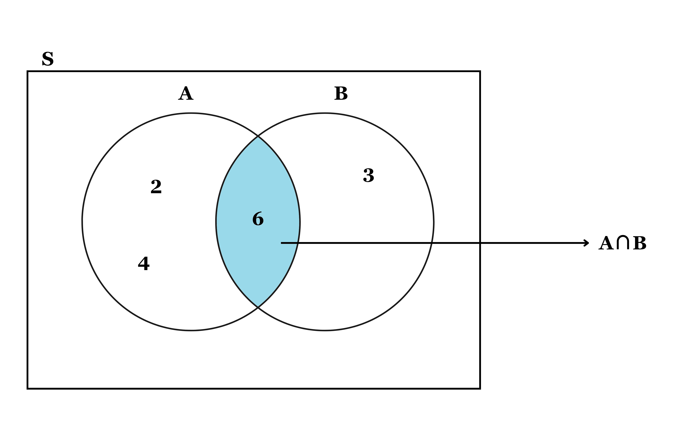

# Probability

Probability is a cornerstone of statistical methods, providing the mathematical framework to quantify and analyze uncertainty. In the diverse and dynamic field of agricultural research, uncertainty often arises in areas such as yield predictions, pest control strategies, and the impact of environmental variables on crop growth. Understanding probability equips researchers and students with the tools to make informed decisions in the face of variability and randomness.

This chapter introduces fundamental probability concepts. We begin with the basic definitions and axioms of probability. The chapter progresses to explore key topics such as conditional probability, Bayes’ theorem, and independence of events.

## Random experiment

A random experiment is a process or procedure that produces an outcome which cannot be predicted with certainty beforehand. The outcome is determined by chance, and the set of all possible outcomes is known as the `sample space`. Random experiments form the basis of probability theory and are critical for understanding uncertainty in various contexts.

[Characteristics of a random experiment]{.underline}

-   Uncertainty of outcome: The result of the experiment cannot be predetermined.

-   Repeatability: The experiment can be repeated under the same conditions.

-   Defined sample space: All possible outcomes are known and well-defined.

Some common examples of random experiments used to illustrate probability theory were discussed below:

**Tossing a coin**

Tossing a coin is one of the simplest and most fundamental random experiments used to illustrate the principles of probability. Despite its simplicity, this seemingly mundane activity provides profound insights into random processes and lays the groundwork for understanding more complex probabilistic systems.

When a coin is tossed, there are two possible outcomes:

-   Heads ($H$)

-   Tails ($T$)

We say that for an unbiassed coin the probability of the coin landing $H$ is $\frac{1}{2}$ and the probability of the coin landing $T$ is $\frac{1}{2}$

::: {.callout-important title="Note"}
An unbiased coin is a theoretical concept in probability, referring to a coin designed or assumed to have no preference for either side when tossed, such that the likelihood of landing on heads (H) is exactly the same as landing on tails (T), with each outcome having a probability of $\frac{1}{2}$ or 50%. Its characteristics include perfect symmetry, ensuring the coin is balanced without physical imperfections or uneven weight distribution that could influence the result, and equal probability, where each side is equally likely to face upward after a toss. This assumption generally holds under ideal experimental conditions, free from external factors like uneven surfaces or human bias in the tossing technique.
:::

**Throwing dice**

A standard die has six faces, numbered from 1 to 6. Under fair conditions, each face has an equal probability of appearing when the die is rolled. Thus, the probability of getting any one face is $\frac{1}{6}$.

{#fig-dice style="text-align:center;" fig-align="center" width="20%"}

**Playing cards**

A standard deck of playing cards consists of 52 cards, divided into four suits: spades, hearts, diamonds, and clubs, with each suit containing 13 cards. Four suits in playing cards were given in the @fig-suitsincard. The spades suit includes 9 numbered cards from 2 to 10, along with the picture cards ace, king, queen, and jack. Similarly, the hearts, diamonds, and clubs suits each contain 13 cards. Of these 52 cards, 26 are red, consisting of the hearts and diamonds suits, while the other 26 cards are black, comprising the spades and clubs suits. Playing cards can be used to create examples for random experiments, such as drawing a single card from a shuffled deck to determine its specific identity. Other experiments include drawing a card and checking its suit etc. These simple experiments can be easily modified with conditions or repetition, making playing cards a versatile tool for exploring probability and random events.

::: {#fig-suitsincard layout-ncol="4"}
{#fig-spade width="50px" height="50px"}

{#fig-heart width="50px" height="50px"}

{#fig-diamond width="50px" height="50px"}

{#fig-clubs width="50px" height="50px"}

Four suits in playing cards
:::

## Random variable

A **random variable** is a numerical value that represents the outcome of a random experiment. It is a function that assigns a real number to each possible outcome in the sample space of the experiment.

Random variables can be classified into two types:

1.  **Discrete random variables**: These take on a countable set of values, such as integers (e.g., the number of heads in three coin tosses).\
2.  **Continuous random variables**: These can take on any value within a given range, which is typically uncountable (e.g., the height of individuals in a population).

In mathematical terms, if $S$ is the sample space of a random experiment, a random variable $X$ is a function that maps sample space to real number set, which can be represented as $X: S \to \mathbb{R}$, where $\mathbb{R}$ represents the set of real numbers.

The probability of a random variable can be represented by $P(X = x)$ or $P(x)$, where the small letter $x$ denotes the value taken by the random variable $X$.

Consider the example of throwing a die once. Here, you can define a random variable of your interest. Defining a random variable involves assigning a numerical value to the outcomes of the experiment. Let $X$ represent the number appearing on the die. The possible values of $X$ are: $x = \{1, 2, 3, 4, 5, 6\}$.

Consider another example of even number appearing on the die. Let $X$ represent the even number appearing on the die. The possible values of $X$ are: $x = \{2, 4, 6\}$.

In each of the above cases, you can see that the random variable $X$ assigns a value to the outcomes of the experiment.

## Probability

Probability is a measure of the likelihood or chance that a particular event will occur. It quantifies uncertainty and is expressed as a number between 0 and 1, where 0 indicates an impossible event and 1 represents a certain event. Mathematically, the probability of an event $A$ is defined as the ratio of the number of favorable outcomes to the total number of possible outcomes, assuming all outcomes are equally likely, and is given by

Probability of an event $A$ happening:

$$P(A) = \frac{\text{Number of favourable outcomes}}{\text{Total possible outcomes}}$$ {#eq-probability1}\
here favourable outcome means outcomes favouring the happening of event $A$.

::: {#exm-prob1}
What is the chances of rolling a “4” with a die ?

**Solution**

Let the event $A$ = rolling a “4” with a die. Number of ways event $A$ can happen is one, as there is only 1 face with a “4” on it. Total number of outcomes is 6 (there are 6 faces altogether). So using @eq-probability1; probability,$P(A)$ = $\frac{1}{6}$.
:::

::: {#exm-prob2}
There are 5 marbles in a bag: 4 are blue, and 1 is red. What is the probability that a blue marble gets picked?

**Solution**

Let the event $A$ = a blue marble gets picked. Number of ways event $A$ can happen is 4 (there are 4 blues). Total number of possible outcomes is 5 (there are 5 marbles in total). So using @eq-probability1; probability,$P(A)$ = $\frac{4}{5}$ = 0.8
:::

[**Common terms used**]{.underline}

**Outcome:** An outcome is the result of a random experiment, representing a single occurrence or observation. For instance, when rolling a die, the outcomes could include the appearance of 1 dot, 2 dots, and so on.

**Sample space:** The sample space (denoted as $S$) of a random experiment is the set that contains all possible outcomes of that experiment. For example, when tossing a coin, the sample space is $S$ = {H, T}, and when throwing a die, the sample space is $S$ = {1, 2, 3, 4, 5, 6}.

**Sample point:** A sample point is an individual element of the sample space, representing a single possible outcome. For example, “heads” in a coin toss or the “5 of clubs” in a deck of cards are sample points. In the case of rolling a die, there are six distinct sample points within the sample space.

{#fig-samplespacendpoint fig-align="center" style="text-align:center;" width="80%"}

::: {#exr-prob1}
If a die is tossed

1.  What is the sample space?
2.  What is the probability of getting a 1?
3.  What is the probability of obtaining an even number?
4.  What is the probability of getting a 7?
:::

## Event

An event refers to one or more outcomes of a random experiment. It can represent any subset of the sample space, where the event consists of specific outcomes that are of interest in the context of the experiment. An event can be a single outcome. For example, when tossing a coin, getting a “Tail” is an event that represents just one outcome from the sample space {H, T}. Similarly, rolling a “5” on a die is an event that includes only one specific outcome, 5, from the sample space {1, 2, 3, 4, 5, 6}.

On the other hand, an event can also include multiple outcomes. For instance, when selecting a “king” from a deck of cards, the event includes any one of the four kings (king of hearts, king of diamonds, king of clubs, king of spades), forming a set of four possible outcomes. Similarly, when rolling an “even number” on a die, the event would encompass the outcomes {2, 4, 6}, which are all the even numbers in the sample space of a die roll. Thus, an event can be a single outcome or a combination of multiple outcomes depending on the context of the experiment.

::: {#exm-prob3}
Ram wants to see how many times a “double” (both dice have same number) comes up when throwing 2 dice.

**Solution**

The *sample space* is all possible outcomes (36 Sample Points): {1,1} {1,2} {1,3} {1,4} ... {6,3} {6,4} {6,5} {6,6}. The *event* Ram is looking for is a “double”, where both dice have the same number. It is made up of these 6 sample points: {1,1} {2,2} {3,3} {4,4} {5,5} and {6,6}. You can calculate the probability of the event using @eq-probability1. Probability = $\frac{6}{36}=0.17$.
:::

### Types of events

**Independent events**

Independent events are events where the occurrence of one does not influence the occurrence of another. For instance, consider tossing a coin. If it lands on “heads” three times in a row, the outcome of the next toss remains unaffected by the previous results. The probability of getting “heads” on the next toss is still $\frac{1}{2}$ (or 0.5), just as it is for any fair coin toss. This demonstrates that past outcomes do not influence the probabilities of future events in independent scenarios.

::: {#exm-prob4}
A coin is tossed 100 times, and heads appear in 99 of those tosses. What is the probability that heads will appear on the $100^{th}$ toss?

**Solution**

Answer is $\frac{1}{2}$ as each toss is independent of previous toss.
:::

**Dependent events**

Dependent events are events where the outcome of one event influences the probabilities of subsequent events. For example, consider drawing cards from a deck. The probabilities change as cards are removed from the deck, altering the available outcomes. Initially, the chance of drawing a king on the first card is $\frac{4}{52}$. However, for the second draw, the probabilities depend on the outcome of the first draw. If the first card is a king, only 3 kings remain among the 51 remaining cards, reducing the likelihood of drawing another king to $\frac{3}{51}$. Conversely, if the first card is not a king, all 4 kings remain, making the probability $\frac{4}{51}$. This illustrates how previous outcomes affect probabilities in dependent events.

::: {.callout-important title="Note"}
When cards are drawn `with replacement`, each card is returned to the deck after being drawn, so the total number of cards remains constant. This keeps the probabilities unchanged, making the events independent. However, when cards are drawn `without replacement`, the total number of cards decreases after each draw, which alters the probabilities and makes the events dependent.
:::

**Mutually exclusive events**

Mutually exclusive events are events that cannot occur at the same time. It is either one event or the other, but not both. For example, turning left or right is mutually exclusive because you cannot do both simultaneously. Similarly, heads and tails in a coin toss is mutually exclusive. Drawing a king and drawing an ace are mutually exclusive events because you can’t draw both in a single card. However, not all events are mutually exclusive. For instance, kings and hearts are not mutually exclusive because it is possible to have a king of hearts, an outcome that belongs to both categories.

**Exhaustive events**

A set of events is called exhaustive if, together, they encompass the entire sample space. For example, when tossing a die, the sample space is $S = \{1, 2, 3, 4, 5, 6\}$. Consider the events: event $A$, which is getting an even number $\{2, 4, 6\}$, and event $B$, which is getting an odd number $\{1, 3, 5\}$. These events are exhaustive because, when combined, they include all possible outcomes in the sample space.

**Equally likely events**

Equally likely events are events that have the same theoretical probability of occurring. For example, when tossing a coin, event $A$ (getting a head) and event $B$ (getting a tail) are equally likely events because both have an equal probability of occurring.

## Definitions of probability

In probability theory, different approaches are used to define and calculate the likelihood of events occurring. These approaches vary depending on the nature of the experiment and the available information. The three primary definitions of probability are mathematical (classical), statistical (empirical), and axiomatic, each offer unique perspectives and methods for determining probabilities. The classical approach is based on equally likely outcomes, the empirical approach relies on experimental data, and the axiomatic approach, developed by A.N. Kolmogorov, is based on a set of foundational principles. Understanding these definitions helps in applying probability theory to various real-world situations, from simple experiments to more complex scenarios.

### Mathematical approach

It is also known as classical, theoretical or a priori approach to probability. If an experiment with $n$ `exhaustive`, `mutually exclusive` and `equally likely` outcomes, $m$ outcomes are favourable to the happening of an event $E$, the probability $p$ of happening of E is given by

$$P\left( E \right) = \ \frac{m}{n}$$ {#eq-mathematicalapproach}

$p$ is termed as probability of success.

::: {#exm-prob5}
When a coin is tossed, there are two possible outcomes head or tail. Outcomes are exhaustive, mutually exclusive and equally likely. What is the probability of getting head?

**Solution**

Solution using mathematical approach, consider the event $E$ : getting a head; probability of event $E$, $P(E)$ can be determined using @eq-mathematicalapproach.

here, number of outcomes are favourable to the happening of event $E$, $m =1$; $n$ = total number of possible outcomes (head and tail) = 2

$$P\left( E \right) =  \ \frac{1}{2}$$

*i*.*e*. probability of getting a head is $\frac{1}{2}$
:::

[**Limitations**]{.underline}

The mathematical approach has certain limitations. For instance, it cannot account for situations where the outcomes are not equally likely, such as tossing a biased die. Additionally, this approach cannot define probability when the total number of possible outcomes $n$ is unknown or tends to infinity, as in determining the probability of raining tomorrow. To address these limitations, other definitions of probability have been developed.

### Statistical approach

The statistical approach to probability, also known as the *empirical approach*, is based on observing and recording outcomes from repeated experiments. The probability of an event is determined as the ratio of the number of times the event occurs $m$ to the total number of trials $n$ as when $n$ approaches infinity. This method is useful when theoretical probabilities cannot be calculated but relies on the practicality of conducting a large number of trials and assumes consistency in experimental conditions.

The probability $p$ of happening of $E$ is given by

$$P\left( E \right) = \lim_{n \rightarrow \infty}\frac{m}{n}$$ {#eq-statisticalapproach}

where $n$ is the number of times the process is performed which tends to infinity, and $m$ is the number of times the outcome ’$E$’ happens.

[**Limitations**]{.underline}

The statistical approach also has limitations. In some cases, the experiment may not be practically repeatable, making it impossible to rely on repeated trials. Additionally, it raises the question of how large ($n$) must be to provide a good approximation of the probability. To address these issues, Russian mathematician A.N. Kolmogorov introduced the axiomatic approach, which does not rely on precise definitions but instead establishes probability based on a set of fundamental axioms or postulates.

### Axiomatic approach

The axiomatic approach to probability, introduced by A.N. Kolmogorov, provides a formal framework based on a set of foundational axioms rather than specific definitions. This approach overcomes the limitations of earlier methods by establishing universally accepted rules that apply to all probability calculations, making it applicable to a wide range of theoretical and practical scenarios.

The whole field of probability theory is based on the following three axioms

1.  Probability of an event, $P(E)$ lies between $0$ and $1$. That is $0 \leq P(E) \leq 1$

2.  Probability of entire sample space is 1. That is $P\left( S \right) = 1$

3.  If $A$ and $B$ are mutually exclusive events then probability of occurrence of either $A$ or $B$ is denoted by $P(A \cup B)$ shall be given by $P\left( A \cup B \right) = P\left( A \right) + P(B)$

::: {.callout-important title="Note"}
The probability $p$ of the occurrence of an event is referred to as the *probability of success*, while the probability $q$ of its non-occurrence is known as the *probability of failure*. Both $p$ and $q$ are non-negative and cannot exceed unity, *i*.*e*., $0 \leq p \leq 1$ and $0 \leq q \leq 1$. This means the probability of an event always lies between $0$ and $1$, inclusive. The probability of an impossible event is $0$, and the probability of a certain event is $1$. For instance, if $P(A) = 1$, event $A$ is guaranteed to occur, and if $P(A) = 0$, event $A$ cannot occur. Additionally, the number of favorable outcomes $m$ for an event cannot exceed the total number of outcomes $n$.
:::

{#fig-probshow fig-align="center" style="text-align:center;" width="80%"}

::: {#exm-prob6}
In a simultaneous toss of two coins, find the probability of (i) getting 2 heads. (ii) exactly 1 head?

**Solution**

Here, the possible outcomes are HH, HT, TH, TT. *i*.*e*., Total number of possible outcomes = 4.

(i) Number of outcomes favorable to the event (2 heads *i*.*e*.,HH) = 1. $p\text{(2 heads)} = \frac{1}{4}$.

(ii) Now the event consisting of exactly one head has two favourable cases, namely HT and TH. $p\text{(exactly one head)} = \frac{2}{4} = \frac{1}{2}$
:::

::: {#exm-prob7}
In a single throw of two dice, what is the probability that the sum is 9?

**Solution**

The number of possible outcomes is 6 × 6 = 36.

(1,1) (1,2) (1,3) (1,4) (1,5) (1,6)

(2,1) (2,2) (2,3) (2,4) (2,5) (2,6)

(3,1) (3,2) (3,3) (3,4) (3,5) (3,6)

(4,1) (4,2) (4,3) (4,4) (4,5) (4,6)

(5,1) (5,2) (5,3) (5,4) (5,5) (5,6)

(6,1) (6,2) (6,3) (6,4) (6,5) (6,6)

Let the event $A$ be sum the is 9. Four outcomes are there with sum 9, they are (5,4), (6,3), (3,6), (4,5). $p (A) = \frac{4}{36} =\frac{1}{9}$
:::

::: {#exm-prob8}
From a bag containing 10 red, 4 blue and 6 black balls, a ball is drawn at random. What is the probability of drawing (i) a red ball? (ii) a blue ball? (iii) not a black ball?

**Solution**

There are 20 balls in all. So, the total number of possible outcomes is 20

(i) Number of red balls = 10, $p\text{(getting a red ball)}=\frac{10}{20} =\frac{1}{2}$\
(ii) Number of blue balls = 4, $p\text{(getting a blue ball)}=\frac{4}{20} =\frac{1}{5}$\
(iii) Number of balls which are not black = 14, $p\text{(not a black ball)}=\frac{14}{20} =\frac{7}{10}$
:::

## Event relations

In probability theory, relationships between events help in analyzing their combined or individual outcomes within a sample space. These relations include concepts such as union, intersection, complement and mutual exclusivity, which are fundamental for understanding how events interact and influence probabilities.

**Complement of an event**

In probability, the complement of an event refers to all outcomes in the sample space that are not favorable to the given event. If $A$ is an event, its complement is denoted by $A^c$, and it represents the occurrence of all outcomes where $A$ does not happen.

For example, consider the experiment of tossing a die. Let $A$ be the event of getting an even number. The favorable outcomes for $A$ are $\{2, 4, 6\}$. The remaining outcomes, $\{1, 3, 5\}$, do not satisfy $A$ and are therefore the complement of $A$. These outcomes represent the occurrence of $A^c$, where $A$ does not occur, therefore in this case $A^c=\{1, 3, 5\}$ .

The complement of an event is essential in probability calculations and is related to the event by the formula:

$$P(A^c) = 1 - P(A)$$ {#eq-complement}

The relationship in @eq-complement highlights that the probability of an event and its complement together always sum to 1. *i*.*e*. $P(A) + P(A^c) = 1$

**Event** $A$ or $B$

Denoted as ’$A \cup B$’, spelled as $A$ union $B$, represents the occurrence of either event $A$, event $B$ or both. Let us consider the example of throwing a die. Suppose $A$ is an event of getting a multiple of 2 and $B$ be another event of getting a multiple of 3. The outcomes 2, 4 and 6 are favourable to the event $A$ and the outcomes 3 and 6 are favourable to the event $B$ *i*.*e*. $A = \{2, 4, 6\}$, $B= \{3, 6\}$ then $A \cup B = \{ 2, 3, 4, 6\}$.

{#fig-unionevents fig-align="center" style="text-align:center;" width="80%"}

**Event** $A$ and $B$

Denoted as ‘$A \cap B$’, spelled as $A$ intersection $B$, represents the occurrence of both events $A$ and $B$ simultaneously. It includes only those outcomes that are common to both events. For example, on throwing a die, let $A$ be the event of getting a multiple of 2 and $B$ be the event of getting a multiple of 3, so that $A = \{2, 4, 6\}$ and $B = \{3, 6\}$. Here 6 is present in both $A$ and $B$, so $A \cap B = \{6\}$. @fig-intersection below shows the Venn diagram of the intersection of two events.

{#fig-intersection fig-align="center" style="text-align:center;" width="80%"}

## Additive law of probability

According to additive law of probability, for any two events $A$ and $B$ of a sample space $S$, the probability of the union of two events $A$ and $B$ is equal to the sum of their individual probabilities, minus the probability of their intersection.

$$P(A \cup B) = P(A)+P(B) − P(A \cap B)$$ {#eq-additivelaw}

For mutually exclusive case $P(AꓵB)=0$; in that case:\
$$P(A \cup B) = P(A )+ P(B )$$ {#eq-additivelaw2}

::: {#exm-prob9}
A card is drawn from a well-shuffled deck of 52 cards. What is the probability that it is either a spade or a king?

**Solution**

If $A$ denotes the event of drawing a ‘spade card’, and $B$ denotes the event of drawing a ‘king’, the event $A$ consists of 13 sample points, whereas the event $B$ consists of 4 sample points. $P(A)= \frac{13}{52}$, $P(B)= \frac{4}{52}$, $P(A \cap B) = \frac{1}{52}$, $P(A \cup B) = P(A)+ P(B) − P(A \cap B)$ = $\frac{13}{52}+\frac{4}{52}-\frac{1}{52}= \frac{4}{13}$
:::

::: {#exm-prob10}
In a single throw of two dice, find the probability of a total of 9 or 11.

**Solution**

Let the events $A$ = a total of 9 and $B$ = a total of 11. Events are mutually exclusive, so $P(A \cap B) = 0$. Now there are four such cases where sum = 9, such as (3, 6), (4, 5), (5, 4), (6, 3); therefore $P(A) = \frac{4}{36}$. Similarly there are two cases where sum = 11, such as (5, 6), (6, 5); therefore $P(B) = \frac{2}{36}$. Thus from @eq-additivelaw2, $P(A \cup B) = \frac{4}{36}+\frac{2}{36}= \frac{6}{36} = \frac{1}{6}$
:::

## Conditional probability

Conditional probability measures the likelihood of an event occurring, given that another event has already occurred. If $A$ and $B$ are two events, the conditional probability of $A$ given $B$ is denoted by $P(A \mid B)$ and is defined as:

$$P(A \mid B) = \frac{P(A \cap B)}{P(B)}, \quad \text{provided } P(B) > 0$$ {#eq-conditionalprob}

@eq-conditionalprob gives the probability of $A$ happening under the condition that $B$ has occurred.

::: {#exm-prob11}
If a card is drawn from a standard deck of 52 cards, what is the probability that it is a king, given that the card drawn is a face card?

**Solution**

Let, event $A$ be the card drawn is a King. Event $B$ be the card drawn is a face card (King, Queen, or Jack).   

A standard deck contains 52 cards, of which 12 are face cards (4 Kings, 4 Queens, and 4 Jacks). Therefore, $P(B)=\frac{\text{Number of face cards}}{\text{Total number of cards}}=\frac{12}{52}$. Since every King is also a face card, the event $A \cap B$ represents drawing a card that is both a King and a face card. There are 4 Kings in the deck. Hence,$P(A \cap B)=\frac{\text{Number of Kings}}{\text{Total number of cards}}=\frac{4}{52}$.
Using the definition of conditional probability @eq-conditionalprob, we obtain
$P(A\mid B)=\frac{\frac{4}{52}}{\frac{12}{52}}$ 
$=\frac{4}{12}\\$ 
$=\frac{1}{3}$  
Hence, the probability of drawing a King given that the card drawn is a face card is $P(A\mid B)=\frac{1}{3}$

:::

::: {#exm-prob19}
In a seed-testing laboratory, 120 groundnut seeds were treated with a fungicide and 80 were left untreated. Out of the treated seeds, 96 germinated, while 40 of the untreated seeds germinated. If a seed is selected at random and found to be treated, what is the probability that it germinated?

**Solution**

Let $A$ be the event that the selected seed germinated, and $B$ be the event that the seed was treated with the fungicide. We need $P(A \mid B)$, the probability that a seed germinated given that it was treated. Out of 200 seeds, 120 were treated, so $P(B) = \frac{120}{200}$. The number of seeds that were both treated and germinated is 96, so $P(A \cap B) = \frac{96}{200}$. Using @eq-conditionalprob the conditional probability is $P(A \mid B) = \frac{P(A \cap B)}{P(B)} = \frac{\frac{96}{200}}{\frac{120}{200}} = \frac{96}{120} = \frac{4}{5}$.
:::

## Multiplication law of probability

The multiplication law of probability states that if $A$ and $B$ are two events, the probability of both events occurring (*i*.*e*., $A \cap B$) is given by:

$$P(A \cap B) = P(A) \cdot P(B \mid A)$$ {#eq-multilaw}

This formula expresses the relationship between the joint probability of two events and their conditional probability. If $A$ and $B$ are independent events, then $P(B \mid A) = P(B)$, and the formula simplifies to:

$$P(A \cap B) = P(A) \cdot P(B)$$ {#eq-multilaw2}

::: {#exm-prob12}
What is the probability of drawing two aces in succession from a standard deck of 52 cards?

**Solution**

Let $A$ be the event that the first card drawn is an ace. $B$ be the event that the second card drawn is an ace. The probability of $A$ (drawing an ace on the first draw) is $P(A) = \frac{4}{52}$. If the first card is an ace, there are only 3 aces left in a deck of 51 cards. The probability of $B$ (drawing an ace on the second draw given that the first card was an ace) is $P(B \mid A) = \frac{3}{51}$. Now using @eq-multilaw the probability of drawing two aces in succession is given by $P(A \cap B) = P(A) \cdot P(B \mid A) = \frac{4}{52} \cdot \frac{3}{51} = \frac{12}{2652} = \frac{1}{221}$
:::

::: {#exm-prob13}
A die is tossed twice. Find the probability of a number greater than 4 on each throw?

**Solution**

Let $A$ be the event that ‘a number greater than 4’ occurs on the first throw, and $B$ be the event that ‘a number greater than 4’ occurs on the second throw. Clearly $A$ and $B$ are independent events. In the first throw, there are two outcomes, namely, 5 and 6 favourable to the event $A$. $P(A) = \frac{2}{6} = \frac{1}{3}$. Similarly in the second throw, there are two outcomes, namely, 5 and 6 favourable to the event $B$, therefore $P(B) = \frac{2}{6} = \frac{1}{3}$. Now by @eq-multilaw2, probability to get a number greater than 4 on each throw is given by $P(A \cap B) = P(A).P(B) = \frac{1}{3}.\frac{1}{3} = \frac{1}{9}$
:::

## Probability using combinations

Combinations can be used to calculate the total number of possible outcomes in a probability problem. The formula for combinations is given by:

$$^n C_r = \frac{n!}{r!(n - r)!}$$ {#eq-combn}

::: {#exm-prob14}
Calculate $^3 C_2$

**Solution**

$^3 C_2 = \frac{3!}{2!(3 - 2)!} = \frac{3 \times 2 \times 1}{2 \times 1} = 3$
:::

::: {#exm-prob15}
A bag contains 3 red, 6 white, and 7 blue balls. What is the probability that two balls drawn are white and blue?

**Solution**

Total number of balls = 3 + 6 + 7 = 16. The number of ways to draw 2 balls from 16 is given by $^{16} C_2 =120$. The number of ways to draw one white ball from 6 white balls is $^6 C_1=6$, and the number of ways to draw one blue ball from 7 blue balls is $^7 C_1 =7$. Since the events are independent, the total number of favorable outcomes is $^6 C_1 \times ^7 C_1 = 6 \times 7 = 42$. Thus, the required probability is:$P(\text{one white and one blue}) = \frac{^6 C_1 \times ^7 C_1}{^{16} C_2} = \frac{42}{120} = \frac{7}{20}$
:::

::: {#exm-prob16}
A bag contains 5 red and 4 black balls. What is the probability that both balls drawn are red?

**Solution**

Total number of balls = 5 + 4 = 9. The number of ways to draw 2 balls from 9 is given by $^9 C_2 = \frac{9 \times 8}{2 \times 1} = 36$. The number of ways to draw 2 red balls from 5 red balls is $^5 C_2 = \frac{5 \times 4}{2 \times 1} = 10$. Thus, the required probability is: $P(\text{both red balls}) = \frac{^5 C_2}{^9 C_2} = \frac{10}{36} = \frac{5}{18}$
:::

::: {#exr-prob2}
Six cards are drawn at random from a pack of 52 cards. What is the probability that 3 will be red and 3 black?
:::

## Bayes’ theorem

Bayes’ theorem gives a mathematical rule for inverting conditional probabilities, allowing one to find the probability of a cause given its effect.

Let $E_1, E_2, \dots, E_n$ be a set of events associated with a sample space $S$, where all the events $E_1, E_2,\dots, E_n$ have non-zero probability of occurrence and they form a partition of $S$. Let $A$ be any event associated with $S$, then according to Bayes theorem,

$$P(E_i \mid A) =\frac{P(E_i) \cdot P(A \mid E_i)}{\sum_{k = 1}^{n}{P(E_k)}\cdot P(A \mid E_k)}$$ {#eq-bayestheorem}

The following terminologies are commonly used when applying Bayes’ theorem:

**Hypotheses**: The events $E_1, E_2, \dots, E_n$ are called the hypotheses.

**Prior probability**: The probability $P(E_i)$ is considered the prior probability of hypothesis $E_i$.

**Posterior probability**: The probability $P(E_i \mid A)$ is considered the posterior probability of hypothesis $E_i$.

For any two events $A$ and $B$, the formula for the Bayes theorem is given by:

$$P(A \mid B) =\frac{P(B\mid A)\cdot P(A)}{P(B)}, P(B)\neq 0$$ {#eq-bayestheorem2}

Where $P(A)$ and $P(B)$ are the probabilities of events $A$ and $B$. $P(A \mid B)$ is the probability of event $A$ given $B$. $P(B \mid A)$ is the probability of event $B$ given $A$.

::: {#exm-prob17}
A bag I contains 4 white and 6 black balls while another bag II contains 4 white and 3 black balls. One ball is drawn at random from one of the bags, and it is found to be black. Find the probability that it was drawn from bag I.

**Solution**

Let $E_1$ be the event of choosing bag I, $E_2$ the event of choosing bag II, and $A$ be the event of drawing a black ball. Since both bags have equal chance of being selected, $P(E_1)=P(E_2)=\frac{1}{2}$. Also, probability of drawing a black ball from bag I is given by $P(A \mid E_1) = \frac{6}{10}=\frac{3}{5}$. Probability of drawing a black ball from bag II is $P(A \mid E_2)=\frac{3}{7}$.

By using Bayes’ theorem, the probability of drawing a black ball from bag I out of two bags,\
$$P(E_1 \mid A) =\frac{P(E_1) \cdot P(A \mid E_1)}{P(E_1) \cdot P(A \mid E_1)+P(E_2) \cdot P(A \mid E_2)}$$\
$$= \frac{\frac{1}{2}\times \frac{3}{5}}{\frac{1}{2}\times \frac{3}{5}+\frac{1}{2}\times \frac{3}{7}} =\frac{7}{12}$$
:::

::: {#exm-prob18}
A man is known to speak the truth 2 out of 3 times. He throws a die and reports that the number obtained is a four. Find the probability that the number obtained is actually a four.

**Solution**

Let $A$ be the event that the man reports that number four is obtained. Let $E_1$ be the event that four is obtained and $E_2$ be its complementary event. Then, $P(E_1)$ = probability that four occurs = $\frac{1}{6}$. $P(E_2)$ = probability that four does not occur = $1-P(E_1) = 1-\frac{1}{6} = \frac{5}{6}$. Also, $P(A|E_1)=$ probability that man reports four and it is actually a four $= \frac{2}{3}$ (because man speaks truth 2 out of 3 times). $P(A|E_2)=$ Probability that man reports four and it is not a four $= \frac{1}{3}$.

By using Bayes’ theorem, probability that number obtained is actually a four, $P(E_1 \mid A) =\frac{P(E_1) \cdot P(A \mid E_1)}{P(E_1) \cdot P(A \mid E_1)+P(E_2) \cdot P(A \mid E_2)}$.

$$P(E_1 \mid A)= \frac{\frac{1}{6}\times \frac{2}{3}}{\frac{1}{6}\times \frac{2}{3}+\frac{5}{6}\times \frac{1}{3}} =\frac{2}{7}$$
:::

::: {.callout-tip title="Quotes to Inspire"}
**“The theory of probabilities is at bottom nothing but common sense reduced to calculus.”**\
**- Pierre-Simon Laplace**
:::

## Chapter Summary

### Fill in the blanks {.unnumbered}

Answers are given at the end of the chapter.

1. A process or procedure that produces an outcome which cannot be predicted with certainty beforehand is called a __________.

2. The set of all possible outcomes of a random experiment is called the __________.

3. An individual element of the sample space is called a __________.

4. A numerical value assigned to the outcomes of a random experiment is called a __________.

5. A random variable that takes countable values is called a __________ random variable.

6. A random variable that can take any value within a given range is called a __________ random variable.

7. Probability is expressed as a number between __________ and __________.

8. An event whose probability is 0 is called an __________ event.

9. An event whose probability is 1 is called a __________ event.

10. An event that consists of one or more outcomes of a random experiment is called an __________.

11. Events that cannot occur at the same time are called __________ events.

12. Events that together contain all possible outcomes are called __________ events.

13. Events having the same probability of occurrence are called __________ likely events.

14. Events in which the occurrence of one does not influence the occurrence of another are called __________ events.

15. Events in which the occurrence of one influences the probability of another are called __________ events.

16. Drawing cards without replacement generally results in __________ events.

17. Drawing cards with replacement generally results in __________ events.

18. The classical approach to probability is also called the __________ approach.

19. The statistical approach to probability is also called the __________ approach.

20. The axiomatic approach to probability was developed by __________.

21. According to the axiomatic approach, $P(E)$ always lies between __________ and __________.

22. The probability of the entire sample space is __________.

23. The complement of event $A$ is denoted by __________.

24. The union of two events $A$ and $B$ is denoted by __________.

25. The intersection of two events $A$ and $B$ is denoted by __________.

26. The probability of an event and its complement together is __________.

27. Conditional probability measures the probability of one event given that another event has already __________.

28. The probability of $A$ given $B$ is denoted by __________.

29. The multiplication law is used to find the probability of __________ events occurring together.

30. For independent events, $P(A \cap B)$ is equal to __________.

31. The number of ways of selecting $r$ objects from $n$ objects without considering order is called a __________.

32. The notation for combination is __________.

33. Bayes’ theorem is used to find the probability of a __________ given an effect or observed event.

34. In Bayes’ theorem, $P(E_i)$ is called the __________ probability.

35. In Bayes’ theorem, $P(E_i\mid A)$ is called the __________ probability.

36. In Bayes’ theorem, the events $E_1,E_2,\ldots,E_n$ are called the __________.

### Short-answer questions {.unnumbered}

1. Define a random experiment and state its characteristics.

2. Explain the concepts of outcome, sample space, and sample point.

3. Define a random variable and explain its two types.

4. Distinguish between discrete and continuous random variables.

5. Define probability.

6. Explain the meaning of an event with suitable examples.

7. Explain independent and dependent events.

8. Distinguish between mutually exclusive and exhaustive events.

9. What are equally likely events?

10. Explain the mathematical or classical approach to probability.

11. State the limitations of the mathematical approach to probability.

12. Explain the statistical or empirical approach to probability.

13. State the limitations of the statistical approach to probability.

14. Explain the axiomatic approach to probability.

15. State the three axioms of probability.

16. Explain the complement of an event.

17. Explain union and intersection of events.

18. State and explain the additive law of probability.

19. What is conditional probability?

20. State and explain the multiplication law of probability.

21. Explain the difference between independent and dependent events using the multiplication law.

22. Explain how combinations are used in probability calculations.

23. Define Bayes’ theorem and explain its purpose.

24. Explain prior probability and posterior probability.

25. What are hypotheses in Bayes’ theorem?

26. Distinguish between prior and posterior probability.

27. Explain the gambler’s fallacy.

### Numerical and conceptual questions {.unnumbered}

Answers are given at the end of the chapter.

1. A die is tossed once. Write the sample space and find the probability of obtaining an even number.

2. A die is tossed once. Find the probability of obtaining a number greater than 4.

3. A die is tossed once. Find the probability of obtaining a 7.

4. A coin is tossed twice. Find the probability of getting two heads.

5. A coin is tossed twice. Find the probability of getting exactly one head.

6. Two dice are thrown simultaneously. Find the probability that the sum is 9.

7. Two dice are thrown simultaneously. Find the probability that the sum is either 9 or 11.

8. A bag contains 10 red, 4 blue, and 6 black balls. Find the probability of drawing a red ball.

9. For the same bag, find the probability of drawing a ball that is not black.

10. A card is drawn from a standard deck of 52 cards. Find the probability that it is a spade or a king.

11. A card is drawn from a standard deck of 52 cards. Find the probability that it is a king given that it is a face card.

12. In a seed-testing laboratory, 120 treated seeds and 80 untreated seeds are taken. Among the treated seeds, 96 germinate, while 40 untreated seeds germinate. If a selected seed is treated, find the probability that it germinated.

13. Two cards are drawn successively from a standard deck without replacement. Find the probability that both are aces.

14. A die is tossed twice. Find the probability of obtaining a number greater than 4 on both throws.

15. Calculate $^3C_2$.

16. A bag contains 3 red, 6 white, and 7 blue balls. Find the probability that two balls drawn are one white and one blue.

17. A bag contains 5 red and 4 black balls. Find the probability that both balls drawn are red.

18. Six cards are drawn at random from a pack of 52 cards. Find the probability that 3 are red and 3 are black.

19. A bag contains 4 white and 6 black balls, while another bag contains 4 white and 3 black balls. One bag is selected at random and a black ball is drawn. Find the probability that it was drawn from the first bag.

20. A man speaks the truth 2 out of 3 times. He throws a die and reports that the number obtained is 4. Find the probability that the number obtained was actually 4.

21. A coin is tossed 100 times and heads occur 99 times. What is the probability of obtaining heads on the next toss?

22. Explain why the previous outcomes of independent trials do not change the probability of the next trial.

### Important formulae {.unnumbered}

Probability of an event under equally likely outcomes:

$$
P(A)=\frac{\text{Number of favourable outcomes}}{\text{Total number of possible outcomes}}
$$

Classical probability:

$$
P(E)=\frac{m}{n}
$$

where $m$ is the number of favourable outcomes and $n$ is the total number of exhaustive, mutually exclusive, and equally likely outcomes.

Statistical probability:

$$
P(E)=\lim_{n\rightarrow\infty}\frac{m}{n}
$$

Probability range:

$$
0\leq P(E)\leq1
$$

Probability of sample space:

$$
P(S)=1
$$

Complement rule:

$$
P(A^c)=1-P(A)
$$

Probability of an event and its complement:

$$
P(A)+P(A^c)=1
$$

Additive law of probability:

$$
P(A\cup B)=P(A)+P(B)-P(A\cap B)
$$

Additive law for mutually exclusive events:

$$
P(A\cup B)=P(A)+P(B)
$$

Conditional probability:

$$
P(A\mid B)=\frac{P(A\cap B)}{P(B)},\quad P(B)>0
$$

Multiplication law:

$$
P(A\cap B)=P(A)P(B\mid A)
$$

Multiplication law for independent events:

$$
P(A\cap B)=P(A)P(B)
$$

Combination:

$$
{}^nC_r=\frac{n!}{r!(n-r)!}
$$

Bayes’ theorem for two events:

$$
P(A\mid B)=\frac{P(B\mid A)P(A)}{P(B)},\quad P(B)\neq0
$$

Bayes’ theorem for a partition of the sample space:

$$
P(E_i\mid A)=
\frac{P(E_i)P(A\mid E_i)}
{\sum_{k=1}^{n}P(E_k)P(A\mid E_k)}
$$

### Quick revision {.unnumbered}

- Random experiment → experiment whose outcome cannot be predicted with certainty.
- Sample space → set of all possible outcomes.
- Sample point → one possible outcome.
- Random variable → numerical value assigned to outcomes.
- Discrete random variable → takes countable values.
- Continuous random variable → takes values within a range.
- Probability → measure of the likelihood of an event.
- Probability always lies between $0$ and $1$.
- Impossible event → probability $0$.
- Certain event → probability $1$.
- Event → one or more outcomes of a random experiment.
- Independent events → occurrence of one does not influence the other.
- Dependent events → occurrence of one influences the other.
- Mutually exclusive events → cannot occur together.
- Exhaustive events → together cover the entire sample space.
- Equally likely events → have equal probability.
- Classical probability → based on exhaustive, mutually exclusive, and equally likely outcomes.
- Statistical probability → based on repeated observations.
- Axiomatic probability → based on the three axioms of probability.
- A.N. Kolmogorov → associated with the axiomatic approach.
- Complement → event not occurring.
- $A\cup B$ → $A$ or $B$ or both.
- $A\cap B$ → both $A$ and $B$.
- $A^c$ → complement of $A$.
- Conditional probability → probability of an event given that another event has occurred.
- Multiplication law → used for probability of joint occurrence.
- With replacement → probabilities remain unchanged and events are independent.
- Without replacement → probabilities change and events are dependent.
- Combination → selection without considering order.
- Bayes’ theorem → obtains the probability of a cause or hypothesis given observed evidence.
- Prior probability → probability before considering the evidence.
- Posterior probability → updated probability after considering the evidence.
- Gambler’s fallacy → belief that previous independent outcomes influence future outcomes.
- In independent trials, past outcomes do not change the probability of the next outcome.

### Answers to fill in the blanks {.unnumbered}

::: {.answer-key}

`1.` Random experiment `2.` Sample space `3.` Sample point `4.` Random variable `5.` Discrete `6.` Continuous `7.` 0; 1 `8.` Impossible `9.` Certain `10.` Event `11.` Mutually exclusive `12.` Exhaustive `13.` Equally `14.` Independent `15.` Dependent `16.` Dependent `17.` Independent `18.` Mathematical `19.` Empirical `20.` A.N. Kolmogorov `21.` 0; 1 `22.` 1 `23.` $A^c$ `24.` $A\cup B$ `25.` $A\cap B$ `26.` 1 `27.` Occurred `28.` $P(A\mid B)$ `29.` Both `30.` $P(A)P(B)$ `31.` Combination `32.` ${}^nC_r$ `33.` Cause `34.` Prior `35.` Posterior `36.` Hypotheses
:::

### Solutions to numerical and conceptual questions {.unnumbered}

1.  Using @eq-probability1 with $S=\{1,2,3,4,5,6\}$ and the even-number event $A=\{2,4,6\}$, $P(A)=\frac{3}{6}=\frac{1}{2}$.

2.  Using @eq-probability1, numbers greater than 4 are 5 and 6, so $P(X>4)=\frac{2}{6}=\frac{1}{3}$.

3.  A standard die has no face numbered 7, so $P(X=7)=\frac{0}{6}=0$; obtaining 7 is an impossible event.

4.  Using @eq-probability1 with $S=\{HH,HT,TH,TT\}$, only $HH$ gives two heads, so $P(\text{two heads})=\frac{1}{4}$.

5.  Exactly one head occurs in $HT$ and $TH$, so $P(\text{exactly one head})=\frac{2}{4}=\frac{1}{2}$.

6.  With two dice there are $6\times6=36$ outcomes; the outcomes with sum 9 are $(3,6),(4,5),(5,4),(6,3)$, so $P(\text{sum}=9)=\frac{4}{36}=\frac{1}{9}$.

7.  Using @eq-additivelaw2 for the mutually exclusive events sum $=9$ and sum $=11$, $P(A)=\frac{4}{36}$ and $P(B)=\frac{2}{36}$, so $P(A\cup B)=\frac{4}{36}+\frac{2}{36}=\frac{6}{36}=\frac{1}{6}$.

8.  Using @eq-probability1 with $10+4+6=20$ total balls, $P(\text{red})=\frac{10}{20}=\frac{1}{2}$.

9.  The number of balls that are not black is $10+4=14$, so $P(\text{not black})=\frac{14}{20}=\frac{7}{10}$.

10. Using @eq-additivelaw with $P(A)=\frac{13}{52}$ (spade), $P(B)=\frac{4}{52}$ (king), and $P(A\cap B)=\frac{1}{52}$ (king of spades), $P(A\cup B)=\frac{13}{52}+\frac{4}{52}-\frac{1}{52}=\frac{16}{52}=\frac{4}{13}$.

11. Using @eq-conditionalprob with $P(B)=\frac{12}{52}$ (face cards) and $P(A\cap B)=\frac{4}{52}$ (kings), $P(A\mid B)=\frac{4/52}{12/52}=\frac{1}{3}$.

12. Using @eq-conditionalprob, of the 120 treated seeds, 96 germinated, so $P(A\mid B)=\frac{96}{120}=\frac{4}{5}$.

13. Using @eq-multilaw with $P(A)=\frac{4}{52}$ and $P(B\mid A)=\frac{3}{51}$ (3 aces remain among 51 cards), $P(A\cap B)=\frac{4}{52}\times\frac{3}{51}=\frac{1}{221}$.

14. Using @eq-multilaw2 with $P(A)=P(B)=\frac{2}{6}=\frac{1}{3}$ for each independent throw, $P(A\cap B)=\frac{1}{3}\times\frac{1}{3}=\frac{1}{9}$.

15. Using @eq-combn, ${}^3C_2=\frac{3!}{2!(3-2)!}=\frac{3\times2\times1}{2\times1}=3$.

16. Using @eq-combn with 16 balls total, ${}^{16}C_2=120$ ways to draw 2, and ${}^6C_1\times{}^7C_1=42$ favourable ways, so $P(\text{one white and one blue})=\frac{42}{120}=\frac{7}{20}$.

17. Using @eq-combn with 9 balls total, ${}^9C_2=36$ ways to draw 2, and ${}^5C_2=10$ ways to draw 2 red, so $P(\text{both red})=\frac{10}{36}=\frac{5}{18}$.

18. Using @eq-combn, the total ways to select 6 cards is ${}^{52}C_6$, and the favourable ways (3 red and 3 black) are ${}^{26}C_3\times{}^{26}C_3$, so $P(\text{3 red and 3 black})=\frac{{}^{26}C_3\,{}^{26}C_3}{{}^{52}C_6}$.

19. Using @eq-bayestheorem with $P(E_1)=P(E_2)=\frac{1}{2}$, $P(A\mid E_1)=\frac{3}{5}$ (bag I) and $P(A\mid E_2)=\frac{3}{7}$ (bag II), $P(E_1\mid A)=\frac{\frac{1}{2}\times\frac{3}{5}}{\frac{1}{2}\times\frac{3}{5}+\frac{1}{2}\times\frac{3}{7}}=\frac{7}{12}$.

20. Using @eq-bayestheorem with $P(E_1)=\frac{1}{6}$, $P(E_2)=\frac{5}{6}$, $P(A\mid E_1)=\frac{2}{3}$ and $P(A\mid E_2)=\frac{1}{3}$, $P(E_1\mid A)=\frac{\frac{1}{6}\times\frac{2}{3}}{\frac{1}{6}\times\frac{2}{3}+\frac{5}{6}\times\frac{1}{3}}=\frac{2}{7}$.

21. For an unbiased coin, each toss is independent of previous tosses, so even after 99 heads in a row, $P(H)=\frac{1}{2}$ on the next toss.

22. In independent events, the occurrence of one does not influence another, so previous outcomes do not change the probability of the next trial; for an unbiased coin, $P(H)=\frac{1}{2}$ on every toss regardless of past results.

::: {.callout-caution title="Historical Insights"}
**The gambler’s fallacy**

In 1913, a group of gamblers gathered at a casino in Monte Carlo, where they witnessed a highly unusual event at the roulette table. The ball landed on black 26 times in a row, an incredibly rare streak. As the streak continued, more and more gamblers bet heavily on red, convinced that red was “due” to appear. But to their shock, black kept winning, and many lost fortunes that night. This event is now a famous example of the *gambler’s fallacy* also known as the *Monte Carlo fallacy* or *the fallacy of the maturity of chances*, the mistaken belief that past events influence future outcomes in independent events, like the spin of a roulette wheel. In reality, the probability of the ball landing on black or red remains the same on every spin, regardless of previous results.
:::
