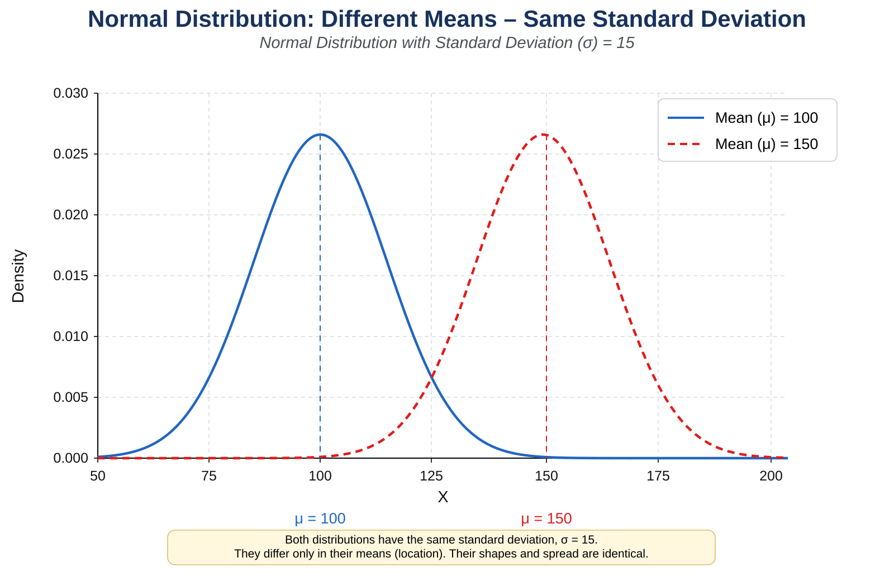
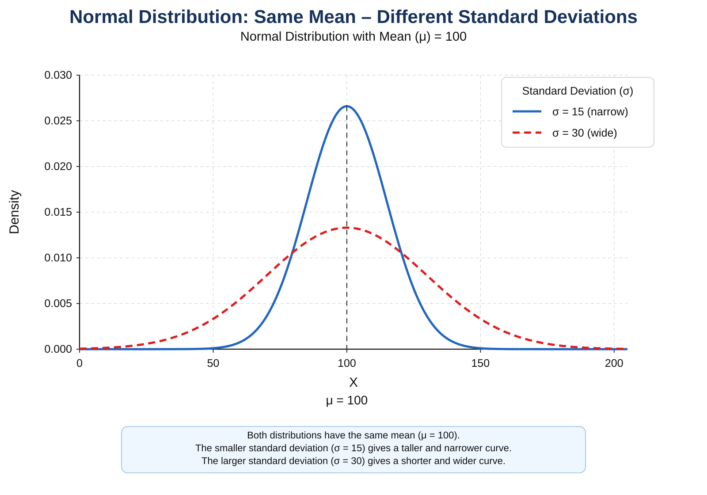
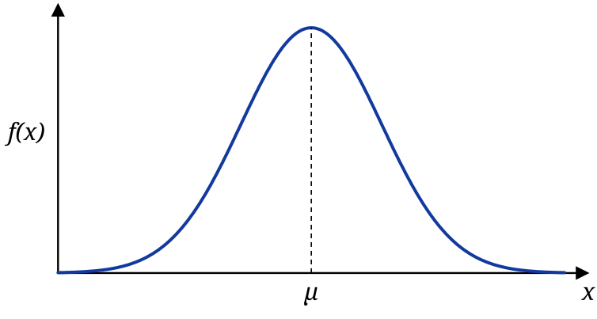
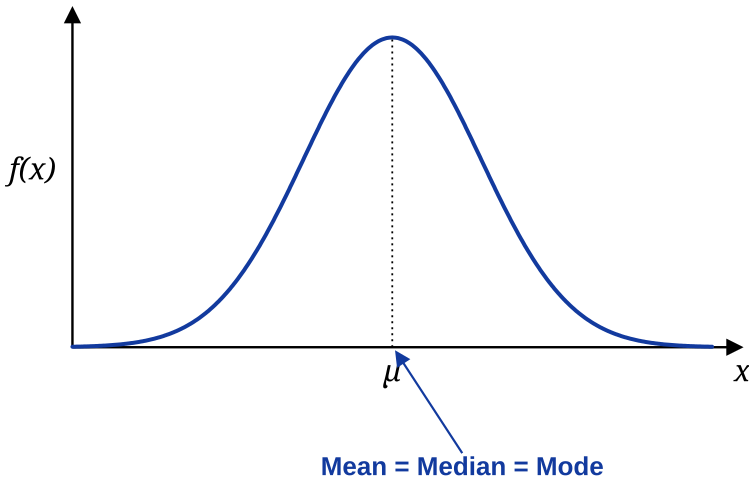
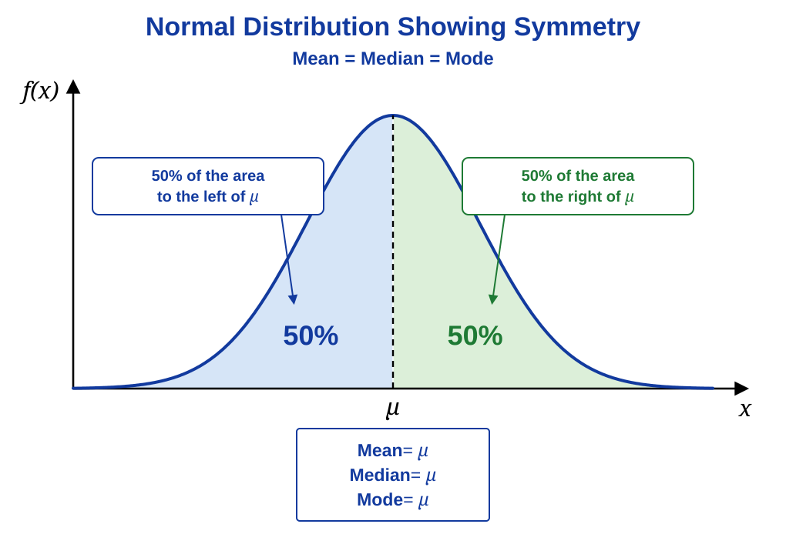
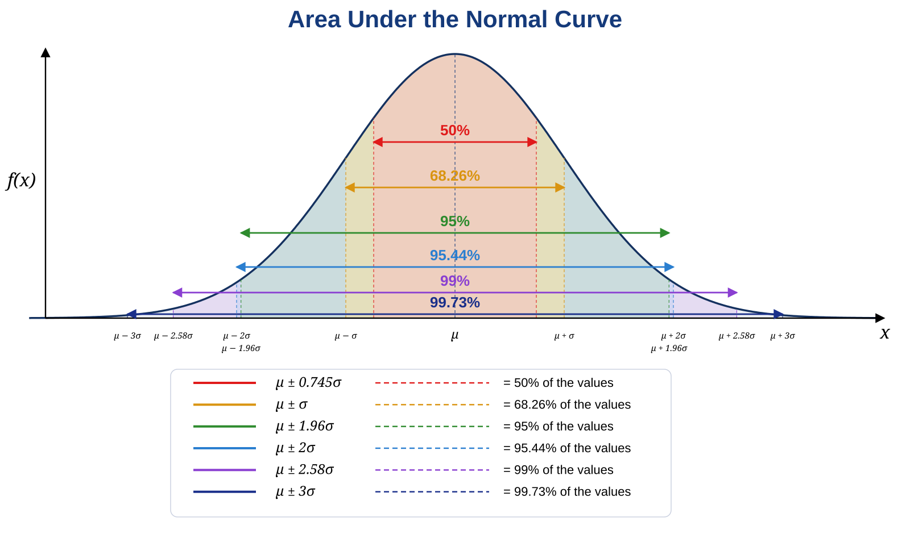
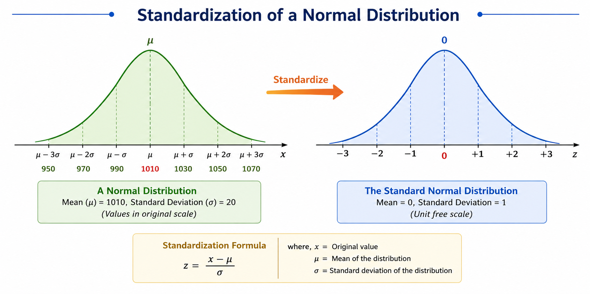
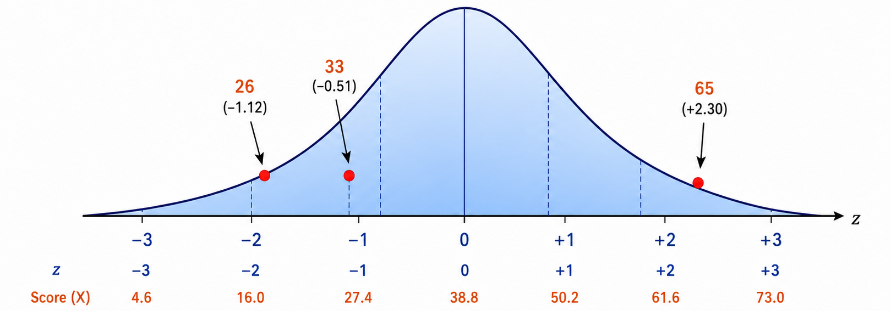

# Probability distributions  

In statistics, a probability distribution gives the possibility of each possible outcome of a random experiment or event. It provides a systematic way to understand and quantify the probabilities of different occurrences.

Probability, as a measure of uncertainty, helps us analyze various phenomena. For instance, when rolling a die, the possible outcomes and their likelihoods are described by a probability distribution. Such distributions apply to any random experiment where outcomes are uncertain or unpredictable.

In this chapter, we explore the definition, functions, formulas, and types of probability distributions.

## Probability distribution

In simple terms, a probability distribution is a way to represent all possible outcomes of a random variable, along with their corresponding probabilities. To understand this better, let us consider a random experiment of tossing an unbiased coin three times. Let $X$ be the random variable defined as the number of heads that appear in these tosses. The possible outcomes for $X$ are 0 heads, 1 head, 2 heads, and 3 heads, forming the sample space $X = \{0, 1, 2, 3\}$. However, these outcomes are not equally likely. The total number of possible outcomes when tossing the coin three times is 8, as shown in @tbl-tossingcoin.

| On tossing thrice | No. of heads ($X$) |
|------------------|--------------------|
| HHH               | 3                  |
| HHT               | 2                  |
| HTH               | 2                  |
| THH               | 2                  |
| HTT               | 1                  |
| THT               | 1                  |
| TTH               | 1                  |
| TTT               | 0                  |

: Possible outcomes on tossing a coin three times {#tbl-tossingcoin .bordered}

$P(X = x)$ = $\dfrac{\text{Number of times } X \text{ takes value } x}{8}$

$P(X = 3)$ = 1/8; $P(X = 2)$ = 3/8; $P(X = 1)$ = 3/8; $P(X = 0)$ = 1/8

@tbl-probabilitydistncoin below shows the probability distribution of the number of heads that appear on tossing a coin 3 times.

| $X$ | $p(x)$ |
|----|-------|
| 0   | 1/8    |
| 1   | 3/8    |
| 2   | 3/8    |
| 3   | 1/8    |

: Probability distribution of tossing the coin three times {#tbl-probabilitydistncoin .bordered}

This is an example of discrete probability distribution as $X$ takes only discrete values. If $X$ takes continuous values, it is termed as continuous probability distribution.

## Expected value of a random variable

Expected value is exactly what you might think it means: the return you can expect for some kind of action. The expected value of a random variable is the long-run average value of repetitions of the same experiment it represents. For example, the expected value in rolling a six-sided die is 3.5, because each face (1 through 6) has an equal chance of 1/6, and when you multiply each number by its probability and sum them up like 1/6 + 2/6 + 3/6 + 4/6 + 5/6 + 6/6, then you get 21/6, which is 3.5. It’s the average you’d see over countless rolls, even though you can’t roll a 3.5!  

The expected value of a random variable $X$ is denoted as $E(X)$.\  

The formula for calculating the Expected Value of random variable where there are multiple probabilities is given for discrete and continuous in @eq-expdiscrete and @eq-expcont.

[**Discrete case**]{.underline}  


$$E(X) = \sum_{x} x\, p(x)$$ {#eq-expdiscrete}

[**Continuous case**]{.underline}  


$$E(X) = \int_{- \infty}^{\infty}{x p(x)\ \text{dx }};- \infty \leq x \leq \infty$$ {#eq-expcont}

here the random variable $X$ lies between ${-\infty}$ and ${+\infty}$

::: {#exm-expval1}
Find the expected value of $X$ of tossing a single unfair die.

```{r, echo=FALSE,warning=FALSE,results='asis'}  
library(knitr)
library(kableExtra)
dt<-read.csv("csv/pr1.csv")
colnames(dt) <- NULL
dt %>%
  kbl(booktabs = TRUE, align = "c", escape = FALSE) %>%
   kable_classic(full_width = F, html_font = "Georgia") %>%
kable_styling(
    # latex_options = "HOLD_position", 
    full_width = FALSE,
    position = "center", 
    bootstrap_options = "bordered"
  ) 
```

**Solution**

```{r, echo=FALSE,warning=FALSE,results='asis'}  
library(knitr)
library(kableExtra)
dt<-read.csv("csv/pr2.csv")
colnames(dt) <- NULL
dt %>%
  kbl(booktabs = TRUE, align = "c", escape = FALSE) %>%
   kable_classic(full_width = F, html_font = "Georgia") %>%
kable_styling(
    # latex_options = "HOLD_position", 
    full_width = FALSE,
    position = "center", 
    bootstrap_options = "bordered"
  ) 
```

Using equation @eq-expdiscrete, $E(X)$ = $\sum_{x} x\, p(x)$ = 0.1+0.2+0.3+0.4+0.5+3 = 4.5
:::

::: {#exr-expval1}
Find $E(X)$ in the following case.  

```{r, echo=FALSE,warning=FALSE,results='asis'}
library(knitr)
library(kableExtra)
dt<-read.csv("csv/pr1.csv")
colnames(dt) <- NULL
dt %>%
  kbl(booktabs = TRUE, align = "c", escape = FALSE) %>%
   kable_classic(full_width = F, html_font = "Georgia") %>%
kable_styling(
    # latex_options = "HOLD_position", 
    full_width = FALSE,
    position = "center", 
    bootstrap_options = "bordered"
  ) 
```
:::

## Discrete probability distributions

A discrete probability distribution represents the probabilities of outcomes of a discrete random variable, which takes on a countable number of distinct values. For example, the number of heads when flipping a coin three times or the number of defective items in a batch are described by discrete distributions. Each possible outcome is assigned a specific probability, and the sum of these probabilities is always 1.

We have seen that a probability distribution lists all possible outcomes of a random variable along with their corresponding probabilities, often represented as a table. However, it is often more convenient to express the distribution as an equation. With such an equation, the probability corresponding to any given value of $x$ can be calculated directly. Depending on the situation, various discrete probability distributions are used to model different scenarios. In this chapter, we will focus on the following discrete distributions.

-   Bernoulli distribution

-   Binomial distribution

-   Poisson distribution

[**Probability mass function**]{.underline}

When a probability function is used to describe a discrete probability distribution, it is referred to as a probability mass function (commonly abbreviated as *p.m.f*). A probability mass function assigns a probability to each specific outcome of a discrete random variable. It is expressed as: $p(x) = P(X = x)$. Here, $X$ is the discrete random variable, and $p(x)$ represents the probability of $X$ taking the specific value $x$. The function ensures that all probabilities are non-negative and sum to 1 across all possible outcomes of $X$.

Properties of *p.m.f*

-   The probability of each outcome is always non-negative. For a discrete random variable $X$ and its *p.m.f*, $p(x) \geq 0 \quad \text{for all } x$

-   The sum of the probabilities over all possible values of the random variable equals 1. That is:$\sum_{x \in S} p(x) = 1$. where $S$ is the sample space of ($X$), representing all possible values.

-   The *p.m.f* gives the exact probability for each specific value of the discrete random variable. For a value $x$, $P(X = x) = p(x)$

-   If a value $x$ is not in the sample space $S$, its probability is zero: $p(x) = 0 \quad \text{for } x \notin S$

The *p.m.f* is defined only for the discrete values in the sample space of the random variable $X$. It does not apply to continuous ranges or non-discrete variables.

### Bernoulli distribution

A Bernoulli distribution is a discrete probability distribution that applies to a random experiment with exactly two possible outcomes, commonly referred to as “success” and “failure.” For example, tossing a coin results in two outcomes, which the experimenter can label as success and failure based on their context. Success might be defined as getting a head and failure as getting a tail. The definition of success and failure is flexible and can be tailored by the experimenter to suit the specific scenario under study.

The probability mass function of the distribution is

$$p(x) = p^x (1 - p)^{1 - x}; \quad x = 0, 1$$ {#eq-bernoulli}

in @eq-bernoulli $X$ takes only two values, 0 and 1. Here $p$ is the probability of success and $1-p$ is the probability of failure.

::: {.callout-important title="Note"}
A parameter of a distribution is a fixed value that describes a key characteristic of the distribution. The parameter of a Bernoulli distribution is $p$, which represents the probability of success in a single trial
:::

The expected value for a random variable, $X$, from a Bernoulli distribution is: E($X$) = $p$ and the variance of a Bernoulli random variable is: var($X$) = $p(1 - p)$.

::: {#exm-bernoulli1}
Find the probability assuming Bernoulli distribution of a biased coin where probability of success (getting head) $p$ = 0.4

**Solution**

Let $X$ be the random variable which takes value 0 on getting tail (failure) and takes value 1 on getting head (success). So using the equation @eq-bernoulli

$P(X = 0) = (0.4)^0 (1-0.4)^1 = 0.6$

$P(X = 1) = (0.4)^1 (1-0.4)^0 =0.4$

the distribution can be shown as below:

| $x$ | $p(x)$ |
|-----|--------|
| 0   | 0.6    |
| 1   | 0.4    |

: Bernoulli distribution for a biased coin with $p=0.4$ {#tbl-bernoulli1 .bordered}
:::

::: {.callout-important title="Note"}
A Bernoulli trial is one of the simplest experiments you can conduct in probability and statistics. It’s an experiment where you can have one of two possible outcomes. For example, “Yes” and “No” or “Heads” and “Tails.”
:::

### Binomial distribution

Binomial distribution can be thought of as simply the probability of a success or failure outcome in an experiment or survey that is repeated multiple times; *i.e*. a Binomial distribution happens, when a Bernoulli trial is repeated $n$ number of times. The binomial is a type of distribution that has two possible outcomes (the prefix “bi” means two, or twice). For example, if you toss a coin 5 times and count the number of heads, that count, $X$, follows a binomial distribution with $n = 5$. In short, a single coin toss is a Bernoulli trial, but repeating it several times (more than once) turns it into a binomial experiment.

**Binomial distributions must also meet the following three criteria:**

-   The number of observations or trials ($n$) is fixed.

-   Each observation or trial is independent

-   The probability of success($p$) is exactly the same from one trial to another

The probability mass function of the distribution is

$$p(x) = \binom{n}{x} p^x q^{n-x} = \frac{n!}{x!(n-x)!} p^x q^{n-x}; \quad x = 0, 1, 2, \ldots, n$$ {#eq-binomial}

where

$n$= number of trials

$x$= number of success desired

$p$= probability of getting a success in one trial

$q$ = $1-p$ = probability of getting a failure in one trial

::: {.callout-important title="Note"}
In a binomial distribution, the parameters are $n$, the number of independent trials, and $p$, the probability of success in a single trial. If X follows a binomial distribution we denote $X \sim \text{Bin}(n, p)$. The mean of $X$ is given by $E(X) = np$, while the variance is $\text{Var}(X) = npq$, where$q = 1 - p$. Since $0 < p < 1$, it follows that $q$ is also positive but less than 1. This implies that $np > npq$, establishing the fundamental property that the mean of a binomial distribution is always greater than its variance.
:::

::: {#exm-binom1}
A coin is tossed 10 times. What is the probability of getting exactly 6 heads?

**Solution**

here, $n = 10; x = 6; p = \frac{1}{2}; q = 1-p = \frac{1}{2}$

We have to find $P(X=6)$; using the @eq-binomial

$P(X=6)=\binom{10}{6}\left( \frac{1}{2} \right)^{6}\left( \frac{1}{2} \right)^{10 - 6} = 210 \times \left( \frac{1}{2} \right)^{10} = 0.2051$
:::

### Fitting of binomial distribution

In practice, we often have a set of observed frequencies obtained from an experiment and we wish to know whether a binomial distribution provides a good description of the data. Fitting a distribution means finding a theoretical distribution that closely matches the observed data, so that we can compare the observed frequencies with the expected (theoretical) frequencies.

To fit a binomial distribution to an observed frequency distribution, we follow these steps:

-   Determine the number of trials $n$ from the nature of the experiment.

-   Estimate the probability of success $p$ from the data. Since the mean of a binomial distribution is $np$, we equate it to the observed mean and obtain $p = \dfrac{\overline{x}}{n}$, where $\overline{x}$ is the mean number of successes. Then $q = 1 - p$.

-   Compute the expected probability $p(x)$ for each value of $x$ using @eq-binomial.

-   Multiply each probability by the total frequency $N$ to obtain the expected frequency, that is, expected frequency = $N \times p(x)$.

::: {#exm-binomfit1}
In a study on the survival of mango seedlings after transplanting, 100 groups of 5 seedlings each were transplanted. The number of seedlings surviving in each group was recorded as given below. Fit a binomial distribution to the data.

|                         |                   |
|:-----------------------:|:-----------------:|
| Number surviving ($x$)  | Number of groups  |
|            0            |         3         |
|            1            |         16        |
|            2            |         32        |
|            3            |         28        |
|            4            |         17        |
|            5            |         4         |
: Number of survivors out of 5 in 100 groups {#tbl-survivorscount .bordered}

: Number of mango seedlings surviving out of 5, in 100 groups {#tbl-mangosurvival .bordered}

**Solution**

Here the number of trials is $n = 5$ and the total frequency is $N = 100$.

Mean number of surviving seedlings,

$$\overline{x} = \frac{\sum f x}{N} = \frac{(0 \times 3) + (1 \times 16) + (2 \times 32) + (3 \times 28) + (4 \times 17) + (5 \times 4)}{100} = \frac{252}{100} = 2.52$$

The probability of success is estimated as $p = \dfrac{\overline{x}}{n} = \dfrac{2.52}{5} = 0.504$, so $q = 1 - 0.504 = 0.496$.

The expected frequency for each value of $x$ is obtained from $N \times \binom{5}{x} p^x q^{5-x}$, as shown in @tbl-binomfit1.

| $x$   | Observed frequency | Expected frequency |
|:------:|:-------------------:|:-------------------:|
| 0     | 3                  | 3.0                |
| 1     | 16                 | 15.3               |
| 2     | 32                 | 31.0               |
| 3     | 28                 | 31.5               |
| 4     | 17                 | 16.0               |
| 5     | 4                  | 3.3                |
| Total | 100                | 100.0              |

: Fitting of binomial distribution to seedling survival data {#tbl-binomfit1 .bordered}

The expected frequencies are close to the observed frequencies, indicating that the binomial distribution provides a good fit to the data.
:::

### Poisson distribution

The Poisson distribution, discovered by the French mathematician Siméon Denis Poisson (1781-1840), was developed to describe the number of times a gambler would win a rarely won game of chance over a large number of tries. As a discrete probability distribution, it specifically deals with rare events. One of its most famous applications came nearly 60 years later, when the statistician Ladislaus Bortkiewicz used the Poisson distribution in 1898 to study the number of deaths caused by horse kicks in the Prussian army, demonstrating its usefulness in modeling infrequent occurrences over a given interval of time or space.

Other applications and examples where Poisson distribution is used

-   Pest incidence

-   Birth defects and genetic mutations

-   Rare diseases

-   Car accidents

-   Traffic flow and ideal gap distance

-   Number of typing errors on a page

-   Hairs found in McDonald’s hamburgers

-   Spread of an endangered animal in Africa

-   Failure of a machine in one month

A random variable $X$ is said to follow a Poisson distribution; if it assumes non-negative values and its probability mass function is given by:

$$p(x) = \frac{e^{- \lambda}.\lambda^{x}}{x!}; \quad x = 0, 1, 2, \ldots, \infty$$ {#eq-poisson}

where

$e$ = base of the natural logarithm, a constant approximately equal to 2.71828.

$\lambda$ : Average number of successes occurring in a given time interval or region in the Poisson distribution

::: {.callout-important title="Note"}
The parameter of Poisson distribution is $λ$. If X follows a Poisson distribution we denote $X \sim \text{poisson}(\lambda)$. The mean and the variance of the Poisson distribution are both equal to $\lambda$
:::

::: {#exm-poisson1}
The average number of homes sold by a Realty company is 2 homes per day. Assuming a Poisson distribution, what is the probability that exactly 3 homes will be sold tomorrow?

**Solution**

here $\lambda = 2$; since 2 homes are sold per day, on average. $x = 3$; since we want to find the probability that 3 homes will be sold tomorrow. Using @eq-poisson.

$P(X=3)= \ \frac{{2.71828}^{- 2}{\  \times \ 2}^{3}}{3!}= 0.180$
:::

::: {#exr-poisson1}
If the random variable $X$ follows a Poisson distribution with mean 3.4, find $P(X = 6)$.
:::

::: {#exr-poisson2}
The number of industrial injuries per working week in a particular factory is known to follow a Poisson distribution with mean 0.5. Find the probability that in a particular week there will be: (a) less than 2 accidents (b) more than 2 accidents.
:::

::: {#exr-poisson3}
A company knows from past experience that 3% of the bulbs they produce are defective. Assuming a Poisson distribution, find the probability of getting the following in a sample of 100 bulbs. (a) no defective (b) 1 defective.
:::

### Fitting of Poisson distribution

Fitting a Poisson distribution to an observed frequency distribution allows us to check whether the Poisson distribution provides a good description of the data, which is especially useful when we are dealing with rare events such as pest counts or defects.

To fit a Poisson distribution to an observed frequency distribution, we follow these steps:

-   Estimate the parameter $\lambda$ from the data. Since the mean of a Poisson distribution is $\lambda$, we take $\lambda = \overline{x}$, the observed mean.

-   Compute the expected probability $p(x)$ for each value of $x$ using @eq-poisson.

-   Multiply each probability by the total frequency $N$ to obtain the expected frequency, that is, expected frequency = $N \times p(x)$.

::: {#exm-poissonfit1}
In a survey on the incidence of diamondback moth larvae, 100 cabbage plants were examined and the number of larvae per plant was recorded as given below. Fit a Poisson distribution to the data.

|                        |                   |
|:----------------------:|:-----------------:|
| Number of Larvae ($x$) | Number of Plants  |
|           0            |        37         |
|           1            |        37         |
|           2            |        18         |
|           3            |         6         |
|       4 or more        |         2         |
: Number of diamondback moth larvae per cabbage plant, in 100 plants {#tbl-larvaecount .bordered}

**Solution**

The total frequency is $N = 100$. The mean number of larvae per plant is

$$\lambda = \overline{x} = \frac{\sum f x}{N} = \frac{(0 \times 37) + (1 \times 37) + (2 \times 18) + (3 \times 6) + (4 \times 2)}{100} = \frac{99}{100} = 0.99$$

The expected frequency for each value of $x$ is obtained from $N \times \dfrac{e^{-\lambda} \lambda^x}{x!}$, as shown in @tbl-poissonfit1. The frequency for the class “4 or more” is obtained by subtracting the sum of the other expected frequencies from the total, $N$.

| $x$       | Observed frequency | Expected frequency |
|:----------:|:-------------------:|:-------------------:|
| 0         | 37                 | 37.2               |
| 1         | 37                 | 36.8               |
| 2         | 18                 | 18.2               |
| 3         | 6                  | 6.0                |
| 4 or more | 2                  | 1.8                |
| Total     | 100                | 100.0              |

: Fitting of Poisson distribution to larval count data {#tbl-poissonfit1 .bordered}

The expected frequencies agree closely with the observed frequencies, indicating that the Poisson distribution provides a good fit to the data.
:::

## Continuous probability distributions

If the random variable X is continuous, the corresponding probability distribution is termed as continuous probability distribution. There are several continuous distributions. Our discussion is limited to only **Normal distribution**.

[**Probability density function**]{.underline}

When a mathematical function is used to describe a continuous probability distribution, it is referred to as a probability density function (commonly abbreviated as *p.d.f*). It describes how values of a continuous random variable are distributed. It gives the relative likelihood of a variable taking a particular value within a given range. The area under the *pdf curve* over an interval represents the probability that the variable falls within that range. However, unlike pmf for discrete variables, the pdf itself does not give the probability of a single value but rather the density of possible values.

### Normal distribution

The name “normal distribution” comes from its historical use in describing many natural and social phenomena that appeared to follow a similar symmetric, bell-shaped pattern. The term “normal” was popularized by Karl Pearson in the early 20th century, though the distribution itself was first studied by Abraham de Moivre and later formalized by Carl Friedrich Gauss.

The distribution was initially called the `Gaussian distribution`, as Gauss used it to model errors in astronomical observations. However, statisticians and scientists noticed that this pattern frequently appeared in various real-world data, such as heights, IQ scores, and measurement errors. Because it was so common, it became known as the normal distribution, implying that it represents a “normal” or typical way data is distributed in many natural processes.

It is characterized by its symmetric, bell-shaped curve, where the mean, median, and mode are equal. Defined by two parameters, the mean ($\mu$) and standard deviation ($\sigma$). Its significance lies in the Central Limit Theorem, which states that the sum of a large number of independent random variables tends to be normally distributed, making it widely applicable in statistical inference. The normal distribution is defined by the following probability density function.

$$f\left( x \right) = \frac{1}{\sigma\sqrt{2\pi}}e^{- \frac{{(x - \mu)}^{2}}{2\sigma^{2}}}; \quad -\infty < x < +\infty$$ {#eq-normaldist}

where $\mu$ is the population mean and $\sigma^2$ is the variance, $e = 2.718$

[**Parameters of Normal distribution**]{.underline}

As with any probability distribution, the parameters of the normal distribution define its shape and probabilities entirely. The normal distribution has two parameters, mean ($\mu$) and standard deviation ($\sigma$). The normal distribution does not have just one form. Instead, the shape changes based on the parameter values.

{#fig-normalchange fig-align="center" style="text-align:center;" width="80%"}

**Standard deviation:**

The standard deviation is a measure of variability. It defines the width of the normal distribution. It determines how far away from the mean the values tend to fall. It represents the typical distance between the observations and the average.

{#fig-normalchange2 fig-align="center" style="text-align:center;" width="80%"}

When you have normally distributed data, the standard deviation can be used to determine the proportion of the values that fall within a specified number of standard deviations from the mean. For example, in a normal distribution, 68% of the observation falls within $\mu\pm  \sigma$. This property is called as **Area Property**.

::: {.callout-important title="Note"}
The parameters of normal distribution are $\mu$ and $\sigma$. If a random variable $X$ follows the normal distribution, then we write $X\sim\text{N}(\mu,\sigma^2)$. In particular, the normal distribution with $\mu = 0$ and $\sigma^2 =1$ is called the standard normal distribution, and is denoted as $X\sim\text{N}(0,1)$
:::

[**Properties of Normal distribution**]{.underline}

1.  The normal distribution is the most frequently used among all probability laws. The normal distribution can be found in many practical problems. If you plot density $f(x)$ against $x$ the graph will be **bell shaped** always.

{#fig-normalcurve fig-align="center" style="text-align:center;" width="80%"}

2.  The Normal Distribution has mean = median = mode. Mean, median and mode are located at the center of the curve.

{#fig-normalcurve2 fig-align="center" style="text-align:center;" width="80%"}

3.  Normal distribution is symmetric about the center, 50% of values less than the mean and 50% greater than the mean

{#fig-normalsymmetry fig-align="center" style="text-align:center;" width="80%"}

4.  Area Property\
    The area property of the normal distribution shows how data is spread around the mean. As we move further from the mean, more values are included within the range. For example, about 68% of the data falls within one standard deviation of the mean. The area increases as we expand the range to two or three standard deviations, covering 95% and 99.7% of the data, respectively. See @tbl-areaproperty for detailed information on the area property of the normal distribution.

{#fig-areaproperty fig-align="center" style="text-align:center;" width="80%"}

| Area                  | $\%$ of value contained |
|:----------------------:|:------------------------:|
| $\mu \pm 0.745\sigma$ | 50                      |
| $\mu \pm \sigma$      | 68.26                   |
| $\mu \pm 1.96\sigma$  | 95                      |
| $\mu \pm 2\sigma$     | 95.44                   |
| $\mu \pm 2.58\sigma$  | 99                      |
| $\mu \pm 3\sigma$     | 99.73                   |

: Area property of normal distribution {#tbl-areaproperty .bordered}

In short, a normal distribution is bell-shaped, symmetric, and has the property that the mean, median, and mode are all equal. It also has the area property. Other important properties of the normal distribution are listed below:

1.  **Defined by two parameters**: The normal distribution is fully defined by its mean ($\mu$) and standard deviation ($\sigma$), where $\mu$ determines the center and $\sigma$ determines the spread or width of the curve.

2.  **Total area under the curve**: The total area under the normal distribution curve is equal to 1, representing the total probability of all possible outcomes.

3.  **Asymptotic**: The tails of the normal distribution approach, but never actually touch, the horizontal x-axis. This means the probability of extreme values is never exactly zero, but it becomes infinitesimally small.

4.  **Skewness and Kurtosis**: A normal distribution has skewness equal to 0 (no skew), and kurtosis equal to 3 (mesokurtic), meaning it has a moderate peak and tails.

5.  **Linear combination**: A linear combination of independent normal variables is also normally distributed. This property is crucial in statistical analysis and is a key reason for the widespread use of the normal distribution.

6.  **Central Limit Theorem**: The normal distribution is central to the Central Limit Theorem, which states that the distribution of the sample mean will tend to be normal regardless of the shape of the original distribution, provided the sample size is sufficiently large.

7.  **Moments**: All odd order moments are zero in normal distribution.

8.  **Dispersion**: Quartile Deviation. Q.D = $\frac{2}{3}\sigma$ and Mean Deviation. M.D = $\frac{4}{5}\sigma$.

### Standard normal distribution

The **standard normal distribution** is a special case of the normal distribution where the mean is 0 and the standard deviation is 1. This distribution is also known as the **Z-distribution**. In the standard normal distribution, a value is referred to as a **standard score** or **Z-score**. The Z-score indicates how many standard deviations a data point is from the mean.

A normal distribution can be converted to a standard normal distribution, which provides several advantages:

1.  **Simplifies calculations**: With a mean of 0 and standard deviation of 1, performing statistical calculations becomes more straightforward.
2.  **Universal comparison**: Converting to a standard normal distribution allows comparison between different normal distributions on a common scale, regardless of their original means and standard deviations.
3.  **Z-scores**: The conversion enables the calculation of Z-scores, which measure the relative position of a data point in terms of standard deviations from the mean.
4.  **Consistent analysis**: It allows the use of standard normal distribution tables, making probability calculations more accessible and consistent across different datasets.

To convert a normal variate to a Standard Score (“z-score”)

-   First subtract the mean,

-   Then divide by the Standard Deviation

And doing that is called “Standardizing”.

When a normal variate $X \sim N(\mu, \sigma^2)$ is converted to a standard normal variate, it follows the transformation:

$$z = \frac{X - \mu}{\sigma}$$ {#eq-standard}

Here, $X$ is a normal variate with mean $\mu$ and variance $\sigma^2$, and $z$ is the corresponding standard normal variate. This transformation converts $X$ into a standard normal distribution $z \sim N(0, 1)$, where the mean is 0 and the standard deviation is 1.

{#fig-normalstandardize fig-align="center" style="text-align:center;" width="80%"}

::: {#exm-zscore1}
A survey of daily travel time ($X$) had these results (in minutes): 26, 33, 65, 28, 34, 55, 25, 44, 50, 36, 26, 37, 43, 62, 35, 38, 45, 32, 28, 34. Convert it into standard scores (Z-score).

**Solution**

The Mean ($\mu$) is 38.8 minutes, and the Standard Deviation ($\sigma$) is 11.4. Using @eq-standard.

| $X$ | $X-\mu$ | $$z = \frac{X - \mu}{\sigma}$$ |
|:----:|:-------:|:------------------------------:|
| 26  |  -12.8  |             -1.12              |
| 33  |  -5.8   |             -0.51              |
| 65  |  26.2   |              2.30              |
| 28  |  -10.8  |             -0.95              |
| 34  |  -4.8   |             -0.42              |
| 55  |  16.2   |              1.42              |
| 25  |  -13.8  |             -1.21              |
| 44  |   5.2   |              0.46              |
| 50  |  11.2   |              0.98              |
| 36  |  -2.8   |             -0.25              |
| 26  |  -12.8  |             -1.12              |
| 37  |  -1.8   |             -0.16              |
| 43  |   4.2   |              0.37              |
| 62  |  23.2   |              2.04              |
| 35  |  -3.8   |             -0.33              |
| 38  |  -0.8   |             -0.07              |
| 45  |   6.2   |              0.54              |
| 32  |  -6.8   |             -0.60              |
| 28  |  -10.8  |             -0.95              |
| 34  |  -4.8   |             -0.42              |

: Z-score calculation {#tbl-zscorecalc .bordered}

{#fig-zscoreandx fig-align="center" style="text-align:center;" width="80%"}
:::

::: {#exm-zscore2}
What is the z-score of a value of 27, given a set mean of 24, and a standard deviation of 2?

**Solution**

To find the z-score we need to divide the difference between the value, 27, and the mean, 24, by the standard deviation of the set, 2. $z = \frac{27 - 24}{2} = \frac{3}{2} = 1.5$. This indicates that 27 is +1.5 standard deviations above the mean.
:::

### Z-score table

A **Z-score table** (or standard normal distribution table) shows the cumulative probability for a standard normal distribution, corresponding to different Z-scores. It provides the probability that a standard normal variable will be less than or equal to a given value. A model Z score table or standard normal table is given in @tbl-ztable in appendix 3.  

Procedure to use a Z-Score Table is given below:

1.  **Calculate the Z-score**:\
    First, calculate the Z-score using the formula @eq-standard

2.  **Find the Z-score in the table**:\
    Once you have the Z-score, locate its value in the Z-score table @fig-zscoretable. The table typically lists Z-scores in two parts: the first two digits (the ones and tenths place) are listed on the left, and the second decimal place is listed at the top. For example, for a Z-score of 1.23, find 1.2 on the left side and 0.03 across the top, and the value at the intersection is the cumulative probability.

3.  **Interpret the table value**:\
    The value from the Z-table represents the cumulative probability (area under the curve) to the left of the Z-score. For example A Z-score of 1.23 corresponds to a cumulative probability of about **0.8907**, which means there is an 89.07% chance that a value from the distribution is less than or equal to 1.23 standard deviations above the mean.

4.  **Use the table for finding areas**:\
    To find the probability that a value lies **above** a certain Z-score, subtract the table value from 1. For example, if the Z-score is 1.23, the probability of a value being greater than 1.23 is: $P(z > 1.23) = 1 - 0.8907 = 0.1093$. So, there is a 10.93% chance the value is above 1.23 standard deviations.

5.  **For ranges of Z-scores**:\
    If you’re looking for the probability that a value falls between two Z-scores, find the cumulative probabilities for both Z-scores and subtract the smaller from the larger. For example, for Z-scores of 1.23 and 0.5. From the table the cumulative probability for 1.23 is 0.8907. The cumulative probability for 0.5 is 0.6915. The probability that $X$ lies between 0.5 and 1.23 is:$P(0.5 < z < 1.23) = 0.8907 - 0.6915 = 0.1992$. By following these steps, you can use the Z-score table to find cumulative probabilities and interpret standard normal distribution data.

::: {#exm-zscore3}
Average yield of mango trees in an orchard has a mean of 70 kg and a standard deviation of 12 kg. What is the probable percentage of mango trees with yield more than 85 kg?

**Solution**

Let $X$ be the yield of a mango tree. It is given that $X \sim N(70, 12^2)$. We need to find $P(X > 85)$. This can be standardized to $P\left(z > \frac{85 - 70}{12}\right)$ = $P(z > 1.25)$. Now $P(z > 1.25) = 1 - P(z \leq 1.25)$. From the table $P(z \leq 1.25) = 0.8944$, so the probability is $1 - 0.8944 = 0.1056$. Hence the percentage of trees with yield above 85 kg = $10.56\%$.
:::

::: {#exm-zscore4}
The heights of coconut trees, H metres, are Normally distributed with a mean of 14.5 and a variance of 7. Determine the probability that the height of a randomly chosen tree will be less than 12 metres.

**Solution**

Let H be the height of the tree. It is given that $H \sim N(14.5,7)$. We need to find $P(H < 12)$. Which can be standardized to $P(z < \frac{12 - 14.5}{\sqrt{7}})$= $P(z < -0.9449)$. Since normal distribution is symmetric, $P(z < -0.9449)=P(z > 0.9449)$. $P(z > 0.9449)= 1-P(z \leq 0.9449)$. From the table $P(z \leq 0.94) =0.8264$ so the probability is 1-0.8264=0.1736.
:::

::: {.callout-caution title="Historical Insights"}
**De Moivre’s Final Prediction**

Abraham de Moivre, a French mathematician exiled to England, spent his life uncovering the hidden patterns of probability. Among his greatest contributions was the **normal distribution**, the elegant bell-shaped curve that governs everything from human traits to measurement errors. As he aged, de Moivre observed that his daily sleep was increasing by about 15 minutes, and in a striking prediction, he calculated that on the day his sleep reached 24 hours, he would die. Mysteriously, his forecast came true, and he passed away on November 27, 1754. Though eerie, his work on probability lived on, later refined by Gauss and Laplace, shaping the foundation of modern statistics and proving that even randomness follows a predictable order.
:::

::: {.callout-tip title="Quotes to Inspire"}
**“To understand God’s thoughts, we must study statistics, for these are the measure of His purpose.”**\
**- Florence Nightingale**
:::  

## Chapter Summary

### Fill in the blanks {.unnumbered}

Answers are given at the end of the chapter.

1. A probability distribution gives the possible outcomes of a __________ variable along with their corresponding probabilities.

2. A probability distribution in which the random variable takes countable values is called a __________ probability distribution.

3. A probability distribution in which the random variable takes continuous values is called a __________ probability distribution.

4. The probability assigned to a particular value of a discrete random variable is called the __________.

5. The expected value of a random variable represents its __________ average value over repeated trials.

6. The expected value of a discrete random variable $X$ is denoted by __________.

7. The expected value of a continuous random variable is obtained using __________.

8. The probability mass function is commonly abbreviated as __________.

9. For a discrete random variable, $p(x)$ represents __________.

10. The sum of all probabilities in a probability mass function is equal to __________.

11. A Bernoulli distribution has exactly __________ possible outcomes.

12. In a Bernoulli distribution, the probability of success is denoted by __________.

13. The probability of failure in a Bernoulli distribution is __________.

14. The parameter of a Bernoulli distribution is __________.

15. The mean of a Bernoulli distribution is __________.

16. The variance of a Bernoulli distribution is __________.

17. A binomial distribution is obtained when a Bernoulli trial is repeated __________ times.

18. In a binomial distribution, the number of trials $n$ is __________.

19. In a binomial distribution, the trials are __________.

20. In a binomial distribution, the probability of success remains __________ from trial to trial.

21. The two parameters of a binomial distribution are __________ and __________.

22. The probability of failure in a binomial distribution is denoted by __________.

23. The mean of a binomial distribution is __________.

24. The variance of a binomial distribution is __________.

25. A Poisson distribution is mainly used to model __________ events.

26. The parameter of a Poisson distribution is denoted by __________.

27. In a Poisson distribution, the mean and variance are both equal to __________.

28. The constant $e$ in the Poisson distribution is approximately __________.

29. In fitting a binomial distribution, the probability of success is estimated as __________.

30. In fitting a Poisson distribution, the parameter $\lambda$ is estimated as the observed __________.

31. The expected frequency is obtained by multiplying the probability by the total __________.

32. A continuous probability distribution is described by a probability __________ function.

33. The probability density function is commonly abbreviated as __________.

34. The probability of a continuous random variable falling within an interval is represented by the __________ under the density curve over that interval.

35. The continuous probability distribution discussed in this chapter is the __________ distribution.

36. The normal distribution is characterized by a __________-shaped curve.

37. In a normal distribution, the mean, median, and mode are __________.

38. A normal distribution is __________ about its mean.

39. A normal distribution is defined by the two parameters __________ and __________.

40. The total area under the normal distribution curve is equal to __________.

41. The standard normal distribution has mean __________ and standard deviation __________.

42. The standard normal distribution is also called the __________ distribution.

43. A standardized value in a normal distribution is called a __________ score.

44. The formula used to convert a normal variable into a standard normal variable is called __________.

45. Approximately __________% of observations in a normal distribution lie within $\mu\pm\sigma$.

46. Approximately __________% of observations lie within $\mu\pm2\sigma$.

47. Approximately __________% of observations lie within $\mu\pm3\sigma$.

48. The skewness of a normal distribution is __________.

49. The kurtosis of a normal distribution is __________.

50. The quartile deviation of a normal distribution is __________.

51. The mean deviation of a normal distribution is __________.

### Short-answer questions {.unnumbered}

1. Define a probability distribution.

2. Explain the difference between discrete and continuous probability distributions.

3. Define the expected value of a random variable.

4. Explain the expected value of a discrete random variable.

5. Explain the expected value of a continuous random variable.

6. What is a probability mass function?

7. State the properties of a probability mass function.

8. Define the Bernoulli distribution and give an example.

9. State the probability mass function of the Bernoulli distribution.

10. What are the mean and variance of a Bernoulli distribution?

11. What is a Bernoulli trial?

12. Define the binomial distribution.

13. State the conditions required for a binomial distribution.

14. Explain the parameters of a binomial distribution.

15. State the probability mass function of the binomial distribution.

16. What are the mean and variance of a binomial distribution?

17. Explain how a binomial distribution is fitted to observed data.

18. What is the Poisson distribution?

19. State the applications of the Poisson distribution.

20. State the probability mass function of the Poisson distribution.

21. What is the parameter of the Poisson distribution?

22. State the mean and variance of the Poisson distribution.

23. Explain how a Poisson distribution is fitted to observed data.

24. Distinguish between probability mass function and probability density function.

25. Define the normal distribution.

26. State the parameters of a normal distribution.

27. Explain the main properties of the normal distribution.

28. Explain the area property of the normal distribution.

29. What is the standard normal distribution?

30. What is a Z-score?

31. Explain the procedure for standardizing a normal variable.

32. What information is provided by a Z-score table?

33. Explain how to use a Z-score table to find the probability above a given Z-score.

34. Explain how to find the probability between two Z-scores.

35. State the relationship between the normal distribution and the Central Limit Theorem.

### Numerical and conceptual questions {.unnumbered}

Answers are given at the end of the chapter.

1. A coin is tossed three times and $X$ denotes the number of heads. Construct the probability distribution of $X$.

2. Find the expected value of a random variable having the given discrete probability distribution.

3. Find the expected value of $X$ for an unfair die using the probabilities given in the chapter.

4. A biased coin has probability of success $p=0.4$. Obtain the Bernoulli probability distribution.

5. A coin is tossed 10 times. Find the probability of obtaining exactly 6 heads.

6. For a binomial distribution with $n=10$ and $p=0.4$, find the probability of obtaining exactly 4 successes.

7. Explain whether the following experiment satisfies the conditions of a binomial distribution: a coin is tossed 10 times and the number of heads is recorded.

8. In a binomial distribution, $n=20$ and $p=0.3$. Find the mean and variance.

9. In a study involving 100 groups of 5 mango seedlings, the observed numbers of surviving seedlings are $3,16,32,28,17,4$ for $x=0,1,2,3,4,5$, respectively. Fit a binomial distribution.

10. A Poisson random variable has mean $3.4$. Find $P(X=6)$.

11. The average number of homes sold by a company is 2 per day. Assuming a Poisson distribution, find the probability that exactly 3 homes are sold tomorrow.

12. The number of industrial injuries per week follows a Poisson distribution with mean $0.5$. Find the probability of less than 2 accidents.

13. For the same Poisson distribution with mean $0.5$, find the probability of more than 2 accidents.

14. A company knows that 3% of its bulbs are defective. Assuming a Poisson distribution, find the probability of obtaining no defective bulbs in a sample of 100 bulbs.

15. For the same problem, find the probability of obtaining exactly 1 defective bulb.

16. In a survey of 100 cabbage plants, the number of diamondback moth larvae per plant was recorded. Fit a Poisson distribution to the observed data given in the chapter.

17. State whether the following is a discrete or continuous probability distribution: number of defective plants in a field.

18. State whether the following is a discrete or continuous probability distribution: height of a plant.

19. A random variable follows $N(70,12^2)$. Find the Z-score corresponding to $X=85$.

20. A random variable has mean 24 and standard deviation 2. Find the Z-score corresponding to $X=27$.

21. A mango orchard has mean yield 70 kg and standard deviation 12 kg. Find the probability that a tree produces more than 85 kg.

22. Heights of coconut trees are normally distributed with mean 14.5 m and variance 7. Find the probability that a randomly selected tree has height less than 12 m.

23. A normal distribution has mean 50 and standard deviation 10. Find the proportion of observations between 40 and 60.

24. A normal distribution has mean 100 and standard deviation 15. Find the Z-score for an observation of 130.

25. Explain the meaning of a Z-score of $-1.5$.

### Important formulae {.unnumbered}

Probability distribution:

$$
P(X=x)=\frac{\text{Number of times }X\text{ takes value }x}{\text{Total number of possible outcomes}}
$$

Expected value of a discrete random variable:

$$
E(X)=\sum_x xp(x)
$$

Expected value of a continuous random variable:

$$
E(X)=\int_{-\infty}^{\infty}xp(x)\,dx
$$

Probability mass function:

$$
p(x)=P(X=x)
$$

Bernoulli probability mass function:

$$
p(x)=p^x(1-p)^{1-x},\quad x=0,1
$$

Bernoulli mean:

$$
E(X)=p
$$

Bernoulli variance:

$$
Var(X)=p(1-p)
$$

Binomial probability mass function:

$$
p(x)=\binom{n}{x}p^xq^{n-x},\quad x=0,1,2,\ldots,n
$$

Combination form of binomial probability:

$$
p(x)=\frac{n!}{x!(n-x)!}p^xq^{n-x}
$$

Probability of failure in binomial distribution:

$$
q=1-p
$$

Binomial mean:

$$
E(X)=np
$$

Binomial variance:

$$
Var(X)=npq
$$

Estimation of binomial probability of success:

$$
p=\frac{\bar{x}}{n}
$$

Expected frequency in fitting a binomial distribution:

$$
\text{Expected frequency}=N\times p(x)
$$

Poisson probability mass function:

$$
p(x)=\frac{e^{-\lambda}\lambda^x}{x!},\quad x=0,1,2,\ldots,\infty
$$

Poisson mean:

$$
E(X)=\lambda
$$

Poisson variance:

$$
Var(X)=\lambda
$$

Estimation of Poisson parameter:

$$
\lambda=\bar{x}
$$

Expected frequency in fitting a Poisson distribution:

$$
\text{Expected frequency}=N\times p(x)
$$

Normal probability density function:

$$
f(x)=\frac{1}{\sigma\sqrt{2\pi}}e^{-\frac{(x-\mu)^2}{2\sigma^2}},\quad -\infty<x<+\infty
$$

Standard normal transformation:

$$
z=\frac{X-\mu}{\sigma}
$$

Normal distribution notation:

$$
X\sim N(\mu,\sigma^2)
$$

Standard normal distribution notation:

$$
X\sim N(0,1)
$$

Quartile deviation for a normal distribution:

$$
Q.D.=\frac{2}{3}\sigma
$$

Mean deviation for a normal distribution:

$$
M.D.=\frac{4}{5}\sigma
$$

### Quick revision {.unnumbered}

- Probability distribution → gives possible values of a random variable and their probabilities.
- Discrete probability distribution → random variable takes countable values.
- Continuous probability distribution → random variable takes continuous values.
- Expected value → long-run average value of a random variable.
- Probability mass function → used for discrete random variables.
- Probability density function → used for continuous random variables.
- For a p.m.f., $p(x)\geq0$.
- For a p.m.f., $\sum p(x)=1$.
- Bernoulli distribution → exactly two possible outcomes, success and failure.
- Bernoulli parameter → $p$, the probability of success.
- Bernoulli mean → $p$.
- Bernoulli variance → $p(1-p)$.
- Binomial distribution → repeated Bernoulli trials.
- Binomial requirements → fixed number of trials, independent trials, and constant probability of success.
- Binomial parameters → $n$ and $p$.
- Binomial failure probability → $q=1-p$.
- Binomial mean → $np$.
- Binomial variance → $npq$.
- In fitting a binomial distribution, $p=\frac{\bar{x}}{n}$.
- Expected frequency → $N\times p(x)$.
- Poisson distribution → used mainly for rare events.
- Poisson parameter → $\lambda$.
- Poisson mean → $\lambda$.
- Poisson variance → $\lambda$.
- In fitting a Poisson distribution, $\lambda=\bar{x}$.
- Normal distribution → continuous, bell-shaped and symmetric.
- Normal distribution parameters → $\mu$ and $\sigma$.
- Mean = median = mode in a normal distribution.
- Normal distribution is symmetric about its mean.
- Total area under the normal curve → 1.
- Standard normal distribution → mean 0 and standard deviation 1.
- Z-score → number of standard deviations an observation is from the mean.
- Standardization → subtract the mean and divide by the standard deviation.
- About 68.26% of observations lie within $\mu\pm\sigma$.
- About 95% of observations lie within $\mu\pm1.96\sigma$.
- About 95.44% of observations lie within $\mu\pm2\sigma$.
- About 99% of observations lie within $\mu\pm2.58\sigma$.
- About 99.73% of observations lie within $\mu\pm3\sigma$.
- Normal distribution has skewness 0.
- Normal distribution has kurtosis 3.
- All odd-order moments are zero for the normal distribution.
- The total area under the normal curve represents total probability.
- The tails of the normal distribution are asymptotic to the horizontal axis.
- A linear combination of independent normal variables is also normally distributed.
- The Central Limit Theorem is closely associated with the normal distribution.
- Z-table gives cumulative probability to the left of a specified Z-score.
- Probability above a Z-score is obtained by subtracting the cumulative probability from 1.
- Probability between two Z-scores is obtained by subtracting the smaller cumulative probability from the larger one.

### Answers to fill in the blanks {.unnumbered}

1. Random
2. Discrete
3. Continuous
4. Probability mass function
5. Long-run
6. $E(X)$
7. Integration
8. p.m.f.
9. $P(X=x)$
10. 1
11. Two
12. $p$
13. $1-p$
14. $p$
15. $p$
16. $p(1-p)$
17. $n$
18. Fixed
19. Independent
20. Constant
21. $n$; $p$
22. $q$
23. $np$
24. $npq$
25. Rare
26. $\lambda$
27. $\lambda$
28. 2.71828
29. $\frac{\bar{x}}{n}$
30. Mean
31. Frequency
32. Density
33. p.d.f.
34. Area
35. Normal
36. Bell
37. Equal
38. Symmetric
39. $\mu$; $\sigma$
40. 1
41. 0; 1
42. Z
43. Z
44. Standardization
45. 68.26
46. 95.44
47. 99.73
48. 0
49. 3
50. $\frac{2}{3}\sigma$
51. $\frac{4}{5}\sigma$

### Solutions to numerical and conceptual questions {.unnumbered}

1.  For 3 tosses of an unbiased coin, $X\in\{0,1,2,3\}$ with $P(X=0)=\frac{1}{8}$, $P(X=1)=\frac{3}{8}$, $P(X=2)=\frac{3}{8}$, $P(X=3)=\frac{1}{8}$.

2.  Using @eq-expdiscrete, multiply each value of $X$ by its probability and sum the products to obtain $E(X)$.

3.  Using @eq-expdiscrete for the unfair die example in the chapter, $E(X)=0.1+0.2+0.3+0.4+0.5+3=4.5$.

4.  Using @eq-bernoulli with $p=0.4$, $q=0.6$: $P(X=0)=(0.4)^0(0.6)^1=0.6$ and $P(X=1)=(0.4)^1(0.6)^0=0.4$.

5.  Using @eq-binomial with $n=10$, $x=6$, $p=q=\frac{1}{2}$, $P(X=6)=\binom{10}{6}\left(\frac{1}{2}\right)^{10}=0.2051$.

6.  Using @eq-binomial with $n=10$, $p=0.4$, $q=0.6$, $x=4$, $P(X=4)=\binom{10}{4}(0.4)^4(0.6)^6\approx0.2508$.

7.  Yes; the number of trials is fixed at 10, each trial is independent, each trial has two outcomes, and the probability of success remains constant, so the number of heads follows a binomial distribution.

8.  Using the binomial mean and variance with $n=20$, $p=0.3$, $q=0.7$: $E(X)=np=6$ and $Var(X)=npq=4.2$.

9.  The observed mean is $\bar{x}=\frac{252}{100}=2.52$, so $p=\frac{\bar{x}}{n}=\frac{2.52}{5}=0.504$ and $q=0.496$. Using @eq-binomial, the expected frequencies $N\binom{5}{x}p^xq^{5-x}$ are 3.0, 15.3, 31.0, 31.5, 16.0, 3.3, closely matching the observed frequencies.

10. Using @eq-poisson with $\lambda=3.4$, $x=6$, $P(X=6)=\frac{e^{-3.4}(3.4)^6}{6!}\approx0.0716$.

11. Using @eq-poisson with $\lambda=2$, $x=3$, $P(X=3)=\frac{e^{-2}(2)^3}{3!}\approx0.180$.

12. Using @eq-poisson with $\lambda=0.5$, $P(X<2)=P(X=0)+P(X=1)=e^{-0.5}(1+0.5)\approx0.9098$.

13. From question 12, $P(X\leq2)=e^{-0.5}\left(1+0.5+\frac{0.5^2}{2!}\right)\approx0.9856$, so $P(X>2)=1-0.9856=0.0144$.

14. With $\lambda=np=100(0.03)=3$, using @eq-poisson, $P(X=0)=e^{-3}\approx0.0498$.

15. Using $\lambda=3$ from question 14, $P(X=1)=3e^{-3}\approx0.1494$.

16. The observed mean is $\lambda=\bar{x}=\frac{99}{100}=0.99$. Using @eq-poisson, the expected frequencies $N\frac{e^{-\lambda}\lambda^x}{x!}$ are 37.2, 36.8, 18.2, 6.0, 1.8, closely matching the observed frequencies.

17. The number of defective plants is countable, so it is a discrete probability distribution.

18. Plant height can take any value within a range, so it is a continuous probability distribution.

19. Using @eq-standard, $z=\frac{85-70}{12}=1.25$.

20. Using @eq-standard, $z=\frac{27-24}{2}=1.5$.

21. Using @eq-standard, $z=\frac{85-70}{12}=1.25$; from the Z-table $P(z\leq1.25)=0.8944$, so $P(z>1.25)=1-0.8944=0.1056$, or 10.56%.

22. Using @eq-standard, $z=\frac{12-14.5}{\sqrt{7}}=-0.9449$; by symmetry $P(z<-0.9449)=P(z>0.9449)$, and from the Z-table $P(z\leq0.94)=0.8264$, so the probability is $1-0.8264=0.1736$.

23. Using @eq-standard, $z=\frac{40-50}{10}=-1$ and $z=\frac{60-50}{10}=1$; approximately 68.26% of observations lie within one standard deviation of the mean, so $P(40<X<60)\approx0.6826$.

24. Using @eq-standard, $z=\frac{130-100}{15}=2$.

25. A Z-score of $-1.5$ means the observation lies 1.5 standard deviations below the mean.
