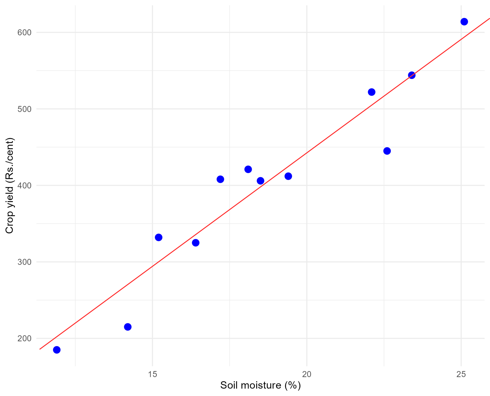
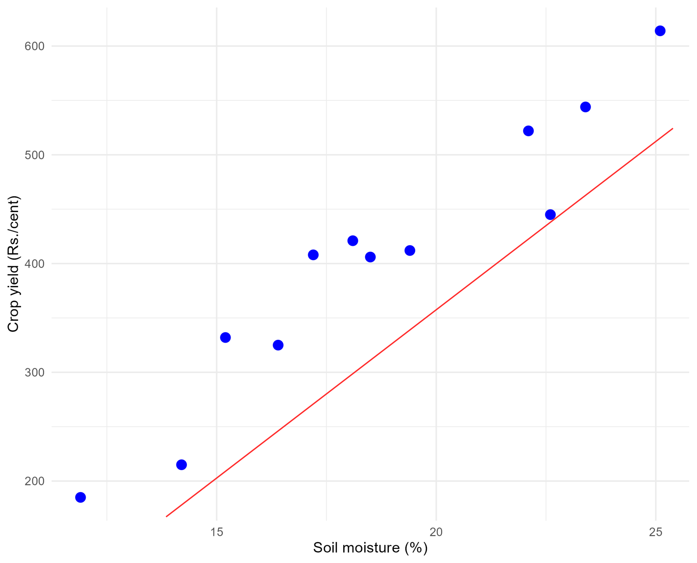
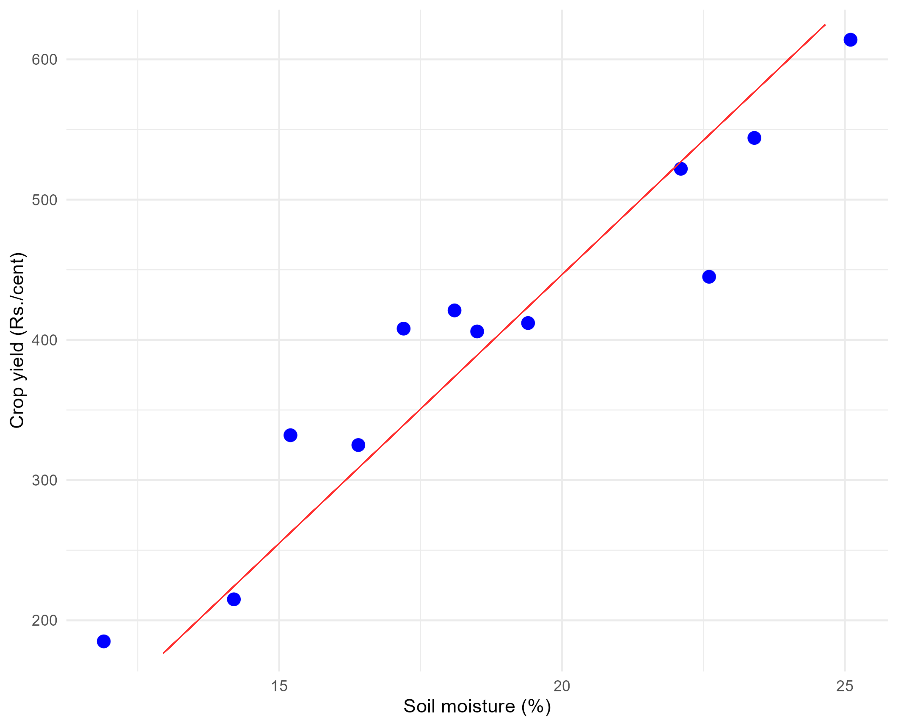
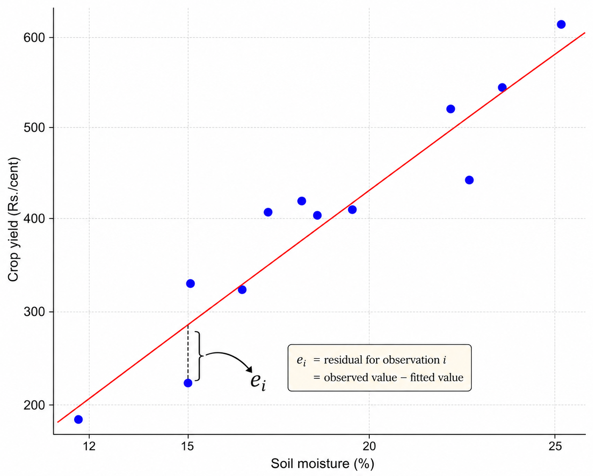
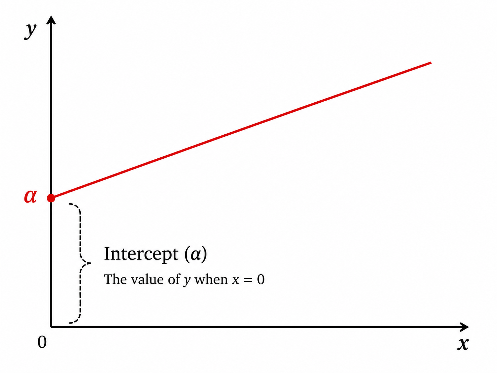
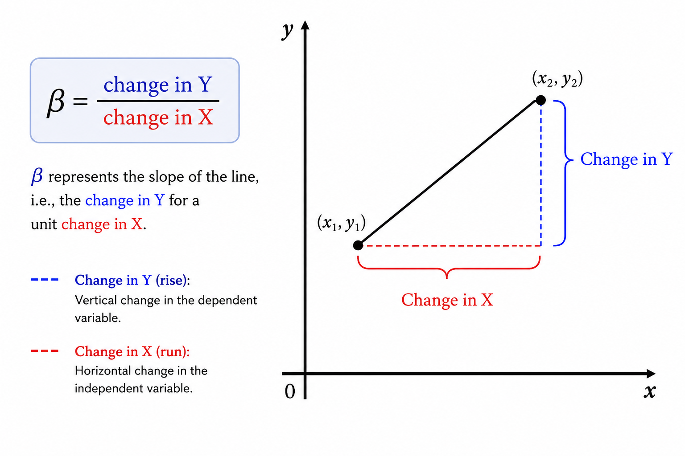
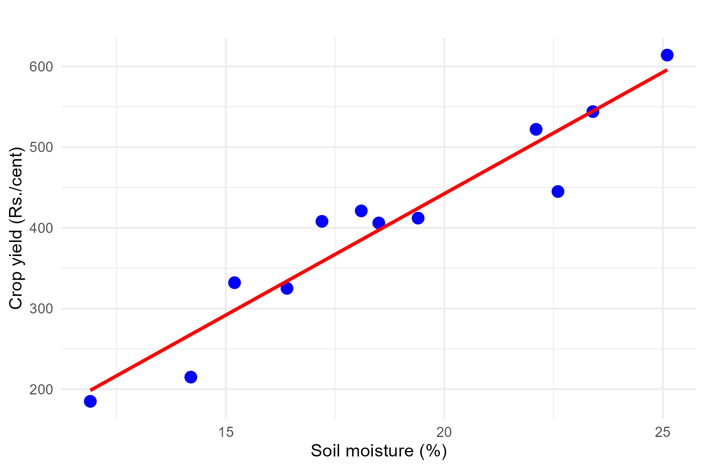
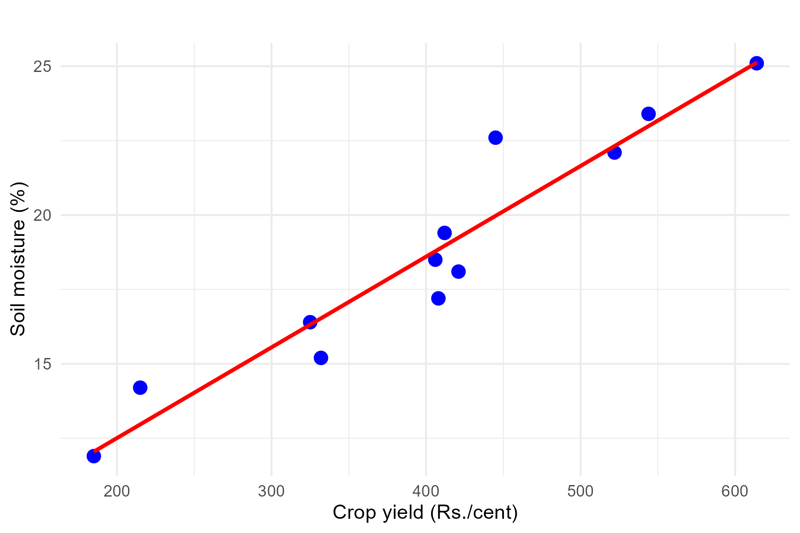
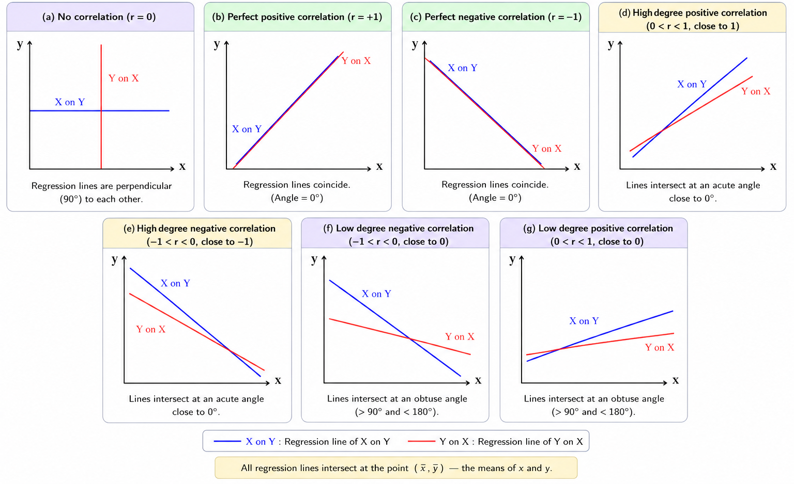

# Regression Analysis {#sec-regression}

Regression analysis is one of the most important tools in statistics, used to understand and quantify the relationships between variables. In essence, regression helps us answer questions such as: "How does a change in one variable (like fertilizer usage) affect another variable (like crop yield)?" It provides a mathematical framework to explore these relationships based on observed data [@Montgomery2021; @Draper1998].

Regression analysis involves two types of variables:

-   **Dependent variable** (*y*): The dependent variable (usually denoted as *y*) is the variable whose values are to be explained, predicted, or modeled based on one or more independent variables. It represents the outcome or response of interest and is assumed to depend on the values of the explanatory variables. For example, crop yield is often the dependent variable in agricultural experiments. In regression analysis, it is commonly referred to as the response variable, outcome variable, criterion variable, target variable, explained variable, regressand, or simply the response.

-   **Independent variable** (*x*): The independent variable (usually denoted as *x*) is a variable used to explain, predict, or account for variation in the dependent variable. It is considered the explanatory or predictor variable in the model and is used as an input to estimate the response. Examples include fertilizer dose, irrigation level, rainfall, temperature, or plant density. In regression analysis, it is also known as the predictor variable, explanatory variable, regressor, covariate, feature (in machine learning), input variable, or simply the predictor.

**Why use regression analysis?**

Regression analysis is particularly useful because it allows you to:

1.  **Quantify relationships**: It measures how strongly one or more independent variables are associated with the dependent variable.

2.  **Predict outcomes**: Once the relationship is understood, regression can be used to predict the dependent variable for new values of the independent variables.

3.  **Identify key factors**: It can highlight which variables have the most significant impact on the dependent variable, guiding decision-making.

4.  **Control for multiple factors**: By including several independent variables, regression helps isolate the effect of each variable while controlling for the others.

**Types of regression**

There are different types of regression techniques, depending on the nature of the data and the relationship between variables:

-   **Simple linear regression**: Examines the relationship between one independent variable and one dependent variable, assuming a straight-line relationship.

-   **Multiple linear regression**: An extension of simple linear regression, allowing for the analysis of the relationship between one dependent variable (*y*) and multiple independent variables (more than one *x*). It is used when the outcome is influenced by more than one factor.

-   **Nonlinear regression**: Deals with situations where the relationship between variables is not a straight line.

-   **Logistic regression**: Used when the dependent variable is categorical, such as predicting whether a plant will survive (yes or no) based on environmental factors.

**Practical applications**

Regression analysis has a wide range of applications across fields:

-   In **agriculture**, it can be used to study the effect of irrigation, soil nutrients, and weather on crop yield.

-   In **economics**, it helps analyse the impact of income, education, and employment on consumer behaviour.

-   In **medicine**, regression can predict health outcomes based on patient characteristics.

By the end of this chapter, you will learn how to perform regression analysis, interpret its results, and understand its assumptions and limitations.

## Simple linear regression

Regression can be simply defined as a technique of fitting a line of best fit to estimate the value of one variable on the basis of another variable. But what is a *line of best fit*? To understand this concept, consider the data presented in @tbl-corrdata of Example 8.2, which shows the average daily soil moisture content and the corresponding monetary yield from crops. This example helps visualise how the relationship between two variables *i.e.* soil moisture content (independent variable) and crop yield (dependent variable) can be captured by a line.

We can use regression analysis to answer the following questions: What will the crop yield be (in rupees) when soil moisture content is maintained at 20%? What is the functional form of the relationship between soil moisture content and monetary crop yield?

Refer to the scatter diagram of @tbl-corrdata in @fig-scattercorrdata. To represent the relationship between soil moisture content and monetary crop yield, we might attempt to draw a line through the data points, as illustrated in @fig-funcrel. However, as shown in @fig-funcrel, it is possible to draw numerous lines through the same set of data points. This raises the question: *which line is the best fit?*

::: {#fig-funcrel layout-ncol="2"}
{#fig-funcrel1 width="200px" height="150px"}

{#fig-funcrel2 width="200px" height="150px"}

{#fig-funcrel3 width="200px" height="150px"}

Possible lines drawn to show the functional relationship between soil moisture and yield
:::

The best fit line is the one that minimises the distances between the observed data points and the line itself. These distances are minimised collectively using a specific mathematical criterion. The regression technique provides a systematic approach to determine and draw this best fit line. Before going further into regression, it is essential to understand the concepts of **error** and **residual**, which play a critical role in determining the best fit line.

### Error and residual

In regression analysis, an **error** represents the difference between an observed value and the value based on the true regression line. True regression line here what we meant is the line that reflects the actual relationship between variables in the entire population. Since the true regression line is based on the whole population and is usually unknown, the error is a theoretical concept that cannot be directly measured.

A **residual** is the difference between an observed value and the value predicted by the regression line fitted from sample data. For a given data point, the residual is calculated as:

$$\text{Residual} = \text{Observed value} - \text{Predicted value}$$

Residuals are measurable because they are derived from the observed data and the fitted regression line. Unlike the errors which are theoretical deviations from the true underlying model, the residuals provide a practical estimate of these deviations, allowing us to assess the goodness of fit and identify any patterns or discrepancies in the model.

In essence, a residual serves as an estimate of the error. From @fig-residual, you can see the residual $e_i$ of the $i$th observation in a fitted regression line.

{#fig-residual fig-align="center" width="40%" style="text-align:center;"}

The distance of the $i$th observation ($e_i$) from the fitted line is the residual. The best fit line is obtained by minimising these distances, which is achieved using the **principle of least squares**, discussed in @sec-leastsquares. Before identifying the best fit line, it is useful to recall the concept of a straight line.

### Straight lines

A straight line is the simplest figure in geometry. The mathematical equation of a straight line is:

$$Y = \alpha + \beta X$$ {#eq-straightline}

A line has two important features: the **intercept** ($\alpha$) and the **slope** ($\beta$). The intercept $\alpha$ is the value of $Y$ at the point where the line crosses the $Y$-axis (i.e., when $X = 0$). The slope $\beta$ is a number that measures the steepness of the line — it is the change in $Y$ for a one-unit change in $X$. In regression, $\beta$ is called the **regression coefficient**, explained further in @sec-regressionbeta.

[Intercept and slope]{.underline}

::: {#fig-interceptandslope layout-ncol="2"}
{#fig-intercept width="200px" height="150px"}

{#fig-slope width="250px" height="150px"}

Intercept and slope of a straight line
:::

The values $\alpha$ and $\beta$ act as a fingerprint of a line, with these two values, we can uniquely identify any straight line. So our problem reduces to finding the line of best fit by estimating $\alpha$ and $\beta$ such that the error $e_i$ of each observation is minimised. For this, we use the *method of least squares*.

### Method of least squares {#sec-leastsquares}

Including the error term $e_i$, the equation of the regression line is:

$$y_i = \alpha + \beta x_i + e_i$$ {#eq-simpleregression}

where $e_i$ is the $i$th error term corresponding to $y_i$, for $i = 1, 2, \ldots, n$.

::: {.callout-important title="Note"}
One way to obtain the line of best fit is by estimating $\alpha$ and $\beta$ by minimising the error sum $\sum_{i=1}^{n} e_i$. However, by theorem, $\sum_{i=1}^{n} e_i = 0$ for any fitted line, so this does not uniquely determine $\alpha$ and $\beta$. Instead, we estimate $\alpha$ and $\beta$ by minimising $\sum_{i=1}^{n} e_i^2$. The term $\sum_{i=1}^{n} e_i^2$ is called the **error sum of squares**. Since we are minimising the sum of the squared error terms, this process is known as the **principle of least squares**.
:::

[**Principle of least squares**]{.underline}

The principle of least squares is the statistical method used to determine the line of best fit by minimising the sum of squares of the errors, i.e., minimising $\sum_{i=1}^{n} e_i^2$ [@Draper1998].

Starting from @eq-simpleregression:

$$e_i = y_i - (\alpha + \beta x_i)$$ {#eq-leastsq1}

$$e_i^2 = [y_i - (\alpha + \beta x_i)]^2$$ {#eq-leastsq2}

Let $E = \sum_{i=1}^{n} e_i^2$. 

$$E=\sum_{i=1}^{n} e_i^2 = \sum_{i=1}^{n} [y_i - (\alpha + \beta x_i)]^2$$ {#eq-leastsq3}

We want to minimise @eq-leastsq3 to estimate $\alpha$ and $\beta$. This is done by taking the partial derivative of $\sum_{i=1}^{n} e_i^2$ with respect to $\alpha$ and $\beta$ separately, and equating each to zero. Doing so yields two equations called the **normal equations**. Solving these normal equations gives the formulas for estimating $\alpha$ and $\beta$.

Differentiating with respect to $\alpha$ and equating to zero:

$$\frac{\partial E}{\partial \alpha} = \sum_{i=1}^n 2 \left[ y_i - (\alpha + \beta x_i) \right](-1) = 0$$ {#eq-lssquares1}

$$\Rightarrow -2 \sum_{i=1}^n \left[ y_i - \alpha - \beta x_i \right] = 0$$ {#eq-lssquares2}

Simplifying @eq-lssquares2:

$$\sum_{i=1}^n y_i - n\alpha - \beta \sum_{i=1}^n x_i = 0$$ {#eq-lssquares4}

Rearranging gives the **first normal equation**:

$$\sum_{i=1}^n y_i = n\alpha + \beta \sum_{i=1}^n x_i$$ {#eq-normaleq1}

Differentiating $E$ with respect to $\beta$ and equating to zero:

$$\frac{\partial E}{\partial \beta} = \sum_{i=1}^n 2 \left[ y_i - (\alpha + \beta x_i) \right](-x_i) = 0$$ {#eq-lssquares5}

$$\Rightarrow -2 \sum_{i=1}^n x_i \left[ y_i - \alpha - \beta x_i \right] = 0$$ {#eq-lssquares6}

Simplifying @eq-lssquares6:

$$\sum_{i=1}^n x_i y_i - \alpha \sum_{i=1}^n x_i - \beta \sum_{i=1}^n x_i^2 = 0$$ {#eq-lssquares8}

Rearranging gives the **second normal equation**:

$$\sum_{i=1}^n x_i y_i = \alpha \sum_{i=1}^n x_i + \beta \sum_{i=1}^n x_i^2$$ {#eq-normaleq2}

Solving normal equations @eq-normaleq1 and @eq-normaleq2 together gives the formulas for estimating $\alpha$ and $\beta$. Since $\alpha$ and $\beta$ are population parameters and are usually unknown, we estimate them from sample data. The estimated values are denoted $\hat{\alpha}$ and $\hat{\beta}$ (pronounced "alpha hat" and "beta hat"), and are used as approximations of the true population parameters.  

**Solving for $\hat{\beta}$**

From the first normal equation (@eq-normaleq1), divide both sides by $n$:

$$\frac{\sum_{i=1}^n y_i}{n} = \alpha + \beta \frac{\sum_{i=1}^n x_i}{n}$$  
$$\overline{y} = \alpha + \beta \overline{x}$$ {#eq-solve1}  
This gives us:

$$\alpha = \overline{y} - \beta \overline{x}$$ {#eq-solve2}

Substitute @eq-solve2 into the second normal equation (@eq-normaleq2):

$$\sum_{i=1}^n x_i y_i = (\overline{y} - \beta \overline{x})\sum_{i=1}^n x_i + \beta \sum_{i=1}^n x_i^2$$  
$$\sum_{i=1}^n x_i y_i = \overline{y}\sum_{i=1}^n x_i - \beta \overline{x}\sum_{i=1}^n x_i + \beta \sum_{i=1}^n x_i^2$$

Collecting the $\beta$ terms on the right:

$$\sum_{i=1}^n x_i y_i - \overline{y}\sum_{i=1}^n x_i = \beta \left(\sum_{i=1}^n x_i^2 - \overline{x}\sum_{i=1}^n x_i\right)$$
Since $\overline{x} = \frac{\sum x_i}{n}$, we have $\overline{x} \sum_{i=1}^n x_i = \frac{\left(\sum_{i=1}^n x_i\right)^2}{n}$. Similarly, $\overline{y} \sum_{i=1}^n x_i = \frac{\sum_{i=1}^n y_i \sum_{i=1}^n x_i}{n}$. Substituting:

$$\sum_{i=1}^n x_i y_i - \frac{\sum_{i=1}^n y_i \sum_{i=1}^n x_i}{n} = \beta \left(\sum_{i=1}^n x_i^2 - \frac{\left(\sum_{i=1}^n x_i\right)^2}{n}\right)$$
Solving for $\beta$:

$$\hat{\beta} = \frac{\sum_{i=1}^n x_i y_i - \dfrac{\sum_{i=1}^n x_i \sum_{i=1}^n y_i}{n}}{\sum_{i=1}^n x_i^2 - \dfrac{\left(\sum_{i=1}^n x_i\right)^2}{n}}$$ {#eq-regeqn3}

This is the formula for $\hat{\beta}$ used for hand calculations. It can be written more compactly by recognising that:

$$\sum_{i=1}^n x_i y_i - \frac{\sum_{i=1}^n x_i \sum_{i=1}^n y_i}{n} = n \cdot cov(x, y)$$

$$\sum_{i=1}^n x_i^2 - \frac{\left(\sum_{i=1}^n x_i\right)^2}{n} = n \cdot var(x)$$
Therefore:

$$\hat{\beta} = \frac{cov(x,y)}{var(x)}$$ {#eq-regeqn4}  
**Solving for $\hat{\alpha}$**

Once $\hat{\beta}$ is known, the intercept is obtained directly from @eq-solve2:

$$\hat{\alpha} = \overline{y} - \hat{\beta}\,\overline{x}$$ {#eq-regeqn5}

where $\overline{y}$ = mean of $y$ and $\overline{x}$ = mean of $x$.

::: {.callout-important title="Note"}
Once the estimates $\hat{\alpha}$ and $\hat{\beta}$ are obtained using @eq-regeqn4 and @eq-regeqn5, the estimated regression line can be written as:

$$\hat{y} = \hat{\alpha} + \hat{\beta}\, x$$ {#eq-regestimate}

Note that the predicted value of $y$ is written as $\hat{y}$ (y-hat) to distinguish it from the observed value $y$. Also note that the regression line always passes through the point $(\overline{x},\, \overline{y})$, which can be verified by substituting $x = \overline{x}$ into @eq-regestimate.
:::

### Regression coefficient {#sec-regressionbeta}

The regression coefficient $\beta$ in linear regression represents the slope of the regression line. It quantifies the relationship between the independent variable ($x$) and the dependent variable ($y$). Specifically, $\hat{\beta}$ indicates the expected change in $y$ for a one-unit increase in $x$, when all other factors are held constant [@Montgomery2021].

Regression coefficients can take any real value from $-\infty$ to $+\infty$. A positive $\hat{\beta}$ implies a direct relationship (as $x$ increases, $y$ increases), while a negative $\hat{\beta}$ implies an inverse relationship (as $x$ increases, $y$ decreases). A coefficient of zero suggests no linear relationship between the variables.

The formula for $\hat{\beta}$ is obtained by solving normal equations @eq-normaleq1 and @eq-normaleq2, and is given by @eq-regeqn3, which can be used for hand calculations:

$$\hat{\beta}=\frac{\sum_{i = 1}^{n}{y_{i}x_{i} - \frac{\sum_{i = 1}^{n}{y_{i}\sum_{i = 1}^{n}x_{i}}}{n}}}{\sum_{i = 1}^{n}x_{i}^{2} - \frac{\left( \sum_{i = 1}^{n}x_{i} \right)^{2}}{n}}$$ {#eq-regeqn3}

@eq-regeqn3 can be written more compactly as:

$$\hat{\beta} = \frac{cov(x,y)}{var(x)}$$ {#eq-regeqn4}

### Intercept

The intercept $\alpha$ represents the value of the dependent variable $y$ when the independent variable $x$ equals zero. It is the point at which the regression line crosses the $y$-axis, and provides a baseline value for $y$ before any influence from $x$ is considered.

The intercept can take any real value ($-\infty$ to $+\infty$). Its practical interpretation depends on the specific context. In many agricultural datasets, $x = 0$ may not lie within the range of observed data, in which case the intercept may not carry a meaningful practical interpretation.

The formula for $\hat{\alpha}$ is obtained by solving normal equations @eq-normaleq1 and @eq-normaleq2:

$$\hat{\alpha} = \overline{y} - \hat{\beta}\,\overline{x}$$ {#eq-regeqn5}

where $\overline{y}$ = mean of $y$ and $\overline{x}$ = mean of $x$.  

### Assumptions

For the results of a regression analysis to be reliable and meaningful, certain underlying assumptions must be met. These ensure that the estimates are accurate, predictions are unbiased, and conclusions drawn from the model are valid [@Montgomery2021; @Draper1998].

1.  **Linearity**\
    The relationship between the independent variable(s) and the dependent variable is linear — changes in $y$ are proportional to changes in $x$.

2.  **Independence**\
    The observations in the dataset are independent of each other, and the residuals (errors) are also independent.

3.  **Homoscedasticity**\
    The variance of the residuals is constant across all levels of the independent variable(s). The spread of the residuals should remain consistent and not show patterns of increasing or decreasing variance.

4.  **Normality of residuals**\
    The residuals are normally distributed. This is particularly important for hypothesis testing and constructing confidence intervals. The normality assumption does not strongly influence the estimation of regression coefficients themselves, but it matters for inference.

5.  **No multicollinearity**\
    In the case of multiple regression, the independent variables should not be highly correlated with each other. Multicollinearity can distort the estimates of regression coefficients and make them difficult to interpret.

6.  **No autocorrelation**\
    There should be no autocorrelation in the residuals — the residual of one observation should not be correlated with the residual of another.

7.  **Correct model specification**\
    The model should include all relevant variables and exclude irrelevant ones. The functional form of the relationship between variables should be correctly specified.

Violations of these assumptions can lead to biased, inconsistent, or inefficient estimates, affecting the validity of the regression analysis.

::: {.callout-important title="Note"}
The essence of the assumptions in linear regression can be summarised as $e \sim \text{i.i.d.}(0, \sigma^2)$. This denotes that the errors are *independent and identically distributed (i.i.d.)*, with a mean of zero and a constant variance $\sigma^2$.

-   **Independence** ensures that the error for one observation does not influence the error for another.
-   **Identically distributed** means all errors are drawn from the same probability distribution.
-   **Mean of zero** ensures that errors do not introduce systematic bias into the model's predictions.
-   **Constant variance** (homoscedasticity) means the errors maintain a consistent level of variability across all values of the independent variable(s).
:::

## Two lines of regression

Consider the data presented in @tbl-corrdata, showing average daily soil moisture content and the corresponding monetary crop yield from Example 8.2 of @sec-scatterdiag. For any two variables $x$ and $y$, we can draw two lines of regression :- one by treating $x$ as independent and $y$ as dependent, and the other by interchanging their roles as shown in @fig-twolines.

::: {#fig-twolines layout-ncol="2"}
{#fig-yonx_plot width="200px" height="150px"}

{#fig-xony_plot width="200px" height="150px"}

Two lines of regression
:::

From @fig-twolines it is clear that two distinct lines of regression are possible: the regression of $y$ on $x$, and the regression of $x$ on $y$.

[Regression of $y$ on $x$]{.underline}

When $y$ is the dependent variable and $x$ is the independent variable, the regression equation is:

$$y = \alpha + \beta_{yx}\, x$$ {#eq-yonx}

This is used to predict the unknown value of $y$ when the value of $x$ is known. The regression coefficient here is denoted $\beta_{yx}$ and is obtained using:

$$\beta_{yx} = \frac{cov(x,y)}{var(x)}$$ {#eq-betayonx}

[Regression of $x$ on $y$]{.underline}

When $x$ is the dependent variable and $y$ is the independent variable, the regression equation is:

$$x = \alpha_1 + \beta_{xy}\, y$$ {#eq-xony}

This is used to predict the unknown value of $x$ when the value of $y$ is known. The regression coefficient here is denoted $\beta_{xy}$ and is obtained using:

$$\beta_{xy} = \frac{cov(x,y)}{var(y)}$$ {#eq-betaxony}

As seen from @eq-betayonx and @eq-betaxony, the two regression coefficients are different. It is the experimenter's responsibility to choose which variable is treated as dependent and which as independent, based on the objective of the study. In Example 8.2, predicting soil moisture based on monetary crop yield may not be meaningful in practice, the choice of dependent and independent variable must reflect the scientific question being asked.

### Properties of Regression Coefficients

1.  **Relationship with the correlation coefficient**

    The product of the two regression coefficients equals the square of the correlation coefficient:

    $$\beta_{yx}\beta_{xy}=r_{xy}^{\,2}$$

    Hence,

    $$|r_{xy}|=\sqrt{\beta_{yx}\beta_{xy}}$$

    Since the regression coefficients always have the same sign,

    $$
    r_{xy}=
       \begin{cases}
       \sqrt{\beta_{yx}\beta_{xy}}, & \text{if } \beta_{yx},\beta_{xy}>0,\\[4pt]
       -\sqrt{\beta_{yx}\beta_{xy}}, & \text{if } \beta_{yx},\beta_{xy}<0.
       \end{cases}
    $$

2.  **Both regression coefficients have the same sign**

    The two regression coefficients always possess the same sign.

    -   If $\beta_{yx}>0$, then $\beta_{xy}>0$, and the correlation coefficient is positive.
    -   If $\beta_{yx}<0$, then $\beta_{xy}<0$, and the correlation coefficient is negative.
    -   If one regression coefficient is zero, the other is also zero, implying $r_{xy}=0$.

3.  **Regression coefficients are independent of change of origin but not of scale**

    -   Adding or subtracting a constant from either variable (**change of origin**) does not affect the regression coefficients (slopes), although it changes the intercepts.
    -   Multiplying or dividing a variable by a constant (**change of scale**) changes the regression coefficients.

    If

    $$
    X=\frac{x-a}{h},\qquad
    Y=\frac{y-b}{k},
    $$

    then

    $$
    \beta_{YX}=\frac{h}{k}\beta_{yx},
    \qquad
    \beta_{XY}=\frac{k}{h}\beta_{xy}.
    $$

4.  **Relationship with unity**

    Since

    $$\beta_{yx}\beta_{xy}=r^2\le1,$$

    -   if one regression coefficient is greater than unity, the other must be less than unity;
    -   both regression coefficients may be less than one;
    -   both regression coefficients cannot exceed one simultaneously.

5.  **Regression coefficients are not bounded**

    Unlike the correlation coefficient, whose value lies between $-1$ and $+1$, regression coefficients can take any real value. Thus,

    $$-\infty<\beta<+\infty.$$

6.  **Regression coefficients in terms of correlation and standard deviations**

    The regression coefficients are related to the correlation coefficient and the standard deviations by

    $$
    \beta_{yx}=r\frac{\sigma_y}{\sigma_x},
    \qquad
    \beta_{xy}=r\frac{\sigma_x}{\sigma_y}.
    $$

    Thus, the magnitude of a regression coefficient depends on both the strength of association and the relative variability of the two variables.

7.  **Independence property**

    If the variables $x$ and $y$ are statistically independent,

    $$r_{xy}=0,$$

    and therefore

    $$\beta_{yx}=\beta_{xy}=0.$$

    In this case, neither variable can be used to predict the other through a linear regression model.

8.  **Perfect correlation**

    If the variables are perfectly correlated ($r=\pm1$),

    $$\beta_{yx}\beta_{xy}=1.$$

    The two regression lines coincide, indicating a perfect linear relationship between the variables.

### Properties of Regression Lines

1.  **Regression lines are the lines of best fit**

    Each regression line is obtained using the **least squares principle**, which minimises the sum of the squared deviations between the observed and predicted values.

    -   The regression line of $y$ on $x$ minimises the sum of squared **vertical** deviations.
    -   The regression line of $x$ on $y$ minimises the sum of squared **horizontal** deviations.

2.  **Both regression lines pass through the point of means**

    The regression lines of $y$ on $x$ and $x$ on $y$ always intersect at the point

    $$(\bar{x},\,\bar{y}),$$

    where $\bar{x}$ and $\bar{y}$ are the arithmetic means of the variables.

3.  **The position of the regression lines depends on the correlation coefficient**

    The angle between the two regression lines depends on the magnitude of the correlation coefficient ($r$).

    -   If $|r|=1$, the two regression lines coincide, indicating a perfect linear relationship.
    -   If $r=0$, the regression lines are perpendicular to each other, indicating no linear relationship.
    -   For $0<|r|<1$, the two regression lines intersect at an angle between $0^\circ$ and $90^\circ$.

    The position and angle of the regression lines therefore reflect the strength of the linear relationship between the variables (see @fig-twolines2).

4.  **Regression lines are unique**

    For a given dataset, there is only one regression line of $y$ on $x$ and one regression line of $x$ on $y$.

5.  **The two regression lines are identical only under perfect correlation**

    The regression lines coincide only when

    $$r=\pm1,$$

    indicating a perfect positive or perfect negative linear relationship. Otherwise, they are distinct.

6.  **Prediction depends on the direction of regression**

    The regression line of $y$ on $x$ is used to predict the value of $y$ from a given value of $x$, whereas the regression line of $x$ on $y$ is used to predict the value of $x$ from a given value of $y$. These two regression equations are generally different unless $|r|=1$.  
    
    
{#fig-twolines2 width="450px" height="300px"}


## Uses of regression  

-   **Prediction**\
    Regression is used to predict the value of a dependent variable ($y$) based on one or more independent variables ($x$). Examples in agricultural research include:
    -   Predicting crop yield based on weather parameters such as temperature, rainfall, and humidity.
    -   Estimating soil nutrient levels using remote sensing data or environmental variables.
    -   Forecasting pest or disease outbreaks based on climatic and ecological conditions.
-   **Identifying the strength of relationships**\
    Regression helps quantify the strength of the relationship between variables, which is essential for identifying influential factors in agricultural research. Examples include:
    -   Determining the effect of fertilizer dosage on crop yield.
    -   Analysing the relationship between irrigation frequency and plant growth.
    -   Understanding the impact of livestock feed composition on milk production.
-   **Forecasting effects of changes**\
    Regression models allow researchers to evaluate how changes in one or more independent variables affect the dependent variable. For example:
    -   Assessing how seed quality impacts overall harvest productivity.
    -   Analysing the effects of varying water availability on crop output in drought-prone areas.
    -   Estimating the economic benefits of adopting precision farming techniques.
-   **Predicting trends and future values**\
    Regression is valuable for modelling trends and forecasting future values. Applications include:
    -   Predicting future crop yields under different climate change scenarios.
    -   Estimating long-term price trends for agricultural commodities such as rice, wheat, or coffee.
    -   Forecasting the adoption rates of new agricultural technologies among farmers.

::: {.callout-important title="Note"}
**Multiple regression** is an extension of simple linear regression that models the relationship between a dependent variable and two or more independent variables [@Montgomery2021]. It allows researchers to account for the combined effect of multiple factors on an outcome. For instance, crop yield can be predicted based on a combination of soil nutrients, rainfall, temperature, and fertilizer application.

In a multiple regression model, the relationship between the dependent variable $y$ and independent variables $x_1, x_2, \ldots, x_k$ is expressed as:

$$y = \alpha + \beta_1 x_1 + \beta_2 x_2 + \cdots + \beta_k x_k + e$$ {#eq-multireg}

Where $y$ is the dependent variable; $\alpha$ is the intercept; $\beta_1, \beta_2, \ldots, \beta_k$ are the coefficients for each independent variable; $x_1, x_2, \ldots, x_k$ are the independent variables; and $e$ is the error term.
:::

**Example 9.1**: Using the data in @tbl-corrdata (average daily soil moisture content and monetary crop yield from Example 8.2 of @sec-scatterdiag), answer the following:

1.  What is the functional form of the relationship between soil moisture and monetary crop yield?
2.  What will be the estimated monetary crop yield when average daily soil moisture is maintained at 20%?

**Solution 9.1**:

Step 1: Fit a model treating monetary crop yield as the dependent variable ($y$) and average soil moisture as the independent variable ($x$). Fitting a model means estimating $\hat{\beta}$ using @eq-regeqn4 and $\hat{\alpha}$ using @eq-regeqn5.

Step 2: Substitute $x = 20$ into the fitted equation to obtain the predicted crop yield.

```{r}
#| label: tbl-regressioncalc
#| tbl-cap: "Calculation table for regression"
#| echo: false
#| warning: false
#| results: asis

library(knitr)
library(kableExtra)
dt <- read.csv("csv/Book12.csv")
colnames(dt) <- c("Sl No.", "Soil moisture ($x$)", "Crop yield in Rs ($y$)",
                  "$(x_{i}-\\overline{x})$", "$(y_{i}-\\overline{y})$",
                  "$(x_{i}-\\overline{x})(y_{i}-\\overline{y})$",
                  "$(x_{i}-\\overline{x})^2$")
dt$`Sl No.` <- as.character(dt$`Sl No.`)
dt %>%
  kbl(booktabs = TRUE, align = "c", escape = FALSE) %>%
  kable_classic(full_width = FALSE, html_font = "Georgia") %>%
  kable_styling(
    full_width = FALSE,
    position = "center",
    bootstrap_options = "bordered"
  )
```

$n = 12$

$$\overline{x} = \frac{224.1}{12} = 18.675$$

$$\overline{y} = \frac{4829}{12} = 402.416$$

$$cov(x,y) = \frac{1}{n}\sum_{i=1}^{n}(x_i - \overline{x})(y_i - \overline{y}) = \frac{5325.03}{12} = 443.752$$

$$var(x) = \frac{1}{n}\sum_{i=1}^{n}(x_i - \overline{x})^2 = \frac{176.983}{12} = 14.749$$

Using @eq-regeqn4:

$$\hat{\beta} = \frac{cov(x,y)}{var(x)} = \frac{443.752}{14.749} = 30.088$$

Using @eq-regeqn5:

$$\hat{\alpha} = \overline{y} - \hat{\beta}\,\overline{x} = 402.416 - 30.088 \times 18.675 = -159.477$$

The estimated regression equation is therefore:

$$\hat{y} = -159.477 + 30.088\, x$$

$$\text{Crop yield (Rs)} = -159.477 + 30.088 \times \text{(soil moisture \%)}$$

For a soil moisture content of 20% ($x = 20$):

$$\hat{y} = -159.477 + 30.088 \times 20 = 442.28$$

The predicted monetary crop yield at an average soil moisture of 20% is **Rs 442.28**.

## Correlation and regression

Correlation and regression are closely related concepts in statistics, often used together to explore and model relationships between variables. While both techniques examine how variables relate to one another, they differ in purpose, interpretation, and methodology.

Correlation focuses on measuring the strength and direction of an association between two variables, without assuming causation. Regression goes a step further by modelling the relationship, enabling predictions of one variable based on another. @tbl-corrndregression below provides a comparison of the two approaches.

| **Aspect** | **Correlation** | **Regression** |
|:---|:---|:---|
| **Definition** | A statistical measure that quantifies the strength and direction of the linear relationship between two variables. | A statistical technique that models the relationship between a dependent variable and one or more independent variables for explanation or prediction. |
| **Primary objective** | To measure the degree of association between variables. | To estimate or predict the value of the dependent variable from the independent variable(s). |
| **Nature of relationship** | Describes association only. | Describes the functional relationship between variables through a fitted mathematical model. |
| **Causation** | Does not imply causation. | Does not establish causation by itself; causal interpretation requires appropriate study design and valid assumptions. |
| **Variables involved** | Treats both variables equally; no distinction between dependent and independent variables. | Clearly distinguishes between the dependent (response) variable and the independent (predictor) variable(s). |
| **Symmetry** | Symmetric: $r_{xy}=r_{yx}$. | Asymmetric: the regression of $y$ on $x$ differs from the regression of $x$ on $y$. |
| **Equation** | Summarised by the correlation coefficient, e.g., $r=\dfrac{\operatorname{Cov}(x,y)}{\sigma_x\sigma_y}$. | Produces a regression equation, e.g., $\hat{y}=\hat{\alpha}+\hat{\beta}x$. |
| **Output** | Produces a single correlation coefficient ($r$). | Produces regression coefficients (intercept and slope), fitted values, residuals, and prediction equations. |
| **Range** | The correlation coefficient lies between $-1$ and $+1$. | Regression coefficients are not bounded and may take any real value ($-\infty$ to $+\infty$). |
| **Units** | Dimensionless (unit-free). | Regression coefficients depend on the units of measurement of the variables. |
| **Effect of interchanging variables** | Unchanged; the value of $r$ remains the same. | Changes the regression equation and regression coefficients. |
| **Prediction** | Cannot be used directly for prediction. | Specifically designed for prediction and estimation of the dependent variable. |
| **Applications** | Assessing the strength and direction of relationships between variables. | Prediction, estimation, trend analysis, forecasting, and quantifying the effect of explanatory variables. |

: Correlation versus regression {#tbl-corrndregression .bordered}

::: {.callout-caution title="Historical Insights"}
**Regression and the Study of Heights**

The story of regression begins with Sir Francis Galton's groundbreaking work on heredity in the late nineteenth century. While studying the heights of parents and their children, Galton noticed a fascinating pattern: tall parents tended to have slightly shorter children, and shorter parents tended to have slightly taller children. He called this phenomenon **"regression toward the mean"** - the offspring's heights seemed to move closer to the population average, not further away from it. This observation not only introduced the term "regression" into statistics but also inspired the development of tools for studying relationships between variables. [@Galton1886]

Galton's work was later placed on a firm mathematical foundation by Karl Pearson, who formalised the method of least squares in the context of regression and introduced the product-moment correlation coefficient - the same $r$ we use today. [@Pearson1896] Together, their contributions laid the foundation for modern regression analysis, which remains an essential technique in fields ranging from agriculture to space exploration.
:::

::: {.callout-tip title="Quotes to Inspire"}
**"Statistics is the art of never having to say you're wrong."- Robert P. Abelson**
:::
