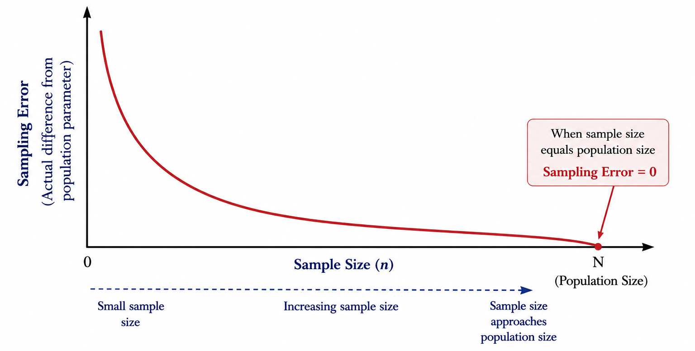
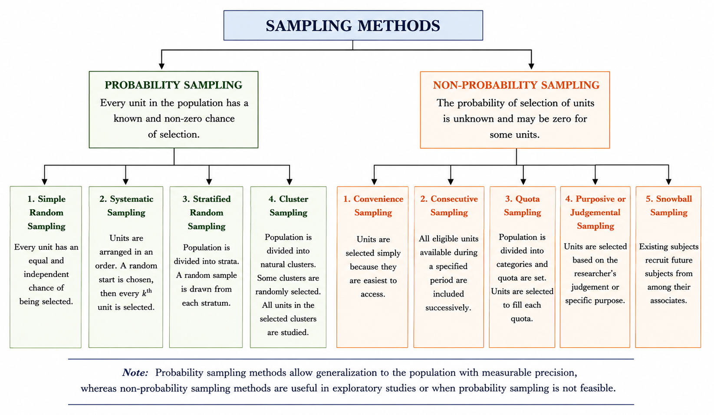
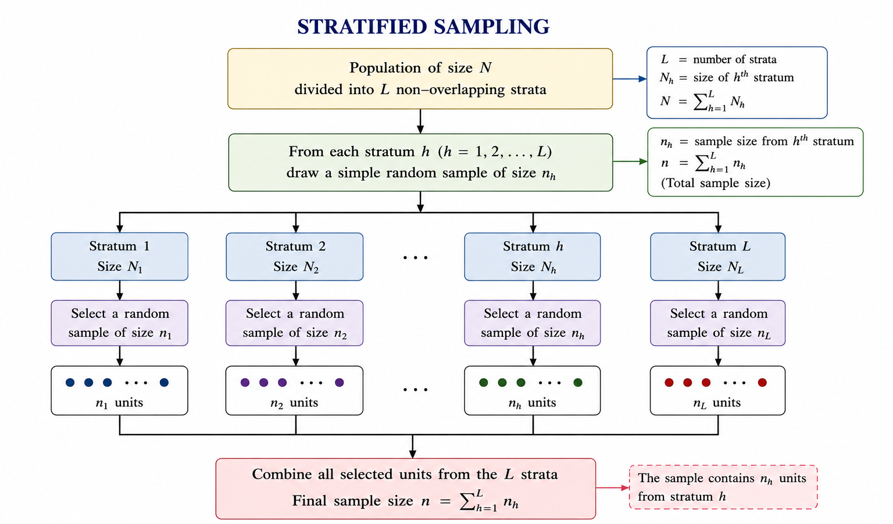
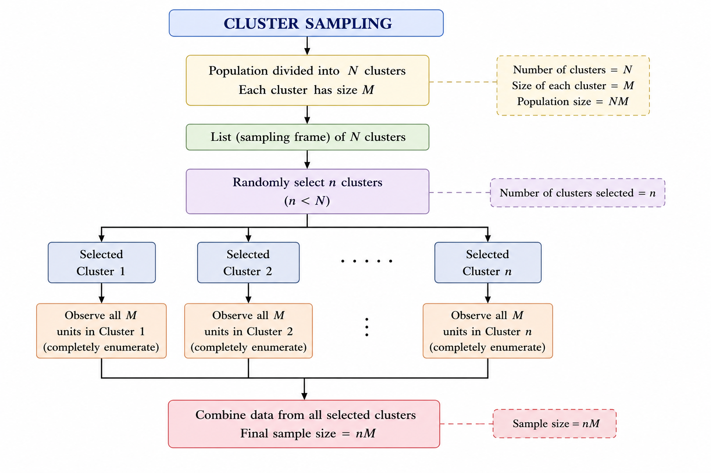

# Sample survey

Before data can be analysed, they must first be collected in a systematic and reliable manner. The quality of any statistical analysis depends greatly on the quality of the data collected. A poorly designed survey or an unrepresentative sample can lead to misleading conclusions, regardless of the statistical methods used.

In many situations, collecting information from every unit in a population is impractical because it is time-consuming, expensive, or impossible. Instead, information is collected from a **sample**, which is a subset of the population. The process of selecting this subset is called **sampling**, and the systematic collection of information from the sample is known as a **sample survey**.

Sample surveys are widely used in agriculture, government, industry, business, and social sciences to obtain reliable information for research, planning, and decision-making. This chapter introduces the basic concepts of sampling and sample surveys, along with the methods used to select representative samples from a population.

## When are sample surveys used? {.unnumbered}

Sample surveys are particularly useful in the following situations:

1.  When results are required with maximum accuracy within a fixed budget and by enumerating the minimum number of units.
2.  When the units under investigation show considerable variation for the characteristic being studied.
3.  When a total count of the population is not possible, or when the method of measurement requires destruction of the unit (e.g., testing seed germination).
4.  When the scope of the investigation is very wide and the population is not completely known.
5.  When time, money, and other resources are limited.

## Basic terminology

**Population** is the complete collection of individuals, objects, or units about which information is required. The population is defined according to the objective of the study. For example, all rice fields in a district, all households in a village, or all dairy cattle in a state may constitute a population. The total number of units in a population is called the **population size** and is denoted by ($N$). A population may be **finite** (for example, all coconut trees in a plantation, which can in principle be counted) or **infinite** (for example, all possible bacterial colonies that could grow on a culture medium).

**Sample** is a subset of the population selected for the study. Information obtained from the sample is used to draw conclusions about the entire population. A good sample is one that is **representative**, meaning it reflects the important characteristics of the population from which it is drawn. For example, if we want to know the average milk yield of cows in a village, we study a sample of cows rather than every cow, and we use the sample result to make a statement about all the cows.

A **sampling unit** is the basic unit selected from the population for inclusion in the sample and on which observations or measurements are made. The population is regarded as being made up of these sampling units, which must be clearly defined and must not overlap. The nature of the sampling unit depends on the objective of the study. For example, in a crop-cutting survey, a field or a small plot marked within a field may be the sampling unit; in a household survey, a household is the sampling unit; in a livestock survey, an individual animal may be the sampling unit; and in a farmer adoption study, an individual farmer may be the sampling unit.

**Census** is the complete enumeration of every unit in the population. In a census, data are collected from all population units rather than from a sample. For example, the counting of every single farmer in a village to record his land holding is a census, whereas recording the land holding of only 50 selected farmers is a sample survey. A census gives exact information but is costly and time-consuming, and is often impossible when the population is very large or when measurement destroys the unit.

**Sample size** is the total number of sampling units included in the sample. It is usually denoted by ($n$). The ratio $\dfrac{n}{N}$ is called the **sampling fraction**. For example, if 50 farmers are selected from a village of 500 farmers, the sample size is $n = 50$ and the sampling fraction is $\dfrac{50}{500} = 0.1$, or 10%.

**Sampling design (Sampling method)** is the procedure used to select units from the population. A good sampling design ensures that the selected sample is representative of the population, allowing reliable conclusions to be drawn. The choice of sampling design depends on the objective of the study, the nature of the population, and the resources available.

**Sampling frame** is the complete list or source that identifies all the sampling units in the population from which the sample is selected. It should include every unit in the target population, with no omissions or duplication. For example, if the population consists of all farmers in a village, the voters' list, farmer registry, or village household register can serve as the sampling frame, provided it includes all farmers. An incomplete or outdated frame (for example, one that leaves out newly settled farmers) leads to a biased sample, because some units of the population never get a chance to be selected.

**Parameter** is a numerical constant that describes a characteristic of the entire population. Examples include the population mean ($\mu$), population variance ($\sigma^2$), and population proportion ($P$). Population parameters are usually unknown, and the main purpose of a sample survey is to estimate them. For example, the true average yield of paddy in a district is a parameter.

**Statistic** is a numerical measure calculated from sample data. Examples include the sample mean ($\bar{x}$), sample variance ($s^2$), and sample proportion ($\hat{p}$). Statistics are used to estimate the corresponding population parameters. Since a statistic changes from one sample to another, it is itself a random variable.

**Estimator** is a statistic used to estimate an unknown population parameter from sample data. It is a function of the sample observations and produces an **estimate** of the parameter. For example, the sample mean $\bar{x}$ is an estimator of the population mean $\mu$; the particular value it takes for a given sample, say 38 kg, is an estimate.

**Expectation (Expected Value)** of an estimator is the long-run average of the values that the estimator would take if the same sampling procedure were repeated a very large number of times. It is denoted by $E(\cdot)$.\
Suppose the average yield of a crop in a population is 40 kg per plot. If many random samples of the same size are drawn and the sample mean is calculated for each sample, the sample means will vary from one sample to another. However, the average of all these sample means will be 40 kg per plot. Thus, $E(\bar{X})=\mu=40$.

An estimator is said to be an **unbiased estimator** of a population parameter if its expected value is equal to the true value of that parameter. Thus, if $t$ is an estimator of the parameter $\theta$, then $t$ is unbiased if $E(t)=\theta$. Unbiasedness means that, although a single sample estimate may be higher or lower than the true value, on average the estimator neither overestimates nor underestimates the parameter. For example, the sample mean $\bar{x}$ is an unbiased estimator of the population mean $\mu$.

**Sampling Error** is the difference between a sample estimate and the corresponding true population value that arises because only a sample, and not the entire population, is observed. Sampling error is a natural consequence of sampling and decreases as the sample becomes more representative of the population.\
Sampling errors arise primarily due to: (i) faulty selection of samples (ii) substitution of sampling units already included in the study (iii) faulty demarcation of sampling units (iv) improper choice of statistical methods for estimating parameters. As long as sampling errors are sufficiently small, the sampling method can be reliably used for studying a population. Sampling errors are absent in a complete census. Increasing the sample size decreases the sampling error.

```{r echo=FALSE, out.width="70%", fig.align='center'}
#| label: fig-samperror
#| fig-cap: "Relationship between sample size and sampling error. As the sample size approaches the population size, the sampling error approaches zero."

```

**Non-sampling error** are the errors other than sampling errors - such as those arising through non-response, incompleteness, or inaccuracy in recording. Data obtained from a census are free from sampling errors but are still subject to non-sampling errors. Sample survey data are subject to both types of errors.

Non-sampling errors can occur due to: (i) faulty planning and definitions - inadequate data specifications, errors in locating units, lack of trained personnel; (ii) response errors - misunderstanding of questions, or bias on the part of the interviewer or respondent; (iii) non-response bias - where full information is not obtained; and (iv) errors in coverage, compilation, and publication.  

## Confidence Interval

A confidence interval (CI) is an interval estimate of a population parameter, such as a population mean or proportion, calculated from sample data. Instead of providing a single estimate (point estimate), a confidence interval gives a range of plausible values within which the true population parameter is expected to lie.

The confidence level of the interval is expressed as ($100(1 - \alpha)$%), where $\alpha$ is the level of significance.

For example:

* If ($\alpha$ = 0.05), the confidence level is 95%.
* If ($\alpha$ = 0.01), the confidence level is 99%.

A 95% confidence interval means that if the same sampling procedure were repeated a very large number of times and a confidence interval were calculated from each sample using the same method, approximately 95% of those intervals would contain the true population parameter, while about 5% would not. Likewise, a 99% confidence interval would contain the true population parameter in approximately 99% of repeated samples.

It is important to note that the confidence level refers to the long-run performance of the method used to construct the interval, rather than to any single interval. Once a confidence interval has been calculated from a sample, the true population parameter either lies within that interval or it does not; the confidence level does not represent the probability that the parameter is inside that particular interval.

::: {.callout-note title="Common Misconception"}
A common misconception is that a 95% confidence interval means there is a 95% probability that the true population parameter lies within the calculated interval. This interpretation is incorrect. The correct interpretation is that the method used to construct the interval captures the true population parameter in about 95% of repeated random samples. Similarly, it does not mean that if an experiment is repeated exactly 100 times, the same conclusion will be obtained exactly 95 times.  
:::  

## Principal Steps in a Sample Survey

1.  Define the objectives of the survey.

2.  Define the target population to be studied.

3.  Prepare the sampling frame and identify the sampling units.

4.  Identify the information (data) to be collected.

5.  Design the questionnaire or schedule for data collection.

6.  Select the method of data collection, such as personal interview, telephone interview, mail survey, or online survey.

7.  Conduct a pilot survey (pre-test) to identify and correct any deficiencies in the questionnaire or survey procedure.

8.  Choose an appropriate sampling design and determine the required sample size.

9.   Organize and conduct the field survey, including procedures for handling non-response.

10.  Scrutinize, edit, code, tabulate, and analyse the collected data.

11. Interpret the results and prepare the survey report.

12. Document and archive the survey methodology and findings for future reference.

## Methods of sampling

The various methods of sampling can be grouped as shown below.

```{r echo=FALSE, out.width="100%", fig.align='center'}
#| label: fig-samplemethod
#| fig-cap: "Classification of sampling methods"

```

### Probability sampling {.unnumbered}

Probability sampling is the scientific method of selecting samples according to the laws of probability, in which each unit in the population has a definite, pre-assigned probability of being selected. This may mean:

1.  All units have an equal chance of being chosen.
2.  Units are sometimes selected with different probabilities.
3.  The probability of selection is proportional to the size of the unit.

#### Simple random sampling {.unnumbered}  

Simple Random Sampling (SRS) is the most basic and widely used probability sampling method. It is appropriate when the population is relatively homogeneous with respect to the characteristic being studied. In SRS, every unit in the population has an equal and independent chance of being selected, and every possible sample of a given size has an equal probability of selection.  

There are two types of simple random sampling:

**Simple Random Sampling With Replacement (SRSWR)**: After a unit is selected, it is returned to the population before the next draw. Therefore, the same unit may be selected more than once.

**Simple Random Sampling Without Replacement (SRSWOR):** After a unit is selected, it is not returned to the population. Hence, each unit can be selected only once. This is the method most commonly used in practice.

The main advantage of SRS is its simplicity and the fact that it gives every unit an equal chance, making the sample free from selection bias. Its main limitation is that it needs a complete list (frame) of all units, and if the population is spread over a wide area, visiting the randomly scattered units can be costly and time-consuming.

To select a simple random sample, all population units are assigned unique identification numbers from 1 to *N*. Then, *n* numbers are selected completely at random using methods such as the lottery method, random number tables, or computer-generated random numbers.

::: {.callout-note title="Example"}
A mango orchard has 300 mango trees, and we wish to estimate the average number of fruits per tree by selecting a simple random sample of 30 trees. Each tree is assigned a unique number from 1 to 300. Using a random number generator (or a random number table), 30 distinct numbers between 1 and 300 are drawn. The trees corresponding to these numbers form the simple random sample without replacement (SRSWOR), and the number of fruits on each selected tree is counted. Because the selection is completely random, every tree, whether healthy or weak, tall or short, has the same chance of being chosen, so the sample fairly represents the whole orchard.
:::


#### Stratified random sampling {.unnumbered}  

In stratified random sampling, the population is first divided into non-overlapping groups, called *strata*, based on a characteristic such as age, gender, region, or crop variety. The units within each stratum are relatively homogeneous with respect to the characteristic of interest. A simple random sample is then selected independently from each stratum. This ensures that all strata are represented in the final sample and generally improves the precision of the estimates.

The number of units selected from each stratum may be proportional to the size of the stratum or determined using other allocation methods depending on the objectives of the survey.

::: {.callout-note title="Example"}
An agricultural scientist wishes to estimate the average wheat yield of a district. The district has three types of farms: small farms (200 farms), medium farms (300 farms), and large farms (100 farms). Since farm size is likely to influence crop yield, farm size is used as the basis for stratification, and the farms are first divided into these three strata. A simple random sample is then selected independently from each stratum, for example, 20 small farms, 30 medium farms, and 10 large farms. The selected farms together constitute the stratified random sample. Because every farm size is guaranteed representation, the estimate of average yield is usually more precise than that from a simple random sample of the same size.
:::

```{r echo=FALSE, out.width="100%", fig.align='center'}
#| label: fig-stratified
#| fig-cap: "Illustration of stratified random sampling. The population is divided into non-overlapping strata, and independent random samples are selected from each stratum to form the final sample."

```


#### Systematic sampling {.unnumbered}  

In systematic sampling, the population units are first arranged in an ordered list. Instead of selecting every unit at random, only the first unit is selected randomly. The remaining units are then selected at regular intervals throughout the list. This method is simple to implement and ensures that the sample is spread evenly over the entire population.

The interval between two successive selected units is called the sampling interval and is denoted by (*k*). It is calculated as

$$k=\frac{N}{n}$$  

where *N* is the population size and *n* is the required sample size. After calculating *k*, a random starting number between 1 and *k* is chosen. Beginning with this unit, every *k* th unit is included in the sample until the required sample size is obtained.

::: {.callout-note title="Example"}
A researcher wishes to select a sample of 20 trees from a row plantation of 300 rubber trees that are already numbered 1 to 300 along the rows. The sampling interval is $k=\frac{300}{20}=15$. A random starting number between 1 and 15 is selected, say 8. The sample then consists of trees numbered 8, 23, 38, 53, 68, 83, and so on, continuing by adding 15 each time until 20 trees have been selected. This is easier to carry out in the field than drawing 20 separate random numbers, since the enumerator simply walks down the rows selecting every 15th tree.
:::

#### Cluster sampling {.unnumbered}

In cluster sampling, the population is divided into naturally occurring groups called clusters. Instead of selecting individual units directly, a random sample of clusters is selected. Data are then collected from all units within the selected clusters. In cluster sampling the sampling units are clusters. The selected clusters are completely enumerated.

Cluster sampling is particularly useful when a complete sampling frame of individual units is not available, but a list of clusters is readily available. It reduces the time and cost of data collection, especially when the population is geographically dispersed.

::: {.callout-note title="Example"}
Suppose a researcher wishes to estimate the average yield of paddy farms in a district. A complete list of all farms in the district is not available, but a list of all villages is available. Each village is treated as a cluster. A random sample of villages is selected, and data are collected from *all* farms in the selected villages. This saves a great deal of travel, since the enumerator visits only a few villages and covers every farm there, instead of chasing scattered individual farms across the whole district.
:::

```{r echo=FALSE, out.width="100%", fig.align='center'}
#| label: fig-cluster
#| fig-cap: "Illustration of cluster sampling. From a population consisting of *N* clusters of size *M*, *n* clusters are selected at random, and all units within the selected clusters are included in the sample."

```


### Non-probability sampling {.unnumbered}

In non-probability sampling, the sample is selected on the basis of the researcher's judgement, convenience, or some other non-random criterion, rather than by giving each unit a known chance of selection. Because the selection does not follow the laws of probability, some units of the population may have no chance at all of being included. As a result, the sampling error cannot be measured, and the results cannot be validly generalised to the whole population using probability theory. Non-probability sampling is nevertheless useful when a sampling frame is not available, when the study is exploratory or qualitative, when time and money are very limited, or when the population is difficult to reach. The main methods are described below.

#### Convenience sampling {.unnumbered}

In convenience sampling, the researcher selects those units that are easiest to reach or most readily available, simply because they are close at hand. It is the quickest and cheapest way to collect data, but the sample is often unrepresentative, because the units that are easy to reach may differ systematically from the rest of the population. It is mostly used for quick, preliminary studies or classroom exercises rather than for drawing firm conclusions.

::: {.callout-note title="Example"}
An agricultural student who wants to know the common pests of brinjal interviews only the farmers whose fields lie along the roadside next to the college, because they are easy to visit. Farmers in the interior villages, who may face very different pest problems, are left out, so the sample may give a misleading picture of the whole area.
:::

#### Consecutive sampling {.unnumbered}

Consecutive sampling is similar to convenience sampling, but instead of taking one convenient group and stopping, the researcher collects data from every accessible unit (or group) one after another over a period of time, until the desired number is reached or the study period ends. By continuing over time, it can capture changes or patterns that a single convenient snapshot would miss, though it still lacks random selection.

::: {.callout-note title="Example"}
A veterinary officer records the health details of every sick animal brought to a village clinic each day, continuing day after day for two months. Each day's cases are added to the sample one after another, allowing the officer to observe how disease incidence changes over the season, even though the animals were never randomly selected.
:::

#### Quota sampling {.unnumbered}

In quota sampling, the population is first divided into subgroups (for example by age, gender, or farm size), and a fixed number, called a **quota**, is decided for each subgroup. The researcher then collects data until each quota is filled, choosing units within each subgroup by convenience rather than at random. It resembles stratified sampling in that it guarantees representation of each subgroup, but it differs crucially because the units within a subgroup are not selected randomly, which can introduce selection bias.

::: {.callout-note title="Example"}
A market research team studying demand for a new cattle feed decides in advance to interview 40 small-holding farmers and 20 large-holding farmers at a cattle fair. The interviewers approach whichever farmers are convenient until each quota is filled. The two farm-size groups are represented, but since the farmers within each group are not chosen randomly, the sample may still be biased.
:::

#### Purposive (judgement) sampling {.unnumbered}

In purposive sampling, also called judgement sampling, the researcher deliberately and knowingly selects the units that are considered most useful, typical, or informative for the particular purpose of the study, relying on expert knowledge of the population. It is efficient when only a few units carry most of the relevant information, and is widely used in qualitative research or when expert opinion is needed. Its weakness is that the selection depends entirely on the researcher's judgement, so it may carry personal bias and the results cannot be generalised to the whole population.

::: {.callout-note title="Example"}
A researcher studying the best practices behind high coconut yields deliberately selects only those farmers in the village who have consistently won awards for record yields, because they are the most informative for the study. Ordinary farmers are excluded, since the aim is to learn from the top performers rather than to estimate an average.
:::

#### Snowball sampling {.unnumbered}

Snowball sampling, also known as **chain-referral sampling**, is used when the members of the target population are hard to find or identify and no sampling frame exists. The researcher starts with one or a few known members, and then asks each of them to refer other eligible members, so the sample grows step by step like a rolling snowball. It is the practical way to reach hidden or scattered groups, but because participants tend to refer people similar to themselves, the sample may not represent the whole population.

::: {.callout-note title="Example"}
A researcher wants to study farmers in a district who practise a rare traditional method of organic pest control, but there is no list of such farmers. The researcher locates one such farmer, interviews him, and asks him to name others who use the same method. Each new farmer refers still more, and in this way the sample steadily grows until enough farmers have been studied.
:::

## Limitations of sampling {.unnumbered}

1.  Samples may not fully cover the population, and consequently the results may not be exact.
2.  Sampling methods are not reliable unless trained and qualified persons are employed for data collection.
3.  Planning and execution must be done carefully, or the data may lead to misleading results.

\
\

::: {.callout-caution title="Historical Insights"}
**The Origin of Sample Surveys - Kiaer's Representative Method**

The idea that a carefully chosen sample could stand in for an entire population - without the expense and labour of a complete census - was not obvious to statisticians in the nineteenth century. It was a Norwegian statistician named **Anders Nicolai Kiaer** who first formally proposed this idea in 1895, calling it the *Representative Method*. Kiaer presented his method at the International Statistical Institute, arguing that a partial investigation, if designed carefully, could yield results as reliable as a full census. His proposal was initially met with scepticism by fellow statisticians who believed that only a complete enumeration could be trusted. [@Kiaer1895]

It took decades before the idea gained wide acceptance. **Arthur Lyon Bowley** later placed Kiaer's method on a firm mathematical footing by introducing random sampling and probability-based inference to survey work in the early twentieth century. [@Bowley1906] The modern theory of sample surveys was then comprehensively developed by **Prasanta Chandra Mahalanobis** in India, who pioneered large-scale sample surveys in the 1930s and 1940s through the Indian Statistical Institute, demonstrating that national-level estimates of crop production and population could be obtained efficiently through sampling. [@Mahalanobis1944]

Today, the sample survey is the backbone of agricultural statistics, public health research, national economic planning, and opinion polling worldwide - all built on Kiaer's initially controversial idea from a statistical conference in 1895.
:::

::: {.callout-tip title="Quotes to Inspire"}
**"Facts are stubborn, but statistics are more pliable." - Mark Twain**
:::
