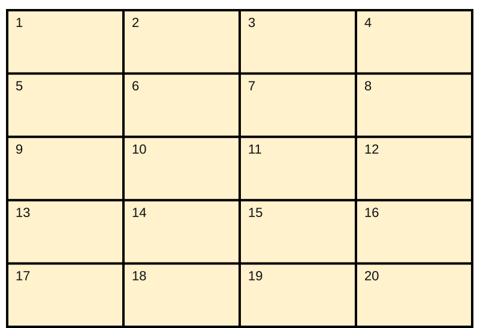
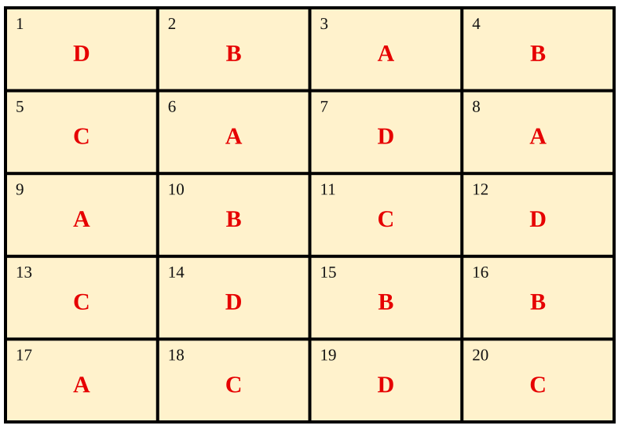
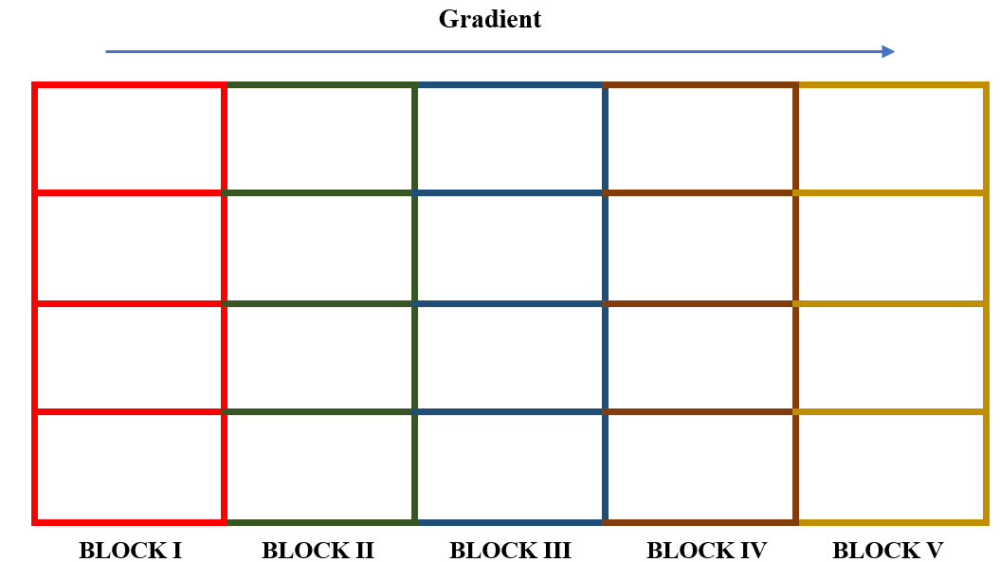
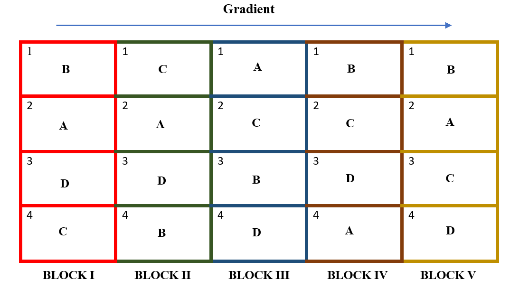
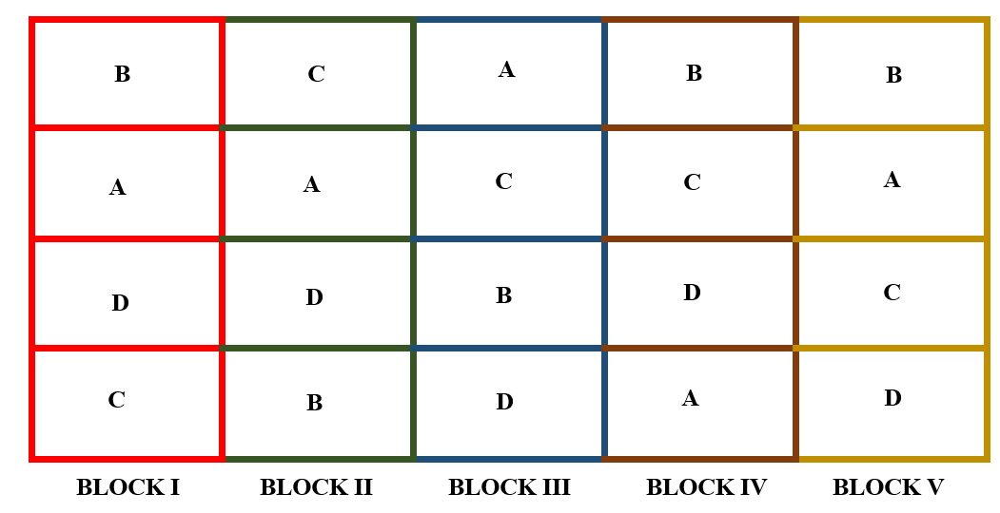
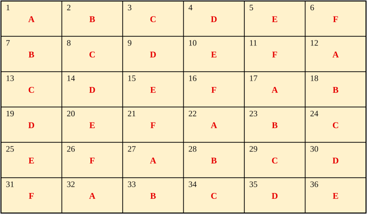
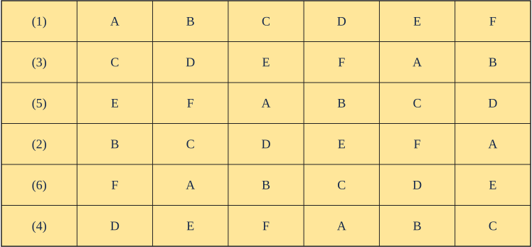
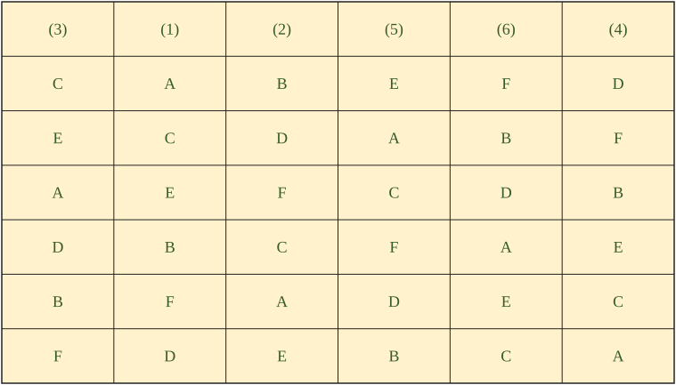
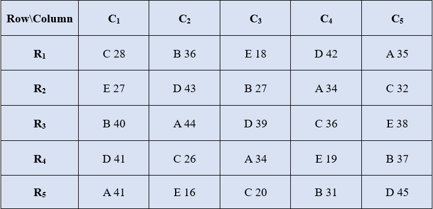
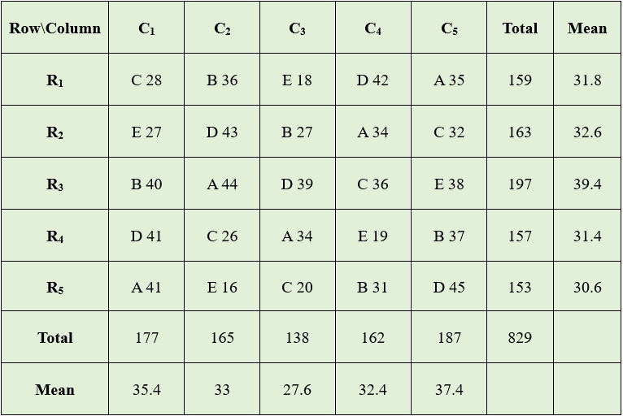

# Single factor experiments

Experiments in which only a single factor varies while all others are kept constant are called single-factor experiments. In such experiments, the treatments consist solely of the different levels of the single variable factor. All other factors are maintained uniformly across all experimental units.

**Examples:**

1.  An experiment to find the best nitrogen level for getting a high yield, where 5 different nitrogen levels are tested. Here, the nitrogen levels are the treatments, and all other factors like irrigation, light, and fertility gradient are assumed to be homogeneous in all experimental units (here the plots are the experimental units).

2.  An experiment to find the best feed formulation for milk yield in cows from 4 feed formulas. Here, the feed formula is the only factor that varies, with 4 levels. All other factors like breed of cow, age, and so on are kept constant.

## Completely Randomized Design (CRD){#sec-crd}  

Completely Randomized Design is the basic single factor design. In this
design the treatments are assigned completely at random so that each
experimental unit has the same chance of receiving any one treatment.
CRD is only appropriate for experiments with homogeneous experimental
units, such as laboratory and green house experiments, where
environmental effects are relatively easy to control. For field
experiments, where there is generally large variation among experimental
plots, CRD is rarely used.

CRD provides a layout for conducting experiments, when experimental
units are homogeneous. Only two basic principles of design,
randomization @sec-rand and replication @sec-rep are followed in
CRD. Local control @sec-local is not required as all the experimental
units are homogeneous. Treatments can have unequal replications in CRD.

### Randomization procedure {#sec-random1}

Consider an experiment involving four treatments A, B, C, D in CRD. Each treatment is replicated 5 times. Randomization procedure is as explained below.   

1.  Determine the total number of experimental units ($n$) as the product of the number of treatments ($t$) and the number of replications ($r$); that is, $n = r\  \times t$. For our example, $n = 5 \times 4 = 20$

2.  Assign a unit number to each experimental units in any convenient manner; for example, consecutively from 1 to n. For our example, the unit numbers 1, 2,\... , 20 are assigned to the 20 experimental units as shown in Figure @fig-crdnumbered  

3.  Assign the treatments to the experimental plots by using any randomization schemes. Here we explain a simple randomization scheme in section @sec-random.  

```{r echo=FALSE, out.width="60%", fig.align='center'}
#| label: fig-crdnumbered
#| fig-cap: "Numbered experimental units"

```

#### Randomization by drawing lots {#sec-random}

1.  Prepare $n$ identical pieces of paper and divide them into $t$ groups, each group with $r$ pieces of paper. Label each piece of paper of the same group with the same letter (or number) corresponding to a treatment. Uniformly fold each of the $n$ labeled pieces of paper, mix them thoroughly, and place them in a container. For our example, there should be 20 pieces of paper, five each with treatments A, B, C, and D appearing on them.

2.  Draw one piece of paper at a time, without replacement and with constant shaking of the container after each draw to mix its content. For our example, the label and the corresponding sequence in which each piece of paper is drawn. The sequence number can be considered as the experimental unit number to which the treatment is to be assigned.  

```{r echo=FALSE, warning=FALSE, message=FALSE, results='asis'}
#| label: tbl-sequence
#| fig-cap: "Sequence in which labelled lots are drawn"
#| tbl-cap: "Sequence in which labelled lots are drawn"
library(knitr)
library(kableExtra)
dt <- read.csv("csv/crd_sequence.csv", header = FALSE, check.names = FALSE)
kbl(dt, col.names = NULL, booktabs = TRUE, align = "c") %>%
  kable_classic(full_width = FALSE, html_font = "Georgia") %>%
  kable_styling(
    full_width = FALSE,
    position = "center",
    bootstrap_options = "bordered",
    font_size = 12
  ) %>%
  column_spec(1, bold = TRUE, width = "2.8cm") %>%
  row_spec(c(1, 3), bold = TRUE)
```

### Layout of CRD

After allotting the treatment according to the randomization procedure explained in section @sec-random1. The final layout will look like in the figure @fig-layout.  

```{r echo=FALSE, out.width="60%", fig.align='center'}
#| label: fig-layout
#| fig-cap: "Layout of Completely Randomized Design"

```  

### Statistical model for CRD  

Consider a CRD with *v* treatments with *r* replications. Statistical model for CRD is same as that of one-way ANOVA (@sec-onewaymodel).  
$$Y_{\text{ij}} = \mu + \tau_{i} + e_{\text{ij}}$$  
Where *i* = 1,2, ..., *v* and *j* =1,2, ..., *r*~i~. $Y_{\text{ij}}$ is the observed value of $i^{\text{th}}$
treatment from $j^{\text{th}}$ replication, $\tau_{i}$ is the effect of $i^{\text{th}}$ treatment. $\mu$ is the general
effect which is common for all treatments. $e_{\text{ij}}$ is the error
effects.$e_{ij}$ $\sim iid\ N(0,\sigma^{2})$  

### Analysis of CRD  

Analysis of CRD is same as that explained in section @sec-onewaycalc of one-way ANOVA.   

::: {.callout-note title="Note"}
Unequal replication (*i*.*e*. each treatment can have a different number of replications) is possible in CRD. So while calculating the treatment sum of squares, each treatment total is squared and divided by its corresponding replication, and then the sum is taken. If the replication is the same for all treatments, the treatment sum of squares is obtained by taking the sum of the squares of the treatment totals and dividing by the common replication number.
:::

```{r tbl-crdanova, echo=FALSE, warning=FALSE, message=FALSE, results='asis'}
#| fig-cap: "ANOVA table of CRD"
#| tbl-cap: "ANOVA table of CRD"
#| filters: 
#| - parse-latex

library(knitr)
library(kableExtra)

dt <- data.frame(
  Source = c("Treatments", "Error", "Total"),
  
  df = c(
    "$v-1$",
    "$n-v$",
    "$n-1$"
  ),
  
  SS = c(
    "$\\text{SST} = \\sum_{i=1}^{v}\\dfrac{T_i^2}{r_i} - \\text{C.F.}$",
    "$\\text{Total SS} - \\text{SST}$",
    "$\\sum_{i=1}^{v}\\sum_{j=1}^{r} y_{ij}^2 - \\text{C.F.}$"
  ),
  
  MSS = c(
    "$\\text{MST}=\\dfrac{\\text{SST}}{v-1}$",
    "$\\text{MSE}=\\dfrac{\\text{SSE}}{v(r-1)}$",
    ""
  ),
  
  F = c(
    "$F = \\dfrac{\\text{MST}}{\\text{MSE}}$",
    "",
    ""
  )
)

colnames(dt) <- c("Source", "D.F.", "S.S", "M.S.S", "F")

kbl(
  dt,
  booktabs = TRUE,
  align = "c",
  escape = FALSE
) %>%
  kable_classic(
    full_width = FALSE,
    html_font = "Georgia"
  ) %>%
  kable_styling(
    full_width = FALSE,
    position = "center",
    bootstrap_options = "bordered"
  ) %>%
  row_spec(0, bold = TRUE) %>%
  column_spec(
    3,
    width = "5.5cm",
    extra_css = "padding-right: 22px;"
  ) %>%
  column_spec(
    4,
    width = "4cm",
    extra_css = "padding-left: 22px;"
  )
```  

#### Post hoc test (LSD) {#sec-postcrd}  
If the null hypothesis is rejected in ANOVA; we proceed to post-hoc test explained in section @sec-lsd. Fisher's Least significant difference (LSD) test explained in section @sec-lsd is the commonly employed test in agricultural experiments.  
Arrange the treatment means in descending order. Critical difference (CD) is calculated for each treatment pair $T_{i},\ T_{j}$ using the following formula.

$$C.D. = t_{\left( \frac{\alpha}{2},\ error\ df \right)}\sqrt{\text{MSE}\left( \frac{1}{r_{i}} + \frac{1}{r_{j}} \right)}$$

(for CRD with unequal replication)

$$C.D. = t_{\left( \frac{\alpha}{2},\ error\ df \right)}\sqrt{\frac{2\,MSE}{r}}$$

(for CRD with equal replication)

Here $t_{\left( \frac{\alpha}{2},\ \ \ error\ df \right)}$ denotes the critical value of Student's t for a two tailed test at α level of significance and error degrees of freedom. $r_{i}$ and $r_{j}$ are replications of $T_{i},\ T_{j}$ respectively. If the difference of any two treatment means is greater
than the critical difference, they are significantly different. If the difference of any two treatment means is less than $\text{C.D}$. they are said to be on par. (*i*.*e*., there is no any statistically significant difference). Those treatments which are at par is given same
symbols or letters, such that treatment means without any common letters or symbols are significantly different at corresponding level of significance (α).  

### Advantages of a CRD

1.  Its layout is very easy.

2.  There is complete flexibility in this design *i*.*e*. any number of
    treatments and replications for each treatment can be tried.

3.  Whole experimental material can be utilized in this design.

4.  This design yields maximum degrees of freedom for experimental
    error.

5.  The analysis of data is simplest as compared to any other design.

6.  Even if some values are missing the analysis can be done.

### Disadvantages of a CRD

1.  Not suitable for field experiments.

2.  Relatively low accuracy due to lack of local control. Completely homogeneous experimental units are practically difficult in many situations.  

### Number of replications in CRD {#sec-replical}

An experimenter is free to choose any number of replications in the experiment. The precision in estimating experimental error variance increases as the number of replications increases. But the design should be such that the number of replications should be optimum, since increasing the replications will increase the experiment cost. So, there
is a rule of thumb that says, error degrees of freedom should be at least 12 to keep type II error in check. One can easily find the number of replications required in a design by using the formula for error degrees of freedom of that design.

::: {#exm-ct42}
You have 5 treatments; you are planning to conduct the experiment in CRD. Find the minimum number of replications required.

**Solution**

Formula for error degrees of freedom (*edf*) in CRD is $n - t$; where $n$ is the total number of experimental units and $t$ is the number of treatments. $n = rt$, $r$ is the number of replications.

*edf* should be $\geq$ 12

*edf* $= n - t = rt - t = t\left( r - 1 \right) \geq 12$

Since t = 5, *edf* $= 5\left( r - 1 \right) \geq 12$

$r \geq 3.4$, since $r$ cannot be a fraction, $r =$ 4

The number of replications required is 4.
:::

::: {.callout-note title="Why is the minimum error degrees of freedom for a design taken as 12?"}
The error degrees of freedom have a major role in deciding the critical value of F. As the error degrees of freedom (the degrees of freedom in the denominator) decrease, F tends to take larger critical values. This inflates the Type II error, *i*.*e*. we will be able to reject the null hypothesis only if there is a considerable difference between the treatments (a higher treatment sum of squares). Beyond about 12 denominator degrees of freedom, the F critical values stabilise and change very little with further increases, so 12 is taken as a practical minimum.
:::

::: {#exm-ct43}
In order to find the yielding abilities of five varieties of sesame an experiment was conducted in the green house using a CRD with four pots per variety. The results are given in the following table below.

```{r echo=FALSE, warning=FALSE, message=FALSE, results='asis'}
#| label: tbl-crdex
#| fig-cap: "Yield data of five varieties of sesame under CRD"
#| tbl-cap: "Yield data of five varieties of sesame under CRD"
library(knitr)
library(kableExtra)
dt <- read.csv("csv/crd_data.csv", check.names = FALSE)
kbl(dt, booktabs = TRUE, align = "c") %>%
  kable_classic(full_width = FALSE, html_font = "Georgia") %>%
  kable_styling(
    full_width = FALSE,
    position = "center",
    bootstrap_options = "bordered"
  ) %>%
  add_header_above(c(" " = 1, "Variety" = 5), bold = TRUE) %>%
  row_spec(0, bold = TRUE) %>%
  row_spec(5:6, bold = TRUE) %>%
  column_spec(1, bold = TRUE)
```

**Solution**

**Correction Factor**:

$= \frac{G^{2}}{n} = \frac{\left( 397 \right)^{2}}{20}$=7880.45

**Total Sum of squares**:

$= \left( 25^{2} + 21^{2} + .... + 11^{2} \right) - CF$

$= 8307 - CF = 426.55$

**Treatment Sum of Squares**:

$\frac{1}{4}(85^{2} + 102^{2} + ... + 53^{2}) - CF$
$= 8211.75 - CF = 331.30$

**Error Sum of Square**:
$426.55 - 331.30 = 95.25$

```{r echo=FALSE, warning=FALSE, message=FALSE, results='asis'}
#| label: tbl-crdanovaex
#| fig-cap: "ANOVA table for the sesame variety trial"
#| tbl-cap: "ANOVA table for the sesame variety trial"
library(knitr)
library(kableExtra)
dt <- read.csv("csv/crd_anova.csv", check.names = FALSE)
dt[is.na(dt)] <- ""

kbl(dt, booktabs = TRUE, align = "c", escape = FALSE) %>%
  kable_classic(full_width = FALSE, html_font = "Georgia") %>%
  kable_styling(
    full_width = FALSE,
    position = "center",
    bootstrap_options = "bordered"
  ) %>%
  row_spec(0, bold = TRUE) %>%
  column_spec(1, bold = TRUE)
```

Since the F value calculated is greater than table value of F, we can reject the null hypothesis and conclude that there is a significant difference between at least a pair of treatments. So in order to find which treatments are significantly different, we perform Fisher's LSD test.

$$\text{CD} = t_{\frac{\alpha}{2}}\sqrt{\frac{2 \times \text{MSE}}{r}} = 2.131\sqrt{\frac{2(6.350)}{4}} = 2.131 \times 1.7819 = 3.7972$$

$t_{0.025\text{ at }15 \text{ edf}} = 2.131$ (Just look for the critical value of *t* for a two tailed test at α = 0.05 in the statistical table, see @tbl-ttable in Appendix 4.

It is shown as $t_{\frac{\alpha}{2}}$, since it is a two tailed test in the one side of the t-distribution curve the probability will be $\frac{\alpha}{2}$, so that combined probability is α.)

Treatment means arranged in descending order. Those treatment pairs whose difference in means is greater than C.D. is labelled with a different letters.

| Treatments | means | Grouping using alphabets |
|:----------:|:-----:|:-------------------------:|
| $V_{2}$ | 25.5 | a |
| $V_{1}$ | 21.25 | b |
| $V_{3}$ | 21.25 | b |
| $V_{4}$ | 18 | b |
| $V_{5}$ | 13.25 | c |

: Grouping of treatment means using letters {#tbl-crdgroupletters .bordered}

In the above table we can see that the difference between the means of $V_{2}$ and $V_{1}$ is 4.25, which is greater than the C.D. value. So $V_{2}$ and $V_{1}$ are significantly different, and different letters are assigned to each of them. Instead of letters one can also use symbols as shown below. Those treatments with the same letters/symbols are not significantly different.

| Treatments | means | Grouping using symbols |
|:----------:|:-----:|:-----------------------:|
| $V_{2}$ | 25.5 | @ |
| $V_{1}$ | 21.25 | \* |
| $V_{3}$ | 21.25 | \* |
| $V_{4}$ | 18 | \* |
| $V_{5}$ | 13.25 | & |

: Grouping of treatment means using symbols {#tbl-crdgroupsymbols .bordered}

So, in our example we can conclude that $V_{2}$ is the best variety because it is having the highest mean and is significantly different from others.

::: {.callout-important title="Note"}
In some cases, more than one alphabet can appear against a treatment mean, see the hypothetical example below.
:::

| Treatments | Grouping |
|:----------:|:--------:|
| $V_2$ | a |
| $V_1$ | ab |
| $V_3$ | bc |
| $V_4$ | c |
| $V_5$ | d |

: A hypothetical example of treatment grouping {#tbl-groupingcrd .bordered}

Here $V_1$ carries two letters (ab), meaning it is not significantly different from $V_2$ (they share **a**) and also not significantly different from $V_3$ (they share **b**), while $V_2$ and $V_3$ do not share a letter and so are significantly different from each other.

::: {.callout-important title="Note"}
When a lettering like this appears, treatments having common alphabets are not significantly different. In the above table $V_{2}$ and $V_{1}$ are not significantly different, as both of them have the common letter *a*. At the same time you can see $V_{5}$ and $V_{4}$ are significantly different, as they don't have any common letters.
:::
:::

## Randomized Complete Block Designs (RCBD)

In field experiments, the plots on which treatments are applied may not be uniform and there may be difference in plot-to-plot fertility. In such cases CRD cannot be
recommended. If there is only one source constituting the difference between the plots then we can recommend randomized block design.

The randomized complete block (RCB) design is one of the most widely used experimental designs in agricultural research. The design is especially suited for field experiments where the number of treatments is not large and the experimental area has a predictable fertility gradient.

When the experimental material is heterogeneous, the experimental material is grouped into homogeneous sub-groups called **blocks**. As each block consists of the entire set of treatments a block is equivalent to a replication. For example, in a field with known fertility gradient in one direction, plots perpendicular to this gradient will be considered as a block. In RCBD (Randomized Complete Block Design) blocks are of equal size and contains all the treatments. Since the block contains all the treatments, the term 'complete block design' is used. See @fig-rcbd1 to see how blocks are formed in a field.

::: {.callout-important title="Note"}
In RCBD, number of replications, $r$ = number of blocks. Number of plots within a block = number of treatments, $v$.
:::

### Blocking technique

Blocking or local control, one of the basic principles of design is effectively implemented in RCBD. The primary purpose of blocking is to reduce experimental error by eliminating the contribution of known sources of variation among experimental units. This is achieved by grouping homogeneous units together, so that variability with in blocks is minimized, between blocks is maximized.  

Two important factors to be considered for blocking

-   The selection of the source of variability to be used as the basis for blocking, in field experiments usually fertility gradient or productivity gradient is used as the identified source of variability.

-   Proper selection of the block shape and orientation. For example, when the gradient is unidirectional, use long and narrow blocks. Use square blocks for strong fertility gradient in both directions. An experimenter should use his common sense to identify the shape and orientation of the block after examining the field conditions, such that plots in a block are homogeneous.

### Randomization in RCBD {#sec-rcbdrandom}

Consider an experiment involving four treatments A, B, C, D in RCBD. Each treatment is replicated 5 times. Randomization procedure is as explained below. The randomization process for a RCB design is applied separately and independently to each of the blocks.

STEP 1. Divide the experimental area into $r$ equal blocks, where $r$ is the number of replications. In our example $r =$ 5.  

```{r echo=FALSE, out.width="60%", fig.align='center'}
#| label: fig-rcbd1
#| fig-cap: "Division of an experimental field into five blocks, each consisting of four plots, for a RCBD with four treatments and five replications. Blocking is done such that blocks are rectangular and perpendicular to the direction of the unidirectional fertility gradient"

``` 

STEP 2. Subdivide each block into $v$ experimental plots, where $v$ is the number of treatments. Number the $v$ plots consecutively from 1 to $v$, and assign $v$ treatments at random to the $v$ plots following the randomization scheme for the CRD described in Section @sec-random. In our example each of the 5 blocks are divided into 4 plots. Plots are numbered 1 to 4 in each block. Now for each block, paper lots of 1 to 4 is prepared. Treatment names are written in order and plot number from each lot is recorded in order as shown below.

| Treatments | A | B | C | D |
|:----------:|:-:|:-:|:-:|:-:|
| Plot number from lot | 2 | 1 | 4 | 3 |

: Plot numbers drawn for each treatment in a single block {#tbl-crdlotdraw .bordered}

STEP 3. All the treatments are allotted to the randomly selected plots. Step 2 is repeated in all blocks.  

```{r echo=FALSE, out.width="60%", fig.align='center'}
#| label: fig-rcbd2
#| fig-cap: "Allotment of treatments in all blocks. In RCBD each block will have all the treatments and each treatment appear in a block exactly once. "

``` 

### Layout of RCBD

In RCBD each block will have all the treatments and each treatment appear in a block exactly once. After allotting the treatment according to the randomization procedure explained in section @sec-rcbdrandom. The final layout will look like in the figure @fig-rcbd3.  

::: {.callout-important title="Note"}
In RCBD every treatment will have the same number of replications (all treatments are equally replicated, say, $r$ times). So we need a total of $v \times r$ plots for conducting that experiment. Each of $r$ blocks will contain $v$ plots. So in this design, the number of blocks = number of replications of the treatments = $r$, and number of plots within a block = number of treatments = $v$.
:::


```{r echo=FALSE, out.width="60%", fig.align='center'}
#| label: fig-rcbd3
#| fig-cap: "Layout of RCBD with four treatments and five replications"

``` 

### Statistical Model for RCBD

Consider a RCBD with $v$ treatments with $r$ replications (Blocks). Statistical model for RCBD is same as that of two-way ANOVA described in section @sec-twowaymodel.  

$$Y_{\text{ij}} = \mu + \tau_{i} +  \gamma_{j}+ e_{\text{ij}}$$  
where, *i* = 1,2, ..., *v* and *j* =1,2, ..., *r*. $Y_{\text{ij}}$ is the observed value of response under $i^{\text{th}}$ treatment and $j^{\text{th}}$ block, $\tau_{i}$ is the effect of $i^{\text{th}}$ factor,$\gamma_{j}$ is the effect of $j^{\text{th}}$ block . $\mu$ is the general
effect which is common for all treatments. $e_{\text{ij}}$ is the error
effects.$e_{ij}$ $\sim iid\ N(0,\sigma^{2})$  

### Analysis of RCBD  
Analysis of RCBD is same as that explained in section @sec-twowaycalc of two-way ANOVA.

Observation from $v$ treatments in $r$ blocks is arranged as shown below.  

| Treatment | Block 1 | Block 2 | Block 3 | $\cdots$ | Block $r$ | Total |
|:---------:|:-------:|:-------:|:-------:|:--------:|:---------:|:-----:|
| 1 | $Y_{11}$ | $Y_{12}$ | $Y_{13}$ | $\cdots$ | $Y_{1r}$ | $T_1$ |
| 2 | $Y_{21}$ | $Y_{22}$ | $Y_{23}$ | $\cdots$ | $Y_{2r}$ | $T_2$ |
| 3 | $Y_{31}$ | $Y_{32}$ | $Y_{33}$ | $\cdots$ | $Y_{3r}$ | $T_3$ |
| $\vdots$ | | | | | | $\vdots$ |
| $v$ | $Y_{v1}$ | $Y_{v2}$ | $Y_{v3}$ | $\cdots$ | $Y_{vr}$ | $T_v$ |
| Total | $B_1$ | $B_2$ | $B_3$ | $\cdots$ | $B_r$ | $G$ |

: Two-way arrangement of observations in RCBD {#tbl-rcbd4}

The ANOVA table, following the calculations as in section @sec-twowaycalc, is

```{r tbl-rcbd5,echo=FALSE, warning=FALSE, message=FALSE, results='asis'}
#| tbl-cap: "ANOVA table of RCBD"
#| fig-cap: "ANOVA table of RCBD"
#| filters:
#| - parse-latex

library(knitr)
library(kableExtra)

dt <- data.frame(
  Source = c("Treatments", "Blocks", "Error", "Total"),
  
  df = c(
    "$v-1$",
    "$r-1$",
    "$(v-1)(r-1)$",
    "$vr-1$"
  ),
  
  SS = c(
    "$\\text{SST} = \\dfrac{\\sum_{i=1}^{v} T_i^2}{r} - \\text{C.F.}$",
    "$\\text{SSB} = \\dfrac{\\sum_{j=1}^{r} B_j^2}{v} - \\text{C.F.}$",
    "$\\text{ESS} = \\text{Total SS} - \\text{SST} - \\text{SSB}$",
    "$\\sum_{i=1}^{v}\\sum_{j=1}^{r} Y_{ij}^2 - \\text{C.F.}$"
  ),
  
  MSS = c(
    "$\\dfrac{\\text{SST}}{v-1} = \\text{MST}$",
    "$\\dfrac{\\text{SSB}}{r-1} = \\text{MSR}$",
    "$\\dfrac{\\text{ESS}}{(v-1)(r-1)} = \\text{MSE}$",
    ""
  ),
  
  F = c(
    "$F_1 = \\dfrac{\\text{MST}}{\\text{MSE}}$",
    "$F_2 = \\dfrac{\\text{MSR}}{\\text{MSE}}$",
    "",
    ""
  )
)

colnames(dt) <- c("Source", "d.f", "S.S", "M.S.S", "F")

kbl(
  dt,
  escape = FALSE,
  booktabs = TRUE,
  align = "c"
) %>%
  kable_classic(
    full_width = FALSE,
    html_font = "Georgia"
  ) %>%
  kable_styling(
    full_width = FALSE,
    position = "center",
    bootstrap_options = "bordered"
  ) %>%
  row_spec(0, bold = TRUE) %>%
  column_spec(3, width = "5cm") %>%
  column_spec(4, width = "3.2cm")
```

where $\text{C.F} = \dfrac{G^2}{rv}$.

$F_{1} \sim F_{(v-1),\ (v-1)(r-1)}$ and $F_{2} \sim F_{(r-1),\ (v-1)(r-1)}$ are two F values, one for treatment and one for blocks respectively. Decisions on the null hypothesis are made by comparing the corresponding F value to the table value given in @tbl-ftable of Appendix 5.

::: {.callout-important title="Note"}
What if $F_{2}$ is not significant? If $F_{2}$ is not significant, it indicates that there is no significant difference between blocks, meaning blocking is not effective. Blocking is considered effective in reducing the experimental error only if $F_{2}$ is significant.
:::

### Number of replications in RCBD  

As explained in section @sec-replical number of replications in RCBD is found out using the formula of error degrees of freedom (*edf*).  

::: {#exm-ct44}
You have 4 treatments; you are planning to conduct the experiment in RCBD. Find the minimum number of replications required.

**Solution**

Formula for error degrees of freedom (*edf*) in RCBD is $(v - 1) (r-1)$; where $v$ is the number of treatments and $r$ is the number of blocks.

*edf* should be $\geq$ 12

*edf* $=(v - 1) (r-1) \geq 12$

Since $v$ = 4, *edf* $= 3\left( r - 1 \right) \geq 12$

$\implies r \geq 5$, minimum replication required is 5

The number of replications required is 5.
:::

### Post-hoc test in RCBD  

If the null hypothesis for treatments is rejected in ANOVA; we proceed to post-hoc test explained in section @sec-lsd. Arrange the treatment means in descending order. Critical difference (CD) or LSD (Least Significant Difference) is calculated for each treatment pair $T_{i},\ T_{j}$ using the following formula.  

$$CD = \ t_{\frac{\alpha}{2},edf}.\sqrt{\frac{2\ MSE}{r}}$$
where, $\text{MSE}$ is the Mean Square Error from ANOVA.
$t_{\frac{\alpha}{2},edf}$ is the critical value of two tailed student's t distribution at $\alpha$ level of significance and error degrees of
freedom. $r$ is the number of blocks/replication.  
Procedure for grouping using symbols is same as that of CRD explained in section @sec-postcrd.  

### Advantages of RCBD

1.  Accuracy: RCB design has been shown to be more efficient or accurate than C.R.D. for most types of experimental work.  

2.  Flexibility: In RCBD no restrictions are placed on the number of treatments or
the number of replicates.

3.  Even if some values are missing, still the analysis can be done by using missing plot 
technique.

4.  Ease of analysis: Statistical analysis is simple, rapid and straight forward.  

### Disadvantages of RCBD

1.  RCBD may give misleading results if blocks are not homogeneous.

2.  RCBD is not suitable for large number of treatments because in that case the block size will increase and it may not be possible to keep large blocks
homogeneous.  

3. If the data on more than two plots is missing the statistical analysis becomes
tedious and complicated.

## Latin Square Design (LSD) 

In this design, variations in the field in two different directions (or  variations 
due to two different factors)  are controlled simultaneously from affecting the 
treatment comparisons.  A layout in RBD controls only one source of external 
variation affecting the treatment comparisons by the construction of homogeneous
blocks. Sometimes when blocks were laid out in a field the environmental conditions 
within each block need not be the same. For example, soil variability in a North South 
direction and an environmental gradient in an East West Direction then the conditions 
within each block will vary. In such situations the variability can be controlled by a 
Latin Square design (LSD). The blocks in a LSD are called rows and columns; they 
represent two external factors. The entire experimental area can be divided into small 
plots arranged in the form of a square. The number of plots in each row and each 
column are equal, both equal to the number of treatments to be compared.

### Layout and Randomization

A Latin square of $v$ treatments (usually called as side $v$) is an arrangement of 
$v$ treatments into $v$ rows  and $v$ columns such that every treatment is replicated in each 
row and each column exactly once. 

Latin squares of various sides are available in Statistical tables. If there are $v$ 
treatments to be compared, chose a Latin square of side $v$ from the statistical tables. In 
the Fisher and Yates (1948) tables for Statisticians and Biometricians these squares 
are presented for a given standard order of alphabets in the first row. Choose one of 
these squares for a given $v$ and carryout the randomization in the following way.

Let $v$ = 6. Then a Latin Square of 6 treatments denoted by *A*, *B*, *C*, *D*, *E* and *F* 
can be denoted by keeping alphabetical order for first row and an order of symmetry 
for the remaining rows can be written as

```{r echo=FALSE, out.width="90%", fig.align='center'}
#| label: fig-lsdlayout
#| fig-cap: "Layout of LSD with six treatments and six replications"

``` 

This square represents a Latin square for $v$ = 6 treatments in 6 replications. 
Blocks are represented in two directions as rows and columns and their number is also 
= $v$ 
 
**Randomization**  
If there are  $v$ treatments take a square of order $v$ at random 
from the statistical tables. 
 
Number the rows of the square from 1 to $v$. Keeping the first row fixed, the 
remaining rows are arranged randomly by using random numbers to develop another 
square. 
So the above square can be randomised in many ways like

```{r echo=FALSE, out.width="90%", fig.align='center'}
#| label: fig-lsdlayout1
#| fig-cap: "Randomization of LSD with six treatments and six replications"

``` 
After the randomisation of the rows the columns are randomised to get another randomized square.

```{r echo=FALSE, out.width="90%", fig.align='center'}
#| label: fig-lsdlayout2
#| fig-cap: "Randomization of LSD"

``` 
Lastly , the $v$ treatments can  be assigned randomly to these $v$ letters (A, B, ...). 

### Analysis

The data collected from experiments in LSD are classified according to the 
levels of three factors. So it is called three way classified design. The two types of 
blockings (Rows and columns) and treatments will make up the three factors. 
The  linear model for analysis as : 
$$Y_{\text{ijk}} = \mu + \tau_{i} + R_{j}+ C_{k}+e_{\text{ijk}}$$ 
where i,j, k = 1,2,3,... $v$

*i.e.,* The response ( yield ($Y_{ijk}$))  of each plot  =  A general mean effect (μ) +  Effect due to the $i^{th}$  treatment ($\tau_{i}$)  + Effect of the $j^{th}$ Row ( $R_{j}$ ) + Effect due to the $k^{th}$ Column ( $C_{k}$) + Random error terms associated with each plot  ( $e_{ijk}$ ).
The effect of the general mean  is subtracted from  each sum of squares ( by 
subtracting the correction factor  $C.F.  = \frac{(\sum{y_{ijk}})^2} {v^2}$). The total sum of squares is split into four components  (i) variation between the treatments  as treatment Sum of squares (ii) variation between the rows (iii) variation between the columns and (iv) Variation within the factors: *i.e.,* Error Sum of squares. 
 
To calculate the sum of squares, arrange the data according to the rows, columns and treatments and obtain the respective totals. Let the treatment totals be $T_{1}$, $T_{2}$, ...., $T_{v}$; row totals be $R_{1}$, $R_{2}$, $R_{3}$, ..., $R_{v}$ and column totals be $C_{1}$, $C_{2}$, $C_{3}$, ..., $C_{v}$.

```{r tbl-lsdanova,echo=FALSE, warning=FALSE, message=FALSE, results='asis'}
#| fig-cap: "ANOVA of Latin Square Design"
#| tbl-cap: "ANOVA of Latin Square Design"
#| filters:
#| - parse-latex

library(knitr)
library(kableExtra)

dt <- data.frame(
  Source = c(
    "Between treatments",
    "Between rows",
    "Between columns",
    "Error",
    "Total"
  ),
  
  df = c(
    "$v-1$",
    "$v-1$",
    "$v-1$",
    "$(v-1)(v-2)$",
    "$v^2-1$"
  ),
  
  SS = c(
    "$\\dfrac{\\sum T_i^2}{v} - CF$",
    "$\\dfrac{\\sum R_j^2}{v} - CF$",
    "$\\dfrac{\\sum C_k^2}{v} - CF$",
    "By subtraction",
    "$\\sum Y_{ijk}^2 - CF$"
  ),
  
  MSS = c(
    "$MST$",
    "$MSR$",
    "$MSC$",
    "$MSE$",
    ""
  ),
  
  F = c(
    "$\\dfrac{\\text{MST}}{\\text{MSE}}$",
    "$\\dfrac{\\text{MSR}}{\\text{MSE}}$",
    "$\\dfrac{\\text{MSC}}{\\text{MSE}}$",
    "",
    ""
  )
)

colnames(dt) <- c(
  "Source of Variation",
  "d.f",
  "Sum of Squares",
  "M.S.S",
  "F value"
)

kbl(
  dt,
  escape = FALSE,
  booktabs = TRUE,
  align = "c"
) %>%
  kable_classic(
    full_width = FALSE,
    html_font = "Georgia"
  ) %>%
  kable_styling(
    full_width = FALSE,
    position = "center",
    bootstrap_options = "bordered"
  ) %>%
  row_spec(0, bold = TRUE) %>%
  column_spec(1, width = "3.2cm") %>%
  column_spec(3, width = "3cm")
```

All these computed F values are compared with the F table values for $(v-1)$ and $(v-1)(v-2)$ degrees of freedom. If the treatments turn out to be significant, then the means are compared pairwise by using

$$C.D. = t_{\left( \frac{\alpha}{2},\ error\ df \right)}\sqrt{\frac{2\,MSE}{v}}$$
 
**Advantages**  
LSD is efficient when there are trends in fertility in two perpendicular 
directions or when there are two factors contributing to experimental error.

**Disadvantages**  
In RBD there is no restriction like  number of replications = Number 
of treatments.  The error degrees of freedom in this design is $(v-1)(v-2)$. For  number 
of treatments like $v$ = 2  , 3 and 4  this value is 0  , 2 and 6. ( *ie.,* very small- hence we cannot carryout the experiment as such for these values of  $v$).  

Similarly when $v>10$ the total number of plots required is $v^2$ > 100. So there 
will be difficulty in getting large number of homogeneous plots.  So LSD is 
commonly used for 5 to 10 treatments only.

::: {#exm-ct45}
Consider a 5x5 LSD experimental setup as follows

```{r echo=FALSE, out.width="90%", fig.align='center'}
#| label: fig-LSDE1

```

**Solution**

The three null hypotheses (one each for treatments, rows, and columns) are

$H_{01}$: $\mu_{11} = \mu_{12} = \mu_{13} = \mu_{14} = \mu_{15}$ (treatment means are equal)

$H_{11}$: at least two of the treatment means are different

$H_{02}$: $\mu_{21} = \mu_{22} = \mu_{23} = \mu_{24} = \mu_{25}$ (row means are equal)

$H_{12}$: at least two of the row means are different

$H_{03}$: $\mu_{31} = \mu_{32} = \mu_{33} = \mu_{34} = \mu_{35}$ (column means are equal)

$H_{13}$: at least two of the column means are different

```{r echo=FALSE, out.width="90%", fig.align='center'}
#| label: fig-LSDE2

```

**Grand Total (G)**= 829

**Correction Factor(C.F)**
$= \frac{G^{2}}{n} = \frac{\left( 829 \right)^{2}}{25}$= 27489.64

**Total Sum of Squares(TSS)**= $(28^2+36^2+18^2+...+31^2)-27489.64$
$=29243-27489.64 = 1753.36$

**Row Sum of Squares(RSS)**=$\frac{1}{5}(159^{2} + 163^{2} + 197^{2}+157^{2}+153^{2}) - CF$
$=27743.4-27489.64 = 253.76$

**Column Sum of Squares(CSS)**=$\frac{1}{5}(177^{2} + 165^{2} + 138^{2}+162^{2}+187^{2}) - CF$
$= 27762.2-27489.64 = 272.56$

**Treatment Sum of Squares(SSt)**=$\frac{1}{5}(188^{2} + 171^{2} + 142^{2}+210^{2}+118^{2}) - CF$
$= 28554.6 - 27489.64 = 1064.96$

**Error Sum of Squares** $= 1753.36 - 253.76- 272.56-1064.96 = 162.08$

```{r echo=FALSE, warning=FALSE, message=FALSE, results='asis'}
#| label: tbl-lsdanovaex
#| fig-cap: "ANOVA table for the Latin Square example"
#| tbl-cap: "ANOVA table for the Latin Square example"
library(knitr)
library(kableExtra)
dt <- data.frame(
  Source = c("Row", "Column", "Treatment", "Error", "Total"),
  df = c("4", "4", "4", "12", "24"),
  SS = c("253.76", "272.56", "1064.96", "162.08", "1753.36"),
  MSS = c("63.44", "68.14", "266.24", "13.51", ""),
  FCal = c("4.70", "5.04", "19.71", "", ""),
  FTab = c("3.26", "3.26", "3.26", "", "")
)
colnames(dt) <- c("Source of variation", "df", "Sum of squares",
                  "Mean Sum of squares", "F Cal", "F tab")
kbl(dt, escape = FALSE, booktabs = TRUE, align = "c") %>%
  kable_classic(full_width = FALSE, html_font = "Georgia") %>%
  kable_styling(
    full_width = FALSE,
    position = "center",
    bootstrap_options = "bordered"
  ) %>%
  row_spec(0, bold = TRUE) %>%
  column_spec(1, bold = TRUE)
```

Since the F cal is greater than the F table value, all the null hypotheses are rejected.

$$C.D. = t_{\left( \frac{\alpha}{2},\ error\ df \right)}\sqrt{\frac{2\,MSE}{v}} = 2.18\sqrt{\frac{2 \times 13.51}{5}} = 5.07$$

Mean of treatment D is maximum which is statistically at par with A. Mean of E is minimum and statistically at par with C.
:::

::: {.callout-caution title="Historical Insights"}
**From a soldiers' puzzle to the experimental field**

The Latin square has a history far older than the science of experimental design. The great mathematician **Leonhard Euler** studied such squares in the eighteenth century, most famously through his “problem of the 36 officers”: can six regiments, each with six officers of six different ranks, be arranged in a 6 x 6 square so that every row and every column contains one officer of each rank and one from each regiment? Euler conjectured that no such arrangement exists for a 6 x 6 square, and he was eventually proved right. He called the arrangements *Latin squares* because he used Latin letters to fill them.

For more than a century the Latin square remained a mathematical curiosity. Its transformation into a tool of science came in the 1920s at the **Rothamsted Experimental Station**, where **Ronald A. Fisher** recognised that the same combinatorial structure could solve a very practical agricultural problem: how to remove soil fertility variation running in *two* perpendicular directions at once. By assigning treatments so that each appears exactly once in every row and every column, the row and column effects (the two fertility gradients) can be separated out and removed from the experimental error. Fisher introduced the Latin square design in his 1925 book *Statistical Methods for Research Workers* and developed it further in *The Design of Experiments* (1935). What began as a puzzle about arranging officers thus became one of the most elegant designs in agricultural research, and a fine example of how pure mathematics can find unexpected use in the service of science. [@Fisher1925]
:::

::: {.callout-tip title="Quotes to Inspire"}
**“The object of statistical methods is the reduction of data.”**\
**- R. A. Fisher**
:::

## Chapter Summary

### Fill in the blanks {.unnumbered}

Answers are given at the end of the chapter.

1.  Experiments in which only a single factor varies while all others are kept constant are called __________ experiments.

2.  In CRD, treatments are assigned to experimental units __________.

3.  CRD requires only the two basic principles of __________ and replication.

4.  __________ is not required in CRD since all experimental units are homogeneous.

5.  CRD is suitable for experiments with __________ experimental units, such as laboratory or greenhouse experiments.

6.  In CRD, treatments can have __________ replications.

7.  The total number of experimental units in CRD is given by $n =$ __________.

8.  The error degrees of freedom in CRD is given by __________.

9.  A common rule of thumb is that the error degrees of freedom of a design should be at least __________.

10. The statistical model for CRD is the same as that of __________ ANOVA.

11. In the CRD model $Y_{ij}=\mu+\tau_i+e_{ij}$, $\tau_i$ represents the effect of the $i^{th}$ __________.

12. The post-hoc test commonly used after a significant ANOVA in agricultural experiments is Fisher's __________ test.

13. Treatment pairs whose difference in means is greater than the critical difference are said to be significantly __________.

14. Treatments that are not significantly different from each other are said to be __________.

15. RCBD is recommended when the experimental material has a fertility gradient in __________ direction.

16. Compared to CRD, RCBD additionally uses the principle of __________.

17. Homogeneous sub-groups into which experimental material is grouped in RCBD are called __________.

18. In RCBD, the number of replications equals the number of __________.

19. In RCBD, the number of plots within a block equals the number of __________.

20. The statistical model of RCBD is the same as that of __________ ANOVA.

21. In the RCBD model $Y_{ij}=\mu+\tau_i+\gamma_j+e_{ij}$, $\gamma_j$ represents the effect of the $j^{th}$ __________.

22. If the F value for blocks in an RCBD ANOVA is not significant, it indicates that __________ has not been effective.

23. The error degrees of freedom formula for RCBD is __________.

24. Latin Square Design controls variation in __________ perpendicular directions simultaneously.

25. In a Latin square of side $v$, every treatment is replicated in each row and each column exactly __________.

26. Data from an LSD experiment are classified according to __________ factors, making it a three-way classified design.

27. In an LSD, the number of rows, columns, and treatments are all equal to __________.

28. The error degrees of freedom in an LSD is given by __________.

29. LSD is commonly recommended for __________ to __________ treatments.

30. The mathematician who studied Latin squares in the eighteenth century, long before their use in experimental design, was __________.

31. Fisher introduced the Latin square design in his book __________.

32. In LSD, the total sum of squares is split into __________ components.

33. In LSD, the correction factor is calculated as __________.

34. Among CRD, RCBD, and LSD, for a fixed number of treatments and replications, __________ yields the maximum error degrees of freedom.

35. In a treatment-grouping table, treatments sharing a common letter are __________ significantly different.

36. Fisher's LSD formula for CRD with equal replication uses __________ in the denominator under the square root, along with $2\times\text{MSE}$.

37. In CRD with unequal replication, the C.D. formula uses $\dfrac{1}{r_i}+\dfrac{1}{r_j}$ in place of __________.

38. The blocks in a Latin Square Design are called __________ and __________.

### Short-answer questions {.unnumbered}

1.  Define a single factor experiment.

2.  What is a Completely Randomized Design?

3.  Explain why CRD is rarely used for field experiments.

4.  Which basic principles of design are followed in CRD, and which is not required?

5.  Explain the randomization procedure used in CRD.

6.  Write the statistical model for CRD and explain each term.

7.  Explain how the treatment sum of squares is calculated in CRD when replications are unequal.

8.  Explain Fisher's Least Significant Difference (LSD) test.

9.  Distinguish between "significantly different" and "at par" treatments.

10. Explain how letters or symbols are used to group treatment means.

11. State the advantages of CRD.

12. State the disadvantages of CRD.

13. Explain why the error degrees of freedom of a design is generally kept at 12 or more.

14. Explain how the minimum number of replications required for a CRD is determined.

15. Explain the concept of blocking in RCBD.

16. What two factors should be considered while forming blocks in a field experiment?

17. Describe the randomization procedure followed in RCBD.

18. Explain the layout of an RCBD.

19. Write the statistical model for RCBD and explain each term.

20. Explain how the number of replications required for an RCBD is determined.

21. Explain what it means when the F value for blocks is not significant in an RCBD ANOVA.

22. State the advantages of RCBD over CRD.

23. State the disadvantages of RCBD.

24. Explain why a Latin Square Design is used instead of RCBD in certain situations.

25. Explain the layout of a Latin Square Design.

26. Describe the randomization procedure followed in LSD.

27. Write the statistical model for LSD and explain each term.

28. Explain why the error degrees of freedom in an LSD is $(v-1)(v-2)$.

29. Explain why LSD is not commonly used for a very small or very large number of treatments.

30. State the advantages and disadvantages of LSD.

### Numerical and conceptual questions {.unnumbered}

Answers are given at the end of the chapter.

1.  An experimenter has 6 treatments and plans to conduct the experiment in CRD. Find the minimum number of replications required.

2.  An experimenter has 5 treatments and plans to conduct the experiment in RCBD. Find the minimum number of blocks required.

3.  A CRD has 4 treatments with 6 replications each. Write down the degrees of freedom for treatments, error, and total.

4.  An RCBD has 5 treatments and 4 blocks. Write down the degrees of freedom for treatments, blocks, error, and total.

5.  A Latin Square Design has $v=6$ treatments. Write down the degrees of freedom for rows, columns, treatments, error, and total.

6.  In a CRD, the treatment sum of squares is 210.40 and the total sum of squares is 285.60, with 4 treatments and 4 replications each. Find the error sum of squares and the degrees of freedom for treatments and error.

7.  In an RCBD with $v=5$ treatments and $r=4$ blocks, the total SS is 500, treatment SS is 300, and block SS is 120. Find the error SS and the error degrees of freedom.

8.  In a Latin square with $v=5$, the row SS is 253.76, column SS is 272.56, treatment SS is 1064.96, and total SS is 1753.36. Find the error SS.

9.  Why is CRD generally preferred over RCBD when experimental units are known to be homogeneous?

10. Two treatments in a CRD have means 40 and 35, and the calculated critical difference is 4. Are the two treatments significantly different? Explain.

11. Two treatments in an RCBD have means 28 and 30, and the calculated critical difference is 3. Are the two treatments significantly different? Explain.

12. Explain, with reasons, whether CRD, RCBD, or LSD would be most appropriate for a greenhouse pot experiment with homogeneous potting mixture.

13. Explain, with reasons, whether CRD, RCBD, or LSD would be most appropriate for a field experiment with a fertility gradient running in one direction only.

14. Explain, with reasons, whether CRD, RCBD, or LSD would be most appropriate for a field experiment with fertility gradients running in two perpendicular directions.

15. In a treatment-grouping table, treatment P is labelled "a", treatment Q is labelled "ab", and treatment R is labelled "b". Explain the relationships among P, Q, and R.

### Important formulae {.unnumbered}

Total number of experimental units in CRD:

$$
n=rt
$$

Error degrees of freedom in CRD:

$$
edf=n-t=t(r-1)
$$

Error degrees of freedom in RCBD:

$$
edf=(v-1)(r-1)
$$

Error degrees of freedom in LSD:

$$
edf=(v-1)(v-2)
$$

Critical difference for CRD with equal replication:

$$
C.D.=t_{\left(\frac{\alpha}{2},\,error\,df\right)}\sqrt{\frac{2\,MSE}{r}}
$$

Critical difference for CRD with unequal replication:

$$
C.D.=t_{\left(\frac{\alpha}{2},\,error\,df\right)}\sqrt{MSE\left(\frac{1}{r_i}+\frac{1}{r_j}\right)}
$$

Critical difference for RCBD:

$$
CD=t_{\frac{\alpha}{2},edf}\sqrt{\frac{2\,MSE}{r}}
$$

Critical difference for LSD:

$$
C.D.=t_{\left(\frac{\alpha}{2},\,error\,df\right)}\sqrt{\frac{2\,MSE}{v}}
$$

Correction factor for LSD:

$$
C.F.=\frac{\left(\sum y_{ijk}\right)^2}{v^2}
$$

### Quick revision {.unnumbered}

* A single factor experiment varies only one factor, the treatments, while all other conditions are kept uniform.

* CRD uses only randomization and replication; local control is not needed since experimental units are already homogeneous.

* CRD is best suited to laboratory and greenhouse experiments; it is rarely used for field experiments because field plots are usually not homogeneous.

* RCBD adds local control (blocking) to randomization and replication, grouping heterogeneous experimental material into homogeneous blocks along a single known source of variation, most often a fertility gradient.

* In RCBD, number of blocks = number of replications, and number of plots per block = number of treatments.

* LSD controls variation in two perpendicular directions at once, using rows and columns as two separate blocking factors, so the number of rows, columns, and treatments are all equal.

* The statistical model of CRD matches one-way ANOVA; the model of RCBD matches two-way ANOVA; LSD requires a three-way classification (rows, columns, treatments).

* Error degrees of freedom should generally be at least 12, since F critical values change very little beyond this point; this rule is used to decide the minimum number of replications needed in a design.

* When the overall F test for treatments is significant, Fisher's Least Significant Difference (LSD) test is used to compare treatment pairs.

* Treatment means that share a common letter or symbol in a grouping table are not significantly different from each other.

* Among CRD, RCBD, and LSD (for the same number of treatments and replications), CRD gives the largest error degrees of freedom, since none of the variation is set aside for blocking.

* LSD is typically restricted to 5 to 10 treatments: too few treatments leave almost no error degrees of freedom, and too many require an impractically large number of homogeneous plots.  


### Answers to fill in the blanks {.unnumbered}  

::: {.answer-key}
`1.` Single factor `2.` Completely at random `3.` Randomization `4.` Local control `5.` Homogeneous `6.` Unequal `7.` $rt$ `8.` $n-t$ or $t(r-1)$ `9.` 12 `10.` One-way `11.` Treatment `12.` Least Significant Difference (LSD) `13.` Different `14.` At par `15.` One `16.` Local control `17.` Blocks `18.` Blocks `19.` Treatments `20.` Two-way `21.` Block `22.` Blocking `23.` $(v-1)(r-1)$ `24.` Two `25.` Once `26.` Three `27.` $v$ `28.` $(v-1)(v-2)$ `29.` Five; ten `30.` Leonhard Euler `31.` *Statistical Methods for Research Workers* `32.` Four `33.` $\dfrac{(\sum y_{ijk})^2}{v^2}$ `34.` CRD `35.` Not `36.` $r$ (the common number of replications) `37.` $\dfrac{2}{r}$ `38.` Rows; columns
:::  

### Solutions to numerical and conceptual questions {.unnumbered}

1.  For CRD, $edf=t(r-1)\geq12$. With $t=6$, $6(r-1)\geq12 \Rightarrow r-1\geq2 \Rightarrow r\geq3$. The minimum number of replications required is 3.

2.  For RCBD, $edf=(v-1)(r-1)\geq12$. With $v=5$, $4(r-1)\geq12 \Rightarrow r-1\geq3 \Rightarrow r\geq4$. The minimum number of blocks required is 4.

3.  With $t=4$ treatments and $r=6$ replications, $n=24$. Treatment df $=t-1=3$; Error df $=n-t=20$; Total df $=n-1=23$.

4.  With $v=5$ treatments and $r=4$ blocks, $n=20$. Treatment df $=v-1=4$; Block df $=r-1=3$; Error df $=(v-1)(r-1)=12$; Total df $=n-1=19$.

5.  With $v=6$, Row df $=v-1=5$; Column df $=v-1=5$; Treatment df $=v-1=5$; Error df $=(v-1)(v-2)=20$; Total df $=v^2-1=35$.

6.  Error SS $=285.60-210.40=75.20$. Treatment df $=4-1=3$; Error df $=n-t=16-4=12$.

7.  Error SS $=500-300-120=80$. Error df $=(v-1)(r-1)=(5-1)(4-1)=12$.

8.  Error SS $=1753.36-253.76-272.56-1064.96=162.08$.

9.  CRD makes full use of the experimental material without setting aside any degrees of freedom for blocking, so when units are genuinely homogeneous, CRD gives the maximum possible error degrees of freedom and the simplest analysis, without the loss of information that blocking causes when it is not actually needed.

10. The difference between the means is $40-35=5$, which is greater than the critical difference of 4, so the two treatments are significantly different.

11. The difference between the means is $30-28=2$, which is less than the critical difference of 3, so the two treatments are not significantly different; they are said to be at par.

12. CRD would be most appropriate, since the potting mixture is homogeneous and environmental conditions in a greenhouse are relatively easy to control; local control is unnecessary, and CRD gives the simplest analysis with the maximum error degrees of freedom.

13. RCBD would be most appropriate, since the fertility gradient runs in a single direction and can be controlled by forming blocks perpendicular to that gradient, leaving randomization and replication within each block to handle the remaining variation.

14. LSD would be most appropriate, since it controls variation in two perpendicular directions simultaneously using rows and columns, which a single blocking factor in RCBD cannot do.

15. P (labelled "a") and Q (labelled "ab") share the letter "a", so they are not significantly different. Q (labelled "ab") and R (labelled "b") share the letter "b", so they are also not significantly different. However, P (labelled "a") and R (labelled "b") share no common letter, so they are significantly different from each other.