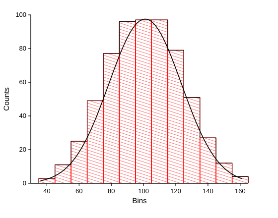
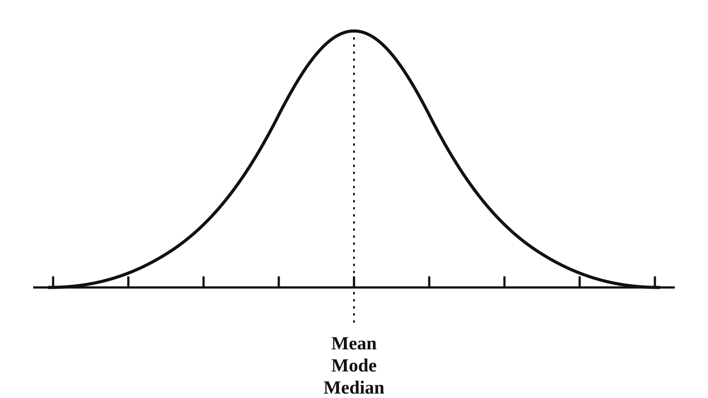
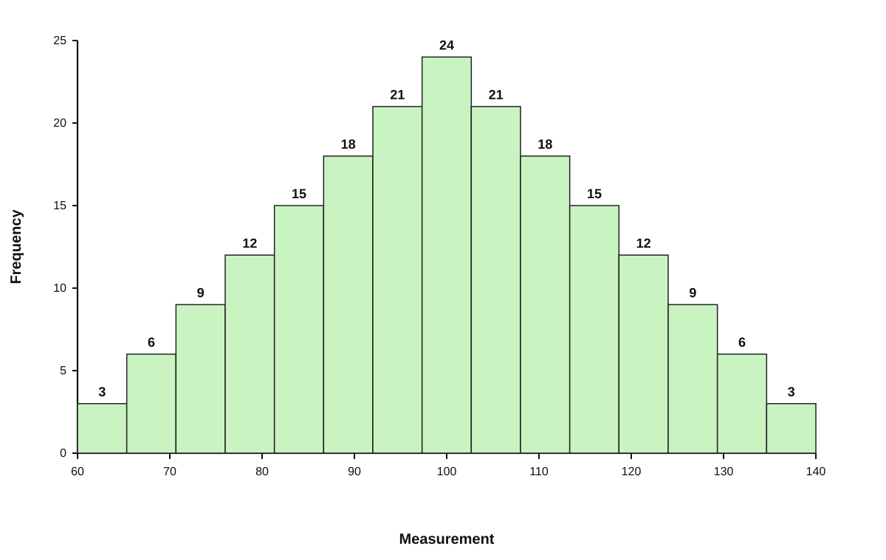
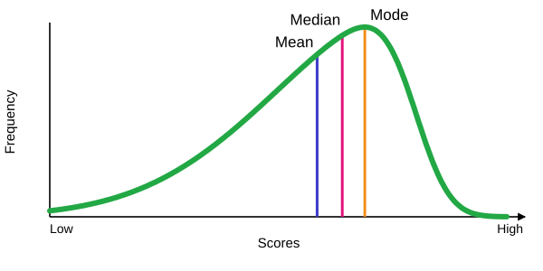
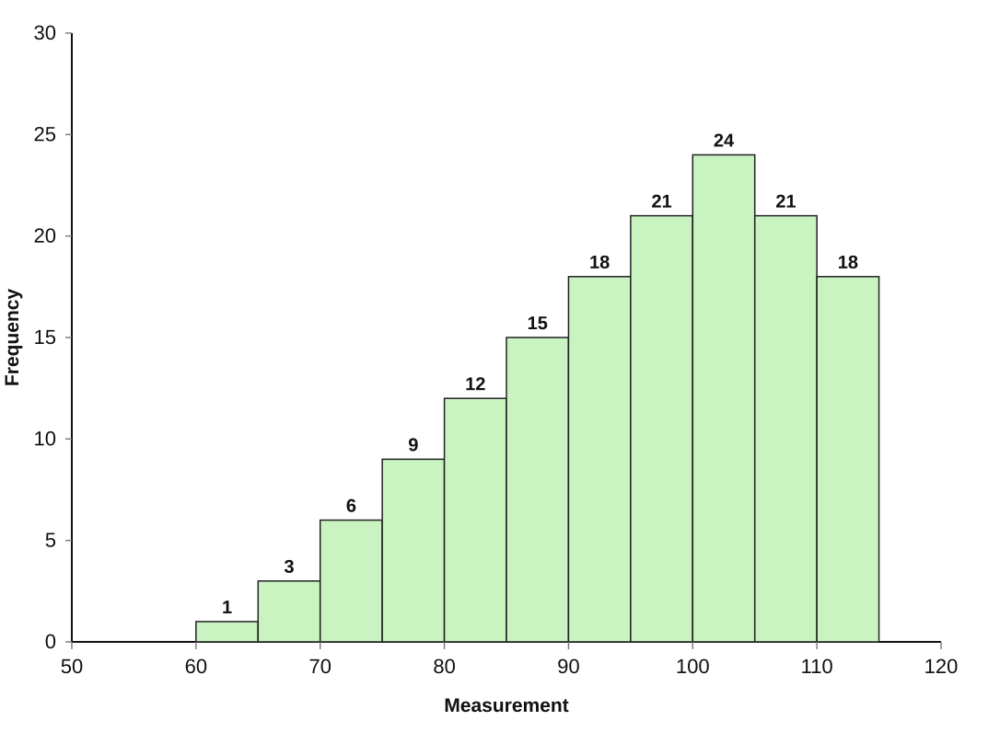
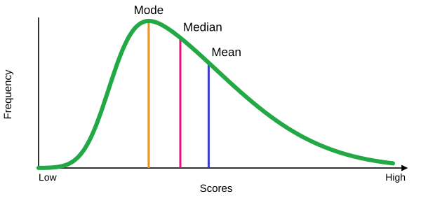
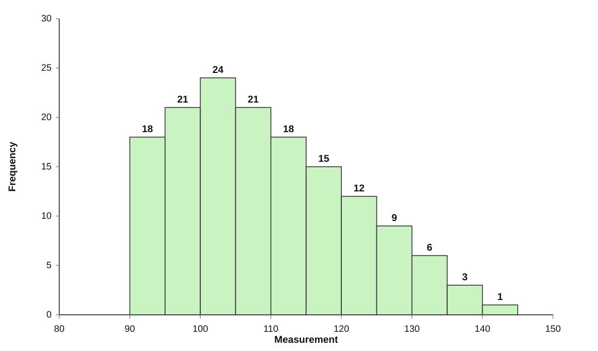
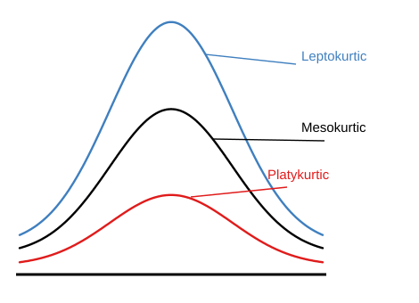
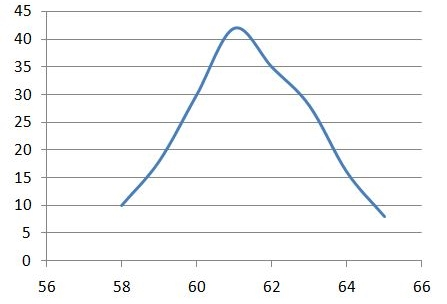

# Skewness and kurtosis

In the previous chapter, we explored numerical measures of central tendency and dispersion. Together, these measures give us insights into the location and spread of our data. However, they don’t fully describe the data distribution. What about its shape?

The shape of a distribution helps us understand the symmetry, peakedness, and presence of tails in the data. While a histogram provides a visual summary of the shape, we often need numerical measures for precise analysis. These measures include:

-   **Skewness**, which quantifies the degree of asymmetry in the data distribution.
-   **Kurtosis**, which measures the “tailedness” or peakedness of the distribution.

In this chapter, we will have a detailed discussion on these two important measures of shape, understanding how they are calculated and interpreted. By the end, you’ll be able to evaluate whether a distribution is symmetric, positively or negatively skewed, and whether it has light or heavy tails.

## Skewness

Skewness is a measure of symmetry, or more precisely, the lack of symmetry. Then you may ask, what does a symmetric distribution look like. A histogram of a symmetric distribution is shown in @fig-histosymm.

{#fig-histosymm fig-align="center" width="80%" style="text-align:center;"}

A distribution, or data set, is symmetric if it looks the same to the left and right of the centre point. In our discussion we are including only unimodal cases.

::: {.callout-important title="Note"}
For a symmetric distribution skewness = 0; mean = median = mode. @fig-symmdist shows what a symmetric distribution looks like.
:::

{#fig-symmdist fig-align="center" width="80%" style="text-align:center;"}

@fig-histodata shows a model data set with skewness = 0 (symmetric distribution) 

{#fig-histodata fig-align="center" width="80%" style="text-align:center;"}

### Negatively skewed

A negatively skewed distribution, also known as a left-skewed distribution, is characterized by a longer tail on the left side of the distribution. The bulk of the data values, or the “mass” of the distribution, is concentrated on the right, as shown in @fig-leftskew.

This type of distribution is referred to as left-skewed, left-tailed, or skewed to the left because of the extended left tail. In such cases, the numerical relationship between the mean, median, and mode typically follows this pattern:

Mean \< Median \< Mode

This occurs because the mean is pulled towards the longer tail, while the median and mode remain closer to the center of the data’s bulk.

{#fig-leftskew fig-align="center" style="text-align:center;" width="80%"}

@fig-negskewed shows a model dataset with negative skewness.

{#fig-negskewed fig-align="center" style="text-align:center;" width="80%"}

### Positively skewed

A positively skewed distribution, also known as a right-skewed distribution, is characterized by a longer tail on the right side. The bulk of the data values, or the “mass” of the distribution, is concentrated on the left, as illustrated in @fig-posskewed.

This type of distribution is referred to as right-skewed, right-tailed, or skewed to the right, due to the extended tail on the right. In such cases, the relationship between the mean, median, and mode typically follows this pattern:

Mean \> Median \> Mode

This occurs because the mean is influenced by the extreme values in the longer right tail, while the median and mode remain closer to the center of the data’s bulk.

{#fig-posskewed fig-align="center" style="text-align:center;" width="80%"}

@fig-rightskeweddat shows a model dataset with positive skewness.

{#fig-rightskeweddat fig-align="center" style="text-align:center;" width="80%"}

## Measures of skewness

The direction and extent of skewness can be measured in various ways. We shall discuss four measures.

### Karl Pearson’s coefficient of skewness ($S_{k}$)

You have noticed that the mean, median and mode are not equal in a skewed distribution. The Karl Pearson’s measure of skewness is based upon the divergence of mean from mode in a skewed distribution.

$$S_{k} = \frac{mean - mode}{\text{standard deviation}}$$ {#eq-karlsq}

The sign of $S_{k}$ gives the direction of skewness and its magnitude gives the extent of skewness. If $S_{k}$ \> 0, the distribution is positively skewed, and if $S_{k}$ \< 0 it is negatively skewed.

In @eq-karlsq since mode is used, there is a problem that if mode is not defined for a distribution we cannot find $S_{k}$. But empirical relation between mean, median and mode states that, for a moderately symmetrical distribution $\ mean - mode \approx 3(mean - median)$. So @eq-karlsq can be written as

$$S_{k} = \frac{3(mean - median)}{\text{standard deviation}}$$ {#eq-karlsq2}

::: {#exm-ct33}
Compute the Karl Pearson’s coefficient of skewness from the following data:

| Height (*x*) | frequency (*f*) |
|:------------:|:---------------:|
|      58      |       10        |
|      59      |       18        |
|      60      |       30        |
|      61      |       42        |
|      62      |       35        |
|      63      |       28        |
|      64      |       16        |
|      65      |        8        |

: Model dataset for skewness calculation {#tbl-skewnessmodel .bordered}

**Solution**

```{r tbl-karlskew, echo=FALSE,warning=FALSE,results='asis'}
#| tbl-cap: "Karl Pearson's coefficient of skewness"
#| fig-cap: "Karl Pearson's coefficient of skewness"  
#| filters: 
#| - parse-latex  


library(knitr)
library(kableExtra)
dt<-read.csv("csv/Book23.csv")
colnames(dt) <- c("Height ($x_{i}$)","frequency ($f_{i}$)","$f_{i}x_{i}$","$f_{i}x_{i}^{2}$")
dt %>%
  kbl(booktabs = TRUE, align = "c", escape = FALSE) %>%
   kable_classic(full_width = F, html_font = "Georgia") %>%
kable_styling(
    # latex_options = "HOLD_position", 
    full_width = FALSE,
    position = "center", 
    bootstrap_options = "bordered"
  ) 
```

Mean, $\overline{x} = \frac{\sum_{i = 1}^{n}{f_{i}x_{i}}}{\sum_{i = 1}^{n}f_{i}}$ = $\frac{11482}{187} = 61.40$

${Sample\ variance,\ s}^{2}$ using @eq-sdfreq = $\frac{705588 - \frac{\left( 11482 \right)^{2}}{187}}{186} = 3.123$

$Standard\ deviation,\ s = \sqrt{3.123} = 1.77$

To calculate the median, refer to the @tbl-karlcf. Locate the cumulative frequency just greater than $\frac{n + 1}{2}$, and the corresponding value of $x$ will be the median ($Q_2$).

Here, $\frac{n + 1}{2} = \frac{187 + 1}{2} = \frac{188}{2} = 94$.\
From the @tbl-karlcf, it is evident that the median is 61.

| Height ($x_{i}$) | frequency ($f_{i}$) | cumulative frequency |
|:----------------:|:-------------------:|:--------------------:|
|        58        |         10          |          10          |
|        59        |         18          |          28          |
|        60        |         30          |          58          |
|        61        |         42          |         100          |
|        62        |         35          |         135          |
|        63        |         28          |         163          |
|        64        |         16          |         179          |
|        65        |          8          |         187          |

: Cumulative frequency for skewness calculation {#tbl-karlcf .bordered}

using @eq-karlsq2

$$S_{k} = \frac{3(61.40 - 61)}{1.77} = \frac{1.2}{1.77} = 0.68$$

Hence, the Karl Pearson’s coefficient of skewness $S_{k}$ = $0.68$, Thus the distribution is positively skewed.
:::

### Bowley’s measure of skewness (*S*~Q~)

Karl Pearson’s coefficient of skewness is most commonly used skewness measure. However, in order to use it you must know the mean, mode (or median) and standard deviation for your data. Sometimes you might not have that information; instead you might have information about quartiles. If that’s the case, you can use Bowley’s measure of skewness as an alternative to find out more about the asymmetry of your distribution. It’s very useful if you have extreme data values (outliers) or if you have an open-ended distribution.

$${Bowley’s\ measure\ of\ Skewness,\ S}_{Q} = \frac{\left( Q_{3} - Q_{2} \right) - \left( Q_{2} - Q_{1} \right)}{\left( Q_{3} - Q_{2} \right) + \left( Q_{2} - Q_{1} \right)}$$ {#eq-bowleyssk}

where, $Q_{1}$ = 1^st^ quartile; $Q_{2}$ = median; $Q_{3}$ = 3^rd^ quartile

Equation can be further modified into

$$S_{Q} = \frac{Q_{3} - 2Q_{2} + Q_{1}}{Q_{3} - Q_{1}}$$ {#eq-bowleyssk2}

-   $S_{Q}$ = 0 means that the curve is symmetrical.

-   $S_{Q}$ \> 0 means the curve is positively skewed.

-   $S_{Q}$\< 0 means the curve is negatively skewed.

Let's find Bowley’s measure of skewness for @tbl-skewnessmodel in @exm-ct33. From the cumulative frequency in @tbl-karlcf, the quartiles can be calculated. Calculation of ${Q}_{1}$, $Q_{2}$, $Q_{3}$ is given in @sec-quartile.

$${Q}_{1} = 60$$

$$Q_{2} = 61$$

$$Q_{3} = 63$$

$$S_{Q} = \frac{63 - (2 \times 61) + 60}{63 - 60} = \ \frac{1}{3} = 0.33$$

Since $S_{Q}$ \> 0 means the curve is positively skewed.

### Kelly’s measure of skewness (*S*~p~)

Bowley’s measure of skewness is based on the middle 50% of the observations; it leaves 25% of the observations on each extreme of the distribution. As an improvement over Bowley’s measure, Kelly has suggested a measure based on Percentiles, including *P*~10~ and *P*~90~ so that only 10% of the observations on each extreme are ignored.

$${Kelly’s\ Measure\ of\ Skewness,\ S}_{p} = \frac{\left( P_{90} - P_{50} \right) - \left( P_{50} - P_{10} \right)}{\left( P_{90} - P_{50} \right) + \left( P_{50} - P_{10} \right)}$$ {#eq-kellyskew}

::: {#exr-ct3}
Try to find Kelly’s measure of skewness for @tbl-skewnessmodel
:::

### Measure based on moments

Before going into measuring skewness using moments, one should know what a moment is:

**Moments**

The ***r***^**th**^ **moment about mean** of a distribution, denoted by $\mu_r$ is given by

$$\mu_{r} = \frac{\sum_{i = 1}^{N}{f_{i}\left( x_{i} - \overline{x} \right)^{r}}}{N}$$ {#eq-moments}

where, $f_{i}$ is the frequency of *i*^th^ observation or class mark $x_{i}$, $N = \sum f_{i}$, the number of observations

Moment about mean is also called as **central moment**.

If *r* = 0, $\mu_{0} = \frac{\sum_{i = 1}^{N}{f_{i}\left( x_{i} - \overline{x} \right)^{0}}}{N}$ = 1

If *r* = 1, $\mu_{1} = \frac{\sum_{i = 1}^{N}{f_{i}\left( x_{i} - \overline{x} \right)^{1}}}{N}$ = 0 (sum of deviation about mean is zero)

If *r* = 2, $\mu_{2} = \frac{\sum_{i = 1}^{N}{f_{i}\left( x_{i} - \overline{x} \right)^{2}}}{N}$ = $\sigma^{2}$, Population variance

::: {.callout-important title="Note"}
It should be remembered that first moment about mean is 0 and second moment about mean is **variance**.
:::

For @tbl-skewnessmodel in @exm-ct33 given above, calculate third central moment, $\mu_{3}$

```{r tbl-moment3, echo=FALSE,warning=FALSE,results='asis'}
#| tbl-cap: "Third central moment calculation"  
#| fig-cap: "Third central moment calculation" 
#| filters: 
#| - parse-latex   

library(knitr)
library(kableExtra)
dt<-read.csv("csv/Book24.csv")
colnames(dt) <- c("Height ($x_{i}$)","frequency ($f_{i}$)","$\\left( x_{i}-\\overline{x} \\right)^{3}$","${f_{i}\\left( x_{i}-\\overline{x}\\right)}^{3}$")
dt %>%
  kbl(booktabs = TRUE, align = "c", escape = FALSE) %>%
   kable_classic(full_width = F, html_font = "Georgia") %>%
kable_styling(
    # latex_options = "HOLD_position", 
    full_width = FALSE,
    position = "center", 
    bootstrap_options = "bordered"
  )
```

Mean = 61.40

$$\mu_{3} = \frac{\sum_{i = 1}^{N}{f_{i}\left( x_{i} - \overline{x} \right)^{3}}}{N} = \ \frac{49.832}{187} = 0.266$$

In short values of following moments about mean are

| Moments about mean |    Value     |
|:------------------:|:------------:|
|    $$\mu_{0}$$     |      1       |
|    $$\mu_{1}$$     |      0       |
|    $$\mu_{2}$$     | $\sigma^{2}$ |

: Moments about mean {#tbl-momentsabtmean .bordered}

#### Beta one and gamma one

The moment measure of skewness is based on the property that, for a symmetrical distribution, all odd ordered central moments are equal to zero. We note that $\mu_{1}$ = 0, for every distribution, therefore, the lowest order moment that can provide an absolute measure of skewness is $\mu_{3}$. So measures of skewness are based on $\mu_{3}$.

$$\beta_{1} = \frac{\mu_{3}^{2}}{\mu_{2}^{3}}$$ {#eq-betaone}

Pronounced as ’beta one’.

$\beta_{1}$= 0 means that the curve is symmetrical. The greater the value of $\beta_{1}$ the more skewed the distribution. One serious limitation of $\beta_{1}$ is that it cannot tell the direction of skewness *i*.*e*. whether it is positive or negative. Since $\mu_{2}$ is always positive (as it is variance) and $\mu_{3}^{2}$ is positive, $\beta_{1}$ will be positive always. This drawback is removed by calculating $\text{γ}_{1}$, called as Karl Pearson’s $\text{γ}_{1}$, pronounced as ’gamma one’.

$$\gamma_{1} = \sqrt{\beta_{1}} = \frac{\mu_{3}}{\mu_{2}^{3/2}}$$ {#eq-gammaone}

If $\mu_{3}$ is positive $\gamma_{1}$ is positive, If $\mu_{3}$ is negative $\gamma_{1}$ is negative

-   $\gamma_{1}$= 0 means that the curve is symmetrical.

-   $\gamma_{1}$ \> 0 means the curve is positively skewed.

-   $\gamma_{1}$\< 0 means the curve is negatively skewed.

For @tbl-skewnessmodel in @exm-ct33, $\beta_{1}$ and $\gamma_{1}$ can be calculated as follows

$\mu_{3}$ = 0.266

$\mu_{2}$ = 3.123

$\beta_{1} = \frac{\mu_{3}^{2}}{\mu_{2}^{3}}$ = $\frac{\left( 0.266 \right)^{2}}{\left( 3.123 \right)^{3}} = \ \frac{0.071}{30.46} = 0.0023$

$\gamma_{1} = \sqrt{\beta_{1}} = \ \sqrt{0.0023} = + 0.05$

Since $\mu_{3}$ is positive, $\gamma_{1}$ is also positive. Since $\gamma_{1}$ is only slightly greater than 0, the distribution is only slightly skewed to the right.

## Kurtosis

Kurtosis is a statistical measure that describes the shape of a distribution’s frequency curve, focusing on its relative peakedness. While skewness measures the asymmetry or lack of symmetry in a distribution, kurtosis evaluates how sharp or flat the peak of the curve is. There are three categories of frequency curves depending upon the shape of their peak as shown in @fig-kurtopeak.

{#fig-kurtopeak fig-align="center" style="text-align:center;" width="40%"}

Kurtosis refers to degree of flatness or peakedness of the curve. It is measured relative to the peakedness of normal curve. The normal curve is considered as *mesokurtic*. If a curve is more peaked than normal curve, it is called *leptokurtic*. If a curve is more flat-topped than normal curve, it is called *platykurtic*. The condition of peakedness (leptokurtic) or flatness (platykurtic) is called **kurtosis of excess**.

### Measure of kurtosis

Kurtosis is measured using $\beta_{2}$ ’beta two’ and $\gamma_{2}$ ’gamma two’ given by Karl Pearson

$$\beta_{2} = \frac{\mu_{4}}{\mu_{2}^{2}}$$ {#eq-beta2}

where, $\mu_{4}$ is the 4^th^ central moment, $\mu_{2}$ is the 2^nd^ central moment

-   $\beta_{2}$ = 3 means that the curve is mesokurtic.

-   $\beta_{2}$ \> 3 means the curve is leptokurtic.

-   $\beta_{2}$\< 3 means the curve is platykurtic.

$$\gamma_{2} = \beta_{2} - 3$$ {#eq-gamma2}

-   $\gamma_{2}$ = 0 means that the curve is mesokurtic.

-   $\gamma_{2}$ \> 0 means the curve is leptokurtic.

-   $\gamma_{2}$\< 0 means the curve is platykurtic.

For @tbl-skewnessmodel in @exm-ct33, kurtosis can be examined as follows
```{r tbl-kutocalc, echo=FALSE,warning=FALSE,results='asis'}
#| tbl-cap: "Measures of kurtosis"
#| fig-cap: "Measures of kurtosis"  
#| filters: 
#| - parse-latex    

library(knitr)
library(kableExtra)
dt<-read.csv("csv/Book25.csv")
colnames(dt) <- c('Height ($x_{i}$)','frequency ($f_{i}$)','$\\left( x_{i}-\\overline{x} \\right)^{4}$','${f_{i}\\left( x_{i}-\\overline{x}\\right)}^{4}$')
dt %>%
  kbl(booktabs = TRUE, align = "c", escape = FALSE) %>%
   kable_classic(full_width = F, html_font = "Georgia") %>%
kable_styling(
    # latex_options = "HOLD_position", 
    full_width = FALSE,
    position = "center", 
    bootstrap_options = "bordered"
  )  
```

Mean, $\overline{x}$ = 61.40

$\mu_{2}$ = 3.123 (calculation shown in previous example)

$\mu_{4} = \frac{\sum_{i = 1}^{N}{f_{i}\left( x_{i} - \overline{x} \right)^{4}}}{N} = \frac{4312.747}{187} = 23.063$

$\beta_{2} = \frac{\mu_{4}}{\mu_{2}^{2}} = \frac{23.063}{\left( 3.123 \right)^{2}} = 2.365$

$\beta_{2}$ is 2.365, which is close to 3, distribution can be considered slightly platykurtic close to symmetric.

You can verify the frequency curve of @exm-ct33 @fig-freqcurvex, it can be seen that it is slightly right tailed (positively skewed).

{#fig-freqcurvex fig-align="center" style="text-align:center;" width="40%"}

 \
 \
 


## Chapter Summary

### Fill in the blanks {.unnumbered}

Answers are given at the end of the chapter.

1. Skewness measures the degree of __________ in a distribution.

2. Kurtosis measures the relative __________ or flatness of a distribution.

3. A distribution that looks the same on both sides of its centre is called a __________ distribution.

4. In a symmetric distribution, mean, median, and mode are __________.

5. In a symmetric distribution, the coefficient of skewness is __________.

6. A distribution with a longer tail on the left side is called __________ skewed.

7. A distribution with a longer tail on the right side is called __________ skewed.

8. In a negatively skewed distribution, the relationship among mean, median, and mode is __________.

9. In a positively skewed distribution, the relationship among mean, median, and mode is __________.

10. Karl Pearson’s coefficient of skewness is based on the difference between the __________ and __________.

11. The sign of Karl Pearson’s coefficient indicates the __________ of skewness.

12. A positive value of Karl Pearson’s coefficient indicates __________ skewness.

13. A negative value of Karl Pearson’s coefficient indicates __________ skewness.

14. Bowley’s measure of skewness is based on __________.

15. Bowley’s measure is particularly useful when the data contain extreme values or an __________ distribution.

16. Kelly’s measure of skewness is based on __________, including $P_{10}$ and $P_{90}$.

17. The $r$th moment about the mean is called the $r$th __________ moment.

18. The zeroth central moment is equal to __________.

19. The first central moment is equal to __________.

20. The second central moment is equal to the population __________.

21. The third central moment is the lowest-order central moment that can provide an absolute measure of __________.

22. The measure $\beta_1$ is based on the __________ central moment and the __________ central moment.

23. $\gamma_1$ is called Karl Pearson’s __________.

24. If $\gamma_1>0$, the distribution is __________ skewed.

25. If $\gamma_1<0$, the distribution is __________ skewed.

26. Kurtosis is measured using $\beta_2$ and __________.

27. The normal curve is called __________.

28. A curve more peaked than the normal curve is called __________.

29. A curve flatter than the normal curve is called __________.

30. If $\beta_2=3$, the distribution is __________.

31. If $\beta_2>3$, the distribution is __________.

32. If $\beta_2<3$, the distribution is __________.

33. If $\gamma_2=0$, the distribution is __________.

34. If $\gamma_2>0$, the distribution is __________.

35. If $\gamma_2<0$, the distribution is __________.

### Short-answer questions {.unnumbered}

1. Define skewness.

2. What is meant by a symmetric distribution?

3. State the characteristics of a symmetric distribution.

4. Explain negative skewness with the relationship among mean, median, and mode.

5. Explain positive skewness with the relationship among mean, median, and mode.

6. What is Karl Pearson’s coefficient of skewness?

7. Explain the interpretation of the sign and magnitude of Karl Pearson’s coefficient of skewness.

8. Why is the alternative Karl Pearson’s formula based on mean and median useful?

9. Define Bowley’s measure of skewness.

10. Explain the situations in which Bowley’s measure of skewness is useful.

11. Define Kelly’s measure of skewness.

12. Why does Kelly’s measure use $P_{10}$ and $P_{90}$?

13. What is a central moment?

14. Explain the first four central moments.

15. Why is the third central moment used as a measure of skewness?

16. Define $\beta_1$ and explain its limitation.

17. Define $\gamma_1$ and explain how it indicates the direction of skewness.

18. Define kurtosis.

19. Explain the three types of kurtosis.

20. What is meant by mesokurtic, leptokurtic, and platykurtic distributions?

21. Define $\beta_2$ and explain its interpretation.

22. Define $\gamma_2$ and explain its interpretation.

23. Distinguish between skewness and kurtosis.

24. Compare Karl Pearson’s, Bowley’s, Kelly’s, and moment-based measures of skewness.

### Numerical and conceptual questions {.unnumbered}

Answers are given at the end of the chapter.

1. A distribution has mean = 61.40, median = 61, and standard deviation = 1.77. Calculate Karl Pearson’s coefficient of skewness and interpret the result.

2. A distribution has mean = 50, median = 48, and standard deviation = 10. Calculate Karl Pearson’s coefficient of skewness.

3. A distribution has mean = 40, median = 42, and standard deviation = 8. Determine the direction of skewness using Karl Pearson’s coefficient.

4. A distribution has $Q_1=60$, $Q_2=61$, and $Q_3=63$. Calculate Bowley’s coefficient of skewness and interpret the result.

5. A distribution has $Q_1=20$, $Q_2=25$, and $Q_3=35$. Calculate Bowley’s coefficient of skewness.

6. A distribution has $Q_1=25$, $Q_2=35$, and $Q_3=40$. Determine whether the distribution is positively or negatively skewed using Bowley’s measure.

7. A distribution has $P_{10}=20$, $P_{50}=30$, and $P_{90}=50$. Calculate Kelly’s measure of skewness.

8. A distribution has $P_{10}=15$, $P_{50}=25$, and $P_{90}=35$. Calculate Kelly’s measure of skewness and interpret the result.

9. Calculate the third central moment for a frequency distribution using

$$
\mu_3=\frac{\sum f_i(x_i-\bar{x})^3}{N}
$$

10. If $\mu_2=4$ and $\mu_3=2$, calculate $\beta_1$ and $\gamma_1$.

11. If $\mu_2=5$ and $\mu_3=-2$, calculate $\beta_1$ and $\gamma_1$ and interpret the direction of skewness.

12. If $\beta_1=0$, what can be concluded about the distribution?

13. If $\gamma_1=0.5$, what is the direction of skewness?

14. If $\gamma_1=-0.5$, what is the direction of skewness?

15. If $\mu_2=4$ and $\mu_4=48$, calculate $\beta_2$ and determine the type of kurtosis.

16. If $\beta_2=3.5$, classify the distribution.

17. If $\beta_2=2.5$, classify the distribution.

18. If $\beta_2=3$, classify the distribution.

19. If $\gamma_2=0.8$, classify the distribution.

20. If $\gamma_2=-0.6$, classify the distribution.

### Important formulae {.unnumbered}

Karl Pearson’s coefficient of skewness:

$$
S_k=\frac{\text{Mean}-\text{Mode}}{\text{Standard deviation}}
$$

Alternative Karl Pearson’s coefficient of skewness:

$$
S_k=\frac{3(\text{Mean}-\text{Median})}{\text{Standard deviation}}
$$

Bowley’s coefficient of skewness:

$$
S_Q=\frac{(Q_3-Q_2)-(Q_2-Q_1)}{(Q_3-Q_2)+(Q_2-Q_1)}
$$

Alternative form of Bowley’s coefficient:

$$
S_Q=\frac{Q_3-2Q_2+Q_1}{Q_3-Q_1}
$$

Kelly’s coefficient of skewness:

$$
S_P=\frac{(P_{90}-P_{50})-(P_{50}-P_{10})}{(P_{90}-P_{50})+(P_{50}-P_{10})}
$$

$r$th central moment:

$$
\mu_r=\frac{\sum_{i=1}^{N}f_i(x_i-\bar{x})^r}{N}
$$

Zeroth central moment:

$$
\mu_0=1
$$

First central moment:

$$
\mu_1=0
$$

Second central moment:

$$
\mu_2=\sigma^2
$$

Third central moment:

$$
\mu_3=\frac{\sum_{i=1}^{N}f_i(x_i-\bar{x})^3}{N}
$$

Measure of skewness based on moments:

$$
\beta_1=\frac{\mu_3^2}{\mu_2^3}
$$

Karl Pearson’s $\gamma_1$:

$$
\gamma_1=\sqrt{\beta_1}
=\frac{\mu_3}{\mu_2^{3/2}}
$$

Measure of kurtosis:

$$
\beta_2=\frac{\mu_4}{\mu_2^2}
$$

Kurtosis of excess:

$$
\gamma_2=\beta_2-3
$$

### Quick revision {.unnumbered}

- Skewness → degree of asymmetry of a distribution.
- Kurtosis → relative peakedness or flatness of a distribution.
- Symmetric distribution → mean = median = mode.
- Symmetric distribution → skewness = 0.
- Negatively skewed → longer left tail.
- Negatively skewed → mean < median < mode.
- Positively skewed → longer right tail.
- Positively skewed → mean > median > mode.
- Karl Pearson’s measure → based on mean, mode or median, and standard deviation.
- Bowley’s measure → based on quartiles.
- Kelly’s measure → based on percentiles, particularly $P_{10}$, $P_{50}$, and $P_{90}$.
- Moment-based skewness → based on the third central moment.
- $\beta_1$ → indicates the extent of skewness but not its direction.
- $\gamma_1$ → indicates both magnitude and direction of skewness.
- $\gamma_1=0$ → symmetric.
- $\gamma_1>0$ → positively skewed.
- $\gamma_1<0$ → negatively skewed.
- $\beta_2=3$ → mesokurtic.
- $\beta_2>3$ → leptokurtic.
- $\beta_2<3$ → platykurtic.
- $\gamma_2=0$ → mesokurtic.
- $\gamma_2>0$ → leptokurtic.
- $\gamma_2<0$ → platykurtic.
- $\mu_1=0$ for every distribution.
- $\mu_2$ is the population variance.
- $\mu_3$ is used for measuring skewness.
- $\mu_4$ is used for measuring kurtosis.

### Answers to fill in the blanks {.unnumbered}

::: {.answer-key}

`1.` Asymmetry `2.` Peakedness `3.` Symmetric `4.` Equal `5.` Zero `6.` Negatively `7.` Positively `8.` Mean < Median < Mode `9.` Mean > Median > Mode `10.` Mean; Mode `11.` Direction `12.` Positive `13.` Negative `14.` Quartiles `15.` Open-ended `16.` Percentiles `17.` Central `18.` 1 `19.` 0 `20.` Variance `21.` Skewness `22.` Third; Second `23.` Gamma one `24.` Positively `25.` Negatively `26.` $\gamma_2$ `27.` Mesokurtic `28.` Leptokurtic `29.` Platykurtic `30.` Mesokurtic `31.` Leptokurtic `32.` Platykurtic `33.` Mesokurtic `34.` Leptokurtic `35.` Platykurtic
:::

### Solutions to numerical and conceptual questions {.unnumbered}

1.  Using @eq-karlsq2, $S_k=\frac{3(61.40-61)}{1.77}=0.68$; since $S_k>0$, the distribution is positively skewed.

2.  Using @eq-karlsq2, $S_k=\frac{3(50-48)}{10}=0.6$; since $S_k>0$, the distribution is positively skewed.

3.  Using @eq-karlsq2, $S_k=\frac{3(40-42)}{8}=-0.75$; since $S_k<0$, the distribution is negatively skewed.

4.  Using @eq-bowleyssk2, $S_Q=\frac{63-2(61)+60}{63-60}=0.33$; since $S_Q>0$, the distribution is positively skewed.

5.  Using @eq-bowleyssk2, $S_Q=\frac{35-2(25)+20}{35-20}=0.33$; the distribution is positively skewed.

6.  Using @eq-bowleyssk2, $S_Q=\frac{40-2(35)+25}{40-25}=-0.33$; since $S_Q<0$, the distribution is negatively skewed.

7.  Using @eq-kellyskew, $S_P=\frac{(50-30)-(30-20)}{(50-30)+(30-20)}=0.33$; the distribution is positively skewed.

8.  Using @eq-kellyskew, $S_P=\frac{(35-25)-(25-15)}{(35-25)+(25-15)}=0$; the distribution is symmetric.

9.  Using @eq-moments with $r=3$: find the mean $\bar{x}$, cube each deviation $(x_i-\bar{x})$, multiply by the frequency $f_i$, sum, and divide by $N$.

10. Using @eq-betaone and @eq-gammaone, $\beta_1=\frac{2^2}{4^3}=0.0625$ and $\gamma_1=\frac{2}{4^{3/2}}=0.25$; since $\gamma_1>0$, the distribution is positively skewed.

11. Using @eq-betaone and @eq-gammaone, $\beta_1=\frac{(-2)^2}{5^3}=0.032$ and $\gamma_1=\frac{-2}{5^{3/2}}=-0.179$; since $\gamma_1<0$, the distribution is negatively skewed.

12. If $\beta_1=0$, the distribution is symmetric.

13. Since $\gamma_1=0.5>0$, the distribution is positively skewed.

14. Since $\gamma_1=-0.5<0$, the distribution is negatively skewed.

15. Using @eq-beta2, $\beta_2=\frac{48}{4^2}=3$; since $\beta_2=3$, the distribution is mesokurtic.

16. Since $\beta_2=3.5>3$, the distribution is leptokurtic.

17. Since $\beta_2=2.5<3$, the distribution is platykurtic.

18. Since $\beta_2=3$, the distribution is mesokurtic.

19. Using @eq-gamma2, since $\gamma_2=0.8>0$, the distribution is leptokurtic.

20. Since $\gamma_2=-0.6<0$, the distribution is platykurtic.

::: {.callout-caution title="Historical Insights"}
**“Crabs and kurtosis”**

The story of **kurtosis** and **skewness** begins with a fascinating scientific journey involving **crabs**! In the late 1800s, Karl Pearson, a pioneering statistician, worked with biologist Walter Weldon to study variations in the size of crustaceans, like crabs. They noticed that the data didn’t follow the usual normal pattern, so Pearson developed new tools to better understand the shapes of these unusual data distributions.

He created the concept of **skewness** to measure whether the data was symmetrical or had long tails on one side. Then, he developed **kurtosis**, a measure of how “peaked” or “flat” the data distribution was compared to the normal curve. These ideas helped statisticians better analyze data that didn’t fit the typical patterns, paving the way for modern statistical tools we still use today! [@fiori2009kurtosis]
:::
::: {.callout-tip title="Quotes to Inspire"}
**“We are just statistics, born to consume resources.”**\
**- Horace**
:::  
