# Uniformity trials

A research worker would perform experiments under identical conditions to obtain valid results, but even with the most uniform land that can be selected, there will still be inherent variations in the soil. So, in order to maintain homogeneity, the experimenter should have a good idea of the nature and extent of fertility variation in the land. This can be obtained from the results of what are known as **uniformity trials**.

Uniformity trials can also be planned to determine the suitable size and shape of the plot and the number of plots in a block. Uniformity trials enable us to have an idea about the fertility variation of the field.

## How a uniformity trial is performed

A uniformity trial is conducted to know the nature of the soil fertility gradient. In a uniformity trial, a particular variety of a crop is sown over the entire experimental field and uniformly managed throughout the growing season without applying fertilizer. At the time of harvest, a substantial border is removed from all sides of the field. The remainder of the field is divided into small plots, which are termed **basic units**. The size of the basic unit is decided by judgement, depending on the crop. The smaller the basic unit, the more accurate the study of heterogeneity that is possible. The produce from each basic unit is harvested and recorded separately. The yield differences between the basic units are taken as the measure of soil heterogeneity of the study area.

Several types of analysis are available to evaluate the pattern of soil heterogeneity based on uniformity trial data. We will discuss some of these procedures in detail.

## Fertility contour map

An approach to describe the heterogeneity of land is to construct a fertility contour map. It is a simple but informative presentation of soil heterogeneity. It is constructed by taking the moving averages of the yields of unit plots and demarcating the regions of the same fertility by grouping together those areas which have yields of the same magnitude. Taking the moving average reduces the large random variation expected on small plots.

## Serial correlation

The serial correlation procedure is generally used to test the randomness of a data set. However, it is also useful in characterizing the trend in soil fertility using uniformity trial data. Horizontal and vertical serial correlations are calculated. These correlations give an idea of whether the fertility gradient is more pronounced horizontally or vertically. A low serial correlation indicates that fertile areas occur in spots, and a high value indicates that there is a gradient.

$$r_{s} = \frac{\sum_{i=1}^{n} X_{i}X_{i+1} - \dfrac{\left( \sum_{i=1}^{n} X_{i} \right)^{2}}{n}}{\sum_{i=1}^{n} X_{i}^{2} - \dfrac{\left( \sum_{i=1}^{n} X_{i} \right)^{2}}{n}}$$ {#eq-serialcorr}

where $X_{i}$ is the value of the $i^{\text{th}}$ basic unit and $n$ is the number of basic units.

## Mean square between strips

This method is simpler to compute and has the same objective as the serial correlation. The units are first combined as horizontal and vertical strips. The variability between strips is measured in each direction by the mean square between strips. The relative size of the two mean squares indicates whether the fertility gradient is more pronounced horizontally or vertically.

$$\text{Sum of squares (Vertical)} = \frac{\sum_{i=1}^{c} V_{i}^{2}}{r} - \frac{G^{2}}{n}$$ {#eq-ssvertical}

$$\text{Sum of squares (Horizontal)} = \frac{\sum_{i=1}^{r} H_{i}^{2}}{c} - \frac{G^{2}}{n}$$ {#eq-sshorizontal}

$$\text{Mean square (Vertical)} = \frac{\text{Sum of squares (Vertical)}}{c - 1}$$ {#eq-msvertical}

$$\text{Mean square (Horizontal)} = \frac{\text{Sum of squares (Horizontal)}}{r - 1}$$ {#eq-mshorizontal}

where $V_{i}$ and $H_{i}$ are the sum totals of the basic units in the vertical and horizontal strips respectively; $r$ is the number of rows and $c$ is the number of columns. $n$ is the total number of basic units, $n = r \times c$. $G$ is the total of all the basic units.

## Fairfield Smith's variance law

Smith (1938) gave an empirical relationship between variance and plot size [@Smith1938]. He developed an empirical model representing the relationship between plot size and the variance of the mean per plot. This model is given by the equation

$$V_{x} = \frac{V_{1}}{x^{b}}$$ {#eq-smithlaw}

Taking logarithms on both sides,

$$\log V_{x} = \log V_{1} - b\log x$$ {#eq-smithlog}

where $x$ is the number of basic units in a plot, $V_{x}$ is the variance of the mean per plot of $x$ units, $V_{1}$ is the variance of the mean per plot of one unit, and $b$ is the regression coefficient. The value of $b$ is determined by the principle of least squares. $b$ is called **Smith's index of soil heterogeneity**. The index gives a single value as a quantitative measure of heterogeneity in the area.

### Smith's index of soil heterogeneity {#sec-smith}

**Step 1.** Combine the basic units to simulate plots of different sizes and shapes. Use only combinations that fit exactly into the whole area, *i*.*e*. the product of the number of simulated plots and the number of basic units per plot must equal the total number of basic units.

**Step 2.** For each of the simulated plots constructed in Step 1, compute the yield total $T$ as the sum of the basic units that make up that plot, and compute the between-plot variance $V_{(x)}$:

$$V_{(x)} = \sum_{i=1}^{w}\frac{T_{i}^{2}}{x} - \frac{G^{2}}{rc}$$ {#eq-betweenplotvar}

where $w = \dfrac{rc}{x}$ is the total number of simulated plots of size $x$ basic units. $r$ is the number of rows and $c$ is the number of columns. $G$ is the total of all the basic units.

**Step 3.** For each plot size and shape, compute the variance per unit area:

$$V_{x} = \frac{V_{(x)}}{rc - 1}$$ {#eq-varperunit}

**Step 4.** For each plot size having more than one shape, test the homogeneity of the between-plot variances $V_{(x)}$ to determine the significance of the plot orientation (plot-shape) effect, using the F test or the chi-square test. If they are found to be homogeneous, the average of the $V_{(x)}$ values over all plot shapes of a given size is computed; otherwise the $V_{(x)}$ of each plot shape of a given size is used separately for further calculation.

For example, there are two plot shapes for size 2 m², *i*.*e*. 2 × 1 m and 1 × 2 m. For both of these plots $V_{(x)}$ is calculated. Homogeneity is tested using the F test. If it is non-significant, the average of the $V_{(x)}$ values over the plot shapes 2 × 1 m and 1 × 2 m is calculated.

**Step 5.** Using the values of the variance per unit area $V_{x}$ computed in Steps 3 and 4, estimate the regression coefficient between $V_{x}$ and plot size $x$.

Using Fairfield Smith's variance law, @eq-smithlog can be written as

$$\log V_{x} - \log V_{1} = -b\log x$$ {#eq-smithlogdiff}

Consider $Y = \log V_{x} - \log V_{1}$. Then @eq-smithlogdiff can be written in the form

$$Y = cX \quad \text{where} \quad c = -b, \ X = \log x$$

$b$ is estimated by fitting a regression between $Y$ and $X$.

**Step 6.** Obtain the adjusted $b$ from the computed $b$ value using the range $\dfrac{x_{1}}{n}$, where $x_{1}$ is the size of the basic unit and $n$ is the whole area size. Columns 2 and 3 in @tbl-adjb give the range of $\dfrac{x_{1}}{n}$. Once you have the computed $b$ and the value of $\dfrac{x_{1}}{n}$, you can calculate the corresponding adjusted $b$ using @tbl-adjb by interpolation as follows.

Find $L_1$ and $L_2$ such that the calculated $b$ lies between them, $L_1 \leq b_{\text{cal}} \leq L_2$, where $L_1$ and $L_2$ are the values in the computed $b$ column of @tbl-adjb. Let $y_1$ and $y_2$ be the values corresponding to $L_1$ and $L_2$ under the range of $\dfrac{x_{1}}{n}$ in @tbl-adjb. Then use the formula

$$\text{Adjusted } b = y_{1} + (b_{\text{cal}} - L_{1})\frac{\left( y_{2} - y_{1} \right)}{\left( L_{2} - L_{1} \right)}$$ {#eq-adjb}

```{r echo=FALSE, warning=FALSE, results='asis'}
#| label: tbl-adjb
#| tbl-cap: "Adjusted b table. Obtain the value of b using the range values and the computed b value."
library(knitr)
library(kableExtra)
dt<-read.csv("csv/b.csv")
dt %>%
 kbl(col.names = NULL, align = "c", booktabs = TRUE) %>%
   kable_classic(full_width = FALSE, html_font = "Georgia") %>%
kable_styling(
    full_width = FALSE,
    position = "center",
    bootstrap_options = "bordered"
  )
```

::: {.callout-note title="Note"}
A relatively low value of the calculated adjusted Smith's index of soil heterogeneity ($b$) indicates a relatively high degree of correlation among adjacent plots in the study area, which means the change in the level of soil fertility tends to be gradual rather than in patches. Even though $b$ is a regression coefficient, its value lies between 0 and 1.
:::

## Maximum curvature method {#sec-mcm}

This method is used to find the optimal plot size for the experiment. In this method, the basic units of the uniformity trial are combined to form new units. The new units are formed by combining columns, rows, or both. The combination of columns and rows is done in such a way that no column or row is left out. For each set of units, the coefficient of variation (CV) is computed. A curve is plotted by taking the plot size (in terms of basic units) on the X-axis and the CV values on the Y-axis of a graph sheet. The point at which the curve takes a turn, *i*.*e*. the point of maximum curvature, is located by inspection. The value corresponding to the point of maximum curvature is the optimum plot size.

## Uniformity trial explained

Let us discuss in detail the procedures explained above using an example. Consider a rice crop field of 12 m × 17 m, uniformly managed throughout the growing season without applying fertilizer. At the time of harvest, a border of 1 m is removed from all sides of the field. The resultant effective area is now 10 m × 15 m. The entire field is divided into basic units of size 1 m × 1 m, and the yield (in grams) is noted from each basic unit. There are 150 basic units.

```{r echo=FALSE, out.width="90%", fig.align='center'}
#| label: fig-u1
#| fig-cap: "Yield observed from the plots of 1 × 1 m size"
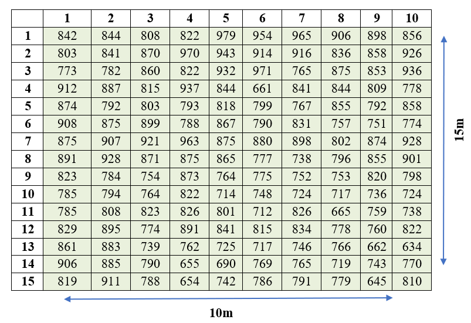
```

::: {.callout-note title="Note"}
Here $r = 15$, $c = 10$, and the total number of basic units $n = r \times c = 150$.
:::

### Fertility contour map

Also known as a soil productivity contour map. The construction of a fertility contour map is explained using the above example.

**Step 1.** Calculate the moving averages of 3 × 3 basic units, *i*.*e*. including three basic units in the rows and three basic units in the columns.

```{r echo=FALSE, out.width="90%", fig.align='center'}
#| label: fig-u2
#| fig-cap: "Calculation of moving averages of 3 × 3 basic units"
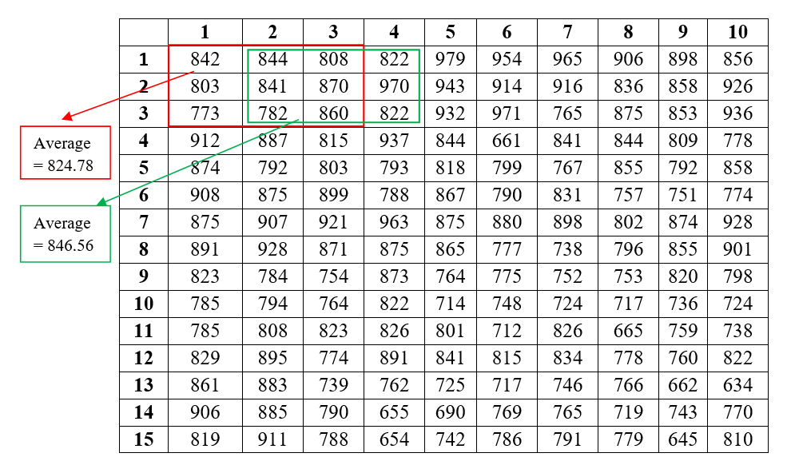
```

**Step 2.** The moving averages are labelled as shown below. After the calculation of moving averages, there are now 8 values in a row and 13 values in a column. The dimension of each plot in the figure below can be considered as 1.25 m × 1.154 m ($10/8 = 1.25$ and $15/13 = 1.154$).

```{r echo=FALSE, out.width="90%", fig.align='center'}
#| label: fig-u3
#| fig-cap: "Moving averages recorded for all 3 × 3 basic units"
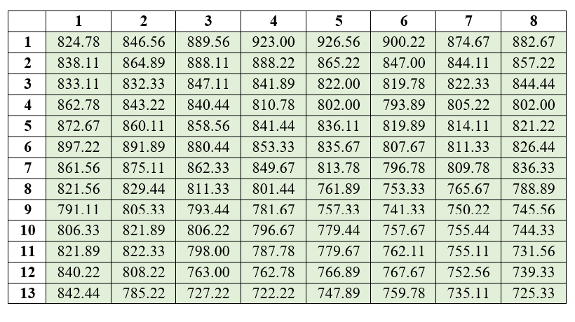
```

**Step 3.** Similar areas are given the same colour to get a fertility contour map.

```{r echo=FALSE, out.width="20%", fig.align='center'}
#| label: fig-u4
#| fig-cap: "Colouring scheme based on the range of moving averages. This can be decided by the experimenter."
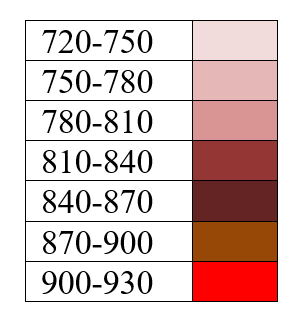
```

```{r echo=FALSE, out.width="90%", fig.align='center'}
#| label: fig-u5
#| fig-cap: "Coloured plot labelled with moving averages"
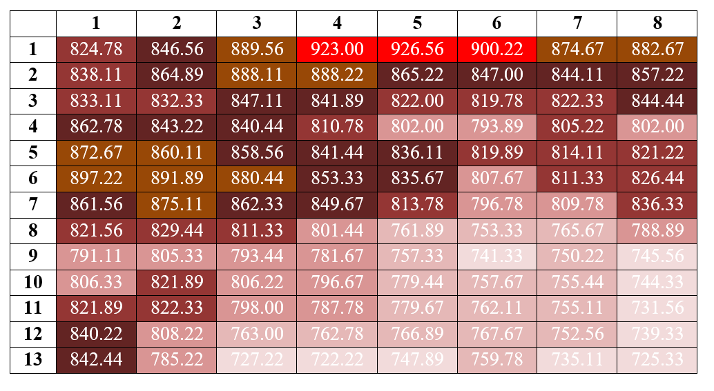
```

The final fertility contour map is obtained as shown in @fig-u6. Now you can get an idea of the fertility gradient of the field and plan how to create blocks in the field.

```{r echo=FALSE, out.width="90%", fig.align='center'}
#| label: fig-u6
#| fig-cap: "Final fertility contour map"
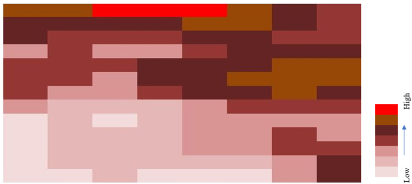
```

The fertility contour map gives only a vague idea of the fertility gradient. Other procedures may give a better idea.

### Serial correlation

The pairwise calculation of vertical values from the experimental observations shown in @fig-u1 is illustrated below.

```{r echo=FALSE, out.width="90%", fig.align='center'}
#| label: fig-serial1
#| fig-cap: "Pairwise calculation of vertical values"
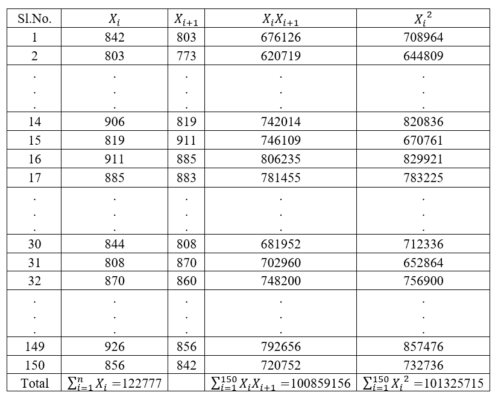
```

Using @eq-serialcorr,

Vertical $r_{s} = \dfrac{100859156 - \dfrac{(122777)^{2}}{150}}{101325715 - \dfrac{(122777)^{2}}{150}} = 0.438627$

The pairwise calculation of horizontal values is shown in @fig-serial2.

```{r echo=FALSE, out.width="90%", fig.align='center'}
#| label: fig-serial2
#| fig-cap: "Pairwise calculation of horizontal values"

```

Using @eq-serialcorr,

Horizontal $r_{s} = \dfrac{100946042 - \dfrac{(122777)^{2}}{150}}{101325715 - \dfrac{(122777)^{2}}{150}} = 0.54317$

Both coefficients are low, which indicates the presence of fertile areas in spots. However, the horizontal serial correlation coefficient was a little higher than the vertical, implying some fertility gradient in the horizontal direction. The relative magnitude of the two serial correlations should not, however, be used to indicate the relative degree of the gradients in the two directions.

### Mean square between strips

```{r echo=FALSE, out.width="90%", fig.align='center'}
#| label: fig-meansq
#| fig-cap: "Mean square between strips from uniformity trial data"
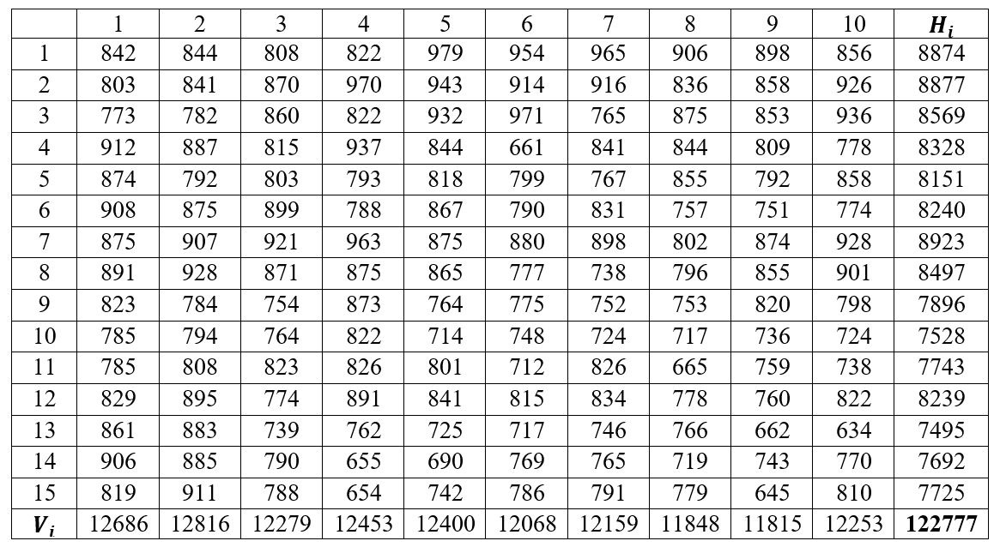
```

$G = 122777$, $n = 150$.

$$\text{Sum of squares (Vertical)} = \frac{\sum_{i=1}^{c} V_{i}^{2}}{r} - \frac{G^{2}}{n} = \frac{12686^{2} + 12816^{2} + \ldots + 12253^{2}}{15} - \frac{122777^{2}}{150} = 63971.47$$

$$\text{Sum of squares (Horizontal)} = \frac{\sum_{i=1}^{r} H_{i}^{2}}{c} - \frac{G^{2}}{n} = \frac{8874^{2} + 8877^{2} + \ldots + 7692^{2}}{10} - \frac{122777^{2}}{150} = 341185.77$$

$$\text{Mean square (Vertical)} = \frac{63971.47}{9} = 7107.94$$

$$\text{Mean square (Horizontal)} = \frac{341185.77}{14} = 24370.41$$

::: {.callout-note title="Note"}
The results show that the horizontal-strip mean square is almost 3 times higher than the vertical-strip mean square, indicating that the trend of soil fertility was more pronounced along the length than along the width of the field.
:::

### Smith's index of soil heterogeneity

::: {#exm-smith}
The optimal plot size can be identified using this method. From the possible plot sizes, the optimum plot size can be found using the method explained in @sec-smith. @tbl-plotsizes shows 9 different plot sizes created from the uniformity trial data in @fig-u1.

**Solution**

```{r echo=FALSE, warning=FALSE, results='asis'}
#| label: tbl-plotsizes
#| tbl-cap: "Nine different plot sizes created from the uniformity trial data"
library(knitr)
library(kableExtra)
dt<-read.csv("csv/Book20.csv")
kbl(dt, escape = FALSE, booktabs = TRUE, align = "c") %>%
  kable_classic(full_width = FALSE, html_font = "Georgia") %>%
  kable_styling(
    full_width = FALSE,
    position = "center",
    bootstrap_options = "bordered"
  ) %>%
  row_spec(0, bold = TRUE, align = "c") %>%
  column_spec(1:5, width = "3cm", extra_css = "text-align: center;")
```

It is recommended that the reader first read @sec-smith and then read this example. Here, we illustrate how the variance per unit area for a plot of size 25 m² (denoted as $V_{25}$) is calculated. The width and length of the plot are 5 m × 5 m. The entire plot area in @fig-u1 is divided into six plots of size 25 m² as shown in @fig-smith1.

```{r echo=FALSE, out.width="70%", fig.align='center'}
#| label: fig-smith1
#| fig-cap: "The uniformity trial plot is divided into six plots"
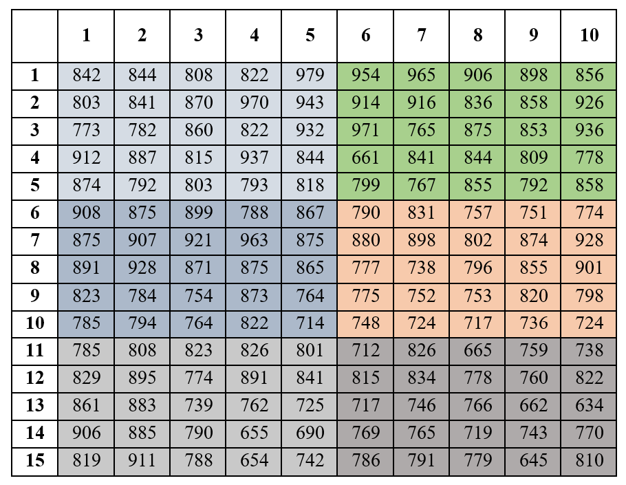
```

Now consider the equation for the between-plot variance, @eq-betweenplotvar, where $w = \dfrac{rc}{x}$ is the total number of simulated plots of size $x$ basic units. $r$ is the number of rows and $c$ is the number of columns. $G$ is the total of all the basic units. The totals of each of the six plots are shown in @fig-smith2.

```{r echo=FALSE, out.width="30%", fig.align='center'}
#| label: fig-smith2
#| fig-cap: "Totals of each of the six plots"
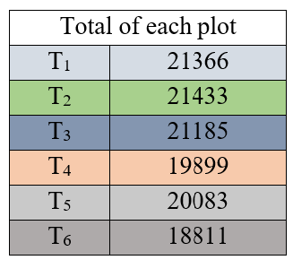
```

$$V_{(25)} = \frac{21366^{2} + 21433^{2} + \ldots + 18811^{2}}{25} - \frac{(122777)^{2}}{150} = 218767.71$$

The variance per unit area is given by @eq-varperunit,

$$V_{25} = \frac{218767.71}{149} = 1468.24$$

The coefficient of variation is calculated as $\dfrac{\text{standard deviation}}{\text{mean}} \times 100$. Here, for the plot size of 25, the standard deviation $= \sqrt{1468.24} = 38.318$, and the mean of the entire data set $= 818.5133$. Therefore, $\text{C.V} = \dfrac{38.318}{818.5133} = 0.047$. Similarly, it can be calculated for all the plot sizes. The $V_{x}$ and C.V for all other plot sizes are summarized in @tbl-vxcv.

```{r echo=FALSE, warning=FALSE, results='asis'}
#| label: tbl-vxcv
#| tbl-cap: "Variance per unit area and C.V for all plot sizes"
library(knitr)
library(kableExtra)
dt<-read.csv("csv/Book21.csv")
kbl(dt, escape = FALSE, booktabs = TRUE, align = "c") %>%
  kable_classic(full_width = FALSE, html_font = "Georgia") %>%
  kable_styling(
    full_width = FALSE,
    position = "center",
    bootstrap_options = "bordered"
  ) %>%
  row_spec(0, bold = TRUE, align = "c") %>%
  column_spec(1:7, width = "3cm", extra_css = "text-align: center;")
```

For each plot size having more than one shape (here plot size 5 has more than one shape), test the homogeneity of the between-plot variances $V_{(x)}$ to determine the significance of the plot orientation (plot-shape) effect, using the F test or the chi-square test. For each plot size whose plot-shape effect is non-significant, compute the average of the $V_{x}$ values over all plot shapes and proceed with the estimation of Smith's index of soil heterogeneity.

$V_{(x)}$ calculated for both plot shapes:

| Plot shape | $V_{(x)}$ |
|:----------:|:---------:|
| 1 × 5      | 456895.9  |
| 5 × 1      | 329859.5  |

: Between-plot variance for the two shapes of the size-5 plot {#tbl-plotshapevar .bordered}

The degrees of freedom for the F test are $(w_{1} - 1,\ w_{2} - 1)$, where $w_{1}$ and $w_{2}$ are the number of plots of each particular shape. Here, the degrees of freedom $= (30 - 1,\ 30 - 1) = (29, 29)$. F is calculated as the ratio of the $V_{(x)}$ of the two plot shapes, $F_{\text{cal}} = \dfrac{456895.9}{329859.5} = 1.39$. The calculated value of F is compared with the table value of F. The table value of F at $(29, 29)$ degrees of freedom is $F_{\text{table}} = 1.860$. Since $F_{\text{cal}} < F_{\text{table}}$, the calculated F is non-significant, so we take the average of the $V_{x}$ of both plot shapes and proceed. In our example, we proceeded without taking the average. This F test example is included for a better understanding of the theory.

Now Smith's index of soil heterogeneity is estimated as follows.

```{r echo=FALSE, warning=FALSE, results='asis'}
#| label: tbl-smithindex
#| tbl-cap: "Estimation of Smith's index of soil heterogeneity"
library(knitr)
library(kableExtra)
dt<-read.csv("csv/Book22.csv")
colnames(dt) <- c("Size of plot x","$V_x$","$\\log V_x$","$Y=\\log V_x-\\log V_1$","$X=\\log x$")
kbl(dt, escape = FALSE, booktabs = TRUE, align = "c") %>%
  kable_classic(full_width = FALSE, html_font = "Georgia") %>%
  kable_styling(
    full_width = FALSE,
    position = "center",
    bootstrap_options = "bordered"
  ) %>%
  row_spec(0, bold = TRUE, align = "c") %>%
  column_spec(1:5, width = "3cm", extra_css = "text-align: center;")
```

Fit a linear regression $Y = cX$ and estimate the value of $c$, where $c = -b$.

The estimated value of $c$ is $-0.3952$. Therefore, the calculated value of $b = 0.3952$. In our case, $\dfrac{x_{1}}{n} = \dfrac{1}{150} = 0.0067$. Now we need to find the adjusted value as explained in Step 6 of @sec-smith using @tbl-adjb. The value of $\dfrac{x_{1}}{n} = 0.0067$ is between 0.001 and 0.01.

Here $b_{\text{cal}} = 0.3952$, $y_{1} = 0.443$, $y_{2} = 0.528$, $L_{1} = 0.40$, and $L_{2} = 0.50$.

$$\text{Adjusted } b = 0.443 + (0.3952 - 0.40)\frac{(0.528 - 0.443)}{(0.50 - 0.40)} = 0.43892$$

The value obtained from the interpolation matches the adjusted $b$ in @tbl-adjb. If the $b$ value is low, it indicates a relatively high degree of correlation among adjacent plots in the study area, indicating a gradual change in soil fertility. But here $b$ is 0.43892, which is moderate, so there is no indication of a gradient, only a slight indication of patches.
:::

### Maximum curvature method

This method (see @sec-mcm) is used to find the optimum plot size. A curve is plotted by taking the plot size (in terms of basic units) on the X-axis and the CV values on the Y-axis.

```{r echo=FALSE, out.width="60%", fig.align='center'}
#| label: fig-mcm1
#| fig-cap: "Relationship between CV and plot size"
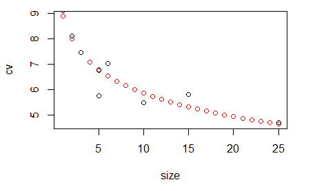
```

@fig-mcm1 indicates that as the plot size increases, the coefficient of variation decreases, and this decrease is maximum with the square-shaped plot of 5 m × 5 m. As we took a small data set for illustrative purposes, it is clearly seen that the 5 m × 5 m plot has the lowest CV value and also the lowest variance per basic unit area.

```{r echo=FALSE, out.width="60%", fig.align='center'}
#| label: fig-mcm2
#| fig-cap: "Relationship between variance per basic unit area and plot size"
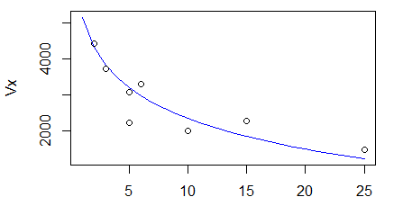
```

@fig-mcm2 shows the relationship between the variance per basic unit area $V_{x}$ and the plot size $x$.  

::: {.callout-tip title="Quotes to Inspire"}
**“The business of the statistician is to catalyze the scientific learning process.”**\
**- George Box**
:::  

## Chapter Summary

### Fill in the blanks {.unnumbered}

Answers are given at the end of the chapter.

1. A trial conducted to study the nature and extent of fertility variation in a field is called a __________ trial.

2. In a uniformity trial, the entire experimental field is planted with a single __________ of crop.

3. In a uniformity trial, the crop is managed __________ throughout the growing season.

4. Fertilizer is generally __________ in a uniformity trial.

5. The small plots into which the effective field is divided are called __________ units.

6. The smaller the basic unit, the more accurately the study of field __________ can be made.

7. The yield differences between basic units are used as a measure of soil __________.

8. A fertility contour map is constructed using __________ averages of yields.

9. Moving averages help to reduce the large random variation expected on __________ plots.

10. Serial correlation can be calculated in both the __________ and __________ directions.

11. A low serial correlation indicates that fertile areas occur in __________.

12. A high serial correlation indicates the presence of a fertility __________.

13. The relative size of horizontal and vertical serial correlations gives an indication of the __________ of fertility pattern.

14. The mean square between strips method has the same objective as the __________ correlation method.

15. In the mean square between strips method, basic units are combined into __________ and __________ strips.

16. The variability between strips is measured using the __________ square between strips.

17. Smith's variance law describes the relationship between plot size and the __________ of the mean per plot.

18. Fairfield Smith's variance law is represented by $V_x=$ __________.

19. The parameter $b$ in Smith's variance law is called Smith's index of soil __________.

20. A lower value of Smith's index generally indicates a higher degree of __________ among adjacent plots.

21. The value of Smith's index $b$ lies between __________ and __________.

22. In constructing simulated plots, the product of the number of plots and the number of basic units per plot must equal the __________ number of basic units.

23. The total yield of the basic units forming a simulated plot is denoted by __________.

24. The variance between simulated plots is denoted by __________.

25. Variance per unit area is obtained by dividing the between-plot variance by __________.

26. When a plot size has more than one possible shape, the homogeneity of the variances can be tested using the __________ test or the __________ test.

27. If the variances for different plot shapes are homogeneous, their __________ is used for further calculation.

28. Smith's index is estimated by fitting a __________ between $\log V_x-\log V_1$ and $\log x$.

29. In the regression equation $Y=cX$, the relationship between $c$ and Smith's index is __________.

30. The adjusted value of Smith's index is obtained by __________ when the calculated value lies between two tabulated values.

31. The maximum curvature method is used to determine the __________ plot size.

32. In the maximum curvature method, plot size is plotted on the __________ axis.

33. In the maximum curvature method, coefficient of variation is plotted on the __________ axis.

34. As plot size increases, the coefficient of variation generally __________.

35. The plot size corresponding to the point of maximum curvature is considered the __________ plot size.

36. The first true uniformity trial was conducted at __________ Experimental Station.

37. The first true uniformity trial was conducted by W. B. Mercer and __________.

38. The historical uniformity trial was conducted using a field of __________.

39. The study showed that neighbouring plots tended to __________ one another.

40. The historical uniformity trial demonstrated that combining small plots into larger plots reduces the variability per __________ area.

### Short-answer questions {.unnumbered}

1. Define a uniformity trial.

2. State the objectives of a uniformity trial.

3. Explain how a uniformity trial is conducted.

4. What are basic units?

5. Why should the basic units be as small as possible?

6. How can a uniformity trial help in planning a field experiment?

7. What information about a field can be obtained from a uniformity trial?

8. Explain the construction of a fertility contour map.

9. What is the purpose of using moving averages in a fertility contour map?

10. What is serial correlation?

11. Why are horizontal and vertical serial correlations calculated separately?

12. Interpret a low serial correlation in a uniformity trial.

13. Interpret a high serial correlation in a uniformity trial.

14. What is the limitation of interpreting the relative magnitude of horizontal and vertical serial correlations?

15. Explain the mean square between strips method.

16. Distinguish between horizontal and vertical strips.

17. How is the direction of the fertility gradient identified using mean squares between strips?

18. What is Fairfield Smith's variance law?

19. Explain the meaning of $V_x$, $V_1$, $x$, and $b$ in Smith's variance law.

20. What is Smith's index of soil heterogeneity?

21. Explain the interpretation of a low value of Smith's index.

22. Explain the steps involved in estimating Smith's index of soil heterogeneity.

23. Why should all possible simulated plot sizes and shapes fit exactly within the field?

24. Explain the calculation of between-plot variance.

25. Explain how variance per unit area is calculated.

26. Why is the homogeneity of variance tested when a plot size has more than one shape?

27. Explain how the F test is used to compare variances of different plot shapes.

28. Explain the regression procedure used to estimate Smith's index.

29. Why is the calculated Smith's index adjusted?

30. Explain the interpolation method used to obtain adjusted $b$.

31. What is the maximum curvature method?

32. Explain how the optimum plot size is obtained by the maximum curvature method.

33. Why does coefficient of variation generally decrease with increase in plot size?

34. Compare Smith's method and the maximum curvature method for determining plot size.

35. Explain how the results of a uniformity trial can help in deciding block size.

36. Explain the importance of plot size and shape in agricultural experiments.

37. Explain the historical importance of the uniformity trial conducted at Rothamsted Experimental Station.

### Numerical and conceptual questions {.unnumbered}

Answers are given at the end of the chapter.

1. A field of 12 m × 17 m is used for a uniformity trial. A border of 1 m is removed from all sides. Find the effective area.

2. If the effective field in Question 1 is divided into 1 m × 1 m basic units, find the total number of basic units.

3. In a uniformity trial, explain why fertilizer is not applied to the crop.

4. A uniformity trial gives low horizontal and vertical serial correlation coefficients. What does this indicate about the distribution of fertility?

5. The horizontal serial correlation is 0.54 and the vertical serial correlation is 0.44. Explain the interpretation based on the chapter.

6. Calculate the vertical and horizontal mean squares between strips when the required strip totals and grand total are given.

7. The vertical mean square is 7107.94 and the horizontal mean square is 24370.41. Which direction shows greater fertility variation?

8. Explain why the relative magnitude of the two serial correlation coefficients should not be used to quantify the relative degree of fertility gradients.

9. A uniformity trial contains $r$ rows and $c$ columns of basic units. Find the total number of basic units.

10. A plot size contains $x$ basic units and the field contains $rc$ basic units. Find the number of simulated plots.

11. Calculate the between-plot variance when the simulated plot totals, total number of basic units, and grand total are given.

12. Explain why the variance per unit area is calculated after obtaining the between-plot variance.

13. For a plot size having two orientations, the calculated variances are 456895.9 and 329859.5. Calculate the F statistic.

14. If the calculated F value is 1.39 and the table value is 1.860, state the conclusion regarding plot orientation.

15. Given $b_{\text{cal}}=0.3952$, $L_1=0.40$, $L_2=0.50$, $y_1=0.443$, and $y_2=0.528$, calculate the adjusted Smith's index.

16. Explain the interpretation of an adjusted Smith's index of 0.43892.

17. A uniformity trial gives CV values for several plot sizes. Explain how the optimum plot size can be identified using the maximum curvature method.

18. If the CV decreases sharply up to a particular plot size and then changes only slightly, explain which plot size would be considered appropriate.

19. Explain why the optimum plot size obtained from the maximum curvature method may depend on the crop and field conditions.

20. A field has strong fertility variation in the horizontal direction. Explain how this information can be used while planning blocks.

### Important formulae {.unnumbered}

Serial correlation:

$$
r_s=\frac{\sum_{i=1}^{n}X_iX_{i+1}-\frac{\left(\sum_{i=1}^{n}X_i\right)^2}{n}}{\sum_{i=1}^{n}X_i^2-\frac{\left(\sum_{i=1}^{n}X_i\right)^2}{n}}
$$

Total number of basic units:

$$
n=r\times c
$$

Vertical sum of squares:

$$
SS_V=\frac{\sum_{i=1}^{c}V_i^2}{r}-\frac{G^2}{n}
$$

Horizontal sum of squares:

$$
SS_H=\frac{\sum_{i=1}^{r}H_i^2}{c}-\frac{G^2}{n}
$$

Vertical mean square:

$$
MS_V=\frac{SS_V}{c-1}
$$

Horizontal mean square:

$$
MS_H=\frac{SS_H}{r-1}
$$

Fairfield Smith's variance law:

$$
V_x=\frac{V_1}{x^b}
$$

Logarithmic form of Smith's variance law:

$$
\log V_x=\log V_1-b\log x
$$

Difference form:

$$
\log V_x-\log V_1=-b\log x
$$

Regression form:

$$
Y=cX
$$

where

$$
Y=\log V_x-\log V_1
$$

and

$$
X=\log x
$$

Relationship between regression coefficient and Smith's index:

$$
c=-b
$$

Number of simulated plots:

$$
w=\frac{rc}{x}
$$

Between-plot variance:

$$
V_{(x)}=\sum_{i=1}^{w}\frac{T_i^2}{x}-\frac{G^2}{rc}
$$

Variance per unit area:

$$
V_x=\frac{V_{(x)}}{rc-1}
$$

Coefficient of variation:

$$
CV=\frac{\text{Standard deviation}}{\text{Mean}}\times100
$$

Standard deviation from variance:

$$
SD=\sqrt{V_x}
$$

Adjusted Smith's index:

$$
\text{Adjusted }b=y_1+(b_{\text{cal}}-L_1)\frac{y_2-y_1}{L_2-L_1}
$$

F statistic for comparing variances of two plot shapes:

$$
F=\frac{\text{Larger variance}}{\text{Smaller variance}}
$$

### Quick revision {.unnumbered}

- Uniformity trial → used to study the nature and extent of fertility variation in a field.

- A single crop variety is grown over the entire field.

- The crop is managed uniformly and fertilizer is not applied.

- A substantial border is removed before dividing the field into basic units.

- Basic unit → smallest unit from which yield is separately recorded.

- Yield differences among basic units → measure of soil heterogeneity.

- Smaller basic units → more accurate study of field heterogeneity.

- Uniformity trials can help determine → fertility variation, plot size, plot shape, and block size.

- Fertility contour map → graphical representation of soil heterogeneity.

- Moving averages → used to reduce random variation and identify areas of similar fertility.

- Similar fertility areas → grouped together in the contour map.

- Serial correlation → measures the relationship between neighbouring observations.

- Horizontal and vertical serial correlations → used to identify the direction of fertility variation.

- Low serial correlation → fertile areas occur in spots.

- High serial correlation → fertility gradient is present.

- Mean square between strips → simpler method having the same objective as serial correlation.

- Vertical strips → used to study fertility variation in the vertical direction.

- Horizontal strips → used to study fertility variation in the horizontal direction.

- Larger strip mean square → indicates greater variation in that direction.

- Fairfield Smith's variance law → relates plot size to variance per plot.

- Smith's law → $V_x=V_1/x^b$.

- Smith's index of soil heterogeneity → $b$.

- $b$ → quantitative measure of soil heterogeneity.

- Lower $b$ → higher correlation among adjacent plots and more gradual change in fertility.

- Higher $b$ → greater tendency for fertility variation to occur in patches.

- Smith's index lies between 0 and 1.

- Simulated plots → formed by combining basic units into different sizes and shapes.

- Only plot arrangements that fit exactly within the whole field are used.

- Between-plot variance → calculated for each simulated plot size and shape.

- Variance per unit area → obtained by dividing between-plot variance by $rc-1$.

- When a plot size has more than one shape → test homogeneity of variances using F test or chi-square test.

- Non-significant plot-shape effect → average the variance values for the different shapes.

- Smith's index → estimated by regression of $Y=\log V_x-\log V_1$ on $X=\log x$.

- In $Y=cX$, $c=-b$.

- Adjusted $b$ → obtained using interpolation from the adjusted $b$ table.

- Maximum curvature method → used to determine optimum plot size.

- In maximum curvature method → plot size is plotted on the X-axis and CV on the Y-axis.

- As plot size increases → CV generally decreases.

- Point of maximum curvature → gives the optimum plot size.

- In the rice example → the field was 12 m × 17 m.

- After removing a 1 m border from all sides → effective area was 10 m × 15 m.

- With 1 m × 1 m basic units → there were 150 basic units.

- In the example, vertical serial correlation → 0.438627.

- In the example, horizontal serial correlation → 0.54317.

- Both serial correlations were low, indicating fertile areas occurring in spots.

- The horizontal value was somewhat higher, suggesting some fertility gradient in the horizontal direction.

- In the example, horizontal-strip mean square was much larger than vertical-strip mean square, indicating a stronger fertility trend along the length of the field.

- For plot size 25 m² in the example → $V_{25}=1468.24$.

- The calculated Smith's index in the example was $b=0.3952$ before adjustment.

- The adjusted Smith's index in the example was approximately $0.43892$.

- The adjusted value indicated moderate heterogeneity, with no clear fertility gradient but a slight indication of patches.

- Uniformity trials are important because field variability exists even when all management practices are kept uniform.

### Answers to fill in the blanks {.unnumbered}  

::: {.answer-key}

`1.` Uniformity `2.` Variety `3.` Uniformly `4.` Not applied `5.` Basic `6.` Heterogeneity `7.` Heterogeneity `8.` Moving `9.` Small `10.` Horizontal; vertical `11.` Spots `12.` Gradient `13.` Direction `14.` Serial `15.` Horizontal; vertical `16.` Mean `17.` Variance `18.` $V_1/x^b$ `19.` Heterogeneity `20.` Correlation `21.` 0; 1 `22.` Total `23.` $T$ `24.` $V_{(x)}$ `25.` $rc-1$ `26.` F; chi-square `27.` Average `28.` Regression `29.` $c=-b$ `30.` Interpolation `31.` Optimum `32.` X `33.` Y `34.` Decreases `35.` Optimum `36.` Rothamsted `37.` A. D. Hall `38.` Wheat `39.` Resemble `40.` Unit
:::

### Solutions to numerical and conceptual questions {.unnumbered}

1.  Removing a 1 m border from all sides of a 12 m × 17 m field leaves an effective area of $(12-2)\times(17-2)=10\times15=150\text{ m}^2$.

2.  With 1 m × 1 m basic units, the number of basic units is $10\times15=150$.

3.  Fertilizer is not applied so that any yield differences among basic units reflect only the natural heterogeneity of the soil, rather than being confounded with a differential response to fertilizer.

4.  Low horizontal and vertical serial correlations indicate that fertile areas are scattered as spots or patches across the field rather than following a systematic gradient in either direction.

5.  Since the horizontal correlation (0.54) is somewhat higher than the vertical correlation (0.44), there may be a slight fertility gradient along the horizontal direction, but because both values are relatively low, the dominant pattern is still one of fertile areas occurring in patches rather than a strong directional gradient.

6.  Using @eq-ssvertical and @eq-sshorizontal, compute $SS_V=\dfrac{\sum V_i^2}{r}-\dfrac{G^2}{n}$ and $SS_H=\dfrac{\sum H_i^2}{c}-\dfrac{G^2}{n}$ from the given vertical strip totals $V_i$, horizontal strip totals $H_i$, and grand total $G$; then divide each by its degrees of freedom, $(c-1)$ for vertical and $(r-1)$ for horizontal, using @eq-msvertical and @eq-mshorizontal.

7.  Since the horizontal mean square (24370.41) is much larger than the vertical mean square (7107.94), the horizontal direction shows greater fertility variation.

8.  Serial correlation reflects the pattern of association between neighbouring units, but its numerical value is not a calibrated measure of the steepness of a gradient. Two correlation values can therefore indicate which direction shows a stronger tendency toward a gradient, but their relative magnitude should not be read as a precise quantitative comparison of the two gradients' strengths.

9.  The total number of basic units is $n=r\times c$.

10. The number of simulated plots of size $x$ basic units is $w=\dfrac{rc}{x}$.

11. Using @eq-betweenplotvar, compute $V_{(x)}=\displaystyle\sum_{i=1}^{w}\dfrac{T_i^2}{x}-\dfrac{G^2}{rc}$ from the given simulated plot totals $T_i$, the total number of basic units $rc$, and the grand total $G$.

12. Between-plot variance alone is not directly comparable across different plot sizes, since it is computed from totals over different numbers of basic units. Dividing by $rc-1$ converts it to a variance per unit area, placing all plot sizes on a common, comparable scale.

13. $F_{\text{cal}}=\dfrac{456895.9}{329859.5}=1.39$.

14. Since $F_{\text{cal}}=1.39$ is less than $F_{\text{table}}=1.860$, the difference between the two plot orientations is non-significant, meaning the plot-shape effect does not significantly affect the variance for that plot size, so the values for the two shapes can be averaged.

15. Adjusted $b=0.443+(0.3952-0.40)\dfrac{(0.528-0.443)}{(0.50-0.40)}=0.43892$.

16. An adjusted Smith's index of 0.43892 is a moderate value, neither close to 0 nor close to 1. It shows no strong indication of a fertility gradient, but only a slight indication that fertile areas occur in patches.

17. The plot size (in basic units) is plotted on the X-axis and the corresponding CV values on the Y-axis. As plot size increases, CV generally decreases; the point at which the curve bends most sharply, the point of maximum curvature, is located by inspection, and the plot size corresponding to that point is taken as the optimum.

18. The plot size near where the CV curve levels off, that is, near the point of maximum curvature, would be considered appropriate, since increasing the plot size beyond this point gives only a small further reduction in CV for a proportionally larger increase in plot size.

19. Different crops and fields have different patterns and magnitudes of inherent soil heterogeneity, so the plot size at which the CV curve stabilises will naturally differ from one crop or field to another.

20. Since the variation is strongest in the horizontal direction, blocks should be formed as long, narrow strips running perpendicular to the horizontal gradient (that is, oriented vertically), so that the units within each block are as homogeneous as possible.

::: {.callout-caution title="Historical Insights"}
**The wheat field that started it all**

In 1910, at the Rothamsted Experimental Station in England, two researchers named **W. B. Mercer** and **A. D. Hall** carried out what is now regarded as the first true uniformity trial. They took a single one-acre field of wheat, grew it under completely uniform treatment, and then harvested it as 500 tiny separate plots, each just about one-fortieth of an acre, recording the grain and straw yield of every plot on its own. When they looked at the results, something important became clear: even though every plot had received identical treatment, the yields varied considerably from one plot to the next. This variation could only be due to the natural heterogeneity of the soil itself.

Their 1911 paper, *The Experimental Error of Field Trials*, showed that neighbouring plots tended to resemble one another, and that combining small plots into larger ones reduced the variability per unit area, exactly the ideas behind the fertility contour map, the serial correlation, and Fairfield Smith's variance law that you have studied in this chapter. [@MercerHall1911] The experiment gave agricultural scientists their first real measure of soil variability, and it convinced a generation of researchers that the size and shape of a plot, and the way plots are grouped into blocks, must be chosen deliberately rather than by guesswork. Nearly every design principle in the modern field experiment traces back to that patiently subdivided acre of wheat.
:::
